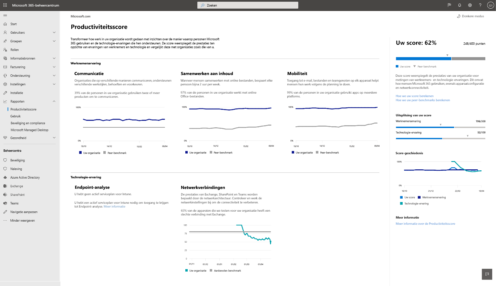

# Microsoft-productiviteits Score (preview)

Met productiviteits Score kunnen organisaties transformeren hoe werk wordt gedaan met inzichten over de manier waarop mensen Microsoft 365 gebruiken en de technologie ervaring die deze ondersteunen. De score toont de prestaties van uw organisatie aan de hand van maateenheden voor werknemers en technologieën en vergelijkt uw score met organisaties zoals uw eigen.

De Score omvat:

- **Meet** informatie om te zien hoe mensen microsoft 365-producten gebruiken om samen te werken, te communiceren en te werken via platforms.
- **Inzichten** over de gegevens om verkoopkansen aan te geven om de productiviteit en tevredenheid van medewerkers te verbeteren.
- **Aanbevolen acties** die u kunt uitvoeren om ervoor te zorgen dat de personen in uw organisatie efficiënt gebruikmaken van microsoft 365-producten, zodat iedereen hun beste werk kan doen.

We bieden gegevens, inzichten en aanbevelingen in twee gedeelten: 

- **Werknemers ervaring:** We meten de manier waarop mensen aan inhoud samenwerken, hoe ze Microsoft 365-producten gebruiken voor communicatie en of ze Microsoft 365 gebruiken op verschillende platforms. 

    We bieden deze inzichten omdat ze online samenwerken, maar ze besparen tijd. Wanneer hij of zij de vrijheid is om op elk apparaat te werken, zijn ze productief en tevreden. Als ze op een flexibele manier kunnen communiceren, zijn ze efficiënter, vormen betere relaties en uw organisatie is uniform. Zie [Forrester Report](https://vc2prod.blob.core.windows.net/vc-resources/TEIStudies/TEI%20of%20Microsoft%20365%20E5%20-%20Oct%202018.pdf)voor bewijzen.

- **Technologie ervaring:** De productiviteit is afhankelijk van betrouwbare en bedrijfsgebruikers en de efficiëntste versie van Microsoft 365. We bieden [eindpunts analyses](https://aka.ms/endpointanalytics), zodat u kunt zien hoe de productiviteit van uw gebruikers kan worden beïnvloed door de prestatie-en status problemen met uw eindpunttoewijzer en-software, terwijl de aanbevolen acties voor het herstel van de gebruikers worden uitgevoerd. en wij bieden Microsoft 365 Network Connectivity Insights voor uw organisatie.

Zie [Wat is Eindpunts analyse](https://docs.microsoft.com/mem/analytics/overview) voor een overzicht en de vereiste gegevens. Lees [het overzicht van netwerkverbinding](https://docs.microsoft.com/office365/enterprise/office-365-networking-overview)voor meer informatie over microsoft 365 Network Connectivity Insights.
  

## Hoe de score wordt berekend

De productiviteits Score is gebaseerd op de gecombineerde cijfers van de categorieën voor werknemers en technologie ervaring. Elke categorie wordt gelijkelijk gewogen, met een totaal van 100 punten per categorie. De totale hoeveelheid mogelijke punten voor de productiviteits Score zijn 500.

### Score Categorieën 

- Samenwerking van inhoud (100 punten)
- Communicatie (100 punten)
- Mobiliteit (100 punten)
- Endpoint Analytics (100 punten)
- Netwerkverbinding (100 punten)
- **Totale potentiële = 500 punten**
 
 In elke categorie identificeren we patronen voor belangrijke activiteiten die indicatoren zijn voor de manier waarop mensen Microsoft 365-producten gebruiken om samen te werken, te communiceren en te werken. We bieden 28-Day en 180-dagweergave van de belangrijkste activiteiten. We bieden ook ondersteunings metrieken die geen deel uitmaken van de score berekening, maar die u helpt bij het identificeren van onderliggend gedrag en instellingen waarop u kunt reageren op een ander station.

### Producten die deel uitmaken van de productiviteits Score 

Productiviteits Score bevat gegevens van Exchange, SharePoint, OneDrive, teams, Word, Excel, PowerPoint, OneNote, Outlook, Yammer en Skype.

Uw score wordt dagelijks bijgewerkt en weerspiegelt de acties van gebruikers die zijn voltooid in de laatste 28 tot 180 dagen (inclusief de huidige dag).

## Vereisten 

U hebt een Microsoft 365 voor bedrijven-of Office 365 voor Enterprise-abonnement nodig om informatie te krijgen over werknemers ervaring, en u moet gebruikmaken van meerdere tenants van cloudservices. Als u gegevens voor de Endpoint Analytics wilt voor de Tenant, moet u Microsoft intune toevoegen aan uw abonnement. Met intune kunt u de gegevens van uw organisatie beschermen door apparaten en apps te beheren.       Wanneer u intune hebt ingeschakeld, kunt u eindpunt analyse inschakelen in de intune-ervaring. Meer informatie over Microsoft intune. 

Als u de productiviteits score voor uw organisatie wilt weergeven, moet u beschikken over een van de volgende rollen: 

- Algemene beheerder 
- Exchange-beheerders
- SharePoint-beheerder 
- Skype voor Bedrijven-beheerder 
- Teams-beheerder 
- Algemene lezer 
- Rapporten lezer 

U hebt toegang tot de ervaring via Microsoft 365 admin voor thuisgebruik onder **rapporterende**  >  **productiviteit**.

## De Score van de productiviteit interpreteren 

Op de startpagina van de productiviteits Score ziet u de totale score en de Score geschiedenis en de belangrijkste inzichten voor elke categorie.

**Uw score** wordt weergegeven als percentagewaarde en in punten, zodat u uw punten (teller) en maximum aantal mogelijke punten (noemer) kunt zien.

Met behulp van **peer-benchmarks** kunt u uw score vergelijken met organisaties zoals uw eigen. Voor de categorieën werknemers ervaring wordt de benchmark-meting berekend als het gemiddelde van maateenheden binnen een set soortgelijke organisaties. De set is samengesteld uit organisaties in uw regio met een vergelijkbaar aantal gebruikers met een licentie, typen licenties, bedrijfstak en tenure met Microsoft 365. 

De peer Bench endpoint Analytics bevat doelen voor de prestaties van het opstarten van apparaten en aanbevolen softwareconfiguratie op basis van geaggregeerde mediaan waarden in alle tenants.

Voor netwerkverbinding is het aanbevolen benchmark 80-Points.

De sectie **Score analyse** biedt een overzicht van de productiviteits Score met benchenen van werknemers en technologie ervaring.

Met Score geschiedenis wordt weergegeven hoe de Score van een categorie in de afgelopen zes maanden is gewijzigd.

De gebieden **werknemers ervaring** en **technologie ervaring** bevatten de primaire inzichten van de categorieën in die gebieden. U kunt op elke categorie klikken om diepere inzichten te zien.

## De pagina's categorie Details

Elke pagina met categorie Details toont de primaire inzichten en ondersteunings metrieken, alsook bijbehorende onderzoek en acties die u kunt uitvoeren om wijzigingen in uw organisatie aan te brengen. Onderzoek biedt ondersteuning voor de urgentie en rationeleering achter de primaire inzichten voor elke categorie. Lees voor meer informatie [het rapport Forrester](https://vc2prod.blob.core.windows.net/vc-resources/TEIStudies/TEI%20of%20Microsoft%20365%20E5%20-%20Oct%202018.pdf).

### Details van samenwerking aan inhoud

De belangrijkste inzichten voor de samenwerking van inhoud is het aantal personen dat online maakt, lezen en samenwerken (bewerken en delen). Deze meetwaarden zijn belangrijk omdat onderzoek wordt getoond dat bij het samenwerken aan bestanden van gebruikers met online bestanden een gemiddelde van 100 minuten of bijna 2 uur per week wordt opgeslagen.

We definiëren de samenwerking van inhoud als één persoon die een Office-bestand maakt en deelt, en minstens één andere persoon die het bewerkt. 

Lezers: personen die online bestanden openen of downloaden in OneDrive of SharePoint.

**Makers:** Personen die online OneDrive-of SharePoint-bestanden maken, wijzigen, uploaden, synchroniseren, inchecken, kopiëren of verplaatsen.

Medewerkers: personen die met online bestanden werken via OneDrive of SharePoint. Twee personen zijn medewerkers als ze een online Word-, Excel-, PowerPoint-, PowerPoint-of PDF-document met een andere persoon lezen of bewerken, nadat de andere persoon het document heeft gemaakt of gewijzigd, binnen een venster van 28 dagen.

De bestandstypen die worden overwogen voor samenwerking zijn Word-, Excel-, PowerPoint-, OneNote-en PDF-bestanden.

We bieden inzichten aan de start tijden en kunnen instellen voor apparaten in uw organisatie, en ook met netwerkverbinding inzichten voor de samenwerking van inhoud omdat online samenwerken via een online gerichte apparatuur met behulp van online bestands samenwerking een betrouwbare apparatuur met een goede begindatum en een goede connectiviteit met Microsoft 365 is vereist.

### Communicatiedetails

Het belangrijkste inzicht in de communicatie is hoe vaak mensen in uw organisatie e-mail, chatberichten en community-berichten gebruiken om te communiceren. Dit inzicht is van belang omdat gebruikers een verscheidenheid aan realtime communicatieprogramma's gebruiken, kunnen ze de modus van communicatie selecteren waarmee ze de meeste efficiënt kunnen zijn en ze dan ook hulpmiddelen zoals chatten en community's bieden waarmee ze relaties tussen Office-locaties kunnen ontwikkelen.

### Mobiliteits gegevens

De primaire inzichten voor mobiliteit is het aantal mensen die toegang hebben tot bestanden en e-mail en chat gebruiken op meerdere platforms. De mogelijkheid om te werken vanaf een willekeurige locatie op elk apparaat dat ze kiezen is belangrijk voor personen met verkoop rollen, senior managers en adviseurs, en andere personen die het werk van Office willen doen om productief te zijn. De verbeteringen voor deze werknemers hebben grote gevolgen. 

We waarderen het percentage en het absolute aantal personen dat met minstens één productiviteits-app voor Microsoft 365 heeft gewerkt op twee of meer platforms, waaronder desktop, Mobile en Internet. De maatregelen van de productiviteits-apps zijn Outlook, teams, Word, Excel, PowerPoint, OneNote, Yammer en Skype. Voor gebruikers moet Microsoft 365-apps voor Enterprise, Exchange, Yammer, Skype of teams worden gemeten. 

## Speciaal rapport bedrijfscontinuïteit

Het rapport bedrijfscontinuïteit is een tijdsbeperking voor het bedrijfscontinuïteit van alle Microsoft 365-klanten, zodat ze hun organisatie tijdens deze opvolgende periode kunnen raadplegen.  

Dit rapport helpt voor leidinggevenden op de hoogte: 

- De werking van de werk dienst voor samenwerking en communicatie van invloed op op afstand. 

- De invloed op de duur van het werk wanneer personen aanpassen aan het thuis werken. 

- Als externe vergaderingen de juiste besluitvorming ondersteunen.

[Meer informatie over het bedrijfs continuïteits rapport](https://aka.ms/bcrps)

[Meer informatie over Microsoft Graph](https://docs.microsoft.com/graph/)

## We horen graag van u

Deel uw ideeën over de productiviteits Score en uw ideeën over het verbeteren van de productiviteit. Gebruik de **feedback** secties binnen het product en/of neem contact op met het productiviteits team op ProductivityScorePreview@service.microsoft.com.
