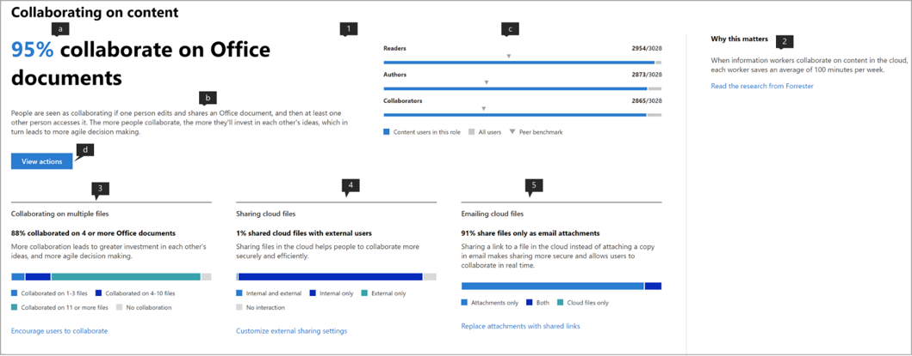

# Microsoft-productiviteitsscore (voorbeeld)

Microsoft 365 biedt productiviteitsoplossingen waarmee uw organisatie haar bedrijfsdoelstellingen kan bereiken. Productivity Score biedt inzichten om deze oplossingen te gebruiken die u transformeren naar de manier waarop werk wordt gedaan.Het bevat: 

- **Zichtbaarheid** door hen te helpen begrijpen hoe mensen werken in de vorm van hun huidige score met uitsplitsing tussen categorieën van employee experience en technologie-ervaring (binnenkort). 
- **Inzichten** om mogelijkheden te identificeren om verbeterde ervaringen mogelijk te maken. 
- **Acties** om vaardigheden en systemen bij te werken, zodat iedereen zijn beste werk kan doen. 

De score en de inzichten zijn aanwezig in twee categorieën –  

- **Werknemerservaring:** laat zien hoe Microsoft 365 helpt bij het creëren van een productief en betrokken personeelsbestand door te kwantificeren hoe mensen samenwerken aan inhoud, overal werken, door communicatiestijlen te begrijpen (binnenkort), en door een vergadercultuur te ontwikkelen (binnenkort) 

- **Technologische ervaring** (binnenkort beschikbaar): helpt u bij het optimaliseren van uw apparaatervaringen, zoals het proactief oplossen van veelvoorkomende helpdeskproblemen en het verbeteren van de opstarttijden van pc's en uw netwerk om ervoor te zorgen dat uw apps goed werken.  

## Hoe het werkt

### Punten van scoren 

Binnen elke scorecategorie biedt productivity score inzicht in uw werktransformatie in verschillende gebieden. De gebieden die onder de employee experience vallen zijn:

- Samenwerken aan inhoud  
- Overal werken 
- Communicatiestijlen begrijpen (binnenkort beschikbaar) 
- Het ontwikkelen van een vergadercultuur (binnenkort beschikbaar) 

### Gebruikersacties scoren 

Binnen elk gebied meten we de op onderzoek gebaseerde kernactiviteiten die de manier van werken vertegenwoordigen die organisaties in staat stellen om te transformeren naar een zeer productieve organisatie. Voor elk gebied berekenen we het % van de gebruikers die deze acties in de afgelopen 28 dagen uitvoeren. 

De employee experience score is samengesteld als een gemiddelde score op alle gebieden. Houd er rekening mee dat we in de loop van de tijd meer gebieden blijven toevoegen aan de ervaring van werknemers en technologie. 

### Producten opgenomen in de productiviteitsscore 

Productiviteitsscore bevat momenteel signalen van de belangrijkste Microsoft 365-workloads OneDrive, SharePoint, Word, Excel, PowerPoint, OneNote, Outlook, Yammer, Teams, Skype. 

Uw score wordt dagelijks bijgewerkt en weerspiegelt de acties van gebruikers die in de afgelopen 28 dagen zijn voltooid (inclusief de huidige dag).

## Toegangs- en vereiste machtigingen 

Voor de werknemerservaring moet u een abonnement hebben op een Office 365 voor Bedrijven-abonnement of een Microsoft 365 Business-abonnement met meerdere gebruikers. 

Als u toestemming wilt hebben om toegang te krijgen tot de Microsoft Productivity Score, moet u de volgende rollen hebben: 

- Algemene beheerder 
- Exchange-beheerders 
- SharePoint-beheerders 
- Skype voor Bedrijven-beheerders 
- Teams-beheerder 
- Wereldwijde lezer 
- Rapporten Reader 

U hebt toegang tot de ervaring vanuit microsoft 365-beheerhuis door > **rapportenproductiviteitsscore** te kiezen in de linkernavigatie. **Reports**

## Productiviteitsscore interpreteren 

### Meer informatie over hoe uw organisatie werkt 

he Productivity Score startpagina biedt de huidige score en geschiedenis op een percentage basis, primaire inzichten voor gebieden binnen elke score categorie aangevuld met benchmarks. 

1.**Productiviteitsscore** wordt vermeld op basis van <numerator> / <denominator> percentage en in het formaat, zodat u ook uw absolute punten (teller) en maximaal mogelijke punten zien  
1. Met deze draaiknop u de scorecategorie selecteren waarop u zich wilt concentreren. In de preview u alleen **de werknemerservaring**bekijken, maar de selectie wordt binnenkort uitgebreid met **technologie-ervaring.** 
1. **Met Peer benchmark** u uw huidige score vergelijken met organisaties zoals u. De benchmarkmaatstaf wordt berekend als het gemiddelde van de maatregelen binnen een reeks vergelijkbare organisaties. De set bestaat uit organisaties die een vergelijkbaar aantal ingeschakelde gebruikers, regio,de typen licenties die u bezit, de industrie en de ambtstermijn binnen Microsoft 365 of Office 365 hebben. 
1. De sectie **Scorecategorieën** geeft een overzicht van uw productiviteitsscore met benchmarks per categorie.
1. **Scoregeschiedenis** geeft aan hoe uw score in elke categorie in de afgelopen 6 maanden is verplaatst.
1. Het primaire inzicht **voor Samenwerken aan inhoud** toont de relevante maatregelen met benchmarks uit dit gebied die bijdragen aan de score. Selecteer **Details weergeven** om de pagina gebiedsdetails te bekijken.
1. Het primaire inzicht voor **Overal werken** toont de relevante maatregelen met benchmarks uit dit gebied die bijdragen aan de score. Selecteer **Details weergeven** om de pagina gebiedsdetails te bekijken.  

### Inzichten om mogelijkheden te identificeren om ervaringen te verbeteren 

Selecteer Voor elk gebied **Details weergeven** in het primaire inzicht om de pagina met gebiedsdetails weer te geven met aanvullende inzichten, gerelateerd onderzoek en acties om uw score te verbeteren. .

Alle detailpagina's van het gebied volgen de volgende structuur: 

- Linksboven: primair inzicht behouden vanaf de startpagina.
- Linksonder: Ondersteuning van inzichten met contextuele acties.  
- Rechts: Academisch onderzoek dat de relatie tussen het gebied en de productiviteit aantoont.

Bovendien bevatten alle inzichten de volgende elementen: 

- Header: Key takeaway of resultaat bijgehouden voor elk inzicht;
- Samenvatting: Verdere uitleg waarom de maatregelen in het inzicht belangrijk zijn voor de productiviteit van uw organisatie. 
- Datavisualisatie: hiermee kwantificeert u de positie van uw organisatie visueel met betrekking tot de metingen in het inzicht met benchmarks indien van toepassing.
- Acties: Contextuele actie die kan helpen om meer van het gewenste resultaat per inzicht te stimuleren en zo uw score te verbeteren.

### Pagina Met gebiedsdetails – Samenwerken aan inhoud 

Samenwerken op de inhoudspagina bevat het primaire inzicht op de startpagina van productiviteitsscore. Het heeft de volgende componenten:

1. Koptekst: Kwantificeert welk percentage gebruikers samenwerkt aan inhoud (belangrijkste uitkomst).
1. Body: Meer details over hoe meer samenwerking leidt tot een hogere productiviteit.
1. Visualisatie: Dit kwantificeert visueel elk element dat bijdraagt aan de score voor dit gebied met benchmarks:

    - **Lezers:** Kwantificeert gebruikers die bestanden in de cloud (OneDrive en SharePoint) openen of downloaden binnen een basis van gebruikers met OneDrive en SharePoint.
    - **Auteurs**: Kwantificeert gebruikers die bestanden wijzigen, uploaden, synchroniseren, inchecken, kopiëren of verplaatsen in de cloud (OneDrive en SharePoint) binnen een basis van gebruikers met OneDrive en SharePoint.
    - **Bijdragers**: Kwantificeert gebruikers die samenwerken aan bestanden in de cloud (OneDrive en SharePoint) binnen een basis van gebruikers met OneDrive en SharePoint. Twee gebruikers zijn bijdragers als een van hen een Word-, Excel-, PowerPoint-, OneNote- of PDF-clouddocument heeft gelezen of bewerkt nadat het andere document binnen een periode van 28 dagen is gemaakt of gewijzigd.

1. **Waarom het ertoe doet** biedt een samenvatting van onderzoek dat samenwerking op cloudbestanden koppelt aan productiviteit. **Lees het onderzoek van Forrester** gaat naar een onderzoeksartikel dat meer context biedt over hoe samenwerking bevorderlijk is voor een verhoogde productiviteit.
1. Het ondersteunen van inzicht in **het samenwerken aan meerdere bestanden** kwantificeert hoe gebruikers in uw organisatie samenwerken in verschillende bestanden. 
1. Ondersteuning van inzicht in **het delen van cloudbestanden** kwantificeert als gebruikers inhoud delen in de cloud terwijl ze onderscheid maken tussen intern en extern delen.
1. Ondersteuning van inzicht in **het e-mailen van cloudbestanden** kwantificeert als gebruikers die bestanden delen via e-mail bijlagen gebruiken ten opzichte van koppelingen naar cloudbestanden.

De bestandstypen die worden overwogen voor samenwerking zijn Word/Excel/PowerPoint/OneNote/PDF.

### Gebiedsdetailpagina – Overal werken 

De pagina Overal werken kwantificeert de gebruikers (als percentage en absolute waarde) die ten minste één productiviteits-app gebruikten op twee of meer platforms, die desktop, mobiel en web zijn. Gebruikers krijgen hoger gescoord voor het gebruik van meer apps en platforms. De apps die worden overwogen zijn Outlook, Teams, Word, Excel, PowerPoint, OneNote, Yammer, Skype. De basis van het inzicht zijn gebruikers die zijn ingeschakeld voor Office 365 ProPlus, Exchange, Yammer, Skype of Teams.

1. **Waarom het ertoe doet** biedt een samenvatting van onderzoek koppelen gebruik van meerdere platforms aan hogere productiviteit. **Lees het onderzoek van Forrester** gaat naar een onderzoeksartikel dat meer context biedt over hoe overwerken bevorderlijk is voor een verhoogde productiviteit.
1. Als u inzicht in **E-mail overal** ondersteunt, kwantificeert u het aantal gebruikers in uw organisatie dat Outlook gebruikt op verschillende platforms binnen de basis van gebruikers die actief zijn in Outlook.
1. Door inzicht in **Chat overal** te ondersteunen, wordt gekwantificeerd hoe gebruikers in uw organisatie Teams gebruiken op verschillende platforms binnen de basis van gebruikers die actief zijn op Teams.
1. Als u overal inzicht in **Office-documenten** ondersteunt, wordt gekwantificeerd hoe gebruikers in uw organisatie Word, Excel, PowerPoint en OneNote gebruiken op verschillende platforms binnen de basis van gebruikers die actief zijn in Word, Excel, PowerPoint of OneNote.

### Acties voor updatevaardigheden en -systemen 

Om de uitvoerbaarheid te bevorderen, wordt elk ondersteunend inzicht geleverd met inline-acties die uw werknemerservaring kunnen helpen transformeren, waarvan sommige configuratiewijzigingen of bewustmakingscampagnes kunnen zijn. Als u op deze aanzet tot actie klikt, wordt deze geopend in de opties van het deelvenster Aanbevolen acties die u mogelijk overweegt. Momenteel zijn de acties in de **samenwerking op inhoud** ingeschakeld.

1. De **actie weergave** gaat naar een deelvenster met alle acties die betrekking hebben op samenwerken aan inhoud.
1. **Gebruikers aanmoedigen om samen** te werken gaat naar een lijst met instructievideo's over samenwerking met onderwerpen zoals cocreatie en @mentions. 
1. **Instellingen voor extern delen aanpassen** gaat naar een pagina met een overzicht over extern delen waarin wordt beschreven wat er gebeurt wanneer gebruikers delen, afhankelijk van wat ze delen en met wie.  
1. **Bijlagen vervangen door gedeelde koppelingen** gaat naar een pagina waarin wordt uitgelegd hoe u OneDrive-koppelingen delen in plaats van bijlagen via e-mail voor een betere samenwerking.

Als u een van de actieknoppen selecteert, opent u het deelvenster **Aanbevolen acties** aan de rechterkant met een samenvatting van elke actie en een koppeling naar de documentatiepagina's.

## We willen graag van je horen 

We willen het privé preview-programma gebruiken om feedback te krijgen en de learnings te gebruiken om het product samen met u te maken. U de **feedbacksecties** binnen het product gebruiken en/of contact opnemen met het team productiviteitsscore op ProductivityScorePreview@service.microsoft.com.

Als u toegang wilt vragen tot de https://aka.ms/productivityscorepreviewprivépreview, vul dan het formulier in op .  
