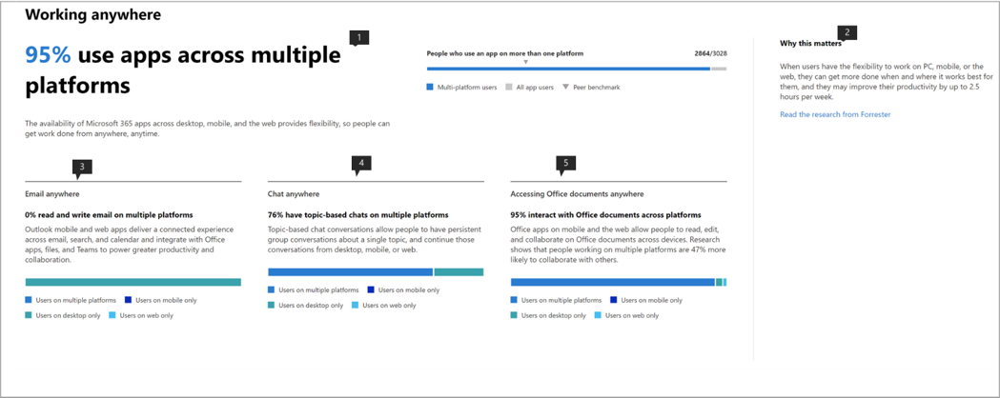

# Microsoft-productiviteitsscore (voorbeeld)

Microsoft 365 biedt productiviteitsoplossingen waarmee uw organisatie haar bedrijfsdoelstellingen kan bereiken. Productivity Score biedt inzichten om deze oplossingen te gebruiken die u transformeren naar hoe werk wordt gedaan.Het bevat: 

- **Zichtbaarheid** door hen te helpen begrijpen hoe mensen werken in de vorm van hun huidige score met uitsplitsing over categorieën employee experience en technologieervaring (binnenkort beschikbaar). 
- **Inzichten** om mogelijkheden te identificeren om verbeterde ervaringen mogelijk te maken. 
- **Acties** om vaardigheden en systemen bij te werken, zodat iedereen zijn best kan doen. 

De score en de inzichten zijn aanwezig in twee categorieën –  

- **Werknemerservaring:** laat zien hoe Microsoft 365 helpt om een productief en betrokken personeelsbestand te creëren door te kwantificeren hoe mensen samenwerken aan inhoud, overal werken, door communicatiestijlen te begrijpen (binnenkort beschikbaar te stellen) en door een vergadercultuur te ontwikkelen (binnenkort) 

- **Technologie-ervaring** (binnenkort beschikbaar): helpt u bij het optimaliseren van uw apparaatervaringen, zoals het proactief oplossen van veelvoorkomende helpdeskproblemen en het verbeteren van de opstarttijden van pc's en uw netwerk om ervoor te zorgen dat uw apps goed werken.  

## Hoe het werkt

### Punten van scoren 

Binnen elke scorecategorie biedt productivity score inzicht in uw werktransformatie op verschillende gebieden. De gebieden die onder de werknemerservaring vallen zijn:

- Samenwerken aan inhoud  
- Overal werken 
- Inzicht in communicatiestijlen (binnenkort beschikbaar) 
- Het ontwikkelen van een vergadercultuur (binnenkort) 

### Acties van gebruikers scoren 

Binnen elk gebied meten we de op onderzoek gebaseerde kernactiviteiten die de manier van werken vertegenwoordigen die organisaties in staat stellen om te transformeren naar een zeer productieve organisatie. Voor elk gebied berekenen we het percentage gebruikers dat deze acties in de afgelopen 28 dagen uitvoert. 

De employee experience score wordt samengesteld als een gemiddelde score op alle gebieden. Houd er rekening mee dat we in de loop van de tijd meer gebieden zullen blijven toevoegen aan de ervaring van werknemers en technologie. 

### Producten die zijn opgenomen in de productiviteitsscore 

Productiviteitsscore bevat momenteel signalen van de belangrijkste Microsoft 365-workloads OneDrive, SharePoint, Word, Excel, PowerPoint, OneNote, Outlook, Yammer, Teams, Skype. 

Uw score wordt dagelijks bijgewerkt en weerspiegelt de acties van gebruikers die in de afgelopen 28 dagen zijn voltooid (inclusief de huidige dag).

## Toegang en vereiste machtigingen 

Voor de werknemerservaring moet u een abonnement hebben op een Office 365 voor Bedrijven-abonnement of een Microsoft 365 Business-abonnement met meerdere gebruikers. 

Als u toestemming wilt hebben voor toegang tot de Microsoft Productivity Score, moet u de volgende rollen hebben: 

- Algemene beheerder 
- Exchange-beheerders 
- SharePoint-beheerders 
- Skype voor Bedrijven-beheerders 
- Teams-beheerder 
- Globale lezer 
- Rapporten Reader 

U hebt toegang tot de ervaring vanuit microsoft 365-beheerhuis door **Rapporten** > **productiviteitsscore** te kiezen in de linkernavigatie.

## Productiviteitsscore interpreteren 

### Ontdek hoe uw organisatie werkt 

hij Productivity Score home page biedt de huidige score en geschiedenis op een percentage basis, primaire inzichten voor gebieden binnen elke score categorie aangevuld met benchmarks. 

1.**Productiviteitsscore** wordt vermeld op een basis <numerator> / <denominator> van percentages en in het formaat, zodat u ook uw absolute punten (teller) en maximaal mogelijke punten zien  
1. Met deze draaidraai u de scorecategorie selecteren waarop u zich wilt concentreren. In de preview u alleen **de ervaring van werknemers**bekijken, maar de selectie wordt binnenkort uitgebreid met **technologie-ervaring.** 
1. **Peer benchmark** u uw huidige score te vergelijken met organisaties zoals jij. De benchmarkmaat wordt berekend als het gemiddelde van de maatregelen binnen een reeks vergelijkbare organisaties. De set bestaat uit organisaties die een vergelijkbaar aantal ingeschakelde gebruikers, regio, de typen licenties die u bezit, branche en ambtstermijn hebben binnen Microsoft 365 of Office 365. 
1. De sectie **Scorecategorieën** biedt een uitsplitsing van uw productiviteitsscore met benchmarks per categorie.
1. **Scoregeschiedenis** geeft aan hoe uw score in elke categorie in de afgelopen 6 maanden is verplaatst.
1. Het primaire inzicht voor **Samenwerken aan content** toont de relevante maatregelen met benchmarks uit dit gebied die bijdragen aan de score. Selecteer **Details weergeven** om de pagina met gebiedsdetails weer te geven.
1. Het primaire inzicht voor **Werken overal** toont de relevante maatregelen met benchmarks uit dit gebied die bijdragen aan de score. Selecteer **Details weergeven** om de pagina met gebiedsdetails weer te geven.  

### Inzichten om mogelijkheden te identificeren om ervaringen te verbeteren 

Selecteer voor elk gebied **Details weergeven** in het primaire inzicht om de pagina met details van het gebied weer te geven die aanvullende inzichten, gerelateerd onderzoek en acties weergeeft om uw score te verbeteren. .

Alle pagina's met gebiedsdetails volgen de volgende structuur: 

- Linksboven: Primair inzicht behouden vanaf de startpagina.
- Linksonder: Inzichten ondersteunen met contextuele acties.  
- Rechts: Academisch onderzoek dat de relatie tussen het gebied en productiviteit aantoont.

Bovendien bevatten alle inzichten de volgende elementen: 

- Koptekst: Key takeaway of outcome bijgehouden voor elk inzicht;
- Samenvatting: Verdere uitleg waarom de maatregelen in het inzicht belangrijk zijn voor de productiviteit van uw organisatie. 
- Datavisualisatie: Kwantificeert visueel de positie van uw organisatie met betrekking tot de maatregelen in het inzicht met benchmarks zoals van toepassing.
- Acties: Contextuele actie die kan helpen om meer van het gewenste resultaat per het inzicht te stimuleren en zo uw score te verbeteren.

### Pagina Gebiedsdetails – Samenwerken aan inhoud 

Samenwerken op de inhoudspagina bevat het primaire inzicht van de startpagina van productiviteitsscore. Het heeft de volgende componenten:

1. Koptekst: kwantificeert welk percentage gebruikers samenwerkt aan inhoud (sleutelresultaat).
1. Lichaam: Meer details over hoe een verhoogde samenwerking leidt tot een hogere productiviteit.
1. Visualisatie: Hiermee wordt elk element dat bijdraagt aan de score voor dit gebied visueel gekwantificeerd met benchmarks:

    - **Lezers**: hiermee worden gebruikers gekwantificeerd die bestanden openen of downloaden in de cloud (OneDrive en SharePoint) binnen een basis van gebruikers met OneDrive en SharePoint.
    - **Auteurs**: Kwantificeert gebruikers die bestanden wijzigen, uploaden, synchroniseren, inchecken, kopiëren of verplaatsen binnen een basis van gebruikers met OneDrive en SharePoint.
    - **Bijdragers**: kwantificeert gebruikers die samenwerken aan bestanden in de cloud (OneDrive en SharePoint) binnen een basis van gebruikers met OneDrive en SharePoint. Twee gebruikers zijn bijdragers als een van hen een Word-, Excel-, PowerPoint-, OneNote- of PDF-clouddocument heeft gelezen of bewerkt nadat het andere binnen een periode van 28 dagen is gemaakt of gewijzigd.

1. **Waarom het er toe doet,** biedt een samenvatting van onderzoek dat samenwerking op cloudbestanden koppelt aan productiviteit. **Lees het onderzoek van Forrester** gaat naar een onderzoeksartikel dat meer context biedt over hoe samenwerking bevorderlijk is voor een hogere productiviteit.
1. Als u inzicht ondersteunt in **samenwerken aan meerdere bestanden,** kwantificeert de manier waarop gebruikers in uw organisatie samenwerken in verschillende bestanden. 
1. Als u inzicht ondersteunt in **het delen van cloudbestanden,** wordt gekwantificeerd als gebruikers inhoud delen in de cloud terwijl ze onderscheid maken tussen intern en extern delen.
1. Als u inzicht ondersteunt in **het e-mailen van cloudbestanden,** wordt gekwantificeerd als gebruikers die bestanden via e-mail delen, bijlagen versus koppelingen naar cloudbestanden gebruiken.

De bestandstypen die in aanmerking worden genomen voor samenwerking zijn Word/Excel/PowerPoint/OneNote/PDF.

### Pagina Gebiedsdetails – Overal werken 

De pagina Werken overal kwantificeert de gebruikers (als percentage en absolute waarde) die ten minste één productiviteitsapp gebruikten op twee of meer platforms, namelijk desktop, mobiel en web. Gebruikers worden hoger gescoord voor het gebruik van meer apps en platforms. De apps die in aanmerking komen zijn Outlook, Teams, Word, Excel, PowerPoint, OneNote, Yammer, Skype. De basis van het inzicht zijn gebruikers die zijn ingeschakeld voor Office 365 ProPlus, Exchange, Yammer, Skype of Teams.

1. **Waarom het er toe doet,** biedt een samenvatting van onderzoek dat het gebruik van meerdere platforms koppelt aan een hogere productiviteit. **Lees het onderzoek van Forrester** gaat naar een onderzoeksartikel dat meer context biedt over hoe werken over een hogere productiviteit bevorderlijk is.
1. Als u overal inzicht in **e-mail** ondersteunt, kwantificeert het aantal gebruikers in uw organisatie dat Outlook gebruikt op verschillende platforms binnen de basis van gebruikers die actief zijn in Outlook.
1. Als u **overal** inzicht in chat ondersteunt, kwantificeert u hoe gebruikers in uw organisatie Teams op verschillende platforms gebruiken binnen de basis van gebruikers die actief zijn in Teams.
1. Als u inzicht ondersteunt bij het **openen van Office-documenten, wordt overal** kwantificeerd hoe gebruikers in uw organisatie Word, Excel, PowerPoint en OneNote gebruiken op verschillende platforms binnen de basis van gebruikers die actief zijn op Word, Excel, PowerPoint of OneNote.

### Acties voor updatevaardigheden en -systemen 

Om de uitvoerbaarheid te bevorderen, wordt elk ondersteunend inzicht geleverd met inline-acties die kunnen helpen bij het transformeren van uw werknemerservaring, waarvan sommige configuratiewijzigingen of bewustmakingscampagnes kunnen zijn. Als u op deze call-to-action klikt, wordt deze geopend in de opties van het deelvenster Aanbevolen acties die u zou kunnen overwegen. Momenteel zijn de acties in de **Samenwerken aan de inhoud** ingeschakeld.

1. De **acties weergeven** gaat naar een deelvenster met alle acties met betrekking tot Samenwerken aan inhoud.
1. **Gebruikers aanmoedigen om samen te werken** gaat naar een lijst met instructievideo's over samenwerking met onderwerpen zoals co-authoring en @mentions. 
1. **De** instellingen voor extern delen aanpassen gaat naar een pagina met een overzicht van extern delen waarin wordt beschreven wat er gebeurt wanneer gebruikers delen, afhankelijk van wat ze delen en met wie.  
1. **Bijlagen vervangen door gedeelde koppelingen** gaat naar een pagina waarin wordt uitgelegd hoe u OneDrive-koppelingen delen in plaats van bijlagen via e-mail voor een betere samenwerking.

Als u een van de actieknoppen selecteert, wordt het deelvenster **Aanbevolen acties** aan de rechterkant geopend met een overzicht van elke actie en een koppeling naar de documentatiepagina's.

## We willen graag van u horen 

We willen het privépreviewprogramma gebruiken om feedback te verzamelen en de lessen te gebruiken om het product samen met u in de toekomst te maken. U de **feedbacksecties** in het product gebruiken en/of contact opnemen met het team Productiviteitsscore op ProductivityScorePreview@service.microsoft.com.

Als u toegang wilt vragen tot de https://aka.ms/productivityscorepreviewprivévoorbeeld, vult u het formulier in op .  
