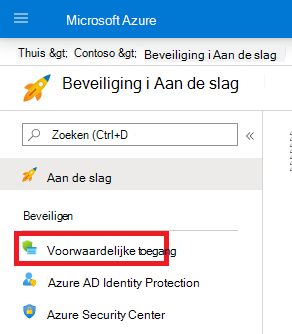
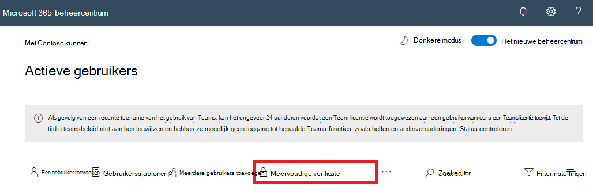

# Meervoudige verificatie instellen voor Microsoft 365

Wachtwoorden zijn de meest voorkomende methode om een aanmelding bij een computer of een online service te verifiëren, maar deze zijn ook het meest kwetsbaar. Mensen kunnen eenvoudige wachtwoorden kiezen en dezelfde wachtwoorden gebruiken voor meerdere aanmeldingen bij verschillende computers en services.

Om een extra beveiligingsniveau voor aanmeldingen te bieden, moet u meervoudige verificatie (MFA) gebruiken, dat zowel een wachtwoord gebruikt dat sterk moet zijn, als een aanvullende verificatiemethode op basis van:

- Iets wat men bij zich heeft dat niet makkelijk te dupliceren is, zoals een smartphone.
- Iets wat u uniek en biologisch heeft, zoals uw vingerafdrukken, gezicht of ander biometrisch kenmerk.

De aanvullende verificatiemethode wordt pas gebruikt nadat het wachtwoord van de gebruiker is geverifieerd. Met MFA, zelfs als een sterk gebruikerswachtwoord wordt gestolen, heeft de aanvaller niet de beschikking over uw smartphone of vingerafdruk om de aanmelding te voltooien.

## MFA-ondersteuning in Microsoft 365

Standaard wordt MFA ondersteund door Microsoft 365 en Office 365 voor gebruikersaccounts met:

- Een SMS-bericht dat wordt verzonden naar een telefoon waarvoor de gebruiker een verificatiecode moet typen.
- Een telefonische oproep.
- De Smart Phone-app van Microsoft Authenticator.

In beide gevallen gebruikt de MFA-aanmelding de methode 'iets wat u bij u hebt dat niet gemakkelijk is gedupliceerd' voor de extra verificatie. Er zijn verschillende manieren waarop u MFA voor Microsoft 365 en Office 365 kunt inschakelen:

- Met standaardinstellingen voor beveiliging
- Met beleidsregels voor voorwaardelijke toegang
- Voor elk afzonderlijk gebruikersaccount (niet aanbevolen)

Deze manieren zijn gebaseerd op uw abonnement op Microsoft 365.

|Abonnement|Aanbeveling|Type klant|
|---|---|---|
|Alle Microsoft 365-abonnementen|Gebruik standaardinstellingen voor beveiliging, die MFA vereisen voor alle gebruikersaccounts. 
 U kunt MFA per gebruiker ook configureren voor afzonderlijke gebruikersaccounts, maar dit wordt niet aanbevolen.|Kleine bedrijven|
|Microsoft 365 Business Premium 
 Microsoft 365 E3 
 Licenties voor Azure Active Directory (Azure AD) Premium P1|Gebruik beleid voor voorwaardelijke toegang om MFA in te stellen voor gebruikersaccounts op basis van groepslidmaatschap, apps of andere criteria.|Klein bedrijf tot ondernemingen|
|Microsoft 365 E5 
 Licenties voor Azure AD Premium P2|De Azure AD-identiteitsbeveiliging gebruiken om MFA te vereisen op basis van het aanmeldingsrisicocriterium.|Enterprise|
||||

### Standaardinstellingen voor beveiliging

De standaardinstellingen voor beveiliging zijn een nieuwe functie voor betaalde Microsoft 365- en Office 365-abonnementen en proefabonnementen van Microsoft 365 en Office 365 die zijn gemaakt na 21 oktober 2019. Voor deze abonnementen zijn de beveiligingsinstellingen standaard ingeschakeld. Dit betekent het volgende:

- Vereist dat al uw gebruikers MFA gebruiken met de Microsoft Authenticator-app.
- Blokkeert verouderde verificatie.

Gebruikers hebben 14 dagen de tijd om zich te registreren voor MFA met de Microsoft Authenticator-app vanaf hun smartphone. Deze periode gaat in bij de eerste aanmelding nadat de standaardinstellingen voor beveiliging zijn ingeschakeld. Na 14 dagen kunnen gebruikers zich alleen aanmelden als de MFA-registratie is voltooid.

De standaardinstellingen voor beveiliging bieden organisaties een basisbeveiligingsniveau voor gebruikersaanmeldingen dat standaard is ingeschakeld. U kunt de standaardinstellingen voor beveiliging uitschakelen ten gunste van MFA met voorwaardelijk toegangsbeleid.

U kunt beveiligingsstandaarden in- of uitschakelen vanuit het **eigenschappen** venster voor Azure AD in de Azure-portal.

U kunt beveiligingsstandaarden gebruiken met elk Microsoft 365-abonnement.

Zie dit [overzicht van gevoeligheidslabels](/azure/active-directory/fundamentals/concept-fundamentals-security-defaults) voor meer informatie.

### Beleid voor voorwaardelijke toegang

Beleidsregels voor voorwaardelijke toegang zijn regels waarmee wordt aangegeven wanneer aanmeldingen worden beoordeeld en toegestaan. U kunt bijvoorbeeld een toegangsbeleid met de volgende voorwaarden maken:

- Als de naam van het gebruikersaccount lid is van een groep gebruikers die is toegewezen aan een Exchange-, gebruikers-, wachtwoord-, beveiligings-, SharePoint- of globale beheerdersrol, wordt MFA vereist om toegang te verlenen.

Met dit beleid kunt u MFA op basis van groepslidmaatschap vereisen in plaats van dat u afzonderlijke gebruikersaccounts voor MFA gaat configureren wanneer deze worden toegewezen (of als de toewijzing ongedaan wordt gemaakt) vanuit deze beheerdersrollen.

U kunt beleidsregels voor voorwaardelijke toegang ook gebruiken voor meer geavanceerde mogelijkheden, zoals vereisen dat MFA wordt gebruikt voor bepaalde apps, of dat de aanmelding wordt uitgevoerd vanaf een compatibel apparaat, zoals uw laptop met Windows 10.

U configureert het beleid voor voorwaardelijke toegang vanuit het deelvenster **Beveiliging** voor Azure AD in de Azure-Portal.

U kunt voorwaardelijke toegangsbeleidsregels gebruiken met:

- Microsoft 365 Business Premium
- Microsoft 365 E3 en E5
- Azure AD Premium P1 en Azure AD Premium P2-licenties

Voor kleine bedrijven die Microsoft 365 Business Premium gebruikten, kunt u eenvoudig beleid voor voorwaardelijke toegang instellen met de volgende stappen:

1. Maak een groep voor de gebruikersaccounts die MFA vereisen.
2. Schakel het beleid **MFA vereisen voor globale beheerders** in.
3. Een beleid voor voorwaardelijke toegang op basis van een groep maken met deze instellingen:
    - Opdrachten > Gebruikers en groepen: de naam van uw groep uit stap 1 hierboven.
    - Opdrachten > Cloud-apps of -acties: alle Cloud-apps.
    - Toegangscontrole > Verlenen > Toegang verlenen > Meervoudige verificatie vereisen.
4. Schakel het beleid in.
5. Voeg een gebruikersaccount toe aan de groep die u in Stap 1 hebt gemaakt en voer een test uit.
6. Als u MFA wilt vereisen voor extra gebruikersaccounts, kunt u deze toevoegen aan de groep die u in stap 1 hebt gemaakt.

Met dit beleid voor voorwaardelijke toegang kunt u de MFA-vereiste voor uw gebruikers in uw eigen tempo uitrollen.

Ondernemingen moeten [Gemeenschappelijk beleid voor voorwaardelijke toegang](/azure/active-directory/conditional-access/concept-conditional-access-policy-common) gebruiken om het volgende beleid te configureren:

- [MFA vereisen voor beheerders](/azure/active-directory/conditional-access/howto-conditional-access-policy-admin-mfa)
- [MFA vereisen voor alle gebruikers](/azure/active-directory/conditional-access/howto-conditional-access-policy-all-users-mfa)
- [Verouderde verificatie blokkeren](/azure/active-directory/conditional-access/howto-conditional-access-policy-block-legacy)

Zie dit [overzicht van voorwaardelijke toegang](/azure/active-directory/conditional-access/overview) voor meer informatie.

### Azure AD-identiteitsbescherming

Met Azure AD-identiteitsbescherming kunt u een aanvullend beleid voor voorwaardelijke toegang maken om [MFA te vereisen wanneer het aanmeldingsrisico gemiddeld of hoog is](../../security/office-365-security/identity-access-policies.md#require-mfa-based-on-sign-in-risk).

U kunt Azure AD-identiteitsbescherming en beleid voor voorwaardelijke toegang op basis van risico gebruiken met:

- Microsoft 365 E5
- Licenties voor Azure AD Premium P2

Zie dit [overzicht van Azure AD-identiteitsbescherming](/azure/active-directory/identity-protection/overview-identity-protection) voor meer informatie.

### Oudere MFA per gebruiker (niet aanbevolen)

U moet beveiligingsstandaarden of beleid voor voorwaardelijke toegang gebruiken om MFA te vereisen voor het aanmelden van gebruikersaccounts. Als een van beide echter niet kan worden gebruikt, raadt Microsoft ten zeerste aan om MFA te gebruiken voor gebruikersaccounts met beheerdersrollen, met name voor de algemene beheerdersrol, voor elke abonnementomvang.

U schakelt MFA in voor individuele gebruikersaccounts vanuit het venster **Actieve gebruiker** van het Microsoft 365-beheercentrum.

Wanneer de gebruiker zich de volgende keer aanmeldt, wordt hen gevraagd zich aan te melden bij MFA en de extra verificatiemethode te kiezen en te testen.

### Deze methoden samen gebruiken

In deze tabel ziet u de resultaten van het inschakelen van MFA met de standaardinstellingen voor beveiliging, het beleid voor voorwaardelijke toegang en de instellingen per gebruikersaccount.

||Ingeschakeld|Uitgeschakeld|Secundaire verificatiemethode|
|---|---|---|---|
|**Standaardinstellingen voor beveiliging**|Beleid voor voorwaardelijke toegang kan niet worden gebruikt|Kan beleid voor voorwaardelijke toegang gebruiken|De Microsoft Authenticator-app|
|**Beleidsregels voor voorwaardelijke toegang**|Als deze zijn ingeschakeld, kunt u beveiligingsinstellingen niet inschakelen|Als ze allemaal zijn uitgeschakeld, kunt u de standaardinstellingen voor beveiliging inschakelen|Door gebruiker opgegeven tijdens MFA-registratie|
|**Oudere MFA per gebruiker (niet aanbevolen)**|Negeert beveiligingsstandaarden en beleid voor voorwaardelijke toegang dat MFA vereist bij elke aanmelding|Genegeerd door beveiligingsstandaarden en beleid voor voorwaardelijke toegang|Door gebruiker opgegeven tijdens MFA-registratie|
||||

Als beveiligingsstandaarden zijn ingeschakeld, worden alle nieuwe gebruikers bij hun volgende aanmelding gevraagd om MFA-registratie en het gebruik van de Microsoft Authenticator-app.

## Manieren om MFA-instellingen te beheren

Er zijn twee manieren om MFA-instellingen te beheren.

In de Azure-Portal kunt u het volgende doen:

- Standaardinstellingen voor beveiliging in- en uitschakelen
- Beleid voor voorwaardelijke toegang configureren

In het Microsoft 365-beheercentrum kunt u MFA-instellingen per gebruiker en service configureren.

## Volgende stappen

[MFA instellen voor Microsoft 365](set-up-multi-factor-authentication.md)

## Verwante onderwerpen

[Video: Meervoudige verificatie inschakelen](../../business-video/turn-on-mfa.md) (video)\
[Video: Meervoudige verificatie inschakelen voor uw telefoon](../../business-video/set-up-mfa.md) (video)