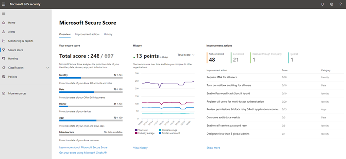

# De tien belangrijkste manieren om microsoft 365 voor bedrijven-abonnementen te beveiligenTop 10 ways to secure Microsoft 365 for business plans

::: moniker range="o365-21vianet"

> [!NOTE]
> Het beheercentrum wordt gewijzigd.The admin center is changing. Als de informatie die hier wordt weergegeven, niet overeenkomt met wat u gewend bent, raadpleegt u [Over het nieuwe Microsoft 365-beheercentrum](https://docs.microsoft.com/microsoft-365/admin/microsoft-365-admin-center-preview?view=o365-21vianet).If your experience doesn't match the details presented here, see [About the new Microsoft 365 admin center](https://docs.microsoft.com/microsoft-365/admin/microsoft-365-admin-center-preview?view=o365-21vianet).

::: moniker-end

Als u een kleine of middelgrote organisatie bent die gebruik maakt van een van de bedrijfsplannen van Microsoft en uw type organisatie wordt gericht door cybercriminelen en hackers, gebruikt u de richtlijnen in dit artikel om de beveiliging van uw organisatie te vergroten.If you are a small or medium-size organization using one of Microsoft's business plans and your type of organization is targeted by cyber criminals and hackers, use the guidance in this article to increase the security of your organization. Deze richtlijnen helpen uw organisatie om de doelen te bereiken die worden beschreven in het handboek Marketingcampagne [van](https://go.microsoft.com/fwlink/p/?linkid=2015598)De Harvard School.This guidance helps your organization achieve the goals described in the Harvard Kennedy School [Cybersecurity Campaign Handbook](https://go.microsoft.com/fwlink/p/?linkid=2015598).

Microsoft raadt u aan de taken uit de volgende tabel te voltooien die van toepassing zijn op uw serviceplan.Microsoft recommends that you complete the tasks listed in the following table that apply to your service plan.

||TaakTask|Microsoft 365 Business StandardMicrosoft 365 Business Standard|Microsoft 365 Business PremiumMicrosoft 365 Business Premium|
|---|---|---|---|
|11|[Meervoudige verificatie instellenSet up multi-factor authentication](secure-your-business-data.md#setup)|||
|22|[Uw gebruikers trainenTrain your users](secure-your-business-data.md#train)|||
|33|[Toegewezen beheerdersaccounts gebruikenUse dedicated admin accounts](secure-your-business-data.md#admin)|||
|44|[Het beschermingsniveau tegen malware in e-mail verhogenRaise the level of protection against malware in mail](secure-your-business-data.md#malware)|||
|55|[Beveiligen tegen ransomwareProtect against ransomware](secure-your-business-data.md#ransomware)|||
|66|[Automatisch doorsturen voor e-mail stoppenStop auto-forwarding for email](secure-your-business-data.md#forwarding)|||
|77|[Office-berichtversleuteling gebruikenUse Office Message Encryption](secure-your-business-data.md#encryption)|||
|88|[Bescherm uw e-mail tegen phishing-aanvallenProtect your email from phishing attacks](secure-your-business-data.md#phishing)|||
|99|[Beveiligen tegen schadelijke bijlagen en bestanden met veilige bijlagenProtect against malicious attachments and files with Safe Attachments](secure-your-business-data.md#atp)|||
|1010|[Bescherm u tegen phishing-aanvallen met veilige koppelingenProtect against phishing attacks with Safe Links](secure-your-business-data.md#phishingatp)|||

Controleer voordat u begint uw [Microsoft 365 Secure Score](https://docs.microsoft.com/microsoft-365/security/mtp/microsoft-secure-score) in het Microsoft 365-beveiligingscentrum.Before you begin, check your [Microsoft 365 Secure Score](https://docs.microsoft.com/microsoft-365/security/mtp/microsoft-secure-score) in the Microsoft 365 security center. Vanuit een gecentraliseerd dashboard kunt u de beveiliging van uw Microsoft 365-identiteiten, gegevens, apps, apparaten en infrastructuur controleren en verbeteren.From a centralized dashboard, you can monitor and improve the security for your Microsoft 365 identities, data, apps, devices, and infrastructure. U krijgt punten voor het configureren van aanbevolen beveiligingsfuncties, het uitvoeren van beveiligingstaken (zoals het weergeven van rapporten) of het oplossen van aanbevelingen met een toepassing of software van derden.You are given points for configuring recommended security features, performing security-related tasks (such as viewing reports), or addressing recommendations with a third-party application or software. Met meer inzichten en meer inzicht in een bredere set Microsoft-producten en -services, kunt u zeker rapporten over de beveiligingstoestand van uw organisatie krijgen.With additional insights and more visibility into a broader set of Microsoft products and services, you can feel confident reporting about your organization's security health.

## 1: Meervoudige verificatie instellen1: Set up multi-factor authentication

Het gebruik van meervoudige verificatie is een van de makkelijkste en meest effectieve manieren om de beveiliging van uw organisatie te vergroten.Using multi-factor authentication is one of the easiest and most effective ways to increase the security of your organization. Dit is eenvoudiger dan wordt gezegd: wanneer u zich aanmeldt, betekent meervoudige verificatie dat u een code van uw telefoon typt om toegang te krijgen tot Microsoft 365.It's easier than it sounds - when you log in, multi-factor authentication means you'll type a code from your phone to get access to Microsoft 365. Dit kan voorkomen dat hackers de foto's overnemen als ze uw wachtwoord kennen.This can prevent hackers from taking over if they know your password. Meervoudige verificatie wordt ook wel verificatie in twee stappen genoemd.Multi-factor authentication is also called 2-step verification. Personen kunnen eenvoudig verificatie in twee stappen toevoegen aan de meeste accounts, bijvoorbeeld aan hun Google- of Microsoft-account.Individuals can add 2-step verification to most accounts easily, for example, to their Google or Microsoft accounts. U voegt als volgende [tweestapsverificatie toe aan uw persoonlijke Microsoft-account.](https://go.microsoft.com/fwlink/p/?linkid=2016403)Here's how to [add two-step verification to your personal Microsoft account](https://go.microsoft.com/fwlink/p/?linkid=2016403).

Voor bedrijven die Microsoft 365 gebruiken, voegt u een instelling toe waarin uw gebruikers zich moeten aanmelden met meervoudige verificatie.For businesses using Microsoft 365, add a setting that requires your users to log in using multi-factor authentication. Wanneer u deze wijziging aan brengen, wordt gebruikers gevraagd hun telefoon in te stellen voor tweestapsverificatie wanneer ze zich de volgende keer aanmelden.When you make this change, users will be prompted to set up their phone for two-factor authentication next time they log in.
Als u een trainingsvideo wilt zien over het instellen van MFA en hoe gebruikers de set-up voltooien, bekijkt u het instellen van [MFA](https://support.microsoft.com/office/e12187b8-216a-4490-9e3b-df34a06fb787) en het instellen [van de gebruiker.](https://support.microsoft.com/office/a32541df-079c-420d-9395-9d59354f7225)To see a training video for how to set up MFA and how users complete the set up, see [set up MFA](https://support.microsoft.com/office/e12187b8-216a-4490-9e3b-df34a06fb787) and [user set up](https://support.microsoft.com/office/a32541df-079c-420d-9395-9d59354f7225).

Als u meervoudige verificatie wilt instellen, moet u beveiligingsinstellingen inschakelen:To set up multi-factor authentication, you turn on Security defaults:

Voor de meeste organisaties bieden standaardinstellingen voor beveiliging een goed niveau aanvullende aanmeldingsbeveiliging.For most organizations, Security defaults offer a good level of additional sign-in security. Raadpleeg [Wat zijn standaardinstellingen voor beveiliging?](https://docs.microsoft.com/azure/active-directory/fundamentals/concept-fundamentals-security-defaults) voor meer informatieFor more information, see [What are security defaults?](https://docs.microsoft.com/azure/active-directory/fundamentals/concept-fundamentals-security-defaults)

Als uw abonnement nieuw is, zijn de standaardinstellingen voor beveiliging mogelijk al automatisch ingeschakeld.If your subscription is new, Security defaults might already be turned on for you automatically.

U kunt standaardinstellingen voor beveiliging in- of uitschakelen vanuit het deelvenster **Eigenschappen** voor Azure Active Directory (Azure AD) in Azure Portal.You enable or disable security defaults from the **Properties** pane for Azure Active Directory (Azure AD) in the Azure portal.

1. Meld u aan bij [Microsoft 365-beheercentrum](https://admin.microsoft.com) met algemeen beheerdersreferenties.Sign in to the [Microsoft 365 admin center](https://admin.microsoft.com) with global admin credentials.
2. Kies in het linker navigatievenster **Alle weergeven** en kies onder **Beheercentra** **Azure Active Directory**.In the left nav choose **Show All** and under **Admin centers**, choose **Azure Active Directory**.
3. Kies in het **Azure Active Directory-beheercentrum** **Azure Active Directory** > **-eigenschappen**.In the **Azure Active Directory admin center** choose **Azure Active Directory** > **Properties**.
4. Kies onderaan de pagina de optie **Standaardinstellingen voor beveiliging beheren**.At the bottom of the page, choose **Manage Security defaults**.
5. Kies **Ja** als u de standaardinstellingen voor beveiliging wilt inschakelen of **Nee** om deze uit te schakelen en kies vervolgens **Opslaan**.Choose **Yes** to enable security defaults or **No** to disable security defaults, and then choose **Save**.

Nadat u meervoudige verificatie voor uw organisatie hebt ingesteld, moeten uw gebruikers tweestapsverificatie op hun apparaten instellen.After you set up multi-factor authentication for your organization, your users will be required to set up two-step verification on their devices. Zie Verificatie in twee stappen instellen [voor Microsoft 365](https://support.microsoft.com/office/ace1d096-61e5-449b-a875-58eb3d74de14)voor meer informatie.For more information, see [Set up 2-step verification for Microsoft 365](https://support.microsoft.com/office/ace1d096-61e5-449b-a875-58eb3d74de14).

Zie Meervoudige verificatie instellen voor gebruikers voor meer informatie [en volledige aanbevelingen.](set-up-multi-factor-authentication.md)For full details and complete recommendations, see [Set up multi-factor authentication for users](set-up-multi-factor-authentication.md).

## 2: Uw gebruikers trainen2: Train your users

Het handboek [Marketingcampagne](https://go.microsoft.com/fwlink/p/?linkid=2015598) van De Harvard School biedt uitstekende richtlijnen voor het creëren van een sterke cultuur van bekendheid met beveiliging binnen uw organisatie, waaronder training voor het identificeren van phishing-aanvallen.The Harvard Kennedy School [Cybersecurity Campaign Handbook](https://go.microsoft.com/fwlink/p/?linkid=2015598) provides excellent guidance on establishing a strong culture of security awareness within your organization, including training users to identify phishing attacks.

Naast deze richtlijnen raadt Microsoft uw gebruikers aan de acties uit te voeren die in dit artikel worden beschreven: Bescherm uw account en apparaten [tegen hackers en malware.](https://support.microsoft.com/office/066d6216-a56b-4f90-9af3-b3a1e9a327d6)In addition to this guidance, Microsoft recommends that your users take the actions described in this article: [Protect your account and devices from hackers and malware](https://support.microsoft.com/office/066d6216-a56b-4f90-9af3-b3a1e9a327d6). Dit zijn onder andere de volgende acties:These actions include:

- Sterke wachtwoorden gebruikenUsing strong passwords

- Apparaten beveiligenProtecting devices

- Beveiligingsfuncties inschakelen op Windows 10- en Mac-pc'sEnabling security features on Windows 10 and Mac PCs

Microsoft raadt gebruikers ook aan hun persoonlijke e-mailaccounts te beveiligen door de acties uit te voeren die worden aanbevolen in de volgende artikelen:Microsoft also recommends that users protect their personal email accounts by taking the actions recommended in the following articles:

- [Uw e-mailaccount Outlook.com beveiligenHelp protect your Outlook.com email account](https://support.microsoft.com/office/a4f20fc5-4307-4ece-8231-6d4d4bd8a9ba)

- [Uw Gmail-account beveiligen met verificatie in twee stappenProtect your Gmail account with 2-step verification](https://go.microsoft.com/fwlink/p/?linkid=2015688&)

## 3: Toegewezen beheerdersaccounts gebruiken3: Use dedicated admin accounts

De beheeraccounts die u gebruikt om uw Microsoft 365-omgeving te beheren, bevatten verhoogde bevoegdheden.The administrative accounts you use to administer your Microsoft 365 environment include elevated privileges. Dit zijn waardevolle doelen voor hackers en cybercriminelen.These are valuable targets for hackers and cyber criminals. Gebruik alleen beheerdersaccounts voor beheer.Use admin accounts only for administration. Beheerders moeten een afzonderlijk gebruikersaccount hebben voor regulier, niet-administratief gebruik en hun beheerdersaccount alleen gebruiken als dat nodig is om een taak te voltooien die aan de functie is gekoppeld.Admins should have a separate user account for regular, non-administrative use and only use their administrative account when necessary to complete a task associated with their job function. Aanvullende aanbevelingen:Additional recommendations:

- Zorg ervoor dat beheerdersaccounts ook zijn ingesteld voor meervoudige verificatie.Be sure admin accounts are also set up for multi-factor authentication.

- Voordat u beheerdersaccounts gebruikt, sluit u alle niet-gerelateerde browsersessies en apps, inclusief persoonlijke e-mailaccounts.Before using admin accounts, close out all unrelated browser sessions and apps, including personal email accounts.

- Nadat u beheertaken heeft uitgevoerd, moet u zich afmelden bij de browsersessie.After completing admin tasks, be sure to log out of the browser session.

## 4: Het beschermingsniveau verhogen tegen malware in e-mail4: Raise the level of protection against malware in mail

Uw Microsoft 365-omgeving omvat beveiliging tegen malware, maar u kunt deze beveiliging verhogen door bijlagen te blokkeren bij bestandstypen die veel worden gebruikt voor malware.Your Microsoft 365 environment includes protection against malware, but you can increase this protection by blocking attachments with file types that are commonly used for malware. Als u malwarebeveiliging in e-mail wilt tegen gaan, bekijkt u een [korte trainingsvideo](https://support.microsoft.com/office/02b5783a-eea0-42e8-8856-62440718c3f0)of volgt u de volgende stappen:To bump up malware protection in email, view a [short training video](https://support.microsoft.com/office/02b5783a-eea0-42e8-8856-62440718c3f0), or complete the following steps:

1. Meld u <https://protection.office.com> aan met de referenties van uw beheerdersaccount.Go to <https://protection.office.com> and sign in with your admin account credentials.

2. Kies in het & compliancecentrum aan de linkerkant, onder **Bedreigingsbeheer,** **De** optie \> **Beleid tegen malware.**In the Security & Compliance Center, in the left navigation pane, under **Threat management**, choose **Policy** \> **Anti-Malware**.

3. Dubbelklik op het standaardbeleid om dit beleid voor het hele bedrijf te bewerken.Double-click the default policy to edit this company-wide policy.

4. Selecteer **Instellingen.**Select **Settings**.

5. Selecteer **onder Filter voor veelvoorkomende** bijlagetypen de optie **.**Under **Common Attachment Types Filter**, select **On**. De geblokkeerde bestandstypen worden weergegeven in het venster direct onder dit besturingselement.The file types that are blocked are listed in the window directly below this control. U kunt later, indien nodig, bestandstypen toevoegen of verwijderen.You can add or delete file types later, if needed.

6. Selecteer **Opslaan.**Select **Save.**

Zie Beveiliging tegen [malware in EOP voor meer informatie.](https://docs.microsoft.com/microsoft-365/security/office-365-security/anti-malware-protection)For more information, see [Anti-malware protection in EOP](https://docs.microsoft.com/microsoft-365/security/office-365-security/anti-malware-protection).

## 5: Beveiligen tegen ransomware5: Protect against ransomware

Ransomware beperkt de toegang tot gegevens door bestanden te versleutelen of computerschermen te vergrendelen.Ransomware restricts access to data by encrypting files or locking computer screens. Vervolgens wordt geprobeerd geld af te trekken van een haar door te vragen om 'gewoon', meestal in de vorm van Eendige zoals Zed, in plaats van toegang tot gegevens.It then attempts to extort money from victims by asking for "ransom," usually in form of cryptocurrencies like Bitcoin, in exchange for access to data.

U kunt beveiligen tegen ransomware door een of meer regels voor de e-mailstroom te maken om bestandsextensies te blokkeren die veel worden gebruikt voor ransomware of om gebruikers te waarschuwen die deze bijlagen in e-mail ontvangen.You can protect against ransomware by creating one or more mail flow rules to block file extensions that are commonly used for ransomware, or to warn users who receive these attachments in email. Een goed uitgangspunt is het maken van twee regels:A good starting point is to create two rules:

- Waarschuw gebruikers voordat ze Office-bestandsbijlagen met macro's openen.Warn users before opening Office file attachments that include macros. Ransomware kunnen worden verborgen in macro's, dus we waarschuwen gebruikers om deze bestanden niet te openen voor mensen die ze niet kennen.Ransomware can be hidden inside macros, so we'll warn users to not open these files from people they do not know.

- Blokkeer bestandstypen die ransomware of andere schadelijke code kunnen bevatten.Block file types that could contain ransomware or other malicious code. We beginnen met een algemene lijst met uitvoerbare bestanden (weergegeven in de onderstaande tabel).We'll start with a common list of executables (listed in the table below). Als uw organisatie een van deze uitvoerbare typen gebruikt en u verwacht dat deze via e-mail worden verzonden, voegt u deze toe aan de vorige regel (gebruikers waarschuwen).If your organization uses any of these executable types and you expect these to be sent in email, add these to the previous rule (warn users).

Als u een e-mail transportregel wilt maken, bekijkt u een [korte trainingsvideo](https://support.microsoft.com/office/a9ecca03-42a6-4867-b9fd-38e3f6bb06ad)of volgt u de volgende stappen:To create a mail transport rule, view a [short training video](https://support.microsoft.com/office/a9ecca03-42a6-4867-b9fd-38e3f6bb06ad), or complete the following steps:

1. Ga naar het [Exchange-beheercentrum](https://go.microsoft.com/fwlink/p/?linkid=2059104).Go to the [Exchange admin center](https://go.microsoft.com/fwlink/p/?linkid=2059104).

2. Selecteer regels **in de** categorie **e-mailstroom.**In the **mail flow** category, select **rules**.

3. Selecteer **+** en maak vervolgens een nieuwe **regel.**Select **+**, and then **Create a new rule**.

4. Selecteer \*\*\*\* onder aan het dialoogvenster om de volledige set opties weer te geven.Select \*\*\*\* at the bottom of the dialog box to see the full set of options.

5. Pas de instellingen in de volgende tabel voor elke regel toe.Apply the settings in the following table for each rule. Laat de rest van de instellingen op de standaardwaarde staan, tenzij u deze wilt wijzigen.Leave the rest of the settings at the default, unless you want to change these.

6. Klik op **Opslaan**.Select **Save**.
    
| InstellingSetting | Gebruikers waarschuwen voordat ze bijlagen van Office-bestanden openenWarn users before opening attachments of Office files | Bestandstypen blokkeren die ransomware of andere schadelijke code kunnen bevattenBlock file types that could contain ransomware or other malicious code |
|:-----|:-----|:-----|
|NaamName    |Regel tegen ransomware: gebruikers waarschuwenAnti-ransomware rule: warn users    |Regel tegen ransomware: bestandstypen blokkerenAnti-ransomware rule: block file types    |
|Pas deze regel toe als .Apply this rule if . .. ..    |Eventuele bijlagen.Any attachment . .. .. komt overeen met de bestandsextensie.file extension matches . .. ..    |Eventuele bijlagen.Any attachment . .. .. komt overeen met de bestandsextensie.file extension matches . .. ..    |
|Woorden of woordgroepen opgevenSpecify words or phrases    |Voeg de volgende bestandstypen toe:Add these file types:    dotm, docm, xlsm, sltm, xla, xlam, xll, pptm, potm, ppam, ppsm, sldmdotm, docm, xlsm, sltm, xla, xlam, xll, pptm, potm, ppam, ppsm, sldm    |Voeg de volgende bestandstypen toe:Add these file types:    ade, adp, ani, bas, bat, chm, cmd, com, cpl, crt, hlp, ht, hta, inf, ins, isp, job, js, jse, lnk, mda, mdb, mde, mdz, msc, msi, mst, mst, pcd, reg, scr, sct, shs, url, vb, vbe, vbs, wsc, wsf, wsh, exe, pifade, adp, ani, bas, bat, chm, cmd, com, cpl, crt, hlp, ht, hta, inf, ins, isp, job, js, jse, lnk, mda, mdb, mde, mdz, msc, msi, msp, mst, pcd, reg, scr, sct, shs, url, vb, vbe, vbs, wsc, wsf, wsh, exe, pif    |
|Ga als volgt te werk:Do the following . .. ..    |Een vrijwaring voorbereidenPrepend a disclaimer    |Het bericht blokkeren.Block the message . .. .. het bericht weigeren en een uitleg opnemenreject the message and include an explanation    |
|Berichttekst verzendenProvide message text    |Open dergelijke typen bestanden niet, tenzij u ze verwachtte, omdat de bestanden mogelijk schadelijke code bevatten en de afzender geen garantie op veiligheid biedt.Do not open these types of files—unless you were expecting them—because the files may contain malicious code and knowing the sender isn't a guarantee of safety.    ||
   
> [!TIP]
> In stap 4 kunt u ook de bestanden die u wilt blokkeren, toevoegen aan de lijst met [malware.](#4-raise-the-level-of-protection-against-malware-in-mail)You can also add the files you want to block to the Anti-malware list in [step 4](#4-raise-the-level-of-protection-against-malware-in-mail).

Zie voor meer informatie:For more information, see:

- [Ransomware: risico beperkenRansomware: how to reduce risk](https://www.microsoft.com/security/blog/2020/04/28/ransomware-groups-continue-to-target-healthcare-critical-services-heres-how-to-reduce-risk/)

- [Uw OneDrive herstellenRestore your OneDrive](https://support.microsoft.com/office/fa231298-759d-41cf-bcd0-25ac53eb8a15)

## 6: Automatisch doorsturen stoppen voor e-mail6: Stop auto-forwarding for email

Hackers die toegang krijgen tot het postvak van een gebruiker, kunnen e-mail verzenden door het postvak zo te configureren dat e-mail automatisch wordt doorgestuurd.Hackers who gain access to a user's mailbox can exfiltrate mail by configuring the mailbox to automatically forward email. Dit kan zelfs gebeuren zonder dat de gebruiker zich daar bewust van is.This can happen even without the user's awareness. U kunt dit voorkomen door een regel voor de e-mailstroom te configureren.You can prevent this from happening by configuring a mail flow rule.

Een e-mail transportregel maken:To create a mail transport rule:

1. Ga naar het [Exchange-beheercentrum](https://go.microsoft.com/fwlink/p/?linkid=2059104).Go to the [Exchange admin center](https://go.microsoft.com/fwlink/p/?linkid=2059104).

2. Selecteer regels **in de** categorie **e-mailstroom.**In the **mail flow** category, select **rules**.

3. Selecteer **+** en maak vervolgens een nieuwe **regel.**Select **+**, and then **Create a new rule**.

4. Selecteer **Meer opties** onder aan het dialoogvenster om de volledige set opties weer te geven.Select **More options** at the bottom of the dialog box to see the full set of options.

5. Pas de instellingen in de volgende tabel toe.Apply the settings in the following table. Laat de rest van de instellingen op de standaardwaarde staan, tenzij u deze wilt wijzigen.Leave the rest of the settings at the default, unless you want to change these.

6. Klik op **Opslaan**.Select **Save**.

|InstellingSetting|Automatisch doorsturen van e-mailberichten naar externe domeinen weigerenReject Auto-Forward emails to external domains|
|---|---|
|NaamName|Voorkomen dat e-mail automatisch wordt doorgestuurd naar externe domeinenPrevent auto forwarding of email to external domains|
|Pas deze regel toe als...Apply this rule if ...|De afzender.The sender . .. .. extern/intern is.is external/internal . .. .. Binnen de organisatieInside the organization|
|Voorwaarde toevoegenAdd condition|De geadresseerde.The recipient . .. .. extern/intern is.is external/internal . .. .. Buiten de organisatieOutside the organization|
|Voorwaarde toevoegenAdd condition|De berichteigenschappen.The message properties . .. .. het berichttype opnemen.include the message type . .. .. Automatisch doorsturenAuto-forward|
|Ga als volgt te werk...Do the following ...|Het bericht blokkeren.Block the message . .. .. het bericht weigeren en een uitleg opnemen.reject the message and include an explanation.|
|Berichttekst verzendenProvide message text|Het automatisch doorsturen van e-mail buiten deze organisatie wordt om veiligheidsredenen voorkomen.Auto-forwarding email outside this organization is prevented for security reasons.|

## 7: Office-berichtversleuteling gebruiken7: Use Office Message Encryption

Office-berichtversleuteling is inbegrepen in Microsoft 365.Office Message Encryption is included with Microsoft 365. Deze is al ingesteld.It's already set up. Met Office-berichtversleuteling kan uw organisatie versleutelde e-mailberichten verzenden en ontvangen tussen personen binnen en buiten uw organisatie.With Office Message Encryption, your organization can send and receive encrypted email messages between people inside and outside your organization. Office 365-berichtversleuteling werkt met Outlook.com, Yahoo!, Gmail en andere e-mailservices.Office 365 Message Encryption works with Outlook.com, Yahoo!, Gmail, and other email services. Versleuteling van e-mailberichten zorgt ervoor dat alleen beoogde geadresseerden de inhoud van het bericht kunnen bekijken.Email message encryption helps ensure that only intended recipients can view message content.

Office-berichtversleuteling biedt twee beveiligingsopties bij het verzenden van e-mail:Office Message Encryption provides two protection options when sending mail:

- Niet doorsturenDo not forward

- VersleutelenEncrypt

Uw organisatie heeft mogelijk extra opties geconfigureerd voor het toepassen van een label op e-mailberichten, zoals Vertrouwelijk.Your organization might have configured additional options that apply a label to email, such as Confidential.

### Beveiligde e-mail verzendenTo send protected email

Selecteer in Outlook voor pc Opties in **het** e-mailbericht en kies **machtigingen.**In Outlook for PC, select **Options** in the email, and then choose **Permissions**.

Selecteer Outlook.com in **de e-mail.**In Outlook.com, select **Protect** in the email. De standaardbeveiliging is **Niet doorsturen.**The default protection is **Do not forward**. Als u dit wilt wijzigen om te versleutelen, **selecteert u Machtigingen** \> **wijzigen.**To change this to encrypt, select **Change Permissions** \> **Encrypt**.

### Versleutelde e-mail ontvangenTo receive encrypted email

Als de geadresseerde Outlook 2013 of Outlook 2016 en een Microsoft-e-mailaccount heeft, ziet deze een waarschuwing over de beperkte machtigingen voor het item in het leesvenster.If the recipient has Outlook 2013 or Outlook 2016 and a Microsoft email account, they'll see an alert about the item's restricted permissions in the Reading pane. Nadat u het bericht hebt geopend, kan de geadresseerde het bericht op dezelfde moment weergeven als alle andere berichten.After opening the message, the recipient can view the message just like any other.

Als de geadresseerde een andere e-mailclient of een ander e-mailaccount gebruikt, zoals Gmail of Yahoo, ziet deze een koppeling waarmee de ontvanger zich kan aanmelden om het e-mailbericht te lezen of een eenjarige wachtwoordcode kan aanvragen om het bericht in een webbrowser te bekijken.If the recipient is using another email client or email account, such as Gmail or Yahoo, they'll see a link that lets them either sign in to read the email message or request a one-time passcode to view the message in a web browser. Als gebruikers de e-mail niet ontvangen, laat u hen de map Ongewenste e-mail controleren.If users aren't receiving the email, have them check their Spam or Junk folder.

Zie Versleutelde berichten verzenden, weergeven en [beantwoorden in Outlook voor pc voor meer informatie.](https://support.microsoft.com/office/eaa43495-9bbb-4fca-922a-df90dee51980)For more information, see [Send, view, and reply to encrypted messages in Outlook for PC](https://support.microsoft.com/office/eaa43495-9bbb-4fca-922a-df90dee51980).

## 8. Uw e-mail beschermen tegen phishing-aanvallen8. Protect your email from phishing attacks

Als u een of meer aangepaste domeinen hebt geconfigureerd voor uw Microsoft 365-omgeving, kunt u gerichte beveiliging tegen phishing instellen.If you've configured one or more custom domains for your Microsoft 365 environment, you can configure targeted anti-phishing protection. Anti-phishingbeveiliging, een onderdeel van Microsoft Defender voor Office 365, kan uw organisatie helpen beschermen tegen kwaadaardige imitatie-phishing-aanvallen en andere phishing-aanvallen.Anti-phishing protection, a part of Microsoft Defender for Office 365, can help protect your organization from malicious impersonation-based phishing attacks and other phishing attacks. Als u geen aangepast domein hebt geconfigureerd, hoeft u dit niet te doen.If you haven't configured a custom domain, you do not need to do this.

Het is raadzaam om aan de slag te gaan met deze beveiliging door een beleid te maken ter bescherming van uw belangrijkste gebruikers en uw aangepaste domein.We recommend that you get started with this protection by creating a policy to protect your most important users and your custom domain.

Als u een anti-phishingbeleid wilt maken in Defender voor Office 365, bekijkt u een korte [trainingsvideo](https://support.microsoft.com/office/86c425e1-1686-430a-9151-f7176cce4f2c)of volgt u de volgende stappen:To create an anti-phishing policy in Defender for Office 365, view a [short training video](https://support.microsoft.com/office/86c425e1-1686-430a-9151-f7176cce4f2c), or complete the following steps:

1. Ga naar <https://protection.office.com>.Go to <https://protection.office.com>.

2. Selecteer beleid in & compliancecentrum in het linkernavigatiedeelvenster, onder Bedreigingsbeheer. In the Security & Compliance Center, in the left navigation pane, under **Threat management**, select **Policy**.

3. Selecteer **Anti-phishing** op de pagina Beleid.On the Policy page, select **Anti-phishing**.

4. Selecteer + Maken op de **anti-phishing-pagina.**On the Anti-phishing page, select **+ Create**. Een wizard start die u stap voor stap door het definiëren van uw anti-phishingbeleid.A wizard launches that steps you through defining your anti-phishing policy.

5. Geef de naam, beschrijving en instellingen voor uw beleid op zoals wordt aanbevolen in de onderstaande grafiek.Specify the name, description, and settings for your policy as recommended in the chart below. Zie [meer informatie over anti-phishingbeleid in de opties van Microsoft Defender voor Office 365](https://docs.microsoft.com/microsoft-365/security/office-365-security/set-up-anti-phishing-policies) voor meer informatie.See [Learn about anti-phishing policy in Microsoft Defender for Office 365 options](https://docs.microsoft.com/microsoft-365/security/office-365-security/set-up-anti-phishing-policies) for more details.

6. Nadat u de instellingen hebt gecontroleerd, **selecteert** u Dit beleid maken of **Opslaan,** waar van toepassing.After you have reviewed your settings, select **Create this policy** or **Save**, as appropriate.

|Instelling of optieSetting or option|Aanbevolen instellingRecommended setting|
|---|---|
|NaamName|Domein en meest waardevolle campagnemedewerkersDomain and most valuable campaign staff|
|BeschrijvingDescription|Zorg ervoor dat het belangrijkste personeel en ons domein niet worden gemitmiteerd.Ensure most important staff and our domain are not being impersonated.|
|Gebruikers toevoegen om te beveiligenAdd users to protect|Selecteer **+ Een voorwaarde toevoegen. De geadresseerde is.**Select **+ Add a condition, The recipient is**. Typ gebruikersnamen of voer het e-mailadres in van de kandidaat, campagnemanager en andere belangrijke personeelsleden.Type user names or enter the email address of the candidate, campaign manager, and other important staff members. U kunt maximaal 20 interne en externe adressen toevoegen die u wilt beveiligen tegen imitatie.You can add up to 20 internal and external addresses that you want to protect from impersonation.|
|Domeinen toevoegen om te beveiligenAdd domains to protect|Selecteer **+ Een voorwaarde toevoegen, het domein van de ontvanger is.**Select **+ Add a condition, The recipient domain is**. Voer het aangepaste domein in dat is gekoppeld aan uw Microsoft 365-abonnement, als u dit hebt gedefinieerd.Enter the custom domain associated with your Microsoft 365 subscription, if you defined one. U kunt meer dan één domein invoeren.You can enter more than one domain.|
|Acties kiezenChoose actions|Als e-mail wordt verzonden door een gemitmiteerde gebruiker: **selecteer** Bericht omleiden naar een ander e-mailadres en typ vervolgens het e-mailadres van de beveiligingsbeheerder. bijvoorbeeld securityadmin@contoso.com.If email is sent by an impersonated user: select **Redirect message to another email address**, and then type the email address of the security administrator; for example, securityadmin@contoso.com.   Als e-mail wordt verzonden door een gemitmiteerd domein: selecteer **Quarantainebericht.**If email is sent by an impersonated domain: select **Quarantine message**.|
|PostvakinformatieMailbox intelligence|Postvakinformatie wordt standaard geselecteerd wanneer u een nieuw anti-phishingbeleid maakt.By default, mailbox intelligence is selected when you create a new anti-phishing policy. Laat deze instelling **aan voor** de beste resultaten.Leave this setting **On** for best results.|
|Vertrouwde afzenders en domeinen toevoegenAdd trusted senders and domains|Definieer in dit voorbeeld geen overschrijvingen.For this example, don't define any overrides.|
|Toegepast opApplied to|Selecteer **het domein van de ontvanger.**Select **The recipient domain is**. Selecteer **Onder Een van deze opties** de optie **Kiezen.**Under **Any of these**, select **Choose**. Selecteer **+ Toevoegen.**Select **+ Add**. Schakel het selectievakje naast de naam van het domein in, bijvoorbeeld contoso.com, in de lijst en selecteer vervolgens **Toevoegen.**Select the check box next to the name of the domain, for example, contoso.com, in the list, and then select **Add**. Selecteer **Gereed**.Select **Done**.|
|

Zie Anti-phishingbeleid instellen [in Defender voor Office 365 voor meer informatie.](https://docs.microsoft.com/microsoft-365/security/office-365-security/configure-atp-anti-phishing-policies)For more information, see [Set up anti-phishing policies in Defender for Office 365](https://docs.microsoft.com/microsoft-365/security/office-365-security/configure-atp-anti-phishing-policies).

## 9: Beveiligen tegen schadelijke bijlagen en bestanden met veilige bijlagen9: Protect against malicious attachments and files with Safe Attachments

Personen verzenden, ontvangen en delen regelmatig bijlagen, zoals documenten, presentaties, spreadsheets en meer.People regularly send, receive, and share attachments, such as documents, presentations, spreadsheets, and more. Het is niet altijd eenvoudig om te bepalen of een bijlage veilig of schadelijk is door alleen maar naar een e-mailbericht te kijken.It's not always easy to tell whether an attachment is safe or malicious just by looking at an email message. Microsoft Defender voor Office 365 bevat beveiliging tegen veilige bijlagen, maar deze beveiliging is niet standaard ingeschakeld.Microsoft Defender for Office 365 includes Safe Attachment protection, but this protection is not turned on by default. U wordt aangeraden een nieuwe regel te maken om deze beveiliging te gebruiken.We recommend that you create a new rule to begin using this protection. Deze beveiliging geldt ook voor bestanden in SharePoint, OneDrive en Microsoft Teams.This protection extends to files in SharePoint, OneDrive, and Microsoft Teams.

Als u een veilig bijlagebeleid wilt maken, bekijkt u een [korte trainingsvideo](https://support.microsoft.com/office/e7e68934-23dc-4b9c-b714-e82e27a8f8a5)of volgt u de volgende stappen:To create an Safe attachment policy, view a [short training video](https://support.microsoft.com/office/e7e68934-23dc-4b9c-b714-e82e27a8f8a5), or complete the following steps:

1. Ga naar <https://protection.office.com> en meld u aan met uw beheerdersaccount.Go to <https://protection.office.com> and sign in with your admin account.

2. Selecteer beleid in & compliancecentrum in het linkernavigatiedeelvenster, onder Bedreigingsbeheer. In the Security & Compliance Center, in the left navigation pane, under **Threat management**, select **Policy**.

3. Selecteer Veilige bijlagen op de pagina **Beleid.**On the Policy page, select **Safe Attachments**.

4. Pas deze beveiliging breed toe op de pagina Veilige bijlagen door het selectievakje ATP in te schakel voor **SharePoint, OneDrive en Microsoft Teams** in.On the Safe attachments page, apply this protection broadly by selecting the **Turn on ATP for SharePoint, OneDrive, and Microsoft Teams** check box.

5. Selecteer **+** deze optie om een nieuw beleid te maken.Select **+** to create a new policy.

6. Pas de instellingen in de volgende tabel toe.Apply the settings in the following table.

7. Nadat u de instellingen hebt gecontroleerd, **selecteert** u Dit beleid maken of **Opslaan,** waar van toepassing.After you have reviewed your settings, select **Create this policy** or **Save**, as appropriate.

|Instelling of optieSetting or option|Aanbevolen instellingRecommended setting|
|---|---|
|NaamName|Huidige en toekomstige e-mailberichten blokkeren met gedetecteerde malware.Block current and future emails with detected malware.|
|BeschrijvingDescription|Huidige en toekomstige e-mailberichten en bijlagen blokkeren met gedetecteerde malware.Block current and future emails and attachments with detected malware.|
|Onbekende malwarereactie bijlagen opslaanSave attachments unknown malware response|Blokkeren **selecteren: de huidige en toekomstige e-mailberichten en bijlagen met gedetecteerde malware blokkeren.**Select **Block - Block the current and future emails and attachments with detected malware**.|
|Bijlage omleiden bij detectieRedirect attachment on detection|Omleiding inschakelen (selecteer dit vakje)Enable redirection (select this box)   Voer het beheerdersaccount of het postvak in voor quarantaine.Enter the admin account or a mailbox setup for quarantine.   De bovenstaande selectie toepassen als er malware wordt gescand op bijlagen of als er een fout optreedt (selecteer dit vakje).Apply the above selection if malware scanning for attachments times out or error occurs (select this box).|
|Toegepast opApplied to|Het domein van de ontvanger is .The recipient domain is . .. .. uw domein.select your domain.|
|

Zie Anti-phishingbeleid instellen [in Defender voor Office 365 voor meer informatie.](https://docs.microsoft.com/microsoft-365/security/office-365-security/configure-atp-anti-phishing-policies)For more information, see [Set up anti-phishing policies in Defender for Office 365](https://docs.microsoft.com/microsoft-365/security/office-365-security/configure-atp-anti-phishing-policies).

## 10: Beschermen tegen phishing-aanvallen met veilige koppelingen10: Protect against phishing attacks with Safe Links

Hackers verbergen soms schadelijke websites in koppelingen in e-mail of andere bestanden.Hackers sometimes hide malicious websites in links in email or other files. Met veilige koppelingen, die deel uitmaken van Microsoft Defender voor Office 365, kunt u uw organisatie beschermen door middel van tijd-van-klik-verificatie van webadressen (URL's) in e-mailberichten en Office-documenten.Safe Links, part of Microsoft Defender for Office 365, can help protect your organization by providing time-of-click verification of web addresses (URLs) in email messages and Office documents. Beveiliging is gedefinieerd via beleidsregels voor veilige koppelingen.Protection is defined through Safe Links policies.

U wordt aangeraden het volgende te doen:We recommend that you do the following:

- Wijzig het standaardbeleid om de beveiliging te verhogen.Modify the default policy to increase protection.

- Voeg een nieuw beleid toe dat is gericht op alle geadresseerden in uw domein.Add a new policy targeted to all recipients in your domain.

Bekijk een korte trainingsvideo of volg de volgende [stappen](https://support.microsoft.com/office/61492713-53c2-47da-a6e7-fa97479e97fa)om naar Veilige koppelingen te gaan:To get to Safe Links, view a [short training video](https://support.microsoft.com/office/61492713-53c2-47da-a6e7-fa97479e97fa), or complete the following steps:

1. Ga naar <https://protection.office.com> en meld u aan met uw beheerdersaccount.Go to <https://protection.office.com> and sign in with your admin account.

2. Selecteer beleid in & compliancecentrum in het linkernavigatiedeelvenster, onder Bedreigingsbeheer. In the Security & Compliance Center, in the left navigation pane, under **Threat management**, select **Policy**.

3. Selecteer Veilige koppelingen op de **pagina Beleid.**On the Policy page, select **Safe Links**.

Het standaardbeleid wijzigen:To modify the default policy:

1. Dubbelklik op de pagina Veilige koppelingen onder Beleid dat **van toepassing** is op de hele organisatie op **Het** standaardbeleid.On the Safe links page, under **Policies that apply to the entire organization**, double-click the **Default** policy.

2. Voer onder Instellingen die van toepassing zijn op inhoud in **Office 365** een URL in die _moet_ worden geblokkeerd, zoals example.com, en selecteer **+** .Under **Settings that apply to content across Office 365**, enter a URL to be blocked, such as _example.com_, and select **+**.

3. Selecteer **onder** Instellingen die van toepassing zijn op inhoud behalve e-mail, **Office 365-toepassingen,** Houd niet bij wanneer gebruikers op veilige koppelingen klikken en laat gebruikers niet doorklikken via veilige koppelingen naar de oorspronkelijke **URL.**Under **Settings that apply to content except email**, select **Office 365 applications**, **Do not track when users click safe links**, and **Do not let users click through safe links to original URL**.

4. Klik op **Opslaan**.Select **Save**.

Een nieuw beleid maken dat is gericht op alle geadresseerden in uw domein:To create a new policy targeted to all recipients in your domain:

1. Selecteer op de pagina Veilige koppelingen onder Beleid **dat van** toepassing is op specifieke geadresseerden om een nieuw beleid **+** te maken.On the Safe links page, under **Policies that apply to specific recipients**, select **+** to create a new policy.

2. Pas de instellingen uit de volgende tabel toe.Apply the settings listed in the following table.

3. Klik op **Opslaan**.Select **Save**.

|Instelling of optieSetting or option|Aanbevolen instellingRecommended setting|
|---|---|
|NaamName|Beleid voor veilige koppelingen voor alle geadresseerden in het domeinSafe links policy for all recipients in the domain|
|De actie selecteren voor onbekende, potentieel schadelijke URL's in berichtenSelect the action for unknown potentially malicious URLs in messages|Selecteren **op - URL's** worden herschreven en gecontroleerd aan de hand van een lijst met bekende schadelijke koppelingen wanneer de gebruiker op de koppeling klikt.Select **On - URLs will be rewritten and checked against a list of known malicious links when user clicks on the link**.|
|Real-time URL's scannen op verdachte koppelingen en koppelingen die naar bestanden wijzenApply real-time URL scanning for suspicious links and links that point to files|Selecteer dit vakje.Select this box.|
|Toegepast opApplied to|Het domein van de ontvanger is .The recipient domain is . .. .. uw domein.select your domain.|
|

Zie Veilige koppelingen [in Microsoft Defender voor Office 365](https://docs.microsoft.com/microsoft-365/security/office-365-security/atp-safe-links)voor meer informatie.For more information, see [Safe Links in Microsoft Defender for Office 365](https://docs.microsoft.com/microsoft-365/security/office-365-security/atp-safe-links).
