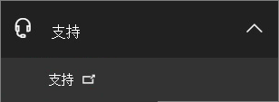
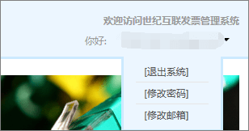

# Toepassen op een Fapiao voor Office 365, beheerd door 21Vianet

> [!NOTE]
> Het beheercentrum wordt gewijzigd. Als de informatie die hier wordt weergegeven, niet overeenkomt met wat u gewend bent, raadpleegt u [Over het nieuwe Microsoft 365-beheercentrum](https://docs.microsoft.com/microsoft-365/admin/microsoft-365-admin-center-preview?view=o365-21vianet).

U kunt uw Fapiao-aanvraag na drie dagen na betaling indienen bij het 21Vianet Fapiao-beheersysteem. Nadat u uw Fapiao aanvraag hebt verzonden, wordt deze binnen twee dagen verwerkt.
  

  
## Stap 1: een Fapiao toepassen

Er zijn twee manieren om een Fapiao toe te passen:
  
1. Nadat u een betaling hebt uitgevoerd op de website van Office 365 die wordt beheerd door 21Vianet, ontvangt u een e-mailbericht met uw ordernummer en een koppeling naar het Fapiao-beheersysteem. U kunt de koppeling in het e-mailbericht gebruiken om een account te maken in het <a href="https://go.microsoft.com/fwlink/p/?linkid=837466" target="_blank">21Vianet Fapiao Information Management System</a>.

    Of

2. U kunt een Fapiao van het <a href="https://go.microsoft.com/fwlink/p/?linkid=850627" target="_blank">Beheercentrum</a>toepassen.

    
  
## Stap 2: registreren met het 21Vianet Fapiao-beheersysteem

> [!NOTE]
> U kunt dezelfde e-mail naam en hetzelfde wachtwoord gebruiken als uw Office 365-account, of u kunt een ander account gebruiken.
  
1. Ga naar het <a href="https://go.microsoft.com/fwlink/p/?linkid=837466" target="_blank">21Vianet Fapiao Information Management System</a>.

2. Voer in het registratieformulier uw bestelnummer, e-mailadres en wachtwoord in en selecteer vervolgens **registreren**.

    
  
3. Wanneer de registratie is voltooid, wordt een e-mailbericht voor activering verzonden naar uw e-mailadres. Open het e-mailbericht en selecteer de koppeling om uw account te activeren.

## Stap 3: uw factuur verzenden voor een Fapiao

1. Meld u aan bij het <a href="https://go.microsoft.com/fwlink/p/?linkid=837465" target="_blank">Fapiao-beheersysteem</a>.

2. Selecteer de facturerings record en selecteer vervolgens **factuur toepassen**.

    > [!NOTE]
    > Het betalingssysteem bevindt zich op een platform van een derde partij en duurt drie dagen voor het synchroniseren van de order-en betalingsrecord.
  
    
  
3. Selecteer het type Fapiao, voer de gevraagde gegevens in en selecteer **volgende**.

    
  
    > [!NOTE]
    > - Voor een normaal BTW-Fapiao hoeft u alleen de naam van de koper in te voeren.
    > - U kunt zo nodig een Fapiao met een andere titel gebruiken. U kunt echter maar één Fapiao titel voor één factuur in het systeem toepassen. Als u de Fapiao wilt splitsen in verschillende bedragen of titels, moet u <a href="https://portal.partner.microsoftonline.cn/Support/SupportOverview.aspx" target="_blank">uw aanvraag indienen in het Beheercentrum</a>.
    > - De volgende keer dat u een Fapiao toepast, geeft het systeem automatisch de eerdere Fapiao-gegevens weer.
    > - Als u een aankoop certificaat of restitutie nodig hebt, moet de naam van de betaler en de titel van de Fapiao overeenkomen.

4. Selecteer een verzendmethode en voer de gegevens van de mailing in. U kunt Yunda of SF kiezen (vracht incasso). U kunt ook naar de 21Vianet Shanghai-tak gaan om de Fapiao te krijgen. Selecteer **volgende**.

    
  
    **het adres van het filiaal in 21Vianet Shanghai:**

    Shanghai, Pudong New gebied Keyuan Road No. 88, Duits centrum, gebouw 3, 657

    **Contact gegevens:**

    Zhu Qin Qin 021-28986102

5. Controleer of de gegevens juist zijn en selecteer vervolgens **bevestigen**.

    
  
## Stap 4: de voortgang van een toepassing controleren

Uw aanvraag wordt automatisch doorgestuurd naar het 21Vianet-service centrum en wordt in twee werkdagen voltooid.
  
Nadat u de toepassing hebt verzonden, kunt u de voortgang op elk moment controleren. We zullen de status van uw toepassing bijwerken met opmerkingen, zoals **uitgegeven** of **e-mailberichten**.
  

  
Als Fapiao niet aanwezig is, wordt er een melding weergegeven en wordt de verwachte tijd aangegeven voor het uitgeven van de Fapiao.
  

  
## Veelgestelde vragen

### Welke services kan ik kopen via de online ondersteuning?

U kunt de voortgang van uw aanvraag voor Fapiao controleren en achterhalen waarom u de Fapiao niet hebt ontvangen.
  
Als u de titel van de Fapiao wilt wijzigen, stuurt u de Fapiao terug naar ons en wordt het Fapiao opnieuw uitgegeven. U kunt de aanvraag indienen bij het <a href="https://portal.partner.microsoftonline.cn/Support/SupportOverview.aspx" target="_blank">Beheercentrum</a>.
  

  
### Hoe wijzig ik mijn e-mailadres en wachtwoord?

1. Meld u aan bij het <a href="https://go.microsoft.com/fwlink/p/?linkid=837465" target="_blank">Fapiao-beheersysteem</a>en selecteer vervolgens **e-mailadres wijzigen**.

    
  
2. Als u uw wachtwoord bent vergeten, kunt u het wachtwoord opnieuw instellen met uw aanmeldings-e-mailadres. Het Fapiao-beheersysteem stuurt een nieuw wachtwoord naar uw e-mailadres. U kunt het nieuwe wachtwoord gebruiken om u aan te melden.

    
  
3. Als u uw e-mailadres voor aanmelding bent vergeten, kunt u contact opnemen met de klantenservice van 21Vianet via (86) 400-089-0365.

### Hoe kan ik mijn order-ID vinden?

1. Ga in het [Beheercentrum](https://go.microsoft.com/fwlink/p/?linkid=850627)naar de pagina **facturen** \> **& betalingen** .

2. Zoek de gewenste factuur, Selecteer om te bekijken of kies om het PDF-bestand te downloaden.

### Wat moet ik doen als ik het verkeerde e-mailadres invoer wanneer ik me Registreer?

Als u het verkeerde e-mailadres invoert wanneer u zich registreert, ontvangt u geen activerings-e-mail. De registratie koppeling in het e-mailbericht verloopt automatisch na 24 uur. U kunt teruggaan naar de <a href="https://go.microsoft.com/fwlink/p/?linkid=837466" target="_blank">registratiepagina</a> en opnieuw registreren met het juiste e-mailadres.
  
### Wat moet ik doen als ik geen activerings-e-mail ontvang?

Als u na het registreren van een e-mailaccount een e-mailaccount een e-mailadres niet kunt activeren, gaat u naar het <a href="https://go.microsoft.com/fwlink/p/?linkid=837466" target="_blank">systeem over Fapiao informatiebeheer</a>, voert u uw e-mailadres in en selecteert u vervolgens **de e-mail activering opnieuw verzenden**. Het systeem stuurt de e-mail over account activering opnieuw naar uw geregistreerde e-mailadres.
  

  
Als u nog steeds geen activerings-e-mail ontvangt, neem dan contact op met de klantenservice van (86) 400-089-0365.