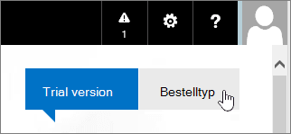

# Abonnementen voor Office 365 kopen of uitproberen die worden beheerd door 21Vianet

> [!NOTE]
>  Dit artikel is van toepassing op Office 365 dat wordt beheerd door 21Vianet in China.

## Office 365 kopen of uitproberen

U meteen een abonnement kopen of Office 365 tot 30 dagen proberen. Als u het leuk vindt, u uw proefabonnement kopen en het domein, de gegevens en de configuratie bewaren die u in uw proefversie hebt ingesteld.

1. Ga naar [Abonnementen voor Office 365 voor Bedrijven vergelijken](https://go.microsoft.com/fwlink/p/?linkid=393691&amp;clcid=0x409) en selecteer de naam van het abonnement dat u wilt kopen. Selecteer vervolgens **Nu kopen**.

2. Maak een account aan door de pagina **Slechts een paar details** in te vullen.

3. Volg de instructies om uw proefperiode van 30 dagen in te stellen of om uw aankoop te voltooien.

## Uw proefabonnement kopen

1. [Meld u aan bij Office 365](https://go.microsoft.com/fwlink/p/?linkid=513813) met uw werk- of schoolaccount.

2. Als u zich nog niet op de startpagina bevindt, selecteert u linksboven **Office 365**.

    

3. Selecteer in de rechterbovenhoek van de pagina, onder de navigatiebalk, **Kopen**.

    

4. On the **Purchase subscriptions** page, you'll see the different plans that you can buy. The plan that you've been trying is identified by the **In Trial** banner.

    > [!IMPORTANT]
    > Als u een ander abonnement koopt dan uw proefabonnement, moet u uw licenties van uw proefabonnement opnieuw toewijzen aan uw nieuwe abonnement (voordat uw respijtperiode van 90 dagen eindigt nadat uw proefabonnement is verlopen) om uw gegevens, accounts en configuratie te behouden. Anders verliest u uw gegevens, accounts en configuratie.

5. Selecteer het abonnement dat u wilt kopen en selecteer vervolgens **Nu kopen**.

6. Volg de stappen om uit te checken.

## Abonnementen of invoegtoepassingen toevoegen aan een bestaand Office 365-account

1. Ga in het [beheercentrum](https://go.microsoft.com/fwlink/p/?linkid=850627)naar de pagina Services **voor factureringsaankopen.** **Billing** \>

2. Selecteer de service(s) die u wilt kopen, selecteer **Kopen**en selecteer **Nu uitchecken**.

3. Volg de instructies om uw aankoop te voltooien.

## Betalingsopties

U uw abonnement betalen met:

- Factuur

- Online betalen met Alipay of China UnionPay

Het bewijs van betaling zal worden verstrekt in de vorm van Fapiaos. U uw Fapiao-aanvraag ongeveer drie (3) dagen na uw loon indienen bij ons [Fapiao-systeem.](https://go.microsoft.com/fwlink/p/?LinkId=395314) Zie [Een Fapiao aanvragen voor Office 365, dat wordt beheerd door 21Vianet, voor](apply-for-a-fapiao.md)meer informatie.

> [!NOTE]
>  Internationale creditcards worden niet geaccepteerd.
