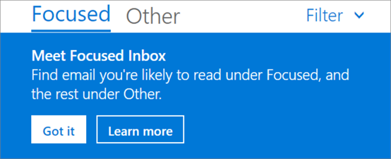

# <a name="configure-focused-inbox-for-everyone-in-your-organization"></a>Postvak IN met prioriteit configureren voor iedereen in uw organisatie

  Als u voor iedereen in uw bedrijf moet configureren hoe e-mail wordt gebruikt, is dit artikel interessant voor u. Er wordt uitgelegd hoe u dit kunt aanpassen of kunt uitschakelen voor uw bedrijf, en u krijgt antwoord op [Veelgestelde vragen](#faq-for-focused-inbox).  <br/> Zie [Postvak IN met prioriteit uitschakelen](https://support.microsoft.com/office/f714d94d-9e63-4217-9ccb-6cb2986aa1b2) als u Postvak IN met prioriteit alleen voor uzelf wilt uitschakelen.  
   
If you want to be sure that your users receive business-specific email messages, for example, from HR or payroll, you can configure Focused Inbox so these messages reach the Focused view. You can also control whether users in your organization see the Focused Inbox in their mailbox.
  
## <a name="turn-focused-inbox-on-or-off-in-your-organization"></a>Postvak IN met prioriteit in- of uitschakelen in uw organisatie

U kunt Windows PowerShell gebruiken om Postvak IN met prioriteit voor iedereen in uw organisatie in of uit te schakelen. Wilt u dit doen in het Microsoft 365-beheercentrum? Laat het weten aan ons technische team. **[Stem hier!](https://go.microsoft.com/fwlink/?linkid=862489)**
  
 **Postvak IN met prioriteit uitschakelen:**
  
The following PowerShell example turns Focused Inbox **Off** in your organization. However, it doesn't block the availability of the feature for your users. If they want, they can still re-enable Focused Inbox again on each of their clients. 
  
1. [Maak verbinding met Exchange Online via externe PowerShell](https://go.microsoft.com/fwlink/p/?LinkId=396554).
    
2. You need to be assigned permissions before you can perform this procedure or procedures. To see what permissions you need, see the "Transport rules" entry in [Messaging policy and compliance permissions](https://go.microsoft.com/fwlink/p/?LinkId=829796).
    
3. Voer de cmdlet **Get-OrganizationConfig** uit. 
    
 ``` PowerShell
Get-OrganizationConfig
 ```

4. Zoek naar **FocusedInboxOn** en bekijk de huidige instelling: 
    
    
  
5. Voer de volgende cmdlet uit om Postvak IN met prioriteit uit te schakelen.
    
 ``` PowerShell
 Set-OrganizationConfig -FocusedInboxOn $false
 ```

6. Voer de cmdlet **Get-OrganizationConfig** opnieuw uit. FocusedInboxOn staat nu ingesteld op $false, wat betekent dat het is uitgeschakeld. 
    
 **Postvak IN met prioriteit inschakelen:**
  
- Voer in stap 5 hierboven de volgende cmdlet uit om Postvak IN met prioriteit in te schakelen.
    
 ``` PowerShell
 Set-OrganizationConfig -FocusedInboxOn $true
 ```

## <a name="what-do-users-see-after-i-turn-on-focused-inbox"></a>Wat zien gebruikers nadat ik Postvak IN met prioriteit inschakel? 

Your users will see the Focused view only after they close and restart Outlook. When they restart Outlook, they'll see a Tip in the Outlook user interface giving them to the option to use the new Focused Inbox.
  

  
If you're switching from Clutter to Focused Inbox, they can decide to enable it ("Try it") or dismiss the feature. If the user has multiple (supported) clients, they can enable/disable Focused Inbox individually on each one. The tip looks like this:
  

  
When a user decides to start using Focused Inbox, Clutter gets disabled automatically. The Clutter folder gets converted into a standard folder, that allows the user to rename or delete it.
  
## <a name="turn-focused-inbox-on-or-off-for-specific-users"></a>Postvak IN met prioriteit in- of uitschakelen voor specifieke gebruikers

This example turns Focused Inbox **Off** for Tim Matthews in the Contoso organization. However, it doesn't block the availability of the feature to him. If his wants, he can still re-enable Focused Inbox again on each of his clients. 
  
1. [Maak verbinding met Exchange Online via externe PowerShell](https://go.microsoft.com/fwlink/p/?LinkId=396554).
    
2. You need to be assigned permissions before you can perform this procedure or procedures. To see what permissions you need, see the "Transport rules" entry in the Messaging policy and compliance permissions topic.
    
3. Voer de cmdlet **Get-FocusedInbox** uit, bijvoorbeeld: 
    
 ``` PowerShell
 Get-FocusedInbox -Identity <tim@contoso.com>
 ```

4. Zoek naar FocusedInboxOn en bekijk de huidige instelling:
    
    
  
5. Voer de volgende cmdlet uit om Postvak IN met prioriteit uit te schakelen:
    
 ``` PowerShell
 Set-FocusedInbox -Identity <tim@contoso.com> -FocusedInboxOn $false
 ```

6. Of voer de volgende cmdlet uit om het in te schakelen:
    
 ``` PowerShell
 Set-FocusedInbox -Identity <tim@contoso.com> -FocusedInboxOn $true
 ```

## <a name="use-the-ui-to-create-a-transport-rule-to-direct-email-messages-to-the-focused-view-for-all-your-users"></a>De gebruikersinterface gebruiken om een transportregel te maken om e-mailberichten voor alle gebruikers met prioriteit weer te geven

1. Ga naar het <a href="https://go.microsoft.com/fwlink/p/?linkid=2059104" target="_blank">Exchange-beheercentrum</a>.
    
2. Ga naar **E-mailstroom** \> **Regels**. Selecteer  en selecteer vervolgens **Een nieuwe regel maken...**. 
    
3. Wanneer u klaar bent met het maken van een nieuwe regel, klikt u op **Opslaan** om de regel toe te passen. 
    
    In de volgende afbeelding wordt een voorbeeld weergegeven waarbij alle berichten van 'Salarisadministratie' worden afgeleverd in Postvak IN met prioriteit.
    
    
  
## <a name="use-powershell-to-create-a-transport-rule-to-direct-email-messages-to-the-focused-view-for-all-your-users"></a>Windows PowerShell gebruiken om een transportregel te maken om e-mailberichten voor alle gebruikers met prioriteit weer te geven

1. [Maak verbinding met Exchange Online via externe PowerShell](https://go.microsoft.com/fwlink/p/?LinkId=396554).
    
2. You need to be assigned permissions before you can perform this procedure or procedures. To see what permissions you need, see the "Transport rules" entry in [Messaging policy and compliance permissions](https://go.microsoft.com/fwlink/p/?LinkId=829796).

3. Voer de volgende opdracht uit om alle berichten van bijvoorbeeld 'Salarisadministratie' at te leveren in Postvak IN met prioriteit.
    
 ``` PowerShell
 New-TransportRule -Name <name_of_the_rule> -From "Payroll Department" -SetHeaderName "X-MS-Exchange-Organization-BypassFocusedInbox" -SetHeaderValue "true"
 ```

> [!IMPORTANT]
> In dit voorbeeld zijn zowel 'X-MS-Exchange-Organization-BypassFocusedInbox' als 'true' hoofdlettergevoelig.
> De functie Postvak IN met prioriteit ondersteunt X-header die Onbelangrijke e-mail vermijdt. Als u deze instelling gebruikt in Onbelangrijke e-mail, wordt deze ook gebruikt in Postvak IN met prioriteit. Zie [Nieuwe-Transportregel](https://go.microsoft.com/fwlink/p/?LinkId=830194) voor gedetailleerde syntaxis- en parameterinformatie.

### <a name="how-do-you-know-this-worked"></a>Hoe weet u of dit heeft gewerkt?

U kunt de koptekst van e-mailberichten controleren om te kijken of de e-mailberichten door toepassing van een transportregel zijn bezorgd in Postvak IN met prioriteit. Kies een e-mailbericht in een postvak in uw organisatie waarop een transportregel voor Postvak IN met prioriteit is toegepast. Kijk of in de koptekst de tekst **X-MS-Exchange-Organization-BypassFocusedInbox: true** voorkomt. De regel werkt als dit het geval is. Zie het artikel[Koptekstgegevens weergeven voor een e-mailbericht](https://go.microsoft.com/fwlink/p/?LinkId=822530) voor instructies voor het vinden van de koptekstgegevens van een bericht. 
 
## <a name="turn-onoff-clutter"></a>Onbelangrijke e-mail in- of uitschakelen
 
We've received reports that Clutter suddenly stopped working for some users. If this happens, you can enable it again for specific users. See [Configure Clutter for your organization](../email/configure-clutter.md).
 
## <a name="faq-for-focused-inbox"></a>Veelgestelde vragen over Postvak IN met prioriteit

Hier vindt u antwoorden op Veelgestelde vragen over Postvak IN met prioriteit. 

### <a name="can-i-control-how-i-roll-out-focused-inbox-in-my-organization"></a>Kan ik bepalen op welke manier ik de functie Postvak IN met prioriteit implementeer in mijn organisatie?

Yes. You can turn Focused Inbox on or off for your entire organization, or you can turn it on or off for specified users. See above.
  
### <a name="is-the-focused-inbox-feature-only-available-for-office-2016-clients"></a>Is de functie Postvak IN met prioriteit alleen beschikbaar voor clients met Office 2016?

Ja, dit geldt alleen voor gebruikers met Office 2016. De functie wordt niet ondersteund voor Outlook 2013 of eerder.
  
### <a name="how-long-does-it-take-for-focused-inbox-changes-to-take-place-in-outlook"></a>Hoe lang het duurt voordat de gewijzigde instelling van Postvak IN met prioriteit wordt doorgevoerd in Outlook?

Nadat u Postvak IN met prioriteit hebt in- of uitgeschakeld, wordt de nieuwe instelling van kracht op het moment dat uw gebruikers hun exemplaar van Outlook sluiten en opnieuw starten.
  
### <a name="what-happens-to-clutter-once-i-turn-on-focused-inbox"></a>Wat gebeurt er met de functie Onbelangrijke e-mail als ik Postvak IN met prioriteit inschakel?

After switching, you'll no longer receive less actionable email in the Clutter folder. Instead, email will be split between the Focused and Other tabs in your inbox. The same algorithm that moved items to the Clutter folder now powers Focused Inbox, meaning that any emails that were set to move to Clutter will now be moved to Other. Any messages already in your Clutter folder will remain there until you decide to delete or move them.
  
Lees dit bericht van [Tony Redmond](https://www.petri.com/author/tony-redmond), Microsoft MVP: [How the Focused Inbox Replaces Clutter Inside Office 365](https://www.petri.com/focused-inbox-office-365).
  
### <a name="can-i-keep-users-on-clutter-what-is-microsofts-recommendation-when-it-comes-to-using-clutter-vs-focused-inbox"></a>Kan ik Onbelangrijke e-mail ingeschakeld laten voor gebruikers? Wat adviseert Microsoft als het gaat om de keuze tussen Onbelangrijke e-mail en Postvak IN met prioriteit?

Yes, you can keep users on Clutter and disable Focused Inbox, however, eventually Clutter will be fully replaced with Focused Inbox so Microsoft's recommends moving to Focused Inbox now. To learn more about when you use Clutter with Exchange Online, see this blog post: [Update on Focused Inbox and our plans for Clutter](https://techcommunity.microsoft.com/t5/Outlook-Blog/Update-on-Focused-Inbox-and-our-plans-for-Clutter/ba-p/136448).
  
### <a name="should-i-disable-clutter-for-my-end-users-if-we-are-going-to-move-everyone-to-focused-inbox"></a>Moet ik Onbelangrijke e-mail uitschakelen voor mijn eindgebruikers als we iedereen gaan overzetten naar Postvak IN met prioriteit?

No. It's possible to disable Clutter for a mailbox explicitly by running the Set-Clutter cmdlet. However, if you do this, the mailbox owner will see messages that were previously redirected to the Clutter folder remain in the Inbox and they'll have to process those messages until their client is upgraded to a version that supports the Focused Inbox. It's therefore best not to disable Clutter until the upgraded clients are available.
  
### <a name="why-are-there-two-different-cmdlets-for-managing-focused-inbox"></a>Waarom zijn er twee verschillende cmdlets voor het beheren van Postvak IN met prioriteit?

Postvak IN met prioriteit kan op twee niveaus worden ingesteld.
  
- **Organisatieniveau**: status van Postvak IN met prioriteit en een bijbehorend tijdstempel van het laatste tijdstip van bijwerken. 
    
- **Postvakniveau**: status van Postvak IN met prioriteit en een bijbehorend tijdstempel van het laatste tijdstip van bijwerken 
    
### <a name="how-does-outlook-decide-to-show-the-focused-inbox-experience-with-these-two-states"></a>Hoe wordt er door Outlook aan de hand van deze twee statuswaarden bepaald of de functie Postvak IN met prioriteit wordt gebruikt?

Outlook decides to show the experience by choosing which cmdlet has the latest time stamp. By default, both time stamps are "null" and in this case, the feature is enabled.
  
### <a name="why-does-the-get-focusedinbox-cmdlet-return-true-when-ive-turned-focused-inbox-off-in-my-organization"></a>Waarom retourneert de cmdlet Get-FocusedInbox 'true' als ik Postvak IN met prioriteit heb uitgeschakeld in mijn organisatie?

There are two cmdlets for controlling Focused Inbox. When you run Get-FocusedInbox for a mailbox, it returns the mailbox level state of the feature. The experience in Outlook is chosen based on which cmdlet state was last modified.
  
### <a name="can-i-run-a-script-to-see-who-has-turned-on-focused-inbox"></a>Kan ik een script uitvoeren om te zien wie Postvak IN met prioriteit heeft ingeschakeld?

No, and this is by design. Focused Inbox enablement is a client side setting, so all the cmdlet can do is tell you if the user's mailbox is eligible for the client experience. It is possible for it to be simultaneously enabled in some clients and disabled in others, for example, enabled in Outlook app and Outlook Mobile but disabled in Outlook on the web.
