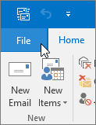

# E-mail en contactpersonen migreren naar Microsoft 365Migrate email and contacts to Microsoft 365

E-mail importeren of migreren van Gmail of een andere e-mailprovider naar Microsoft 365.Import or migrate email from Gmail or another email provider to Microsoft 365.
  
 **Wilt u hier hulp bij?****Want help with this?**  [Neem contact Microsoft 365 voor zakelijke ondersteuning](../../business-video/get-help-support.md) op.[Contact Microsoft 365 for business support](../../business-video/get-help-support.md) . 
  
U moet een versie van een Outlook gebruiken die op uw bureaublad is geïnstalleerd voor deze taak.You need to use a version of Outlook that is installed on your desktop for this task. Outlook is opgenomen in de meeste Microsoft 365 [abonnementen.](https://go.microsoft.com/fwlink/p/?LinkId=723731)Outlook is included in most Microsoft 365 [plans](https://go.microsoft.com/fwlink/p/?LinkId=723731).
  
### Gmail migreren naar Microsoft 365Migrate Gmail to Microsoft 365

Volg deze stappen om e-mail, contactpersonen en agenda van Gmail te importeren of te migreren naar Outlook met Microsoft 365:Follow these steps to import or migrate email, contacts, and calendar from Gmail into Outlook with Microsoft 365:
  
- [Gmail importeren in OutlookImport Gmail to Outlook](https://support.microsoft.com/office/20fdb8f2-fed8-4b14-baf0-bf04b9c44bf7)
    
- [Contactpersonen importeren in OutlookImport contacts to Outlook](https://support.microsoft.com/office/bb796340-b58a-46c1-90c7-b549b8f3c5f8)
    
- [Google Agenda importerenImport Google Calendar](https://support.microsoft.com/office/098ed60c-936b-41fb-83d6-7e3786437330)

## Kijken: Agenda's importerenWatch: Import calendars
    
> [!VIDEO https://www.microsoft.com/videoplayer/embed/c1e45708-9a92-475b-910b-f5aa40614d92?autoplay=false]
  
### Pst Outlook-bestanden importeren in Microsoft 365 (bureaublad)Import Outlook pst files to Microsoft 365 (desktop)

Volg deze stappen om e-mail, contactpersonen en agenda's te exporteren van Outlook naar een PST-bestand en vervolgens dat bestand te importeren in Outlook met Microsoft 365:Follow these steps to export email, contacts and calendars from Outlook to a .pst file, and then import that file to Outlook with Microsoft 365:
  
1. [E-mail, contactpersonen en agenda exporterenExport email, contacts, and calendar](https://support.microsoft.com/office/14252b52-3075-4e9b-be4e-ff9ef1068f91)
    
2. [E-mail, contactpersonen en agenda importerenImport mail, contacts, and calendar](https://support.microsoft.com/office/431a8e9a-f99f-4d5f-ae48-ded54b3440ac)
    
Als u alleen contactpersonen wilt, volgt u de volgende stappen:If you just want contacts, follow these steps:
  
1. [Contactpersonen exporteren uit OutlookExport contacts from Outlook](https://support.microsoft.com/office/10f09abd-643c-4495-bb80-543714eca73f)
    
2. [Contactpersonen importeren in OutlookImport contacts to Outlook](https://support.microsoft.com/office/bb796340-b58a-46c1-90c7-b549b8f3c5f8)
    
Als u het proces wilt starten, opent u Outlook en kiest **u** \> **&amp; Exportbestand openen** \> **Import/Export.**To start the process, open Outlook and choose **File** \> **Open &amp; Export** \> **Import/Export**.
  

  
## Andere e-mailaccounts in OutlookSee other email accounts in Outlook

Wilt u alleen uw e-mail van een andere provider (zoals Gmail, Yahoo of Live.com) in Outlook?Just want to see your email from another provider (like Gmail, Yahoo, or Live.com) in Outlook? U hoeft niet te importeren of te migreren.No need to import or migrate. U kunt Outlook of Outlook Web App zo instellen dat u toegang hebt tot uw andere accounts vanaf dezelfde plaats als uw Microsoft 365-postvak en e-mail kunt verzenden, ontvangen en lezen die naar deze accounts is verzonden.You can set up Outlook or Outlook Web App so you can access your other accounts from the same place as your Microsoft 365 mailbox and send, receive, and read email sent to those accounts.
  
### Outlook (bureaublad)Outlook (desktop)

Voeg een account, zoals uw persoonlijke Gmail-account, toe aan Outlook.Add an account, such as your private Gmail account, to Outlook.
  
- Open Outlook en ga vervolgens naar  \> **Bestandsaccount toevoegen.**Open Outlook, then go to **File** \> **Add account**.
    
Hebt u meer gedetailleerde stappen nodig?Need more detailed steps? Zie [Een account toevoegen.](https://support.microsoft.com/office/6e27792a-9267-4aa4-8bb6-c84ef146101b)See [Add an account](https://support.microsoft.com/office/6e27792a-9267-4aa4-8bb6-c84ef146101b).
  

  
## Meerdere postvakken: beheerders kunnen e-mail, contactpersonen en agenda's bulksgewijs importeren in Microsoft 365Multiple mailboxes: Admins can bulk import email, contacts, and calendars to Microsoft 365

Afhankelijk van uw bron-e-mailsysteem kunt u kiezen uit verschillende bulkmigratiemethoden.Depending on your source email system, you can choose from several bulk migration methods. Lees [Manieren om meerdere e-mailaccounts te migreren naar Microsoft 365](/Exchange/mailbox-migration/mailbox-migration) om te bepalen welke methode voor u werkt.Read [Ways to migrate multiple email accounts to Microsoft 365](/Exchange/mailbox-migration/mailbox-migration) to decide which method works for you.

## Verwante inhoudRelated content

[Uw installatie van Microsoft 365 voor bedrijven](plan-your-setup.md) (artikel)[Plan your setup of Microsoft 365 for business](plan-your-setup.md) (article)\
[Installeer Office toepassingen](install-applications.md) (koppelingspagina)[Install Office applications](install-applications.md) (link page)\
[Overzicht van het Microsoft 365-beheercentrum](../../business-video/admin-center-overview.md) (video)[Overview of the Microsoft 365 admin center](../../business-video/admin-center-overview.md) (video)