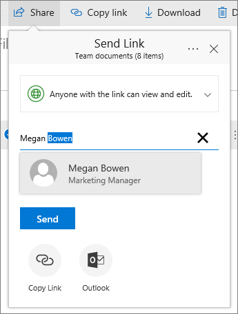

# Bestandsopslag en -delen instellen in Microsoft 365Set up file storage and sharing in Microsoft 365

Een van de beste manieren om bestandsopslag en -delen voor uw bedrijf in te stellen, is door samen OneDrive en een teamsite te gebruiken.One of the best ways to set up file storage and sharing for your business is to use OneDrive and a team site together. Dit is ideaal voor een klein bedrijf met een klein aantal medewerkers.This is ideal if you have a small business with a few employees.

## Bekijk: Waar kunt u bestanden opslaan in Office 365Watch: Where to store files in Office 365

> [!VIDEO https://www.microsoft.com/videoplayer/embed/RE1FTHX] 

Als u deze video nuttig vond, raadpleegt u dan de [complete reeks trainingen voor kleine bedrijven en nieuwe gebruikers van Microsoft 365](../../business-video/index.yml).If you found this video helpful, check out the [complete training series for small businesses and those new to Microsoft 365](../../business-video/index.yml).

## Microsoft 365 documentopslag en -beheerMicrosoft 365 document storage and management

- OneDrive is ontworpen voor individueel gebruik, met af en toe het delen van bestanden.OneDrive is designed for individual use, with the occasional sharing of files.

- Een teamsite is ontworpen voor het regelmatig delen en samenwerken aan bestanden.A team site is designed for sharing and collaborating on files regularly. Een teamsite is ideaal voor het opslaan van bestanden met gedeeld eigendom waarbij meerdere personen de eigenaar zijn van de bestanden en er mogelijk aan kunnen samenwerken.A team site is ideal for storing files that have shared ownership where several people own the files and might collaborate on them. Maak een Microsoft-team om een teamsite toe te voegen.Create a Microsoft Team to add a team site. [Meer informatie over Een team maken in Teams.](https://support.microsoft.com/office/174adf5f-846b-4780-b765-de1a0a737e2b)[Learn more at Create a team in Teams](https://support.microsoft.com/office/174adf5f-846b-4780-b765-de1a0a737e2b).

Zowel OneDrive als teamsites bieden overal toegang voor u en uw werknemers.Both OneDrive and team sites provide anywhere access for you and your employees.
  

  
Hier volgen aanbevelingen voor wat u op elke locatie kunt opslaan wanneer u OneDrive en teamsites samen gebruikt:Here are recommendations for what to store in each location when you use OneDrive and team sites together: 

  
|OpslaglocatieStorage location|Waar is het voorWhat's it for|Wat ik hier moet opslaanWhat to store here|
|:-----|:-----|:-----|
|**OneDrive****OneDrive** |Het opslaan van inhoud in OneDrive is net als het opslaan van bestanden op uw computer. niemand anders kan er gemakkelijk toegang toe krijgen.Storing content in OneDrive is like storing files on your computer; no one else can easily access them.  Zie Wat [is OneDrive voor Bedrijven?](https://support.microsoft.com/office/187f90af-056f-47c0-9656-cc0ddca7fdc2) voor meer OneDrive voor BedrijvenFor more info, see [What is OneDrive for Business?](https://support.microsoft.com/office/187f90af-056f-47c0-9656-cc0ddca7fdc2)   |Bestanden voor uw werk waaraan andere teamleden niet regelmatig hoeven te werken of toegang toe hoeven te hebben.Business files that other team members won't need to collaborate on or access regularly.  |
|**SharePoint-teamsites****SharePoint team sites**   |Samenwerking.Collaboration. Wanneer u een Microsoft 365-groep maakt (bijvoorbeeld in het Microsoft 365-beheercentrum, in Outlook of door een team te maken in Microsoft Teams), wordt er een SharePoint-teamsite gemaakt voor die groep.When you create a Microsoft 365 group (for example, in the Microsoft 365 admin center, in Outlook, or by creating a team in Microsoft Teams), a SharePoint team site is created for that group. Als u een nieuwe SharePoint teamsite maakt vanaf de startpagina van SharePoint of vanuit het nieuwe SharePoint-beheercentrum, wordt er ook een Microsoft 365 gemaakt.Likewise, when you create a new SharePoint team site from the SharePoint home page or from the new SharePoint admin center, it also creates a Microsoft 365 group. Zie Wat is een SharePoint [teamsite?](https://support.microsoft.com/office/75545757-36c3-46a7-beed-0aaa74f0401e) en [Een teamsite maken in SharePoint Online voor meer informatie.](https://support.microsoft.com/office/ef10c1e7-15f3-42a3-98aa-b5972711777d)For more info, see [What is a SharePoint team site?](https://support.microsoft.com/office/75545757-36c3-46a7-beed-0aaa74f0401e) and [Create a team site in SharePoint Online](https://support.microsoft.com/office/ef10c1e7-15f3-42a3-98aa-b5972711777d).    |Bestanden die gedeeld eigendom zijn.Files that have shared ownership. We raden u aan afzonderlijke teamsites te gebruiken voor elke werkeenheid in uw organisatie.We recommend separate team sites for each unit of work in your organization. Als u bijvoorbeeld personeel en financiële documenten privé wilt houden voor een klein team, maakt u een aparte teamsite.For example, to keep personnel and financial documents private to a small team, create a separate team site.    |

> [!NOTE]
> SharePoint heeft ook andere typen sites die u voor uw bedrijf kunt gebruiken.SharePoint also has other types of sites you can use for your business. U kunt [communicatiesites](https://support.microsoft.com/office/7fb44b20-a72f-4d2c-9173-fc8f59ba50eb) in uw intranet gebruiken om informatie te publiceren voor een breed publiek.You can use [communication sites](https://support.microsoft.com/office/7fb44b20-a72f-4d2c-9173-fc8f59ba50eb) in your intranet to publish information for a broad audience. En u kunt [hubsites gebruiken om sites](https://support.microsoft.com/office/fe26ae84-14b7-45b6-a6d1-948b3966427f) in uw intranet met elkaar te verbinden.And you can use [hub sites](https://support.microsoft.com/office/fe26ae84-14b7-45b6-a6d1-948b3966427f) to connect sites in your intranet.
  
## Start met OneDrive en uw teamsiteStart using OneDrive and your team site

### Teamleden kunnen hun eigen bestanden opslaan in OneDriveTeam members can store their own files in OneDrive

Elke persoon in uw bedrijf die een licentie Microsoft 365 toegewezen (en SharePoint Online geselecteerd) krijgt OneDrive cloudopslag.Each person in your business who has a Microsoft 365 license assigned (and SharePoint Online selected) gets OneDrive cloud storage. Ze kunnen hier zakelijke bestanden opslaan voor toegang vanaf elk apparaat en ze zijn alleen beschikbaar voor die gebruiker.They can store business-related files here for access from any device, and they are only available to that user. Ze kunnen hier bijvoorbeeld een conceptversie van een offerte, hun vergadernotities of een script opslaan voor een demo die ze gaan geven.For example, they might store a draft proposal, their meeting notes, or the script for a demo they're going to deliver.
  
Werknemers kunnen ook OneDrive bestanden en mappen delen.Employees can also share OneDrive files and folders. Als een werknemer weg is of het bedrijf verlaat, hebben anderen toegang tot gedeelde bestanden die zijn opgeslagen in OneDrive (OneDrive delen van teammappen).If an employee is away or leaves the company, others can access shared files stored in OneDrive (OneDrive team folder sharing).
  
Hier ziet u hoe elke persoon in uw team bestanden kan OneDrive en delen.Here's how each person on your team can set up OneDrive and share files.

1. Ga naar de <a href="https://portal.office.com/ " target="_blank">Microsoft 365 portal</a>en meld u aan met uw gebruikersnaam en wachtwoord.Go to the <a href="https://portal.office.com/ " target="_blank">Microsoft 365 Portal</a>, and sign in with your user name and password.

2. Selecteer in het start start start- en **OneDrive.**From the App launcher, select **OneDrive**.

3. In OneDrive kunnen teamleden hun eigen zakelijke bestanden opslaan.In OneDrive, team members can store their own business-related files. U kunt afzonderlijke bestanden of een hele map delen.You can share either individual files, or a whole folder. Kies een bestand of map, klik met de rechtermuisknop en kies **delen.**Pick a file or folder, right-click, and then choose **Share**.

    
  
4. Op de **pagina Koppeling verzenden** laat u de standaardselectie staan die iedereen met de koppeling kan bekijken en **bewerken.**On the **Send Link** page, leave the default selection **Anyone with the link can view and edit**.

    Typ namen of e-mailadressen van teamleden die u toegang wilt geven tot de map en voeg een optioneel bericht toe.Type names or email addresses of team members who you want to have access to the folder, and add an optional message.

    Als u uw eigen kopie wilt van de e-mail die wordt verzonden, voegt u uw e-mailadres toe aan de lijst.If you want your own copy of the email that will be sent, add your email address to the list.

    
  
5. Wanneer u klaar bent met het invoeren van de persoon met wie u wilt delen, selecteert u **Verzenden.**When you're done entering who you want to share with, select **Send**. De e-mail wordt onmiddellijk verzonden naar de personen die u uitnodigt.The email is immediately sent to the people you invite.

    
  
6. Zo ziet het e-mailbericht eruit.Here's what the email looks like. 

    
  
### Upload bestanden naar een teamsite voor onlinesamenwerkingUpload files to a team site for online collaboration

Teamsites hebben een plek om bestanden op te slaan, een zogenaamde documentbibliotheek.Team sites come with a place to store files, called a document library.  
  
Hier volgen de stappen om bestanden toe te voegen:Here are the steps to add files:
  
1. Kies documenten in het linkernavigatiemenu op de startpagina van uw teamsite. On the home page of your team site, choose **Documents** from the left-hand navigation menu. Dit brengt u naar uw **documentbibliotheek**.This will take you to your **Documents library**.
  
2. Terwijl u nog steeds bent aangemeld bij Microsoft 365, opent u Windows **Verkenner** vanaf de taakbalk of een andere locatie.While you're still signed in to Microsoft 365, open Windows **File Explorer** from your taskbar or other location. Ga naar de bestanden die u wilt uploaden naar uw teamsite.Go to the files you want to upload to your team site.

3. Selecteer de bestanden die u wilt uploaden naar uw teamsite en sleep deze naar de **documentbibliotheek.**Select the files you want to upload to your team site, and then drag them to the **Document library**.
  
4. Wanneer u klaar bent, worden de bestanden opgeslagen op zowel uw teamsite als uw computer.When you're done, the files will be stored in both your team site and your computer.
  
5. U kunt de bestanden van uw computer verwijderen.You can delete the files from your computer. In de volgende stap, [Onlinebestanden synchroniseren met](#sync-online-files-with-your-pc-or-mac)uw pc of Mac, maakt u een nieuwe locatie voor deze bestanden op uw computer.In the next step, [Sync online files with your PC or Mac](#sync-online-files-with-your-pc-or-mac), you're going to create a new location for these files on your computer.

    Als u een groot aantal bestanden of grote bestanden naar uw teamsite wilt uploaden, leest u deze tips over het uploaden van grote of veel bestanden [naar een bibliotheek.](https://support.microsoft.com/office/da549fb1-1fcb-4167-87d0-4693e93cb7a0#__toc384119242)If you have numerous files or large files to upload to your team site, read these tips on [uploading large or many files to a library](https://support.microsoft.com/office/da549fb1-1fcb-4167-87d0-4693e93cb7a0#__toc384119242).

    Als u meer opslagruimte nodig hebt, raadpleegt u [Opslagruimte voor uw abonnement wijzigen](../../commerce/add-storage-space.md).If you need more storage space, see [Change storage space for your subscription](../../commerce/add-storage-space.md).

### Onlinebestanden synchroniseren met uw pc of MacSync online files with your PC or Mac

Nu dat u bestanden op uw teamsite hebt, kunt u instellen dat deze met uw pc of Mac worden gesynchroniseerd.Now that you have files on your team site, you can set them up to sync with your PC or Mac. Op deze manier kunt u werken aan uw bestanden vanaf uw pc of Mac in plaats van te werken in Microsoft Edge, Chrome of een andere browser.This way, you can work on your files from your PC or Mac instead of working in Microsoft Edge, Chrome, or another browser. Het is ook handig om een versie van uw bestanden op uw pc of Mac te synchroniseren, voor het geval dat u een bestand nodig hebt en geen verbinding met internet hebt.It's also useful to have a version of your files synced on your computer for situations when you need to get to a file and you aren't connected to the Internet.
  
Nadat u bestanden hebt ingesteld om te worden gesynchroniseerd met uw computer, worden ze automatisch gesynchroniseerd wanneer u verbinding hebt met internet.After you set up files to sync with your computer, when you're connected to the Internet, they'll be synchronized automatically.
  
Hier volgt de werkwijze waarop u bestanden op uw teamsite kunt synchroniseren met uw computer:Here's how to synchronize files on your team site with your desktop:
  
1. Kies documenten in het linkernavigatiemenu op de startpagina van uw teamsite. On the home page of your team site, choose **Documents** from the left-hand navigation menu. Hiermee gaat u naar de bibliotheek Documenten.This takes you to your Documents library.

    > [!TIP]
    > Wanneer u bestanden op uw teamsite synchroniseert, synchroniseert u elke bestandsbibliotheek op de site, niet de hele site.When syncing files on your team site, you're syncing each file library on the site, not the entire site.
  
2. Kies **Synchroniseren** om alle bestanden te synchroniseren.Choose **Sync** to synchronize all the files. Of blader naar de specifieke map die u wilt synchroniseren.Or browse to the specific folder you want to sync.

3. Als u wordt gevraagd om van app te wisselen, kiest u **Ja.**If prompted to switch apps, choose **Yes**. OneDrive is het proces dat de synchronisatie doet.OneDrive is the process doing the synchronization.
  
4. Als u vervolgens een prompt Instellen **OneDrive,** meld u dan aan met uw werk- of schoolaccount.If you then get a **Set up OneDrive** prompt, sign in with your work or school account.

    
  
5. Als u uw OneDrive nog niet hebt gesynchroniseerd, ziet u mogelijk het scherm Dit **is OneDrive map.**If you haven't yet synced your OneDrive, you might see a **This is your OneDrive folder** screen. Controleer het pad onder **Uw OneDrive map is hier**.Check the path under **Your OneDrive folder is here**. Kies **Locatie wijzigen** als u een ander pad wilt gebruiken en selecteer vervolgens **Volgende.**Choose **Change Location** if you want to use a different path, and then select **Next**.

    
  
6. De bestanden op uw teamsites worden weergegeven in het linkerdeelvenster van Verkenner onder de naam van uw organisatie.The files in your team sites will appear in the left pane of File Explorer under the name of your organization. De bestanden in OneDrive worden weergegeven onder 'OneDrive - \<Name of Organization\> 'The files in OneDrive will appear under "OneDrive - \<Name of Organization\>"

    
  
7. Test de synchronisatie door een bestand te openen in de map van het team op uw computer.Test the synchronization by opening a file in the team's folder on your computer. Breng een wijziging aan en kies vervolgens **Opslaan**.Make a change, and then choose **Save**.

## Aanbevolen procedures voor het opslaan en delen van bestandenBest practices for file storage and sharing

Hier zijn een paar tips om het meeste uit uw OneDrive of uw SharePoint teamsite te krijgen.Here are a few tips for getting the most from OneDrive or your SharePoint team site.
  
### Aanbevelingen voor bestandsopslag en samenwerking voor andere typen kleine bedrijvenFile storage and collaboration recommendations for other types of small businesses

- **Eenmanszaken:** Gebruik OneDrive om uw eigen bestanden op te slaan en deze per geval te delen met klanten.**Sole proprietorships**: Use OneDrive to store your own files and share them with customers on a case-by-case basis.

- **Co-eigendom:** beide eigenaren gebruiken OneDrive en delen bestanden heen en weer.**Co-ownerships**: Both owners use OneDrive and share files back and forth.

- **Bedrijven met externe klanten of partners die** toegang nodig hebben tot bestanden: Maak een nieuwe teamsite om documenten op te slaan en te delen die zijn bedoeld voor een specifieke klant.**Businesses with external clients or partners who need access to files**: Create a new team site to store and share documents intended for a specific customer. Stel de site zo in dat alleen die klant toegang heeft.Set up the site to allow access to only that customer. U hoeft zich dan geen zorgen te maken dat de ene klant per ongeluk toegang krijgt tot informatie die voor een andere klant is bedoeld.You then don't need to worry that one customer will accidentally get access to information intended for another customer.

### Persoonlijke bestanden privé houdenKeep private files private

Wanneer u een bestand op OneDrive is het alleen toegankelijk voor u, tenzij u het met anderen deelt.When you store a file in OneDrive it's only accessible by you, unless you share it with others. Wanneer u bestanden deelt, kunt u ervoor kiezen om een koppeling te maken die kan worden doorgestuurd of om te delen met alleen specifieke personen.When you share files, you can choose to create a link that can be forwarded, or to share with only specific people. U kunt ook afzonderlijke mappen in OneDrive maken voor verschillende doeleinden, zoals openbare, persoonlijke of afzonderlijke projecten.You can also create separate folders in OneDrive for different purposes such as public, personal, or for individual projects. Elke map kan met een andere persoon of groep worden gedeeld, of met helemaal niemand.Each folder can be shared with a different person or group, or nobody else at all.
  
Zie Bestanden en mappen delen met Microsoft 365 voor [meer informatie over delen.](https://support.microsoft.com/office/72f26d6c-bf9e-432c-8b96-e3c2437f5b65)For more information on sharing, also see [Share files and folders with Microsoft 365](https://support.microsoft.com/office/72f26d6c-bf9e-432c-8b96-e3c2437f5b65).
  
### Controleren hoeveel opslagruimte u nog hebtTrack how much space you have left

Als u wilt zien hoeveel opslagruimte u nog hebt in OneDrive, gaat u naar [Uw OneDrive voor Bedrijven beheren.](https://support.microsoft.com/office/31519161-059C-4764-B6F8-F5CD29F7FE68)To see how much storage space you have left in OneDrive, see [Manage your OneDrive for Business storage](https://support.microsoft.com/office/31519161-059C-4764-B6F8-F5CD29F7FE68).
  
### Welke bestanden kunnen worden opgeslagen in OneDrive en een teamsite?What files can be stored in OneDrive and a team site?

Hoewel u vrijwel alle typen bestanden kunt uploaden, zijn sommige bestandsnamen en tekens in bestandsnamen niet toegestaan.While you can upload almost all types of files, some file names and characters in file names aren't allowed. Zie Ongeldige [bestandstekens en bestandstypen in](https://support.microsoft.com/office/64883A5D-228E-48F5-B3D2-EB39E07630FA)OneDrive voor Bedrijven.For more info, see [Invalid file characters and file types in OneDrive for Business](https://support.microsoft.com/office/64883A5D-228E-48F5-B3D2-EB39E07630FA).
  
### Opslagservices van derden in- of uitschakelenEnable or disable third-party storage services

U kunt opslag van derden inschakelen voor uw gebruikers in Microsoft 365 zodat ze documenten kunnen opslaan en delen met services zoals Dropbox, naast OneDrive en teamsites.You can enable third-party storage for your users in Microsoft 365 so they can store and share documents using services like Dropbox in addition to OneDrive and team sites. Dit is een uitstekende manier om services te bieden die gebruikers mogelijk al gebruiken of liever gebruiken voor zakelijke projecten.This can be a great way to provide services that your users may already be using or prefer to use for business projects. Als u niet wilt dat personen in uw organisatie bestanden Office openen in een service van derden, volgt u deze stappen om deze uit te schakelen.If you don't want people in your organization using Office to open files in a third-party service, follow these steps to turn it off.
  
> [!IMPORTANT]
> Opslag van derden is standaard ingeschakeld, dus u moet deze stappen direct uitvoeren als u niet wilt dat deze beschikbaar is voor uw gebruikers.Third-party storage is enabled by default so you need to perform these steps right away if you don't want it available to your users.
  
1. Meld u aan bij het <a href="https://go.microsoft.com/fwlink/p/?linkid=2024339" target="_blank">beheercentrum.</a>Sign in to to the <a href="https://go.microsoft.com/fwlink/p/?linkid=2024339" target="_blank">admin center</a>.

2. Ga naar de **pagina Instellingen** \> <a href="https://go.microsoft.com/fwlink/p/?linkid=2053743" target="_blank">**organisatieinstellingen.**</a>Go to the **Settings** \> <a href="https://go.microsoft.com/fwlink/p/?linkid=2053743" target="_blank">**Org settings**</a> page.

3. Selecteer op **het** tabblad Services **webversie van Office**.On the **Services** tab, select **Office on the web**.

4. Schakel het selectievakje in of uit om opslag van derden in of uit te schakelen en selecteer **vervolgens Wijzigingen opslaan.**Select or deselect the check box to turn third-party storage on or off, then select **Save changes**.

## Volgende stappenNext steps

- [Pas uw teamsite aan voor bestandsopslag en delen.](customize-team-site.md)[Customize your team site for file storage and sharing](customize-team-site.md). In deze stapsgewijze zelfstudie leert u hoe kunt profiteren van meer functies voor opslag en samenwerking.This step-by-step tutorial shows you how to you can take advantage of more storage and collaboration features.

- **Office-apps instellen voor uw tablets en telefoons**.**Set up Office apps on your tablets and phones.** U moet dit doen, zodat u **bestanden** kunt bewerken die zijn opgeslagen in OneDrive en op teamsites vanaf uw tablet of telefoon.You need to do this so you can **edit** files that are stored in OneDrive and on team sites from your tablet or phone. Als u de apps Office voor uw tablet of telefoon niet installeert, kunt u de bestanden bekijken, maar niet bewerken.If you don't install the Office apps for your tablet or phone, you'll be able to view the files but not edit them.

  - [Installeren en instellen Office op een Android met Microsoft 365Install and set up Office on an Android with Microsoft 365](https://support.microsoft.com/office/cafe9d6f-8b0c-4b03-b20a-12438a82a22d)

  - [Installatie en installatie van Office op een iPhone of iPad met Microsoft 365Install and set up Office on an iPhone or iPad with Microsoft 365](https://support.microsoft.com/office/9df6d10c-7281-4671-8666-6ca8e339b628)

  - [Een Office instellen op Windows Phone met Microsoft 365Set up Office on Windows Phone with Microsoft 365](https://support.microsoft.com/office/2b7c1b51-a717-45d6-90c9-ee1c1c5ee0b7)

## Verwante inhoudRelated content

[Opslagruimte toevoegen voor uw abonnement](../../commerce/add-storage-space.md) (artikel)[Add storage space for your subscription](../../commerce/add-storage-space.md) (article)\
[Bestanden en mappen delen met Microsoft 365 Business](https://support.microsoft.com/office/share-files-and-folders-with-microsoft-365-business-72f26d6c-bf9e-432c-8b96-e3c2437f5b65) (video)[Share files and folders with Microsoft 365 Business](https://support.microsoft.com/office/share-files-and-folders-with-microsoft-365-business-72f26d6c-bf9e-432c-8b96-e3c2437f5b65) (video)\
[Uw teamsite aanpassen voor bestandsopslag en delen](customize-team-site.md) (artikel)[Customize your team site for file storage and sharing](customize-team-site.md) (article)