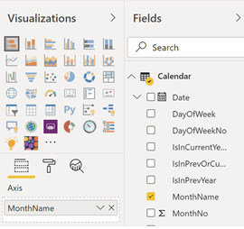
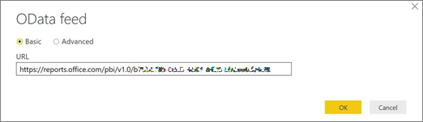

# Rapporten in Microsoft 365 Gebruiksanalyse naar voorkeur aanpassen

Gebruiksanalyse van Microsoft 365 biedt een dashboard in Power BI dat inzicht biedt in de manier waarop gebruikers Microsoft 365 gebruiken en gebruiken. Het dashboard is alleen een beginpunt voor interactie met de gebruiksgegevens. De rapporten kunnen worden aangepast voor meer persoonlijke inzichten.
  
U kunt ook Power BI Desktop gebruiken om uw rapporten verder aan te passen, door verbinding te maken met andere gegevensbronnen voor nog uitgebreidere inzichten in uw bedrijf.
  
## Rapporten aanpassen in de browser

In de volgende twee voorbeelden ziet u hoe u een bestaand visueel element kunt aanpassen en een nieuw visueel element kunt maken.
  
### Een bestaand visueel element wijzigen

In dit voorbeeld ziet u hoe u het tabblad **Activering** wijzigt in **het rapport Activering/licentie.** 
  
1. Selecteer in **het rapport Activering/licentie** het **tabblad** Activering.
    
2. Voer de bewerkingsmodus in door **de** knop Bewerken bovenaan te kiezen via de knop Meer pagina in  BI. 
    
    
  
3. Kies rechtsboven de optie **Deze pagina dupliceren.**
    
    
  
4. Kies rechtsonder een van de staafdiagrammen met het aantal gebruikers dat activeert op basis van het besturingssysteem, zoals Android, iOS, Mac, enzovoort.
    
5. Selecteer in **het gebied Visualisaties** aan de rechterkant de **X** er naast om Het aantal **Mac's** uit het visuele gedeelte te verwijderen.

        
    
### Een nieuw visueel element maken

In het volgende voorbeeld ziet u hoe u een nieuw visueel element maakt voor het bijhouden van nieuwe Yammer-gebruikers op maandbasis.
  
1. Ga met de linkernavigatie naar het **rapport Productgebruik** en selecteer het **tabblad Yammer.**
    
2. Schakel over naar de bewerkingsmodus door  **kiezen.** 
    
3. Selecteer onder aan de pagina de optie  om een nieuwe pagina te maken.
  
4. Kies in **het gebied Visualisaties** aan de rechterkant de optie **Gestapeld staafdiagram** (bovenste rij, eerst van links).

    
    
5. Selecteer de rechteronderzijde van die visualisatie en sleep om deze groter te maken.

6. Vouw in **het** gebied Velden aan de rechterkant de tabel **Agenda** uit.

7. Sleep **MonthName** naar het gedeelte met velden, direct onder de koptekst **As** in het gedeelte **Visualisaties**.
 
    
    
8. Vouw in het gedeelte **Velden** aan de rechterkant de tabel **TenantProductUsage** uit.

9. Sleep **FirstTimeUsers** naar het gedeelte met velden, direct onder de koptekst **Waarde**.

10. Sleep **Product** naar het gedeelte **Filters**, direct onder de koptekst **Filters op niveau van visuele elementen**.

11. Selecteer in het gedeelte **Filtertype** dat wordt weergegeven het selectievakje **Yammer**.

    
  
12. Kies net onder de lijst met visualisaties het **pictogram** Opmaakpictogram Opmaak in Power 

13. Vouw Titel uit en wijzig de waarde **Titel** in **Nieuwe gebruikers van Yammer per maand**.
    
14. Wijzig de **Tekengrootte** in **12**.
    
15. Wijzig de titel van de nieuwe pagina door de naam van de pagina rechtsonder te bewerken.

16.  Sla het rapport op door te klikken op de **leesweergave** bovenaan en vervolgens **op Opslaan.**
    
## De rapporten in Power BI Desktop aanpassen

Voor de meeste klanten is het aanpassen van de rapporten en visuele elementen van grafieken op de Power BI-website voldoende. Sommige klanten willen deze gegevens echter misschien koppelen aan andere gegevensbronnen voor uitgebreidere inzichten in de context van hun eigen bedrijf. In dat geval kunnen ze rapporten aanpassen en aanvullende rapporten maken met Power BI Desktop. U kunt [Power BI Desktop](https://go.microsoft.com/fwlink/p/?linkid=849797) gratis downloaden. 
  
### De rapportage-API's gebruiken

U kunt beginnen door rechtstreeks verbinding te maken met de ODATA-rapportage-API's van Microsoft 365 die van invloed zijn op deze rapporten.
  
1. Ga naar **Gegevens ophalen** \> **Overige** \> **ODATA-feed** \> **Verbinding maken**.
    
2. Voer in het URL-venster 'https:// <i></i> \<tenantid\> reports.office.com/pbi/v1.0/' in
    
    **OPMERKING:** De rapportage-API's zijn in preview en kunnen worden gewijzigd totdat ze in productie gaan. 
  
    
  
3. Voer uw Microsoft 365-beheerdersreferenties (organisatie of school) in om te verifiëren bij Microsoft 365 wanneer u daarom wordt gevraagd.
    
    Zie de [veelgestelde](usage-analytics.md#faq) vragen voor meer informatie over wie toegang heeft tot de microsoft 365-app-app-rapporten met acceptatiesjabloon. 
    
4. Zodra de verbinding is geautoriseerd, wordt het Navigator-venster weergegeven met de gegevenssets waarmee u verbinding kunt maken.
    
    Selecteer alles en kies **Laden.**
    
    Hiermee worden de gegevens gedownload naar uw Power BI-bureaublad. Sla dit bestand op en vervolgens kunt u beginnen met het maken van de rapporten die u nodig hebt.
    
    
  
### Het Microsoft 365 Gebruiksanalyse sjabloon gebruiken

U kunt ook het Power BI-sjabloonbestand dat hoort bij de rapporten van Microsoft 365 Gebruiksanalyse gebruiken als startpunt voor het maken van verbinding met de gegevens. Het voordeel van het gebruik van het PBIT-bestand is dat de verbindingstekenreeks al is vastgelegd. U kunt ook profiteren van alle aangepaste metingen die zijn gedaan ter aanvulling op de gegevens in het basisschema, en die verder uitbouwen.
  
U kunt het Power BI-sjabloonbestand downloaden vanuit het [Microsoft Downloadcentrum.](https://download.microsoft.com/download/7/8/2/782ba8a7-8d89-4958-a315-dab04c3b620c/Microsoft%20365%20Usage%20Analytics.pbit) Nadat u het Power BI-sjabloonbestand hebt gedownload, volgt u de volgende stappen om aan de slag te gaan:
  
1. Open het PBIT-bestand.
    
2. Geef uw tenant-id op in het dialoogvenster.
    
    
  
3. Voer uw beheerdersreferenties in om te verifiëren bij Microsoft 365 wanneer u daarom wordt gevraagd.
    
     voor meer informatie over wie toegang heeft tot de analyserapporten voor Microsoft 365-gebruik. 
    
    Na autorisatie worden de gegevens in het Power BI-bestand vernieuwd.
    
    Het laden van de gegevens kan enige tijd duren. Wanneer het is voltooid, kunt u het bestand opslaan als een PBIX-bestand en de rapporten verder aanpassen of nog meer gegevensbronnen aan het rapport toevoegen.
    
4. Volg de documentatie [Aan de slag met Power BI](/power-bi/fundamentals/desktop-getting-started) voor informatie over hoe u rapporten maakt, ze publiceert naar de Power BI-service en ze deelt binnen uw organisatie. Voor het volgen van dit pad voor aanpassen en delen zijn mogelijk extra Power BI-licenties vereist. Zie de [licentierichtlijnen](https://go.microsoft.com/fwlink/p/?linkid=849803) voor Power BI voor meer informatie. 
