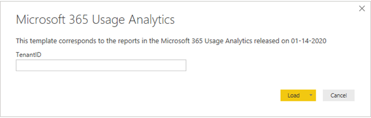

# Rapporten in Microsoft 365 Gebruiksanalyse naar voorkeur aanpassenCustomize the reports in Microsoft 365 usage analytics

::: moniker range="o365-21vianet"

> [!NOTE]
> Het beheercentrum verandert.The admin center is changing. Als uw ervaring niet overeenkomt met de hier gepresenteerde details, raadpleegt u [Over het nieuwe Microsoft 365-beheercentrum](https://docs.microsoft.com/microsoft-365/admin/microsoft-365-admin-center-preview?view=o365-21vianet).If your experience doesn't match the details presented here, see [About the new Microsoft 365 admin center](https://docs.microsoft.com/microsoft-365/admin/microsoft-365-admin-center-preview?view=o365-21vianet).

::: moniker-end

Microsoft 365-gebruiksanalyse biedt een dashboard in Power BI dat inzicht biedt in de manier waarop gebruikers Microsoft 365 gebruiken en gebruiken.Microsoft 365 usage analytics provides a dashboard in Power BI that offers insights into how users adopt and use Microsoft 365. Het dashboard is alleen een beginpunt voor interactie met de gebruiksgegevens.The dashboard is just a starting point to interact with the usage data. De rapporten kunnen worden aangepast voor meer persoonlijke inzichten.The reports can be customized for more personalized insights.
  
U kunt ook Power BI Desktop gebruiken om uw rapporten verder aan te passen, door verbinding te maken met andere gegevensbronnen voor nog uitgebreidere inzichten in uw bedrijf.You can also use the Power BI desktop to further customize your reports by connecting them to other data sources to gain richer insights about your business.
  
## Rapporten aanpassen in de browserCustomizing reports in the browser

In de volgende twee voorbeelden ziet u hoe u een bestaand visueel element kunt aanpassen en een nieuw visueel element kunt maken.The following two examples show how to modify an existing visual and how to create a new visual.
  
### Een bestaand visueel element wijzigenModify an existing visual

In dit voorbeeld ziet u hoe u het tabblad **Activering wijzigt** in het rapport **Activering/licentieverlening.**This example shows how to modify the **Activation** tab within the **Activation/Licensing** report. 
  
1. Klik in het rapport **Activering/licentieverlening** op het tabblad **Activering.**Within the **Activation/Licensing** report, click on the **Activation** tab.
    
2. Voer de bewerkingsmodus in **Edit** door bovenaan op de  via de knop Meer pagina in de knop Power BI.Enter the edit mode by clicking the **Edit** button on the top through the  button. 
    
    
  
3. Klik rechtsboven op **Deze pagina dupliceren**.On the top right, click **Duplicate this page**.
    
    
  
4. Klik rechtsonder op een van de staafdiagrammen met het aantal gebruikers dat activeert op basis van het besturingssysteem, zoals Android, iOS, Mac, enz.In the bottom right, click on any of the bar charts showing the count of users activating based on the OS such as Android, iOS, Mac, etc.
    
5. Klik in het gebied **Visualisaties** aan de rechterkant om **Mac Count** uit de visual te verwijderen op de **X** ernaast.In the **Visualizations** area to the right, in order to remove **Mac Count** from the visual, click on the **X** next to it.

        
    
### Een nieuw visueel element makenCreate a new visual

In het volgende voorbeeld ziet u hoe u een nieuw visueel element maakt voor het bijhouden van nieuwe Yammer-gebruikers op maandbasis.The following example shows how to create a new visual to track new Yammer users on monthly basis.
  
1. Ga naar het rapport **Productgebruik** met de linkernavigatie en klik op het tabblad **Yammer.**Go to the **Product Usage** report using the left nav and click on **Yammer** tab.
    
2. Schakel over naar de bewerkingsmodus door te klikken op  en **Bewerken**.Switch to edit mode by clicking on  and **Edit**. 
    
3. Klik onderaan de pagina opAt the bottom of the page, click on  om een nieuwe pagina te maken.to create a new page.
  
4. Klik in het gebied **Visualisaties** rechts op het **gestapelde staafdiagram** (bovenste rij, eerste van links).In the **Visualizations** area to the right, click the **Stacked bar chart** (top row, first from left).

    
    
5. Klik op de rechtersbenedenhoek van de visualisatie en sleep om die groter te maken.Click the bottom right of that visualization and drag to make it larger.

6. Vouw in het gebied **Velden** aan de rechterkant de tabel **Agenda** uit.In the **Fields** area to the right, expand the **Calendar** table.

7. Sleep **MonthName** naar het gedeelte met velden, direct onder de koptekst **As** in het gedeelte **Visualisaties**.Drag **MonthName** to the fields area, directly below the **Axis** heading in the **Visualizations** area.
 
    
    
8. Vouw in het gedeelte **Velden** aan de rechterkant de tabel **TenantProductUsage** uit.In the **Fields** area to the right, expand the **TenantProductUsage** table.

9. Sleep **FirstTimeUsers** naar het gedeelte met velden, direct onder de koptekst **Waarde**.Drag **FirstTimeUsers** to the fields area, directly below the **Value** heading.

10. Sleep **Product** naar het gedeelte **Filters**, direct onder de koptekst **Filters op niveau van visuele elementen**.Drag **Product** to the **Filters** area, directly below the **Visual level filters** heading.

11. Selecteer in het gedeelte **Filtertype** dat wordt weergegeven het selectievakje **Yammer**.In the **Filter Type** area that appears, select the **Yammer** check box.

    
  
12. Klik net onder de lijst met  **Opmaak** in Power BI Visualizaions .Just below the list of visualizations, click the **Format** icon .

13. Vouw Titel uit en wijzig de waarde **Titel** in **Nieuwe gebruikers van Yammer per maand**.Expand Title and change the **Title Text** value to **First-Time Yammer Users by Month**.
    
14. Wijzig de **Tekengrootte** in **12**.Change the **Text Size** value to **12**.
    
15. Wijzig de titel van de nieuwe pagina door de naam van de pagina rechtsonder te bewerken.Change the title of the new page by editing the name of the page on bottom right.

16.  Sla het rapport op door bovenaan op **leesweergave** te klikken en vervolgens **op te slaan**.Save out the report by Clicking on **Reading View** on top and then **Save**.
    
## De rapporten in Power BI Desktop aanpassenCustomizing the reports in Power BI Desktop

Voor de meeste klanten is het aanpassen van de rapporten en visuele elementen van grafieken op de Power BI-website voldoende. Sommige klanten willen deze gegevens echter misschien koppelen aan andere gegevensbronnen voor uitgebreidere inzichten in de context van hun eigen bedrijf. In dat geval kunnen ze rapporten aanpassen en aanvullende rapporten maken met Power BI Desktop. U kunt [Power BI Desktop](https://go.microsoft.com/fwlink/p/?linkid=849797) gratis downloaden.For most customers modifying the reports and chart visuals in Power BI web will be sufficient. For some however, there may be a need to join this data with other data sources to gain richer insights contextual to their own business, in which case they can customize and build additional reports using Power BI Desktop. You can download [Power BI Desktop](https://go.microsoft.com/fwlink/p/?linkid=849797) for free. 
  
### De rapportage-API's gebruikenUse the reporting APIs

U beginnen door rechtstreeks verbinding te maken met de ODATA-rapportage-API's van Microsoft 365 die deze rapporten van stroom voorstaan.You can start by connecting directly to the ODATA reporting APIs from Microsoft 365 that power these reports.
  
1. Ga naar **Gegevens ophalen** \> **Overige** \> **ODATA-feed** \> **Verbinding maken**.Go to **get data** \> **Other** \> **ODATA Feed** \> **Connect**.
    
2. Voer in het URL-venster 'https://<i></i>reports.office.com/pbi/v1.0/\<tenantid\>in'In the URL window enter "https://<i></i>reports.office.com/pbi/v1.0/\<tenantid\>"
    
    **LET OP:** De rapportage-API's zijn in preview en kunnen worden gewijzigd totdat ze in productie gaan.**NOTE:** The reporting APIs are in preview and are subject to change until they go into production. 
  
    
  
3. Voer uw Microsoft 365-beheerdersreferenties (organisatie of school) in om deze te verifiëren bij Microsoft 365 wanneer daarom wordt gevraagd.Enter your Microsoft 365 (organization or school) admin credentials to authenticate to Microsoft 365 when prompted.
    
    Zie de [veelgestelde vragen](usage-analytics.md#faq) voor meer informatie over wie toegang heeft tot de rapporten van de Microsoft 365-sjabloonvoor adoptie.See the [FAQ](usage-analytics.md#faq) for more information about who is allowed to access the Microsoft 365 Adoption template app reports. 
    
4. Zodra de verbinding is geautoriseerd, wordt het Navigator-venster weergegeven met de gegevenssets waarmee u verbinding kunt maken.Once the connection is authorized, you will see the Navigator window that shows the datasets available to connect to.
    
    Selecteer alles en klik op **Laden**.Select all and click on **Load**.
    
    Hiermee downloadt u de gegevens naar Power BI Desktop. Sla het bestand op. U kunt beginnen met het maken van de gewenste rapporten.This will download the data into your Power BI Desktop. Save this file and then you can start creating the reports you need.
    
    
  
### Het Microsoft 365 Gebruiksanalyse sjabloon gebruikenUse the Microsoft 365 usage analytics template

U kunt ook het Power BI-sjabloonbestand dat hoort bij de rapporten van Microsoft 365 Gebruiksanalyse gebruiken als startpunt voor het maken van verbinding met de gegevens. Het voordeel van het gebruik van het PBIT-bestand is dat de verbindingstekenreeks al is vastgelegd. U kunt ook profiteren van alle aangepaste metingen die zijn gedaan ter aanvulling op de gegevens in het basisschema, en die verder uitbouwen.You can also use the Power BI template file that corresponds to the Microsoft 365 usage analytics reports as a starting point to connect to the data. The advantage of using the pbit file is that it has the connection string already established. You can also take advantage of all the custom measures that are created, on top of the data that the base schema returns and build on it further.
  
U het Power BI-sjabloonbestand downloaden vanuit het Microsoft-downloadcentrum vanuit het [downloadcentrum.](https://download.microsoft.com/download/7/8/2/782ba8a7-8d89-4958-a315-dab04c3b620c/Microsoft%20365%20Usage%20Analytics.pbit)You can download the Power BI template file from the Microsoft download center from the [Download center](https://download.microsoft.com/download/7/8/2/782ba8a7-8d89-4958-a315-dab04c3b620c/Microsoft%20365%20Usage%20Analytics.pbit). Nadat u het Power BI-sjabloonbestand hebt gedownload, gaat u als volgt te werk om aan de slag te gaan:After you have downloaded the Power BI template file follow these steps to get started:
  
1. Open het PBIT-bestand.Open the pbit file.
    
2. Geef uw tenant-id op in het dialoogvenster.Enter your tenant id value in the dialog.
    
    
  
3. Voer uw beheerdersreferenties in om te verifiëren bij Microsoft 365 wanneer daarom wordt gevraagd.Enter your admin credentials to authenticate to Microsoft 365 when prompted.
    
     voor meer informatie over wie toegang heeft tot de Microsoft 365-rapporten over gebruiksanalyses.for more information about who is allowed to access the Microsoft 365 usage analytics reports. 
    
    Na autorisatie worden de gegevens in het Power BI-bestand vernieuwd.Once authorized, the data will be refreshed in the Power BI file.
    
    Het laden van de gegevens kan enige tijd duren. Wanneer het is voltooid, kunt u het bestand opslaan als een PBIX-bestand en de rapporten verder aanpassen of nog meer gegevensbronnen aan het rapport toevoegen.Data load may take some time, once complete, you can save the file as a .pbix file and continue to customize the reports or bring an additional data source into this report.
    
4. Volg de documentatie [Aan de slag met Power BI](https://go.microsoft.com/fwlink/?linkid=849802) voor informatie over hoe u rapporten maakt, ze publiceert naar de Power BI-service en ze deelt binnen uw organisatie. Voor het volgen van dit pad voor aanpassen en delen zijn mogelijk extra Power BI-licenties vereist. Zie de [licentierichtlijnen](https://go.microsoft.com/fwlink/p/?linkid=849803) voor Power BI voor meer informatie.Follow [Getting started with Power BI](https://go.microsoft.com/fwlink/?linkid=849802) documentation to understand how to build reports, publish them to the Power BI service, and share with your organization. Following this path for customization and sharing may require additional Power BI licenses. See Power BI [licensing guidance](https://go.microsoft.com/fwlink/p/?linkid=849803) for details. 
    

