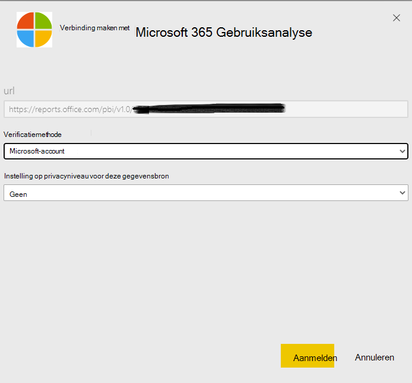

# Microsoft 365 Gebruiksanalyse inschakelenEnable Microsoft 365 usage analytics

::: moniker range="o365-21vianet"

> [!NOTE]
> Het beheercentrum wordt gewijzigd.The admin center is changing. Als de informatie die hier wordt weergegeven, niet overeenkomt met wat u gewend bent, raadpleegt u [Over het nieuwe Microsoft 365-beheercentrum](https://docs.microsoft.com/microsoft-365/admin/microsoft-365-admin-center-preview?view=o365-21vianet).If your experience doesn't match the details presented here, see [About the new Microsoft 365 admin center](https://docs.microsoft.com/microsoft-365/admin/microsoft-365-admin-center-preview?view=o365-21vianet).

::: moniker-end

Microsoft 365-gebruiksanalyses zijn nog niet beschikbaar voor microsoft 365-overheidscommunity van de Amerikaanse overheid.Microsoft 365 usage analytics is not yet available for Microsoft 365 US Government Community.
  
## Stappen voor het inschakelen van Microsoft 365 GebruiksanalyseSteps to enable Microsoft 365 usage analytics

Als u aan de slag wilt met Microsoft 365-gebruiksanalyses, moet u eerst de gegevens beschikbaar stellen in het Microsoft 365-beheercentrum en vervolgens de sjabloon-app in Power BI starten.To get started with Microsoft 365 usage analytics you must first make the data available in the Microsoft 365 admin center, then initiate the template app in Power BI.
  
### Power BI downloadenGet Power BI

Als u nog geen Power BI hebt, u [zich aanmelden voor Power BI Pro.](https://go.microsoft.com/fwlink/p/?linkid=845347)If you don't already have Power BI, you can [sign up for Power BI Pro](https://go.microsoft.com/fwlink/p/?linkid=845347). Selecteer **Probeer je gratis** aan te melden voor een proefversie of Koop **nu** om Power BI Pro te krijgen.Select **Try free** to sign up for a trial, or **Buy now** to get Power BI Pro.
  
  
U kunt ook **Products** uitvouwen om een versie van Power BI te kopen.You can also expand **Products** to buy a version of Power BI. 

> [!NOTE]
> U hebt een Power BI Pro-licentie nodig om een sjabloon-app te installeren, aan te passen en te distribueren.You need a Power BI Pro license to install, customize, and distribute a template app. Zie [Voorwaarden](https://docs.microsoft.com/power-bi/service-template-apps-install-distribute?source=docs#prerequisites)voor meer informatie.For more information, please see [Prerequisites](https://docs.microsoft.com/power-bi/service-template-apps-install-distribute?source=docs#prerequisites).

U hebt een Power BI Pro-licentie nodig om uw inhoud te delen, en de mensen met wie u deze deelt, doen dat ook, of de inhoud moet zich in een werkruimte bevinden in een [Premium-capaciteit.](https://docs.microsoft.com/power-bi/service-premium-what-is)You need a Power BI Pro license to share your content, and the people you share it with do too, or the content needs to be in a workspace in a [Premium capacity](https://docs.microsoft.com/power-bi/service-premium-what-is). 
  
### De sjabloon-app inschakelenEnable the template app

Als u de sjabloon-app wilt inschakelen, moet u een **globale beheerder**, **rapportlezer**, **Exchange-beheerder,** **Skype voor Bedrijven-beheerder**of **SharePoint-beheerder**zijn.To enable the template app, you have to be either a **global administrator**, **report reader**, **Exchange administrator**, **Skype for Business administrator**, or **SharePoint administrator**. 
  
Zie [Over beheerdersrollen](../add-users/about-admin-roles.md) voor meer informatie.See [About admin roles](../add-users/about-admin-roles.md) for more information. 
  
1. Ga in het beheercentrum naar de pagina **Rapporten** \> <a href="https://go.microsoft.com/fwlink/p/?linkid=2074756" target="_blank">Gebruik</a>.In the admin center, go to the **Reports** \> <a href="https://go.microsoft.com/fwlink/p/?linkid=2074756" target="_blank">Usage</a> page. 
    
2. Zoek op de pagina **Gebruik** de **Microsoft 365-gebruiksanalysekaart** en selecteer **Aan de slag**.On the **Usage** page, locate the **Microsoft 365 usage analytics** card, and select **Get started**.
    
3. Stel in het deelvenster Rapporten dat wordt geopend, de gegevens beschikbaar maken **voor Microsoft 365-gebruiksanalyses voor Power BI** in **Opslaan.** \> **Save**On the Reports panel that opens, set **Make data available to Microsoft 365 usage analytics for Power BI** to **On** \> **Save**. 
  
Hiermee wordt het gegevensverzamelingsproces gestart, en dit zal voltooid worden in 2 tot 48 uur, afhankelijk van de grootte van uw tenant. De knop **Ga naar Power BI** zal ingeschakeld zijn (niet langer grijs) als het verzamelen van gegevens is voltooid.This initiates the data collection process and will complete in 2 to 48 hours depending on the size of your tenant. The **Go to Power BI** button will be enabled (no longer gray) when data collection is complete. 
    
### De sjabloon-app startenInitiate the template app

Als u de sjabloon-app wilt starten, moet u een **globale beheerder**, **rapportlezer**, **Exchange-beheerder,** **Skype voor Bedrijven-beheerder**of **SharePoint-beheerder**zijn.To initiate the template app, you have to be either a **global administrator**, **report reader**, **Exchange administrator**, **Skype for Business administrator**, or **SharePoint administrator**. 
  
1. Kopieer de tenant-id en selecteer **Ga naar Power BI**.Copy the tenant Id and select **Go to Power BI**.
    
2.  Meld u aan wanneer u in Power BI komt.When you get to Power BI, sign in. Selecteer Apps->Apps ophalen in het navigatiemenu.Select Apps->Get apps from the navigation menu.    
  
3. In het tabblad **Apps** typt u Microsoft 365 in het zoekvak en selecteer vervolgens **Microsoft 365 Gebruiksanalyse** \> **Koop het vandaag nog**.In the **Apps** tab, type Microsoft 365 in the search box and then select **Microsoft 365 usage analytics** \> **Get it now**.

    
    
4.  Zodra de app is geïnstalleerd.Once the app is installed. Klik op de tegel om deze te openen.Click on the tile to open it.

5.  Klik **op De app verkennen** om de app met voorbeeldgegevens weer te geven.Click **Explore app** to view the app with sample data. Klik **op Verbinding** maken om de app te koppelen aan de gegevens van uw organisatie.Click **Connect** to connect the app to your organization’s data.

6.  Nadat u **op Verbinding**hebt geklikt , typt u in het scherm Verbinding maken met Microsoft **365-gebruiksanalyse** de tenant-id (zonder streepjes) die u in stap hebt gekopieerd (1) en selecteert u **Volgende**.After clicking **Connect**, on the **Connect to Microsoft 365 usage analytics** screen, type in the tenant Id (without dashes) you copied in step (1), and select **Next**.
    
7. Selecteer in het volgende scherm **Microsoft-account** als **verificatiemethode** \> **Aanmelden**.On the next screen, select **Microsoft account** as the **Authentication method** \> **Sign in**. Als u een andere verificatiemethode kiest, mislukt de verbinding met de sjabloon-app.If you choose any other authentication method, the connection to the template app will fail.
    
    
  
8. Zodra de sjabloon-app is gehe momentediated, is het Microsoft 365 usage analytics-dashboard beschikbaar in Power BI op het web.Once the template app is instantiated the Microsoft 365 usage analytics dashboard will be available in Power BI on the web. Het eerste laden van het dashboard duurt 2 tot 30 minuten.The initial loading of the dashboard will take between 2 to 30 minutes.
  
Samengevoegde gegevens op tenantniveau zijn beschikbaar in alle rapporten.Tenant level aggregates will be available in all reports. **Gegevens op gebruikersniveau zijn pas beschikbaar na de 1e of 15e dag van de kalendermaand na aanmelding**.**User-level details will only become available after the 1st or 15th day of the calendar month after opting in**. Dit heeft gevolgen voor alle rapporten onder Gebruikersactiviteit (Zie [Navigeren en gebruik de rapporten in Microsoft 365-gebruiksanalyses](navigate-and-utilize-reports.md) voor tips over het bekijken en gebruiken van deze rapporten).This will impact all reports under User Activity (See [Navigate and utilize the reports in Microsoft 365 usage analytics](navigate-and-utilize-reports.md) for tips on how to view and use these reports).
    
## Verzamelde gegevens anoniem makenMake the collected data anonymous

Alleen hoofdbeheerders kunnen de gegevens die worden verzameld voor alle rapporten anoniem maken.To make the data that is collected for all reports anonymous, you have to be a global administrator. Hiermee worden identificeerbare informatie zoals gebruikers-, groeps- en sitenamen verborgen in rapporten en in de sjabloon-app.This will hide identifiable information such as user, group and site names in reports and in the template app .
  
1. Ga in het beheercentrum naar **de** \> **instellingeninstellingen van organisatie**en kies onder tabblad **Services** De optie **Rapporten**.In the admin center, go to the **Settings** \> **Org Settings**, and under **Services** tab, choose **Reports**.
    
2. Selecteer **Rapporten**en kies vervolgens voor **Anonieme id's weergeven**.Select **Reports**, and then choose to **Display anonymous identifiers**. Deze instelling wordt zowel toegepast op de gebruiksrapporten als op de sjabloon-app.This setting gets applied both to the usage reports as well as to the template app.
  
3. Selecteer **Wijzigingen opslaan**.Select **Save changes**.
