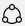

# Navigeren en de rapporten gebruiken in Microsoft 365 Gebruiksanalyse

::: moniker range="o365-21vianet"

> [!NOTE]
> Het beheercentrum wordt gewijzigd. Als de informatie die hier wordt weergegeven, niet overeenkomt met wat u gewend bent, raadpleegt u [Over het nieuwe Microsoft 365-beheercentrum](https://docs.microsoft.com/microsoft-365/admin/microsoft-365-admin-center-preview?view=o365-21vianet&preserve-view=true).

::: moniker-end

Het dashboard biedt een beknopt overzicht van de belangrijkste gebruiks- en acceptatiestatistieken. Door de statistieken op het hoogste niveau te selecteren, hebt u toegang tot rapporten met meer details en inzichten. Elk tabblad bevat gegevensvisualisaties die zijn toegespitst op een aspect van het gebruik en toepassing voor uw organisatie. De verzamelde gegevens worden be verklaren in de titel van elk rapport en er verschijnt een tegel met meer informatie over de visualisaties op het rapporttabblad dat u bekijkt.

Hier volgen enkele tips om aan de slag met de rapporten:

- Gebruik de navigatietabbladen aan de linkerkant  of op een gerelateerde metrieke op de pagina Samenvatting voor leidinggevenden om naar elk rapport op het hoogste niveau te navigeren.

    

- Gebruik de navigatietabbladen boven aan elk rapport op het hoogste niveau om naar verschillende rapporten binnen dat niveau te navigeren.

    

- Veel rapporten bevatten een slicer waarin u kunt filteren op het product, het AAD-kenmerk of de activiteit die u wilt bekijken. Dit kan één selectie of meerdere selecties zijn.

    

    

- Beweeg de muisaanwijzer over gegevenspunten om een bijschrift met details weer te geven.

    

De gebruiker die de sjabloon-app heeft geïnstalleerd, kan het rapport aan zijn of haar wensen aanpassen. De sjabloon-app aanpassen:

- Selecteer **Rapport bewerken** boven aan het rapport.

    

- Maak uw eigen visuele elementen met de onderliggen [gegevenssets](usage-analytics-data-model.md).

- Gebruik Power BI Desktop om uw eigen gegevensbronnen toe te voegen.

Als u uw rapporten wilt delen, selecteert u gewoon de knop Delen  boven aan de pagina.

Voor meer informatie over het aanpassen van rapporten raadpleegt u [Rapporten naar voorkeur aanpassen in Microsoft 365 Gebruiksanalyse](customize-reports.md).

U kunt uitgebreide informatie vinden in de Help van Power BI:

- [Basisbegrippen voor Power BI](https://docs.microsoft.com/power-bi/service-basic-concepts)

    Meer informatie over dashboards, gegevenssets, rapporten en andere Power BI-concepten.

- [Get started with Power BI service](https://docs.microsoft.com/power-bi/service-get-started?wt.mc_id=O365_Reports_PBI_contentpack) (Aan de slag met de Power BI-service)

    Informatie over de basisfunctionaliteit van Power BI. Hier vindt u koppelingen om meer te lezen over het gebruik van het Power BI-bureaublad.

- [Share a dashboard and reports with colleagues and others](https://docs.microsoft.com/power-bi/service-share-dashboards) (Dashboard en rapporten delen met collega's en anderen)

    Lees hoe u rapporten kunt delen met collega's of personen buiten uw organisatie. U kunt het rapport of een gefilterde versie van het rapport ook delen.
