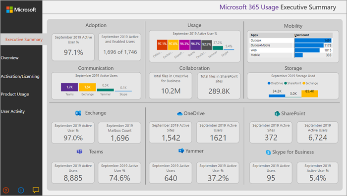

# Microsoft 365 Gebruiksanalyse

Gebruik Microsoft 365 gebruiksanalyse binnen Power BI om inzicht te krijgen in hoe uw organisatie de verschillende services binnen uw Microsoft 365. U kunt uw gebruiksgegevens visualiseren Microsoft 365 analyseren, aangepaste rapporten maken en de inzichten binnen uw organisatie delen. U kunt ook inzicht krijgen in de manier waarop specifieke regio's of afdelingen Microsoft 365.
  
Microsoft 365 gebruiksanalyse biedt u toegang tot een vooraf gebouwd dashboard dat een productoverschrijdende weergave biedt van de afgelopen 12 maanden en een aantal vooraf gebouwde rapporten bevat. Elk rapport bevat specifieke gebruiksinzichten. Gebruikersspecifieke informatie is beschikbaar voor de laatste volledige kalendermaand.
  
Het [gegevensmodel dat](usage-analytics-data-model.md) de sjabloon-app aanjabloont, bevat gebruikerskenmerken van Active Directory, waarmee u in bepaalde rapporten kunt draaien. De volgende Active Directory-kenmerken zijn opgenomen: locatie, afdeling en organisatie. 
  
Zie [Microsoft 365 Gebruiksanalyse inschakelen](enable-usage-analytics.md) om te beginnen met het verzamelen van gegevens. 
  
Microsoft 365 gebruiksanalyse bevat een aantal rapporten die in de volgende secties worden beschreven. 

U hebt toegang tot gedetailleerde rapporten voor elk gebied door de gegevenstabellen te selecteren. U kunt alle voorafgebouwde rapporten weergeven door de tabbladen onder aan de site te selecteren. Lees Navigeren en  de rapporten gebruiken en de rapporten aanpassen voor meer [gedetailleerde instructies.](customize-reports.md)

## Samenvatting van leidinggevenden

De samenvatting is een overzicht op hoog niveau, in een oogopslag van Microsoft 365 voor zakelijke acceptatie, gebruik, mobiliteit, communicatie, samenwerking en opslagrapporten en is bedoeld voor zakelijke besluitvormers. Het biedt een overzicht van de manier waarop bepaalde afzonderlijke services worden gebruikt, op basis van alle gebruikers die zijn ingeschakeld en degenen die actief zijn. Alle waarden van de maand die in het rapport worden weergegeven, verwijzen naar de meest recente volledige maand. 

In deze samenvatting kunt u snel inzicht krijgen in gebruikspatronen in Office en hoe en waar uw werknemers samenwerken.

## Overzicht

Het Microsoft 365 overzichtsrapport bevat de volgende rapporten. U kunt deze weergeven door het tabblad boven aan de rapportpagina te kiezen. Alle waarden van de maand die in het bovenste gedeelte van het rapport worden weergegeven, verwijzen naar de meest recente volledige maand.

- **Acceptatie** &ndash; Biedt een overzicht van de acceptatietrends. Gebruik de rapporten in deze sectie voor meer informatie over hoe uw gebruikers Microsoft 365 en hoe het algemene gebruik van de afzonderlijke services maand na maand is gewijzigd. U kunt zien hoe gebruikers zijn ingeschakeld, hoeveel personen in uw organisatie actief Microsoft 365 gebruiken, hoeveel terugkerende gebruikers er zijn en hoeveel gebruikers het product voor het eerst gebruiken.

- **Gebruik** &ndash; Biedt een inzoomweergave in het volume van actieve gebruikers en de belangrijkste activiteiten voor elk product van de afgelopen 12 maanden. Gebruik de rapporten in deze sectie om te leren hoe personen in uw organisatie gebruikmaken van Microsoft 365.

- **Communicatie** &ndash; U kunt in één oogopslag zien of personen in uw organisatie liever contact houden met behulp van Teams, Yammer, e-mail of Skype oproepen. U kunt zien of er verschuivingen zijn in patronen in het gebruik van communicatiehulpmiddelen tussen uw werknemers. 

- **Samenwerking** &ndash; Bekijk hoe personen in uw organisatie documenten OneDrive en SharePoint gebruiken om documenten op te slaan en met elkaar samen te werken, en hoe deze trends zich maand na maand ontwikkelen. U kunt ook zien hoeveel documenten intern of extern worden gedeeld en hoeveel SharePoint-sites of OneDrive-accounts actief worden gebruikt, uitgesplitsd door eigenaren en andere medewerkers.

- **Storage** &ndash; Gebruik dit rapport om cloudopslag bij te houden voor postvakken, OneDrive en SharePoint sites.

- **Mobiliteit** &ndash; Houd bij welke clients en apparaten personen gebruiken om verbinding te maken met e-mail, Teams, Skype of Yammer.

## Activering en licentieverlening

De activerings- en licentiepagina bevat rapporten over Microsoft 365 activering; dat wil zeggen, hoeveel gebruikers apps hebben gedownload en geactiveerd Office en hoeveel licenties zijn toegewezen door uw organisatie. De maandwaarde naar boven verwijst naar de huidige maand en de metrische waarden die zijn samengevoegd vanaf het begin van de maand tot de huidige datum.

- **Activering** &ndash; Houd serviceplan bij (bijvoorbeeld Microsoft 365-apps voor ondernemingen, Project en Visio) activeringen in uw organisatie. Elke persoon met een Office-licentie kan producten installeren op maximaal vijf apparaten. U kunt rapporten in deze sectie ook gebruiken om de apparaten te zien waarop personen Office hebben geïnstalleerd. Als u een abonnement wilt activeren, moet een gebruiker de app installeren en zich aanmelden met zijn of haar account.

- **Licenties** &ndash; Dit rapport bevat een overzicht van licentietypen, het aantal gebruikers dat aan elk licentietype is toegewezen en de verdeling van de toewijzing van licenties voor elke maand. De maandwaarde naar boven verwijst naar de huidige maand en de metrische waarden die zijn samengevoegd vanaf het begin van de maand tot de huidige datum.

## Productgebruik

Dit rapport bevat een afzonderlijk rapport voor elke Microsoft 365-service, waaronder Exchange, Microsoft 365 groepen, OneDrive, SharePoint, Skype, Teams en Yammer. Elk rapport bevat het totale aantal ingeschakelde versus het totale aantal actieve gebruikersrapporten, het aantal entiteiten, zoals postvakken, sites, groepen en accounts, evenals activiteitentyperapporten waar van toepassing. Alle waarden van de maand die in het bovenste gedeelte van het rapport worden weergegeven, verwijzen naar de meest recente volledige maand.

## Gebruikersactiviteit

Gebruikersactiviteitsrapporten zijn beschikbaar voor bepaalde afzonderlijke services. Deze rapporten bevatten detailgebruiksgegevens op gebruikersniveau die zijn verbonden met Active Directory-kenmerken. Bovendien kunt u in het rapport Department Adoption segmenteren op Active Directory-kenmerken, zodat u actieve gebruikers kunt zien in alle afzonderlijke services. Alle metrische gegevens worden samengevoegd voor de laatste volledige maand.

## Veelgestelde vragen

### Is deze sjabloon-app beschikbaar via aankoop of is deze gratis?

Het is niet gratis, u hebt een Power BI Pro nodig. Zie vereisten [voor het](/power-bi/service-template-apps-install-distribute#prerequisites) installeren, aanpassen en distribueren van een sjabloon-app voor meer informatie.

Als u de dashboards met anderen wilt delen, raadpleegt u meer informatie op [Dashboards en rapporten delen.](/power-bi/service-how-to-collaborate-distribute-dashboards-reports#share-dashboards-and-reports)
### Is de rol Gebruikersoverzichtsrapportenlezer voldoende om de gebruiksanalyse te bekijken?

Met de rol Overzichtsrapporten voor gebruik biedt lezer alleen toegang tot aggregaties op tenantniveau in Microsoft 365 gebruiksanalyse.  We raden de rol Rapportenlezer of Overzichtsoverzichtslezer voor gebruik aan aan iedereen die verantwoordelijk is voor wijzigingsbeheer en acceptatie, maar niet noodzakelijkerwijs een IT-beheerder is.

### Wie kan verbinding maken met Microsoft 365 Gebruiksanalyse?

U moet een globale  beheerder **,** **Exchange-beheerder**, **Skype voor Bedrijven-beheerder**, **SharePoint-beheerder** **,** globale lezer of rapportlezer zijn om de verbinding met de sjabloon-app tot stand te brengen. Zie [Beheerdersrollen voor](../add-users/about-admin-roles.md) meer informatie.

### Wie kunt u de gebruiksanalyserapporten aanpassen?

Alleen de gebruiker die de eerste verbinding met de sjabloon-app heeft gemaakt, kan de rapporten aanpassen of nieuwe rapporten maken in de Power BI webinterface. Zie [De rapporten aanpassen in Microsoft 365 gebruiksanalyse](customize-reports.md) voor instructies.

### Kan ik de rapporten alleen aanpassen vanuit de Power BI webinterface?

Naast het aanpassen van de rapporten vanuit de Power BI-webinterface, kunnen gebruikers ook Power BI Desktop gebruiken om rechtstreeks verbinding te maken met de Microsoft 365-rapportageservice om hun eigen rapporten te maken.

### Hoe krijg ik het pbit-bestand waarmee dit dashboard is gekoppeld?

U hebt toegang tot het pbit-bestand vanuit het [Microsoft Downloadcentrum.](https://download.microsoft.com/download/7/8/2/782ba8a7-8d89-4958-a315-dab04c3b620c/Microsoft%20365%20Usage%20Analytics.pbit) 

### Wie kunt u de dashboards en rapporten bekijken?

Als u verbinding hebt gemaakt met de sjabloon-app, kunt u deze met iedereen delen met behulp van de [functionaliteit voor delen.](/power-bi/collaborate-share/service-share-dashboards) Power BI vereist dat zowel de gebruiker die deelt als de gebruiker met wie een dashboard wordt gedeeld, een Power BI Pro of Power BI Premium.

### Kan iedereen het dashboard delen of moet dit de persoon zijn die verbonden is met het dashboard?

Wanneer u het dashboard deelt, kunt u toestaan dat gebruikers het dashboard opnieuw delen met anderen of niet. U kunt deze optie instellen op het moment van delen.

### Is het mogelijk om samen met een groep personen aan dezelfde sjabloon-app te werken en deze aan te passen?

Ja. Als u een groep beheerders wilt inschakelen om samen te werken aan dezelfde sjabloon-app, kunt u gebruikmaken van de functionaliteit van de app-werkruimte van Power BI, zie Hoe moet ik samenwerken en dashboards en rapporten delen? voor meer [informatie.](/power-bi/collaborate-share/service-how-to-collaborate-distribute-dashboards-reports) 

### Voor welke periode zijn gegevens beschikbaar?

De meeste rapporten bevatten gegevens over de afgelopen 12 maanden. Sommige grafieken geven echter minder geschiedenis aan, omdat de gegevensverzameling voor verschillende producten en rapporten op verschillende tijdstippen is gestart, waardoor gegevens voor de volledige 12 maanden mogelijk niet beschikbaar zijn. Alle rapporten worden uiteindelijk opgebouwd tot 12 maanden geschiedenis. Rapporten met details op gebruikersniveau geven gegevens weer voor de vorige volledige maand.

### Welke gegevens zijn opgenomen in de sjabloon-app?

De gegevens in de sjabloon-app hebben momenteel betrekking op dezelfde set activiteitsgegevens die beschikbaar zijn in de [activiteitenrapporten.](../activity-reports/activity-reports.md) Wanneer rapporten aan de activiteitenrapporten worden toegevoegd, worden ze in een toekomstige release toegevoegd aan de sjabloon-app.

### Hoe verschillen de gegevens in de sjabloon-app van de gegevens in de gebruiksrapporten?

De onderliggende gegevens die u in de sjabloon-app ziet, komen overeen met de gegevens die u ziet in de activiteitenrapporten in de Microsoft 365-beheercentrum. De belangrijkste verschillen zijn dat in het beheercentrum gegevens beschikbaar zijn voor de laatste 30-90-180-dagen, terwijl de sjabloon-app gegevens op maandelijkse basis voor maximaal 12 maanden presenteert.

Daarnaast zijn details op gebruikersniveau in de sjabloon-app alleen beschikbaar voor de laatste volledige maand voor gebruikers die een productlicentie hebben gekregen en een activiteit hebben uitgevoerd.

### Wanneer moet ik de sjabloon-app gebruiken en wanneer de gebruiksrapporten?

De [activiteitenrapporten](../activity-reports/activity-reports.md) zijn een goed beginpunt om het gebruik en de acceptatie van Microsoft 365. De sjabloon-app combineert de Microsoft 365 gebruiksgegevens en de Active Directory-gegevens van uw organisatie en stelt beheerders in staat om de gegevensset te analyseren met de visuele analysemogelijkheden van Power BI. Hierdoor kunnen beheerders niet alleen de gebruiksgegevens visualiseren en Microsoft 365 analyseren, maar ook segmenten maken op Active Directory-eigenschappen, zoals afdelingen, locatie enzovoort. Ze kunnen ook aangepaste rapporten maken en de inzichten binnen hun organisatie delen. 

### Hoe vaak worden de gegevens vernieuwd? 

Wanneer u voor de eerste keer verbinding maakt met de sjabloon-app, worden de gegevens van de afgelopen 12 maanden automatisch gevuld met uw gegevens. Daarna worden de gegevens van de sjabloon-app wekelijks vernieuwd. Klanten kunnen ervoor kiezen om het vernieuwingsschema te wijzigen als hun gebruik van deze gegevens een ander updateritme vereist.

De back-end Microsoft 365-service vernieuwt gegevens dagelijks en biedt gegevens tussen 5 en 8 dagen latent vanaf de huidige datum.

De **kolom Inhoudsdatum** in elke gegevensset vertegenwoordigt de frisheidsdatum van de gegevens in de sjabloon-app.

### Hoe wordt een actieve gebruiker gedefinieerd?

De definitie van actieve gebruiker is hetzelfde als de definitie van [actieve gebruiker](../activity-reports/active-users.md) in de activiteitenrapporten.

### Zijn de SharePoint-siteverzamelingen opgenomen in de SharePoint-rapporten?

De huidige versie van de sjabloon-app bevat bestandsactiviteiten van SharePoint teamsites en SharePoint groepssites.

### Welke groepen worden opgenomen in het rapport Microsoft 365 Groepen gebruik?

De huidige versie van de sjabloon-app bevat het gebruik van Outlook groepen, Yammer groepen en SharePoint groepen. Het omvat geen groepen met betrekking tot Microsoft Teams of Planner.

### Wanneer wordt een bijgewerkte versie van de sjabloon-app beschikbaar?

Belangrijke wijzigingen in de sjabloon-app worden twee keer per jaar uitgebracht, waaronder mogelijk nieuwe rapporten of nieuwe gegevens. Kleine wijzigingen in de rapporten worden mogelijk vaker uitgebracht.

### Is het mogelijk om de gegevens uit de sjabloon-app te integreren in bestaande oplossingen? 

De gegevens in de sjabloon-app kunnen worden opgehaald via de Microsoft 365 API's (in voorbeeld). Wanneer ze naar de productie gaan, worden ze samengevoegd in de [Microsoft-Graph rapportage-API's](https://go.microsoft.com/fwlink/p/?linkid=848843). 

### Zijn er plannen om de sjabloon-app uit te vouwen om gebruiksgegevens van andere Microsoft-producten weer te geven?

Dit wordt overwogen voor toekomstige verbeteringen. Controleer de [Microsoft 365 roadmap voor](https://www.microsoft.com/microsoft-365/roadmap) updates.

### Hoe kan ik op bedrijfsgegevens groeperen in Active Directory?

Bedrijfsgegevens zijn opgenomen in een van de Active Directory-velden in de sjabloon-app en u kunt deze zien als een vooraf ingebouwd filter in de **activiteitenrapporten van productgebruikers.** Deze is beschikbaar als kolom in de **tabel UserState.**

### Is het mogelijk om extra velden aan te brengen in Active Directory?

Extra aanpassing van deze gegevens is mogelijk door verbinding te maken met de [Microsoft Graph rapportage-API's](https://go.microsoft.com/fwlink/p/?linkid=848843) om extra velden uit Azure Active Directory te halen en deel te nemen aan de gegevensset. 

### Is het mogelijk om de gegevens in de sjabloon-app te aggregeren in meerdere abonnementen?

Op dit moment is de sjabloon-app voor één abonnement, omdat deze is gekoppeld aan de referenties die zijn gebruikt om er in eerste instantie verbinding mee te maken.

### Is het mogelijk gebruik per abonnement te zien (dat wil zeggen E1, E3)?

In de sjabloon-app wordt het gebruik per productniveau weergegeven. Er worden gegevens verstrekt over de verschillende abonnementen die aan gebruikers zijn toegewezen, maar het is niet mogelijk om gebruikersactiviteit te correleren met het abonnement dat aan de gebruiker is toegewezen.

### Is het mogelijk om andere gegevenssets te integreren in de sjabloon-app?

U kunt Power BI Desktop verbinding maken met de Microsoft 365 API's (in voorbeeld) om extra gegevensbronnen te combineren met de gegevens van de sjabloon-app.

Zie het [document aanpassen voor meer informatie.](customize-reports.md)

### Is het mogelijk om de rapporten 'Top users' te zien voor een bepaalde periode?

Alle rapporten op gebruikersniveau bevatten samengevoegde gegevens voor de vorige maand.

### Wordt de sjabloon-app gelokaliseerd? 

Dit staat momenteel niet op de routekaart.

### Ik heb een specifieke vraag over de gegevens die ik zie van mijn organisatie. Met wie kan ik contact opnemen?

U kunt de feedbackknop gebruiken op de overzichtspagina  van het beheercentrum of u kunt een ondersteuningscase openen om hulp te krijgen bij de sjabloon-app. 

### Hoe krijgen partners toegang tot de gegevens?

Als een partner gedelegeerde beheerdersrechten heeft, kan hij of zij namens de klant verbinding maken met de sjabloon-app.

### Kan ik identificatiegegevens zoals namen van gebruikers, groepen en sites verbergen in rapporten?

Ja, zie [De verzamelde gegevens anoniem maken.](enable-usage-analytics.md#make-the-collected-data-anonymous)

## Verwante inhoud

[Microsoft 365-gebruiksanalyse inschakelen](enable-usage-analytics.md) (artikel)\
[Navigeer en gebruik de rapporten in Microsoft 365 gebruiksanalyse](navigate-and-utilize-reports.md) (artikel)\
[Gebruiksrapporten bekijken in Microsoft 365](../../business-video/act-on-report.md) (video)