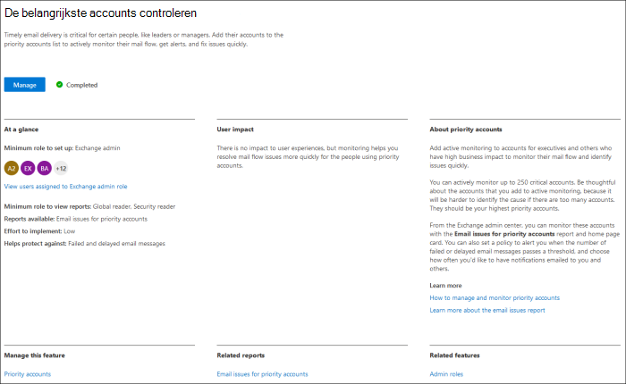
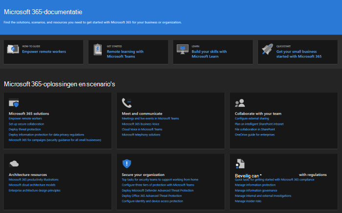
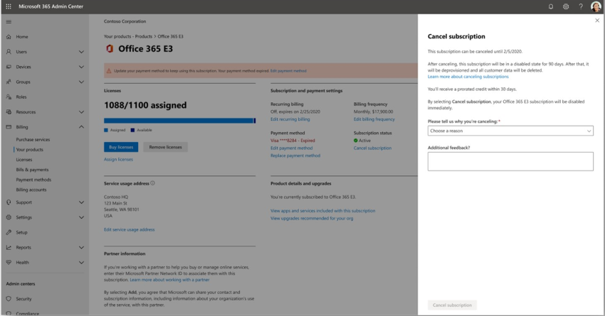
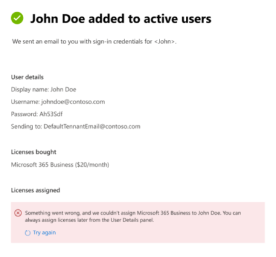

# Nieuwe functies in het Microsoft 365-beheercentrumWhat's new in the Microsoft 365 admin center

::: moniker range="o365-21vianet"

> [!NOTE]
> Sommige informatie in dit artikel is mogelijk niet van toepassing op Office 365 beheerd door 21Vianet.Some of the information in this article might not apply to Office 365 operated by 21Vianet.

::: moniker-end

We voegen voortdurend nieuwe functies toe aan het [Microsoft 365-beheercentrum,](https://docs.microsoft.com/microsoft-365/business-video/admin-center-overview)lossen problemen op die we leren en brengen wijzigingen aan op basis van uw feedback.We're continuously adding new features to [the Microsoft 365 admin center](https://docs.microsoft.com/microsoft-365/business-video/admin-center-overview), fixing issues we learn about, and making changes based on your feedback. Bekijk hieronder wat er vandaag voor u beschikbaar is.Take a look below to see what's available for you today. Sommige functies worden met verschillende snelheden uitgerold voor onze klanten.Some features get rolled out at different speeds to our customers. Als u nog geen functie ziet, kunt u [proberen om uzelf toe te voegen aan een gerichte release.](manage/release-options-in-office-365.md)If you aren't seeing a feature yet, [try adding yourself to targeted release](manage/release-options-in-office-365.md).

En als u wilt weten wat er nieuw is met andere Microsoft-cloudservices:And if you'd like to know what's new with other Microsoft cloud services:

- [Nieuwe functies in Azure Active DirectoryWhat's new in Azure Active Directory](/azure/active-directory/fundamentals/whats-new)
- [Nieuwe functies in het Exchange-beheercentrumWhat's new in the Exchange admin center](/Exchange/whats-new)
- [Nieuwe functies in Microsoft IntuneWhat's new in Microsoft Intune](/mem/intune/fundamentals/whats-new)
- [Nieuwe functies in het Microsoft 365-compliancecentrumWhat's new in the Microsoft 365 compliance center](/Office365/SecurityCompliance/whats-new)
- [Wat is er nieuw in Microsoft 365 DefenderWhat's new in Microsoft 365 Defender](../security/mtp/whats-new.md)
- [Nieuwe functies in het SharePoint-beheercentrumWhat's new in the SharePoint admin center](/sharepoint/what-s-new-in-admin-center)
- [Office-updatesOffice updates](/OfficeUpdates/)
- [Status van Windows-release controlerenHow to check Windows release health](https://docs.microsoft.com/windows/deployment/update/check-release-health)

## Ignite 2021 (maart)Ignite 2021 (March)

Welkom bij Microsoft Ignite.Welcome to Microsoft Ignite. We hopen dat u een aantal van onze sessies hebt kunnen [bijwonen: Microsoft Ignite 2021.](https://myignite.microsoft.com/sessions)We hope you were able to attend some of one of our sessions: [Microsoft Ignite 2021](https://myignite.microsoft.com/sessions). Hier zijn een paar van de dingen waar we het over hebben gehad bij Ignite.Here's a few of the things we talked about at Ignite.
> [!NOTE]
> Niet alle functies zijn direct voor iedereen beschikbaar.Not all features are going to be available to everyone right away. Als u de nieuwe functies niet ziet, kunt u [deelnemen aan Targeted Release.](manage/release-options-in-office-365.md)If you aren't seeing the new features, [join Targeted Release](manage/release-options-in-office-365.md).

### BerichtencentrumMessage center

We hebben het Berichtencentrum vernieuwd om u te helpen relevante berichten te ontdekken en een flexibelere leeservaring toe te voegen.We’ve revamped the Message center to help you discover relevant messages and added a more flexible reading experience. We hebben een nieuwe **servicekolom toegevoegd** waarmee u kunt scannen op welke Service een bericht van toepassing is en berichten filteren op Service en andere metagegevens.We've added a new **Service** column to help you scan which Service a message applies to and filter messages by Service and other metadata. U kunt een bericht als favoriet markeren voor opvolging, kiezen welke kolommen worden weergegeven in de berichtenlijst en navigeren tussen berichten met de knoppen achter en volgende.You can favorite a message to mark it for follow up, choose which columns appear in the message list, and navigate between messages with the back and next buttons. We hebben ook het proces verbeterd, om het gemakkelijker te maken feedback te geven op berichten in het berichtencentrum.We've also improved the process to make it easier to give feedback on Message center posts.

:::image type="content" source="../media/message-center.png" alt-text="Schermafbeelding: startpagina berichtencentrum met Postvak IN en berichten":::

Zie Berichten beheren in het [berichtencentrum](manage/manage-messages.md)voor meer informatie over de nieuwe functies.To learn more about the new features, check out [Manage messages in Message center](manage/manage-messages.md).

### Nieuwe functiesWhat's new features

We hebben verbeteringen aangebracht in de weergave van de functies 'Nieuwe functies' voor gebruikers in de Office-apps.We've made improvements to how you view the "What's new" features for users in the Office apps. U kunt nu de uitgebreide inhoud zien in het nieuwe deelvenster Whats dat uw gebruikers kunnen zien.You can now see the rich content in the Whats' new pane that your users can see. U kunt ook meer informatie over de functie krijgen voordat u besluit om uw gebruikers te laten weten over de functie.You can also learn more about the feature before you decide to let your users know about the feature. For more info, check out [Manage which Office‎ features appear in What's New](manage/show-hide-new-features.md).For more info, check out [Manage which Office‎ features appear in What's New](manage/show-hide-new-features.md).

:::image type="content" source="../media/power-bi-whats-new2.png" alt-text="Schermafbeelding: Nieuwe pagina office-apps met verbeteringen in Power BI":::

## Ignite 2020 (augustus & september)Ignite 2020 (August & September)

Welkom bij Microsoft Ignite- onze eerste online-only Ignite.Welcome to Microsoft Ignite - our first online-only Ignite. We hopen u te zien in een van onze sessies: [Microsoft Ignite 2020 Session Catalog](https://myignite.microsoft.com/sessions).We hope to see you in one of our sessions: [Microsoft Ignite 2020 Session Catalog](https://myignite.microsoft.com/sessions). Hier zijn slechts een paar van de dingen waar we het over hebben bij Ignite.Here's just a few of the things we'll be talking about at Ignite.
> [!NOTE]
> Niet alle functies zijn direct voor iedereen beschikbaar.Not all features are going to be available to everyone right away. Als u de nieuwe functies niet ziet, kunt u [deelnemen aan Targeted Release.](manage/release-options-in-office-365.md)If you aren't seeing the new features, [join Targeted Release](manage/release-options-in-office-365.md).

### Beheer van meerdere tenantsMulti-tenant management

We hebben een reeks functies ontwikkeld voor beheerders met meerdere tenants, zoals u, om uw taak sneller en efficiënter uit te kunnen werken.We've developed a set of features for multi-tenant admins like you to get your job done faster and more efficiently. Zie Meerdere [tenants beheren voor meer informatie.](multi-tenant/manage.md)For more information, see [Manage multiple tenants](multi-tenant/manage.md).

- **Uw tenants:** Schakel snel tussen de tenants die u beheert.**Your tenants**: Quickly switch between the tenants you manage.
- **Alle tenants:** een nieuwe pagina waar u snel de status van alle services van uw tenants, eventuele openstaande serviceaanvragen, uw producten en facturering, aanbevolen installatietaken en het aantal gebruikers in die tenant kunt zien.**All tenants**: A new page where you can quickly see the health of all your tenants' services, any open service requests, your products and billing, recommended setup tasks, and the number of users in that tenant.
- **Setup:** De pagina Setup met meerdere tenants geeft u een lijstweergave van de pagina Setup, maar is georganiseerd voor veel tenants.**Setup**: The multi-tenant Setup page gives you a list view of the Setup page, but organized for many tenants. U kunt zien welke functies niet zijn ingeschakeld, welke taken zijn voltooid voor alle tenants, taken die tenants nog moeten uitvoeren.You can see which features aren't turned on, which tasks are complete for all tenants, tasks that tenants still need to complete. Met deze weergave kunt u de acceptatie van functies bijhouden en ervoor zorgen dat de aanbevolen beveiligingstaken altijd worden uitgevoerd.This view will help you keep track of feature adoption and to make sure the recommended security setup tasks are always done.
- **Service-status:** in de weergave service-status ziet u of incidenten of adviezen van invloed zijn op de tenants.**Service health**: The service health view shows you if any incidents or advisories are affecting the tenants. Er wordt zelfs bekent hoeveel van uw beheerde tenants worden beïnvloed.It will even tell you how many of your managed tenants are affected. Selecteer een incident om meer informatie te krijgen op het tabblad Overzicht en ga vervolgens naar het tabblad Tenants getroffen om in te zoomen en deze tenant te ondersteunen.Just select an incident to get more information on the overview tab, then switch over to the Tenants affected tab to drill down and support that tenant.
- **Cross-tenantpostvakmigraties** is een nieuwe service, nu in een openbaar voorbeeld, waarmee u postvakken kunt verplaatsen tussen tenants zonder dat u buiten het bord hoeft te gaan en vervolgens postvakken aan boord hoeft te nemen.**Cross-tenant mailbox migrations** is a new service, now in public preview, that lets you move mailboxes between tenants without the need to offboard and then onboard mailboxes. 
- **Domein delen met meerdere tenants:** Binnenkort kunt u deelnemen aan een privévoorbeeld voor mogelijkheden waarmee u een domein kunt delen in meerdere tenants.**Cross-tenant domain sharing**: Soon, you can join a private preview for capabilities that allow you to share a domain across multiple tenants. Als Contoso bijvoorbeeld Wingtip Toys verwerft, kan Contoso het domein delen met Wingtip Toys, zodat personen in beide tenants 'contoso.com' kunnen gebruiken als hun e-mailadressen.For example, if Contoso acquires Wingtip Toys, Contoso can share the domain with Wingtip Toys so that people in both tenants can use "contoso.com" as their email addresses.

### Uw belangrijkste accounts controlerenMonitor your most important accounts

U kunt mislukte of vertraagde e-mailberichten controleren en bijhouden die zijn verzonden naar uw gebruikers die een hoge zakelijke impact hebben, zoals uw CEO.You can monitor and track failed or delayed email messages sent to your users who have a high business impact, like your CEO. U houdt prioriteitsaccounts bij door gebruikers toe te voegen aan uw lijst met prioriteitsaccounts in het Microsoft 365-beheercentrum.You track priority accounts by adding users to your priority accounts list in the Microsoft 365 admin center. Voeg leidinggevenden, leidinggevenden, managers of andere gebruikers toe die toegang hebben tot gevoelige of hoge prioriteitsgegevens.Add executives, leaders, managers, or other users who have access to sensitive or high priority information.

Prioriteitsaccounts zijn alleen beschikbaar voor organisaties die aan beide van de volgende vereisten voldoen:Priority accounts are only available to organizations that meet both of the following requirements:

- Office 365 E3 of Microsoft 365 E3, of Office 365 E5 of Microsoft 365 E5.Office 365 E3 or Microsoft 365 E3, or Office 365 E5 or Microsoft 365 E5.
- Ten minste 10.000 licenties en ten minste 50 maandelijks actieve Exchange Online-gebruikers.At least 10,000 licenses and at least 50 monthly active Exchange Online users.

Er zijn twee manieren om aan de slag te gaan:There are two ways to get started:

- Ga naar **Gebruikers** en selecteer vervolgens in het menu Meer acties de optie **Prioriteitsaccounts beheren** om gebruikers toe te voegen aan de lijst.Go to **Users**, and then in the "more actions" menu select **Manage priority accounts** to add users to the list.
- Ga naar **Setup,** zoek de installatietaak **Controleer uw belangrijkste accounts** en selecteer Aan de **slag.**Go to **Setup**, find the setup task **Monitor your most important accounts**, and then select **Get started**.

Zie Prioriteitsaccounts controleren voor meer informatie over [prioriteitsaccounts.](./setup/priority-accounts.md)For more info on priority accounts, check out [Monitoring priority accounts](./setup/priority-accounts.md).

### Sneller zoeken en betere resultaten krijgen op elke paginaSearch faster and get better results from any page

We zijn begonnen met de uitrol van een nieuwe zoekervaring voor het beheercentrum en we kunnen niet wachten tot u het wilt uitproberen. Alt+S to search from any page.](../media/MAC-WN-GlobalSearch.png)

- Het vak Zoeken is verplaatst naar het koptekstgebied met de tekst 'Microsoft 365-beheercentrum' zodat u nu vanaf elke pagina kunt zoeken, niet alleen op de startpagina.The Search box moved to the header area where it says "Microsoft 365 admin center" so you now search from any page, not just the Home page. We hebben zelfs een snelkoppeling: **Alt+S.**We've even got a shortcut: **Alt+S**.
- Zoeken is slimmer en geeft u betere resultaten, nog sneller.Search is smarter and will give you better results, even faster. Probeer '2fa' te typen om aan de slag te gaan.Try typing "2fa" to get started.
- Zoekresultaten worden ingedeeld op het type item of actie dat u kunt ondernemen.Search results are organized by the type of item or action you can take.
  - **Gebruikers:** Selecteer de naam van de gebruiker en u kunt die gebruiker daar bewerken.**Users**: Select the user's name and you can edit that user right there. Als u het menu Meer acties naast de naam selecteert, kunt u het wachtwoord opnieuw instellen.If you select the "more actions" menu next to their name, you can reset their password. U kunt zoeken op weergavenaam, achternaam, voornaam, gebruikersnaam of primair e-mailadres en e-mailalias.You can search by display name, last name, first name, username or primary email address, and email aliases. Maar om een exacte overeenkomst te krijgen, zoekt u op primair e-mailadres of gebruikersnaam.But to get an exact match, search by primary email address or username.
  - **Groepen:** Bewerk de groep vanaf elke pagina, voeg leden toe, wijs eigenaren toe.**Groups**: Edit the group from any page, add members, assign owners.
  - **Acties:** Net als hoe u naar een gebruiker kunt zoeken en vervolgens het wachtwoord opnieuw kunt instellen, kunt u ook op elke pagina zoeken naar 'wachtwoord opnieuw instellen' en vervolgens een of meer wachtwoorden opnieuw instellen voor gebruikers.**Actions**: Similar to how you can search for a user and then reset their password, you can also search "reset password" from any page and then reset one or more passwords for users.
  - **Navigatie:** Resultaten onder Navigatie kunnen u snel helpen om snel naar een pagina in het beheercentrum te gaan.**Navigation**: Results under Navigation can quickly help you get to a page in the admin center quickly. Als u bijvoorbeeld 'rollen' zoekt, gaat u naar de pagina Rollen voor Azure AD-rollen.For example, searching "roles" will take you to the Roles page for Azure AD roles.
  - **Instellingen:** zoek naar instellingen met betrekking tot uw organisatie, de services die u abonneert en beveiligings- en privacyinstellingen.**Settings**: Search for any setting related to your organization, the services you subscribe to, and security and privacy settings. 
  - **Domeinen:** U kunt snelle koppelingen naar uw domeinen vinden en vervolgens gaat u met de koppeling naar de pagina Overzicht en status van dat domein.**Domains**: You can find quick links to your domains, and then the link will take you to that domain's Overview and health page.
  - **Documentatie:** Als we geen resultaat voor u kunnen vinden, proberen we wat documentatie te vinden om u te helpen.**Documentation**: If we can't find a result for you, we'll try to find some documentation to help. Het duurt iets langer voordat de samengestelde lijst met artikelen een overeenkomst heeft gevonden, dus wacht even om te zoeken naar de resultaten.It takes a little longer for the curated list of articles to find a match, so wait a second to let Search find the results. 
  - **Feedback:** Hebt u niet gevonden wat u zocht?**Feedback**: Didn't find what you were looking for? Stuur ons feedback van Zoeken.Send us feedback from Search. We voegen zoekfunctionaliteit toe voor meer pagina's en meer functies in het beheercentrum.We will add searching functionality for more pages and more features across the admin center.

### Mobiele app voor Microsoft 365-beheerdersMicrosoft 365 admin mobile app

Met de mobiele [microsoft 365-app](https://www.microsoft.com/microsoft-365/business/manage-office-365-admin-app)voor beheerders , die is inbegrepen bij uw abonnement, kunt u Microsoft 365 beheren vanaf uw mobiele apparaat, zodat u van uw bureau kunt afblijven om elke dag taken uit te voeren.The [Microsoft 365 admin mobile app](https://www.microsoft.com/microsoft-365/business/manage-office-365-admin-app), which is included with your subscription, lets you manage Microsoft 365 from your mobile device so you can get away from your desk to do every day tasks. In feite zijn er meer dan 90 functies in de app. We hebben er nog een paar toegevoegd:In fact, there are over 90 features in the app--and we just added a few more:

- Ondersteuning voor het beleid voor mobiel toepassingsbeheer en voorwaardelijke toegang van **Microsoft Intune:** U kunt nu uw persoonlijke apparaat gebruiken om Microsoft 365 te beheren, zelfs als uw organisatie het beleid voor mobiel toepassingsbeheer en voorwaardelijke toegang van Intune heeft ingeschakeld.**Support for Microsoft Intune's Mobile Application Management and Conditional Access policies**: You can now use your personal device to manage Microsoft 365 even if your org has turned on Intune's Mobile Application Management and conditional access policies.
- **Meldingen in het berichtencentrum:** Schakel meldingen van het berichtencentrum in bij Instellingen Meldingen als u wilt worden gewaarschuwd voor nieuwe  >   berichten in het berichtencentrum.**Message center notifications**: Turn on message center notifications at **Settings** > **Notifications** if you wish to be alerted about new message center posts. Via meldingen willen we ervoor zorgen dat u op de hoogte blijft van belangrijke informatie en gebeurtenissen in uw tenant.Through notifications, we want to ensure you stay informed about important information and events across your tenant.
- **Factureringswaarschuwingen:** u kunt factureringsmeldingen ook in- of uitschakelen bij Instellingen Meldingen als u  >   factureringsmeldingen op uw apparaat wilt ontvangen als een abonnement binnenkort verloopt.**Billing alerts**: You can also turn on billing notifications at **Settings** > **Notifications** if you want to get billing notifications on your device if a subscription is about to expire.
- **Donkere modus:** Welkom bij de donkere kant van de mobiele app.**Dark mode**: Welcome to the dark side of the mobile app. Dit was een van onze meest gevraagde functies.This was one of our most requested features. Ga naar  >  **Instellingenthema's** om deze in te zetten.Go to **Settings** > **Themes** to turn it on.
- **Een probleem melden:** U kunt nu een probleem melden in de app of problemen bekijken die zijn gerapporteerd door andere beheerders.**Report an issue**: You can now report an issue in the app or view issues reported by other admins. Ga **naar Service status** om het te controleren.Visit **Service health** to check it out.

### Gebruiksaanbevelingen voor kleine en middelgrote bedrijvenUsage recommendations for small and medium businesses

Kleine en middelgrote bedrijven krijgen  mogelijk een aanbeveling op de startpagina als sommige personen in de organisatie teams, OneDrive of Office-apps niet actief gebruiken.Small and medium businesses might get a recommendation on the **Home** page if some of the people in the org aren't actively using Teams, OneDrive, or Office apps. Wanneer u de aanbeveling bekijkt, kunt u snel microsoft-training e-mailen naar inactieve gebruikers om ze te helpen aan de slag te gaan met de app en ervoor te zorgen dat u de volledige waarde van uw abonnementen krijgt.When you view the recommendation, you can quickly email Microsoft training to inactive users to help them get started with the app and to make sure you are getting the full value from your subscriptions.

### Verzameling extern werkRemote work collection

In oktober voegen we een verzameling extern werk toe om eigenaren van kleine bedrijven en hun personeel te helpen online te gaan en op afstand te werken.In October, we'll be adding a remote work collection to help small business owners and their staff get online and working remotely.  **Installatie van externe** werkbenodigdheden is een samengestelde lijst met alle functies die microsoft aanraadt om extern werk veilig in te stellen en effectief samen te werken.**Remote work essentials** setup is a curated list of all features Microsoft recommends to securely enable remote work and to collaborate effectively. Over een paar weken kunt u het uitproberen in **Essentials** voor Extern  >  **werk instellen.**In a couple of weeks, you can try it out in **Setup** > **Remote work essentials**.

Voor meer informatie over het veilig toestaan van extern werk en een handig webadres dat u gemakkelijk kunt onthouden en delen, gaat u naar [aka.ms/remote-business.](https://aka.ms/remote-business)For more information about how to securely allow remote work and a handy web address that's easy to remember and share, go to [aka.ms/remote-business](https://aka.ms/remote-business).

### Hulp nodig? naar meer beheercentra gaanNeed help? moving to more admin centers

We zijn voortdurend bezig met het bekijken en bijwerken van de inhoud en hulpmiddelen om de wijzigingen in het product bij te houden.We're continuously looking at and updating the content and tools to keep up with changes in the product. We hebben nu nog veel meer hulpprogramma's voor zelfvoorzienend diagnostische functies waarmee u problemen snel en efficiënt kunt oplossen.We now have many more self-serve diagnostic tools to help you resolve issues quickly and efficiently. Hier zijn er een paar die onlangs zijn toegevoegd:Here are a few that were recently added:

- Het beperkingsbeleid voor Exchange Web Service wijzigenChange your Exchange Web Service throttling policy
- Status controleren van Teams-inrichting en validatie voor specifieke gebruikersChecking status of Teams provisioning and validation to specific users
- Problemen met het instellen van DKIM oplossenFix DKIM setup issues
- Fouten bij het registreren van Intune-gebruikers diagnosticerenDiagnose Intune user enrollment errors

En we zijn de nieuwe en verbeterde ondersteuningservaring die u al in het Microsoft 365-beheercentrum ziet, aan het uitrollen naar enkele andere beheercentra.And we are rolling out the new and improved support experience you already see in the Microsoft 365 admin center to some of the other admin centers. Teams Admin Center en Beveiligings- en compliancebeheerderscentra hebben deze nieuwe ervaring al.Teams Admin Center and Security and Compliance Admin Centers already have this new experience. Binnenkort worden **exchange-beheercentrum,** **SharePoint-beheercentrum** **en** Office.com samen met deze nieuwe help-ervaring voor beheerders bijgewerkt.And soon, **Exchange admin center**, **SharePoint admin center**, and **Office.com** will be updated along with this new help experience for admins.

### Wijzigingen beheren met Microsoft PlannerManage changes with Microsoft Planner

In mei hebben we aangekondigd dat u berichten in het Berichtencentrum binnenkort kunt synchroniseren met Microsoft Planner en dat deze nu beschikbaar zijn voor iedereen.In May, we announced that you'll soon be able to sync Message center posts to Microsoft Planner and now it's available for everyone to use.  U kunt nu taken maken op berichten, deze toewijzen en bijhouden tot ze zijn voltooid.You can now create tasks from messages, assign them, and track them to completion. De eerste keer selecteert u **Synchronisatieplanner** die u nodig hebt om verbinding te maken met het juiste abonnement.The first time, you select **Planner syncing** you'll need to connect to the appropriate plan.

Bekijk dit artikel en de video om te zien hoe het werkt: Berichten in het berichtencentrum bijhouden in Planner voor meer [informatie.](/Office365/Planner/track-message-center-tasks-planner)To learn more about it, check out this article and video to see how it works: [Track your message center posts in Planner](/Office365/Planner/track-message-center-tasks-planner)

### Documentatie, training en video'sDocumentation, Training, and Videos

- Gloednieuw en net op tijd voor Microsoft Ignite,[de virtuele hub.](https://adoption.microsoft.com/virtual-hub/)Brand new and just in time for Microsoft Ignite--[The Virtual Hub](https://adoption.microsoft.com/virtual-hub/). Ga dieper in op de technische training voor IT-professionals en ontwikkelaars.Deep dive into technical training for IT pros and developers. Zoek snel ongeveer 20 nieuwe video's als onderdeel van #SIDETRACKED, de naam van de Ignite-beheerderstrack dit jaar.Quickly find around 20 new videos as part of #SIDETRACKED, the name of the Ignite admin track this year.
- Nieuwe functies in [microsoft 365-videoreeksen:](https://www.youtube.com/watch?v=OVjb2lGJ4GU&t=2s) deze maand behandelen we nieuwe functies die beschikbaar zijn in Whiteboard voor Teams en op het web, over het automatiseren van gebruikers inrichting naar Azure AD, nieuwe Power Automate triggers en acties in Teams en meer.[What's new with Microsoft 365](https://www.youtube.com/watch?v=OVjb2lGJ4GU&t=2s) video series: This month, we cover new features available in Whiteboard for Teams and on the web, how to automate user provisioning to Azure AD, new Power Automate triggers and actions in Teams, and more. En blijf op de hoogte voor volgende maand, waar we een overzicht hebben van alle geweldige dingen die er bij Ignite gebeuren!And stay tuned for next month, where we'll have a recap of all the great things happening at Ignite!
- We hebben de documentatiepagina van [Microsoft 365](/microsoft-365) opnieuw ontworpen, waarin eerst de focus ligt op oplossingen.We did a redesign of the [Microsoft 365 documentation](/microsoft-365) page that focuses on solutions first. We zullen nieuwe oplossingen markeren zodra ze beschikbaar zijn op deze pagina, dus houd een oogje in het zeil.We'll highlight new solutions as they become available on this page, so keep an eye out.

## Juli 2020July 2020

### Voorbereiden op Ignite 2020Getting ready for Ignite 2020

Terwijl we het Ignite-seizoen bij Microsoft gaan gebruiken, brengen we niet zo veel functies uit, zodat we veel te bespreken hebben tijdens onze sessies.As we're moving into Ignite season at Microsoft, we're not releasing as many features so that we have a lot to talk about during our sessions.

De volgende update van dit artikel vindt plaats op de openingsdag van onze eerste online-only Ignite.The next update to this article will be on opening day of our first online-only Ignite. En dit jaar is het gratis om deel te nemen!And this year, it is free to attend! Check it out, get signed up: [Microsoft Ignite 2020](https://www.microsoft.com/ignite).Check it out, get signed up: [Microsoft Ignite 2020](https://www.microsoft.com/ignite).

### Uw productenYour products

Er is veel werk verricht in het beheer van abonnementen om de pagina sneller te laden, sneller te vinden wat u zoekt en om te voldoen aan de standaarden voor toegankelijkheid op het web[(WCAG 2.1-richtlijnen).](http://www.w3.org/TR/WCAG21/)There has been a lot of work done in the subscriptions management to make the page faster to load, faster to find what you're looking for, and to meet the web accessibility standards ([WCAG 2.1 guidelines](http://www.w3.org/TR/WCAG21/)).

- **Tabelontwerp:** de tabel is opnieuw ontworpen, zodat u vergelijkbare abonnementen kunt groepeert.**Table redesign**: The table was redesigned so that you can group similar subscriptions. Ga naar **Facturering**  >  **van uw producten.**Go to **Billing** > **Your products**.
- **Productdetails:** Meer informatie dan ooit over uw abonnementen door het product in de lijst te selecteren.**Product details**: Get more details than ever about your subscriptions by selecting the product in the list.
- **Doe het allemaal vanaf hier**: En u hoeft niet naar verschillende pagina's te gaan om één product te beheren.**Do it all from here**: And you don't have to go to jump around several pages to manage one product. Als u bijvoorbeeld een abonnement wilt opzeggen, wordt het deelvenster geopend om de actie daar uit te voeren.For example, if you need to cancel a subscription, the panel will open to do the action right there.

### DomeinenDomains

Domeinbeheer kan ingewikkeld zijn en we hebben een nieuwe functie uitgebracht om dat gemakkelijker te maken.Domain management can be complicated, and we've released a new feature to make that easier. Ga naar Instellingen > domeinen en selecteer vervolgens een domein voor meer informatie over uw domein en de status van het domein.Go to Settings > Domains and then select a domain to get more information about your domain and the domain's health.

:::image type="content" source="../media/MAC-WN-DomainDNS.PNG" alt-text="Pagina met domeinendetails voor contoso.com":::

### Documenten, training en video's (juli 2020)Docs, training, and videos (July 2020)

Wat is er nieuw met [microsoft 365-videoreeksen:](https://youtu.be/m1Nu8WJgCDY) Deze maand behandelen we de nieuwe Yammer-ervaring voor web en mobiel, hoe u de App Yammer-community's voor Microsoft Teams integreert, nieuwe beleidspakketten ter ondersteuning van Firstline-werknemers en -managers, en meer.[What's new with Microsoft 365](https://youtu.be/m1Nu8WJgCDY) video series: This month, we cover the new Yammer experience for web and mobile, how to integrate the Yammer Communities app for Microsoft Teams, new policy packages to support Firstline Workers and managers, and more.

## Juni 2020June 2020

### Up-up houden met Office What's New managementKeeping up with Office What's New management

Een paar maanden geleden hebben we een instelling toegevoegd waarmee u de nieuwe berichten kunt beheren die worden in de [Office-apps](#office-whats-new-management)van een gebruiker.A few months ago, we added a setting that lets you manage the [What's New messages that show up in a user's Office apps](#office-whats-new-management). Deze maand hebben we een nieuwe startpaginakaart uitgebracht die u  helpt snel te handelen en de berichten die u wilt laten zien aan de gebruikers in uw organisatie bij te houden.This month, we released a new Home page card that will help you act quickly and keep track of the **What's New** messages that you want shown to the users in your organization.

### Documenten, training en video's (juni)Docs, training, and videos (June)

- [Aan de slag met TeamsGetting started with Teams](https://support.microsoft.com/office/184f1aba-2f91-43f0-86e1-9fae607e24f6)

## Mei 2020May 2020

### Nieuw updatekanaal voor OfficeNew update channel for Office

Op 12 mei hebben we de beschikbaarheid aangekondigd van een nieuw updatekanaal voor Office: Monthly Enterprise Channel.On May 12, we announced the availability of a new update channel for Office:  Monthly Enterprise Channel. Dit updatekanaal biedt uw gebruikers eenmaal per maand nieuwe Office-functies, op de tweede dinsdag van de maand.This update channel provides your users with new Office features once a month, on the second Tuesday of the month.

Als u uw gebruikers toestaat Office zelf te installeren vanuit de portal, kunt u Monthly Enterprise-kanaal voor hen selecteren.If you allow your users to self-install Office from the portal, you can select Monthly Enterprise Channel for them. Om dit te doen, meld u aan bij het Microsoft 365-beheercentrum en gaat u naar **Alle** instellingen voor instellingen voor instellingen  >   >    >  **van Services**  >  **Office-software downloadinstellingen.**To do this, sign in to the Microsoft 365 admin center and go to **Show all** >**Settings** > **Org settings** > **Services** > **Office software download settings**. Als u **Eenmaal per maand (Monthly Enterprise-kanaal)** selecteert, worden nieuwe zelf-installaties van Office geconfigureerd voor gebruik van Monthly Enterprise-kanaal.If you select **Once a month (Monthly Enterprise Channel)**, then any new self-installs of Office will be configured to use Monthly Enterprise Channel.

In combinatie met de release van Monthly Enterprise Channel worden ook de namen van de bestaande updatekanalen herzien.In conjunction with the release of Monthly Enterprise Channel, we’re also revising the names of the existing update channels. Monthly-kanaal wordt bijvoorbeeld gewijzigd in Huidig kanaal.For example, Monthly Channel is being renamed to Current Channel. De nieuwe namen worden op 9 juni 2020 van kracht.The new names take effect on June 9, 2020.

Zie Wijzigingen in kanalen bijwerken voor [Microsoft 365 Apps](/DeployOffice/update-channels-changes)voor meer informatie.For more information, see [Changes to update channels for Microsoft 365 Apps](/DeployOffice/update-channels-changes).

### Nieuwe beheerdersrollenNew admin roles

We hebben een aantal nieuwe Azure Active Directory-beheerdersrollen toegevoegd aan het Microsoft 365-beheercentrum.We've added some new Azure Active Directory admin roles to the Microsoft 365 admin center.

- De rol van hybride identiteitsbeheerder geeft gebruikers toestemming om cloud-inrichtings- en verificatieservices te beheren.Hybrid identity admin role gives users permission to manage cloud provisioning and authentication services.
- Met de rol netwerkbeheerder kunnen gebruikers netwerklocaties beheren en netwerkinzichten voor Microsoft 365 Software as a Service-apps bekijken.Network admin role lets users manage network locations and review network insights for Microsoft 365 Software as a Service apps.
- De rol printerbeheerder verleent machtigingen voor het beheren van alle aspecten van printers en printerverbindingen.Printer admin role grants permission to manage all aspects of printers and printer connections.
- Printertechnicus is een subset van de rol printerbeheerder waarin deze gebruikers printers kunnen registreren en afmelden en de printerstatus kunnen bijwerken.Printer technician is a subset of the Printer admin role where those users can register and unregister printers, and update printer status.
Zie Over beheerdersrollen voor meer informatie [over deze rollen.](./add-users/about-admin-roles.md)To find out more about these roles, see [About admin roles](./add-users/about-admin-roles.md).

### Lijst met groepen exporterenExport groups list

We hebben van veel beheerders gehoord dat ze informatie over groepen en hun gebruik moeten delen met personen die geen toegang hebben tot de beheercentra.We've heard from a lot of admins that they need to share information about groups and their usage to people who don't have access to the admin centers. U kunt nu de lijst Groepen exporteren naar een CSV-bestand voor controledoeleinden, wat betekent dat u dat oude PowerShell-script kunt verwijderen.You can now export the Groups list to a CSV file for auditing purposes, which means you can throw out that old PowerShell script. Als u het wilt uitproberen, gaat u naar  >  **Groepengroepen** en selecteert u **Vervolgens Groepen exporteren** op de opdrachtbalk.To try it out, go to **Groups** > **Groups**, and then select **Export groups** from the command bar.

### Microsoft 365-oplossings- en architectuurcentrumMicrosoft 365 solution and architecture center

Deze maand hebben we een nieuwe site uitgebracht op het [https://docs.microsoft.com]() [Microsoft 365-oplossings-](../solutions/index.yml)en architectuurcentrum, waarin de technische richtlijnen worden samen gebracht die u nodig hebt om geïntegreerde Microsoft 365-oplossingen te begrijpen, plannen en implementeren voor veilige en compatibele samenwerking.Just this month, we released a new site on [https://docs.microsoft.com]() called the [Microsoft 365 solution and architecture center](../solutions/index.yml), which brings together the technical guidance you need to understand, plan, and implement integrated Microsoft 365 solutions for secure and compliant collaboration. In dit centrum vindt u het volgende:In this center, you'll find:

- Richtlijnen voor basisoplossingFoundational solution guidance
- Werkbelastingsoplossingen en scenario-richtlijnenWorkload solutions and scenario guidance
- Oplossings- en architectuurillustraties (De posters!!!)Solution and architecture illustrations (The posters!!!)
- Branchespecifieke richtlijnenIndustry specific guidance
- Ontwerp principals voor ondernemingsarchitectuurEnterprise architecture design principals

### Documenten, training en video's (mei)Docs, training, and videos (May)

- Nieuwe functies **in microsoft 365-videoreeks:** deze maand behandelen we de nieuwe ondersteuningservaring in de Teams-beheer- en beveiligings- en compliancecentra, plannerintegratie met het Berichtencentrum en de nieuwe 3x3-video-indeling in Microsoft Teams.**What's new in Microsoft 365 video series**: This month, we cover the new support experience in the Teams admin and Security and Compliance Centers, Planner integration with the Message Center, and the new 3x3 video layout in Microsoft Teams. 
- De Help-hubpagina van het [Microsoft 365-beheercentrum](./index.yml) is bijgewerkt om sneller te vinden wat u nodig hebt.The [Microsoft 365 admin center help](./index.yml) hub page was updated to help you find what you need more quickly. En als u nu naar die pagina gaat kijken, hebben we een kaart toegevoegd om u te informeren over belangrijke updates en wijzigingen.And if you go look at that page right now, we've added a card to inform you of important updates and changes.

## April 2020April 2020

### Rollenbeheer in IntuneIntune roles management

[April 2020April 2020](#april-2020)

We hebben het gedaan.Well, we did it! We hebben de tweede stap gezet naar een geïntegreerde rollenervaring en u kunt nu Intune-rollen beheren in het Microsoft 365-beheercentrum.We've taken the second step towards a unified roles experience and you can now manage Intune roles in the Microsoft 365 admin center. U kunt ook gebruikmaken van functies, zoals de mogelijkheid om rollen te zoeken en rolmachtigingen weer te geven.You can also leverage features such as the ability to search for roles and view role permissions. Dit betekent dat u geen twee afzonderlijke hulpprogramma's nodig hebt voor het beheren van rollen voor Microsoft 365 en Intune.This means you don’t need two separate tools to manage roles for Microsoft 365 and Intune. Wanneer u zich bij het Microsoft 365-beheercentrum meldt, ziet u dat er twee draaitatjes op de pagina Rollen staan, een voor Azure AD en een voor Intune.When you sign into the Microsoft 365 admin center, you’ll see that there are two pivots on the Roles page, one for Azure AD and one for Intune.

### Berichten in berichtencentrum synchroniseren met PlannerSync Message Center posts to Planner

Vanaf mei zien beheerders die targeted release hebben de knop 'Planner syncing' in het berichtencentrum.Starting in May, admins who are in Targeted release will start seeing the "Planner syncing" button in the message center. U kunt nu berichten bijhouden die actie nodig hebben, het type berichten selecteren dat u wilt bijhouden, berichten toewijzen om bij te houden als taken en berichten taggen voor latere aandacht.You can now track messages that need action, select the type of messages you'd like to track, assign messages to track as tasks, and tag messages for later attention.

[Deelnemen aan targeted release](manage/release-options-in-office-365.md) om aan de slag te gaan![Join Targeted Release](manage/release-options-in-office-365.md) to get started!

### 'Hulp nodig?'"Need help?" gestart in Teams-beheercentrum & beveiligings- en compliancecentralaunched in Teams admin center & Security and Compliance centers

Het Teams-beheercentrum, beveiligingscentrum en compliancecentrum gebruiken nu hetzelfde 'Hulp nodig?'The Teams admin center, Security center, and Compliance center are now using the same "Need help?" functie die door het Microsoft 365-beheercentrum wordt gebruikt voor het zoeken naar hulp en het contact opnemen met ondersteuning.feature that the Microsoft 365 admin center uses for finding help and contacting support. We hebben veel feedback ontvangen van beheerders die u op hetzelfde niveau van hulp en ondersteuning wilde hebben en we brengen dat graag naar u toe.We've received a lot of feedback from admins that you wanted the same level of help and support and we're happy to bring that to you. Probeer het uit en geef ons uw feedback!Try it out and give us your feedback!

#### Wilt u chatten?Need chat?

Onze ondersteuningsagenten hebben thuis gewerkt, terwijl ze nog steeds klantzaken en beperkingen voor internetbandbreedte in beslag nemen terwijl ze thuis werken, kunnen van invloed zijn op de gesprekskwaliteit van de klant.Our support agents have been working from home while still taking customer cases and limitations on internet bandwidth while working from home can impact customer call quality. Om u te blijven ondersteunen, hebben we de ondersteuningsoptie voor livechats voor commerciële klanten in het Microsoft 365-beheercentrum gelanceerd.In order to continue supporting you, we have launched live chat support option for commercial customers in the Microsoft 365 admin center.

Tijdens het maken van een serviceaanvraag ziet u chat nu als een optie, naast telefoon en e-mail.While creating a service request, you'll now see chat as an option, in addition to phone and email. Selecteer chat als een voorkeurskanaal voor communicatie en maak de aanvraag.Select chat as a preferred channel of communication and create the request. Nadat u de aanvraag hebt gemaakt, kunt u de chat starten wanneer u klaar bent om te chatten met Microsoft-agenten.Once you've created the  request, you can start the chat when you are ready to chat with Microsoft agents.

### Teams-updatesTeams updates

Met het toegenomen gebruik van Teams hebben we een aantal functies toegevoegd om u te helpen deze te beheren.With the increased usage of Teams, we've added a few features to help you manage them.

- Een nieuwe aanbevelingskaart op de startpagina van het beheercentrum laat zien welke gebruikers Teams al 30 dagen niet actief hebben gebruikt.A new recommendation card on the admin center Home page shows which users have not actively used Teams for 30 days. U kunt deze gebruikers een trainings-e-mail sturen om ze aan de slag te laten gaan met Teams.You can send those users a training email to get them started using Teams.
- **Personen samenbrengen met teams:** Ga naar Setup om een nieuwe pagina te bekijken waarmee u Teams kunt in- en in- en uit te zetten voor gelicentieerde gebruikers en gasttoegang kunt toestaan, zodat u kunt werken met externe klanten in Teams. **Bring people together with teams**: Go to **Setup** to see a new page to help you turn on Teams for licensed users and allow guest access, so you can work with external customers in Teams.
- Een Microsoft Teams-kaart is nu standaard vastgemaakt aan uw startpagina.A Microsoft Teams card is now pinned by default to your Home page. Hier ziet u of Teams is ingeschakeld en of gasttoegang is toegestaan.It shows whether Teams is turned on, and if guest access is allowed. U kunt ook de installatiestatus controleren voor nieuwe Teams-gebruikers en controleren of netwerkproblemen van invloed kunnen zijn op Teams-gebruikers.It also allows you to check the setup status for newly licensed Teams users, and check if network issues might be impacting Teams users.
- Ten slotte is Teams nu een stap in de eerste set-upstroom als u een licentie hebt gekocht die Teams bevat.Finally, Teams is now a step in the initial set up flow if you purchased a license that includes Teams.

### ProductiviteitsscoreProductivity score

Productiviteitsscore geeft inzicht in hoe mensen Gebruikmaken van Microsoft-cloudservices en de technologieervaringen die hen ondersteunen.Productivity Score gives insights about how people use Microsoft cloud services and the technology experiences that support them. De score weerspiegelt de prestaties van uw organisatie ten opzichte van werknemers- en technologieervaringen en vergelijkt uw score met organisaties zoals die van u.The score reflects your organization’s performance against employee and technology experience measures and compares your score with organizations like yours. Deze maand introduceren we de volgende nieuwe concepten in de preview-ervaring:This month, we are introducing the following new concepts to the preview experience:

- Trendweergave van primaire inzichten op startpagina- en categoriedetailpagina's -Endpoint Analytics en Netwerkconnectiviteitscategorieën toegevoegd aan TechnologieervaringTrend view of primary insights on home page and category detail pages -Endpoint Analytics and Network Connectivity categories added to Technology Experience
- Relevant technology experience insight shown in Employee Experience categoriesRelevant Technology Experience insight shown in Employee Experience categories
- Nieuwe communicatiecategorie als onderdeel van Employee ExperienceNew Communications category as part of Employee Experience
- Gebruikersgegevens met metagegevens van de organisatie in categorieën WerknemerservaringUser details with organizational metadata in Employee Experience categories

Als u meer wilt weten, bekijkt u de blog: De [Microsoft 365-ervaring](https://techcommunity.microsoft.com/t5/microsoft-365-blog/measure-and-improve-the-microsoft-365-experience-with-microsoft/ba-p/1348618)met Microsoft Productiviteitsscore meten en verbeteren.If you'd like to learn more, check out the blog: [Measure and improve the Microsoft 365 experience with Microsoft Productivity Score](https://techcommunity.microsoft.com/t5/microsoft-365-blog/measure-and-improve-the-microsoft-365-experience-with-microsoft/ba-p/1348618). De productiviteitsscore staat momenteel in een privévoorbeeld.Productivity score is currently in private preview. [Neem deel aan de persoonlijke preview van de productiviteitsscore](https://aka.ms/productivityscorepreview) om aan de slag te gaan.[Join the Productivity score private preview](https://aka.ms/productivityscorepreview) to get started.

### Updates voor groepenGroups updates

We hebben deze maand twee updates voor Groepen:We've got two updates for Groups this month:

- U kunt nu e-mailadressen voor Office 365-groepen bewerken (ook wel Groepen in Outlook genoemd en binnenkort Microsoft 365-groepen genoemd).You can now edit email addresses for Office 365 groups (Also known as Groups in Outlook, and soon to be known as Microsoft 365 groups).
- We hebben uw feedback gehoord en we hebben duidelijkere foutberichten toegevoegd waarom u een groep niet kunt converteren naar een Microsoft-team.We've heard your feedback and we've added clearer error messaging for why you can't convert a group to a Microsoft Team.

### Documenten, video's en training (april)Docs, videos, and training (April)

Nieuwe functies **in microsoft 365-videoreeksen:** Deze maand behandelen we tips en bronnen om kleine bedrijven te helpen over te gaan op extern werk, zoals het uitrollen van Microsoft Teams, trainingsbronnen voor extern werk om in contact te blijven met klanten en partners, en het nieuwe Microsoft 365 Business Voice-abonnement.**What's new in Microsoft 365 video series**: This month, we cover tips and resources to help small businesses transition to remote work including how to roll out Microsoft Teams, remote work training resources to stay connected with clients and partners, and the new Microsoft 365 Business Voice plan. [Nieuwe functies in Microsoft 365What's New in Microsoft 365](https://go.microsoft.com/fwlink/p/?linkid=2118096)

#### Voor uw gebruikersFor your users

- [Een vergadering plannenSchedule a meeting](https://support.microsoft.com/office/c61b4f61-ee62-4a06-8bf7-0a1cd302700a)
- [Deelnemen aan een Teams-vergaderingJoin a Teams meeting](https://support.microsoft.com/office/078e9868-f1aa-4414-8bb9-ee88e9236ee4)
- [Een team voor uw hele organisatie makenCreate an org-wide team](https://support.microsoft.com/office/037bb27a-bcc9-48fe-8d72-44d9482420a3)
- [Een team maken met gastenCreate a Team with guests](https://support.microsoft.com/office/11fbb083-52ee-434d-8c6e-63711fdafac7)
- [Deelnemen aan een team als gastJoin a Team as a guest](https://support.microsoft.com/office/928d1eef-61e2-49ec-b754-c2fe86b34824)
- [Een groepsmailadres makenCreate a group email address](https://support.microsoft.com/office/ded875f9-a9de-437f-b559-2ae4f235bb2b)

#### Voor beheerders en bedrijfseigenarenFor admins and business owners

- [Uw kleine bedrijven in staat stellen om extern werk te doenEmpower your small business with remote work](https://support.microsoft.com/office/9b91a85a-39b4-40a6-a590-0f9bea0ba8e6)
- [Een extern klein bedrijf runnenRunning a remote small business](https://support.microsoft.com/office/9ac1a0f1-789b-4143-b954-5821d5d89298)
- [Registreren voor Microsoft Business BasicSign up for Microsoft Business Basic](https://support.microsoft.com/office/9ac1a0f1-789b-4143-b954-5821d5d89298)
- [Aanmelding met twee factoren instellenSetting up two-factor sign-in](https://support.microsoft.com/office/9ac1a0f1-789b-4143-b954-5821d5d89298)

## Maart 2020March 2020

### Aanbevolen feedback fix: De betrouwbaarheid van 'add user' voor licenties verbeterenFeatured Feedback Fix: Improve "add user" reliability for licensing

We hebben veel feedback ontvangen van beheerders over hoe moeilijk het is om licenties toe te wijzen bij het toevoegen van gebruikers.We received a lot of feedback from admins about the how hard it is to assign licenses when adding users. We hebben de eerste update voor deze oplossing uitgebracht en we zijn gemigreerd naar een betrouwbaardere service achter de schermen om deze aanvragen te verwerken.We've made the first update to this fix and we've migrated to a more reliable behind-the-scenes service to process those requests. En als er iets misgaat, krijgt u nu een foutbericht waarmee u het opnieuw kunt proberen.And if something goes wrong, you'll now get an error message that lets you to try again.

### Startpaginakaart van Microsoft TeamsMicrosoft Teams home page card

Met de uptick in Het gebruik van Teams krijgen sommige organisaties een vastgemaakte dashboardkaart, waardoor Teams beter kan worden ontdekt.With the uptick in Teams usage, some orgs will get a pinned dashboard card that makes turning Teams on more discoverable. De kaart bevat ook koppelingen naar trainingen en documenten om uw organisatie te helpen bij de overgang naar extern werk.The card also has links to training and docs to help your org transition to remote work. Ga naar de **startpagina** om de nieuwe kaart te zien.Just go to the **Home** page to see the new card.

### Het thema van de mobiele SharePoint-app van uw organisatie aanpassenCustomize your organization's SharePoint mobile app theme

Met het Microsoft 365-beheercentrum kunt u nu het thema van uw organisatie aanpassen in de mobiele SharePoint-app voor iOS en de mobiele SharePoint-app voor Android.Using the Microsoft 365 admin center, you can now customize your organization's theme in SharePoint mobile app for iOS and SharePoint mobile app for Android. Deze functie biedt eenvoudig een mobiele intranet-app die kan overeenkomen met uw SharePoint Online voor werknemers die onderweg zijn.This feature conveniently provides a mobile intranet app experience that can match your SharePoint Online for employees on the go. Themaaanpassing omvat uw logoafbeelding, navigatiebalkkleur, tekst- en pictogramkleuren en accentkleuren, waardoor u eenvoudig kunt worden herkend.Theme customization includes your logo image, navigation bar color, text and icon colors, and accent colors, making for easy recognition.

### Verbeteringen in de wizard Een groep toevoegenImprovements to the "Add a group" wizard

Wanneer beheerders een nieuwe groep hebben gemaakt en er tegelijkertijd een Team van hebben gemaakt, kunnen ze eigenaren toewijzen die geen licentie hebben die Teams bevat.When admins created a new group - and made it a Team at they same time, they could assign owners who don't have a license that includes Teams. En dat zorgde voor wat kopzorgen.And that created some headaches. We hebben de wizardstroom bijgewerkt om te controleren of eigenaren een Teams-licentie hebben en als ze niet de optie hebben om de groep om te zetten in een Team is uitgeschakeld.We've updated the wizard flow to verify that owners have a Teams license and if they don't the option to turn the group into a Team is disabled.

### Microsoft 365-aanbiedingen voor kleine en middelgrote bedrijvenMicrosoft 365 offerings for small and medium businesses

We weten dat dit een aankondiging is voor volgende maand, maar we willen ervoor zorgen dat u voorbereid bent.We know that this is an announcement for next month, but we want to make sure you're prepared.

Vanaf 21 april brengen we wijzigingen aan met betrekking tot onze Office 365-abonnementen voor kleine en middelgrote bedrijven en office 365 ProPlus.Starting on April 21, we're making changes related to our Office 365 subscriptions for small and medium businesses – and to Office 365 ProPlus. Voor deze producten wordt nu het microsoft 365-merk gebruikt.These products will now use the Microsoft 365 brand.

De nieuwe productnamen gaan in op 21 april 2020.The new product names go into effect on April 21, 2020. Dit is alleen een wijziging van de productnaam en er zijn op dit moment geen prijs- of functiewijzigingen.This is a change to the product name only, and there are no pricing or feature changes at this time.

|Huidige naamCurrent name |Nieuwe naamNew name  |
|---------|---------|
|Office 365 Business EssentialsOffice 365 Business Essentials     |   Microsoft 365 Business BasicMicrosoft 365 Business Basic      |
|Office 365 Business PremiumOffice 365 Business Premium     |    Microsoft 365 Business StandardMicrosoft 365 Business Standard     |
|Microsoft 365 BusinessMicrosoft 365 Business     |    Microsoft 365 Business PremiumMicrosoft 365 Business Premium     |
|Office 365 BusinessOffice 365 Business     |    Microsoft 365-apps voor bedrijvenMicrosoft 365 Apps for business       |
|Office 365 ProPlusOffice 365 ProPlus    |   Microsoft 365-apps voor ondernemingenMicrosoft 365 apps for enterprise      |

### Video's, training en documentenVideos, training, and docs

Nieuw in microsoft [365-webreeks:](https://go.microsoft.com/fwlink/p/?linkid=2118096)in de aflevering van deze maand wordt de driejarige verjaardag van Microsoft Teams belicht en worden nieuwe functies belicht, waaronder verbeterde geluidskwaliteit in onlinevergaderingen, Targeted Communications voor firstlinemanagers met de Shifts-app, Teams en Skype-consumenteninteroperabiliteit, en meer.[What's New in Microsoft 365 web series](https://go.microsoft.com/fwlink/p/?linkid=2118096): In this month's episode, we highlight the 3-year anniversary of Microsoft Teams and cover new features including improved audio quality in online meetings, Targeted Communications for firstline managers with the Shifts app, Teams and Skype consumer interoperability, and more.

## Februari 2020February 2020

### Aanbevolen feedback fix: schakelknop voor meerdere organisatiesFeatured Feedback Fix: Multi-organization switcher

We hebben veel feedback ontvangen van partners en beheerders over de uitdagingen voor het beheren van meerdere Microsoft-cloudorgieën.We received a lot of feedback from partners and admins about the challenges of managing multiple Microsoft cloud orgs. Een van onze eerste beheerfuncties voor meerdere organisaties is de **organisatiewisselaar,** waarmee u met slechts twee klikken kunt schakelen tussen de organisaties die u beheert.One of our first multi-org management features is the **Organization switcher**, which lets you change between the orgs that you manage in just 2 clicks.
> [!TIP]
> U hoeft niets te doen om de organisatiewisselaar te laten verschijnen, zolang u de recordpartner bent voor ten minste één organisatie.You don't have to do anything to make the organization switcher appear as long as you are the Partner of record for at least one organization.

1. Selecteer in het Microsoft 365-beheercentrum de naam van de organisatie.In the Microsoft 365 admin center, select the org name.

2. Selecteer in de organisatiewisselaar de organisatie die u wilt beheren.In the organization switcher, select the org you want to manage.

Dat is het letterlijk!!!That's literally it!!!

### GroepenGroups

Een paar wijzigingen in het groepengebied deze maand:A couple of changes in the groups area this month:

- **Sorteren op groepsnaam:** u kunt de lijst met groepen alfabetisch sorteren door de kolom **Groepsnaam te** selecteren.**Sort by group name**: You can sort the groups list alphabetically, by selecting the **Group name** column.
- **Verwijderde Microsoft 365-groepen** herstellen: u hoeft niet meer naar het Exchange-beheercentrum te gaan om verwijderde Microsoft 365-groepen te herstellen.**Restore deleted Microsoft 365 groups**: You don't have to go to the Exchange admin center anymore to restore  deleted Microsoft 365 groups. Ga naar **Microsoft 365-beheercentrum** \> **Groepen** \> **Verwijderde** groepen \> (selecteer een groep in de lijst) \> **Groep Herstellen.**Go to **Microsoft 365 admin center** \> **Groups** \> **Deleted groups** \> (select a group from the list) \> **Restore group**. Het herstelt de groep  weer in de lijst Groepen en herstelt de e-mail, gesprekken, notitieblokken, bestanden en agenda van de groep.It'll restore the group back to the **Groups** list and restore the group's email, conversations, notebook, files, and calendar.

### Video's, trainingen en documenten (februari)Videos, training, and docs (February)

- Nieuwe functies **in de Microsoft 365-videoreeks:** Deze maand richten we ons op aangepaste zoekmogelijkheden voor SharePoint Online, de office-beheerfunctie 'Nieuw' waarmee u specifieke functies kunt weergeven of verbergen voor eindgebruikers via het helpvenster in de app, de meest recente beveiligings- en compliance-updates in Yammer en meer.**What's new in Microsoft 365 video series**: This month, we're focused on custom search capabilities for SharePoint Online, the Office "What's New" management feature that lets you show or hide specific features from end-users via the in-app help pane, the latest security and compliance updates in Yammer, and more. Dit is de nieuwste aflevering: [Nieuw in Microsoft 365](https://go.microsoft.com/fwlink/p/?linkid=2118096)Here's the latest episode: [What's New in Microsoft 365](https://go.microsoft.com/fwlink/p/?linkid=2118096)

- **Verplaatsen van documenten:** We hebben de office 365-beheerderswebartikelen gecombineerd met de Microsoft 365-inhoud en u hebt mogelijk de nieuwe URL gezien.**Docs move**: We combined the Office 365 admin web articles with the Microsoft 365 content and you might've noticed the new URL. Dit artikel werd bijvoorbeeld gehost op: **docs.microsoft.com/Office365/Admin/whats-new-in-preview**, maar de URL is nu: **docs.microsoft.com/microsoft-365/admin/whats-new-in-preview.**For example, this article used to be hosted at: **docs.microsoft.com/Office365/Admin/whats-new-in-preview**, but the URL is now: **docs.microsoft.com/microsoft-365/admin/whats-new-in-preview**. Als u pagina's met bladwijzers hebt, moet u uw koppelingen bijwerken. Inhoudskoppelingen worden echter omgeleid naar de nieuwe inhouds-repo.If you've bookmarked pages, you should update your links; however, content links will be redirected to the new content repo.

## Januari 2020 - Gelukkig nieuwjaarJanuary 2020 - Happy New Year

> [!NOTE]
> Wist u dat er een videoreeks Nieuw [is in Microsoft 365](https://go.microsoft.com/fwlink/p/?linkid=2118096) op YouTube?Did you know that there's a [What's New in Microsoft 365](https://go.microsoft.com/fwlink/p/?linkid=2118096) video series on YouTube? Hier worden de nieuwste functies belicht die we hebben uitgerold naar gebruikers.It highlights the latest features that we've rolled out to users. Elke maand gaan we een koppeling maken naar de nieuwste aflevering in de sectie [Video's, training en documenten.](#videos-training-and-docs)Every month, we'll start linking to the latest episode in the [Videos, training, and docs](#videos-training-and-docs) section.     Dit is de nieuwste aflevering: [Nieuw in Microsoft 365](https://go.microsoft.com/fwlink/p/?linkid=2118096)Here's the latest episode: [What's New in Microsoft 365](https://go.microsoft.com/fwlink/p/?linkid=2118096)

### Donkere modusDark mode

Toen we de donkere modus voor het eerst uitrolden, was deze alleen beschikbaar op de startpagina.When we first rolled out dark mode, it was only available on the Home page. De donkere modus is nu niet meer te zien en is beschikbaar in targeted release op de meeste pagina's in het beheercentrum.Dark mode is now out of preview and is in Targeted release across most pages in the admin center.

1. Eerst moet u Targeted Release in- of uitschakelen: Ga naar **Instellingen** \> **Instellingen** \> **Organisatieprofiel** \> **Releasevoorkeuren**.First, you'll need to turn on Targeted Release: Go to **Settings** \> **Settings** \> **Organization profile** \> **Release preferences**.
1. Als u de donkere modus wilt inschakelen, gaat u naar de **startpagina** en selecteert u vervolgens de **knop Donkere** modus.And then to turn on dark mode, go to the **Home** page, and then select the **Dark mode** button. (Het veld staat naast het veld **Zoeken** en dit artikel is **De nieuwe** koppeling.)(It's next to the **Search** field and this article's **What's new** link.)
1. Voor een pagina met een donkere modus staat de knop boven aan de pagina, naast **De nieuwe schakelknop voor** het beheercentrum.For any page that has dark mode available, the button is at the top of the page, next to **The new admin center** toggle.

### Office What's New ManagementOffice What's New management

Beheerders willen controle over de manier waarop Microsoft 'Nieuw' communiceert met hun gebruikers in de Office-apps en u hebt nu dat besturingselement.Admins want control over how Microsoft communicates "What's New" to their users in the Office apps - and you now have that control. Ga naar **Instellingen** \> **Office Wat is nieuw beheervoorbeeld.**Go to **Settings** \> **Office What's New management Preview**. Selecteer een functie om de details weer  te geven en vervolgens kunt u de knop Verbergen van gebruikers selecteren als u niet wilt dat uw gebruikers een bepaald bericht 'nieuw' zien.Select a feature to view its details, and then you can select the **Hide from users** button if you don't want your users to see a particular "what's new" message. Uw organisatie kan bijvoorbeeld wachten om gebruikers te laten weten over een functie totdat iedereen in uw organisatie is opgeleid.For example, your organization might be waiting to let users know about a feature until everyone in your org is trained on it.

Deze functie is voor het eerst uitgebracht voor een preview-versie in november, maar er zijn een paar functie-updates die u moet weten: [Office What's New management preview updates now available](https://techcommunity.microsoft.com/t5/microsoft-365-blog/office-what-s-new-management-preview/ba-p/1020438)This feature was first released to preview in November, but there have been a few feature updates that you should know about: [Office What's New management preview updates now available](https://techcommunity.microsoft.com/t5/microsoft-365-blog/office-what-s-new-management-preview/ba-p/1020438)

### PartnersPartners

Howdy, Partners!Howdy, Partners! (Ik kon het niet helpen.) We hebben deze maand ook een update voor u.(Couldn't help myself.) We've got an update for you this month, as well. Er is een nieuwe functie waarmee partners CSP-klanten de optie kunnen geven om  hun Microsoft Customer Agreement (MCA) te accepteren in de sectie Factureringsaccounts van het beheercentrum.There's a new feature that allows Partners to give CSP customers the option to accept their Microsoft Customer Agreement (MCA) in the **Billing accounts** section of the admin center. In deze nieuwe ervaring:In this new experience:

1. De klant ontvangt een e-mail met een uitnodiging met een koppeling om de partnerrelatie en de MCA te accepteren.The customer receives an invitation email with a link to accept the partner relationship and the MCA.
2. Nadat de klant zich heeft aangegeven, kunnen ze de MCA- en partnermachtigingen direct vanuit het beheercentrum bekijken en accepteren.After the customer signs in, they can view and accept the MCA and partner permissions - right from the admin center.

### ResourcepostvakkenResource mailboxes

De lijst Resourcepostvakken is bijgewerkt naar de nieuwe stijl.The Resource mailboxes list has been updated to the new style. Ga in het Microsoft 365-beheercentrum naar  \> **Resources-& apparatuur.**In the Microsoft 365 admin center, go to **Resources** \> **Rooms & equipment**.

### Video's, trainingen en documenten (januari)Videos, training, and docs (January)

Bekijk de training voor beheerders voor kleine bedrijven die we in januari hebben uitgebracht:Check out the small business admin training that we released in January:

- [Uw zakelijke website makenCreate your business website](https://support.microsoft.com/office/3325d50e-d131-403c-a278-7f3296fe33a9)
- [Antwoorden en hulp zoekenFind answers and help](https://support.microsoft.com/office/7f681212-c649-4a3e-a43b-32b1d1e58988)
- [Help of ondersteuning krijgenGet help or support](https://support.microsoft.com/office/18948a4c-3eb1-4b30-b1bc-a4cc29eb7655)
- [Een gebruiker verwijderenDelete a user](https://support.microsoft.com/office/6bcdad7b-732a-4260-997a-8c176bc3d9d6)
- [Een Microsoft-abonnement kiezenChoose a Microsoft subscription](https://support.microsoft.com/office/b9f7c78e-430f-4117-89ec-2eeb1dced2ca)
- [Overzicht van de beveiliging van Microsoft 365 voor BedrijvenOverview of Microsoft 365 for business security](https://support.microsoft.com/office/3274b159-a825-46d7-9421-7d6e209389d1)