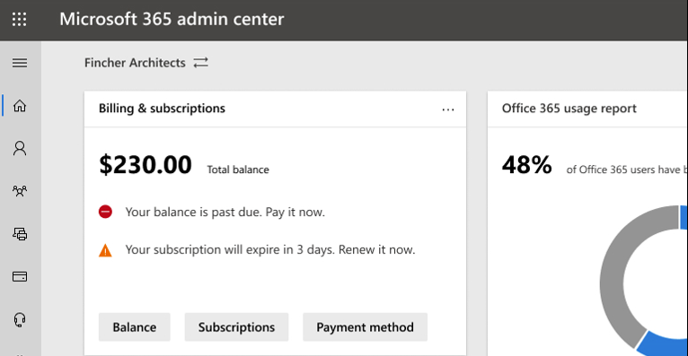

# Nieuw in het Microsoft 365-Beheercentrum

::: moniker range="o365-21vianet"

> [!NOTE]
> Sommige gegevens in dit artikel zijn mogelijk niet van toepassing op Office 365, dat wordt beheerd door 21Vianet.

::: moniker-end

We toevoegen voortdurend nieuwe functies aan [het Microsoft 365-Beheercentrum](microsoft-365-admin-center-preview.md), zorgen voor oplossing voor het oplossen van problemen en het aanbrengen van wijzigingen op basis van uw feedback. Bekijk hieronder wat voor u beschikbaar is. Sommige functies worden met een verschillend toerental uitgerold voor onze klanten. Als u nog geen functie ziet, [probeer dan uzelf toe te voegen aan de targeted release](manage/release-options-in-office-365.md).

En als u meer wilt weten over de nieuwe functies in Microsoft-cloudservices, gaat u als volgt te werk:

- [Nieuw in azure Active Directory](https://docs.microsoft.com/azure/active-directory/fundamentals/whats-new)
- [Nieuwe functies in het Exchange-Beheercentrum](https://docs.microsoft.com/Exchange/whats-new)
- [Nieuw in Microsoft intune](https://docs.microsoft.com/mem/intune/fundamentals/whats-new)
- [Nieuw in het Microsoft 365 compliance Center](https://docs.microsoft.com/Office365/SecurityCompliance/whats-new)
- [Nieuw in Microsoft 365 Defender](https://docs.microsoft.com/microsoft-365/security/mtp/whats-new)
- [Nieuwe functies in het SharePoint-Beheercentrum](https://docs.microsoft.com/sharepoint/what-s-new-in-admin-center)
- [Office-updates](https://docs.microsoft.com/OfficeUpdates/)

## Ignite 2020 (augustus & september)

Welkom bij Microsoft Ignite-onze eerste online-Ignite. We hopen dat we u kunnen zien in een van onze sessies: [Microsoft Ignite 2020 sessie catalogus](https://myignite.microsoft.com/sessions). Hier is slechts een paar van de dingen die we bespreken op Ignite. 
> [!NOTE]
> Niet alle functies zijn direct beschikbaar voor iedereen. Als u de nieuwe functies niet ziet, neemt u [deel aan de targeted release](manage/release-options-in-office-365.md).

### Beheer van meerdere tenants

We hebben een reeks functies ontwikkeld voor beheerders van meerdere tenants, zoals u nodig hebt om uw werk sneller en efficiënter te doen.

- **Uw tenants** : snel schakelen tussen de tenants die u beheert.
- **Alle tenants** : een nieuwe pagina waar u snel de status van de services van uw tenants, alle OpenService aanvragen, uw producten en facturering, aanbevolen configuratietaken en het aantal gebruikers in die Tenant kunt zien.
- **Instelling** : de pagina voor het instellen van meerdere tenants biedt u een lijstweergave van de instellings pagina, maar u hebt veel tenants ingedeeld. U kunt zien welke functies niet zijn ingeschakeld, welke taken zijn voltooid voor alle tenants, welke taken moeten worden voltooid. In deze weergave kunt u de aanneming van functies bijhouden en ervoor zorgen dat de aanbevolen beveiligingstaken altijd worden uitgevoerd.
- **Servicestatus** : in de weergave servicestatus ziet u of de tenants van invloed zijn op de tenants. U kunt zelfs aangeven hoeveel van uw beheerde tenants van invloed zijn. Selecteer een incident voor meer informatie op het tabblad Overzicht, ga naar het tabblad tenants waarmee wordt ingezoomd en de ondersteuning van de Tenant wordt weergegeven.
- **Migraties van cross-tenants** zijn een nieuwe service, nu in de openbare preview-versie, waarmee u postvakken kunt verplaatsen tussen tenants, zonder dat u de verwijderen en vervolgens op een plaats hoeft te zetten. 
- **Delen van domein voor domein** : binnenkort kunt u deelnemen aan een privé Preview voor de mogelijkheden die u kunt gebruiken om een domein te delen via meerdere tenants. Als contoso wervel wind Toys verwerft, kan contoso het domein delen met wervel wind Toys, zodat personen in beide tenants hun e-mailadressen kunnen ' contoso.com ' gebruiken.

### De belangrijkste accounts controleren

U kunt mislukte of uitgetraagde e-mailberichten die naar uw gebruikers worden verzonden, controleren en bijhouden, zoals de CEO. U kunt prioriteits accounts bijhouden door gebruikers toe te voegen aan uw lijst met prioriteits accounts in het Microsoft 365-Beheercentrum. U kunt leidinggevenden, leidinggevenden, beheerders en andere gebruikers toevoegen die toegang hebben tot gevoelige of High Priority Information.

Prioriteit accounts zijn alleen beschikbaar voor organisaties die aan de volgende vereisten voldoen:

- Office 365 E3 of Microsoft 365 E3 of Office 365 E5 of Microsoft 365 E5.
- Minstens 10.000 licenties en minstens 50 maandelijkse actieve Exchange Online-gebruikers.

U kunt op twee manieren beginnen:

- Ga naar **gebruikers** en selecteer vervolgens in het menu meer acties de optie **prioriteits accounts beheren** om gebruikers aan de lijst toe te voegen.
- Ga naar **Setup** , ga naar de configuratie-taak **Monitor uw belangrijkste accounts** en selecteer aan de **slag**.

Ga voor meer informatie over prioriteits accounts naar berekenings [prioriteit accounts](https://docs.microsoft.com/microsoft-365/admin/setup/priority-accounts) en [e-mail problemen voor prioriteit accounts](https://docs.microsoft.com/Exchange/mail-flow-best-practices/mail-flow-insights/mfi-email-issues-for-priority-accounts).

### Sneller zoeken en betere resultaten van een pagina weergeven

We zijn bezig met het implementeren van een nieuwe zoekervaring voor het Beheercentrum en we kunnen u er niet voor proberen. 

- Het zoekvak is verplaatst naar het gebied voor de koptekst, waar dit ' Microsoft 365-Beheercentrum ' staat, zodat u nu vanaf een willekeurige pagina op een willekeurige pagina op een willekeurige plek We hebben zelfs een sneltoets: **ALT + S**.
- De zoekfunctie is slimmer en levert betere resultaten en levert nog sneller resultaten. Voer ' 2fa ' in om aan de slag te gaan.
- De zoekresultaten worden ingedeeld op basis van het type item of de actie die u kunt uitvoeren.
  - **Gebruikers** : Selecteer de naam van de gebruiker en u kunt de gebruiker daar bewerken. Als u het menu ' meer acties ' naast de naam selecteert, kunt u het wachtwoord opnieuw instellen. U kunt zoeken op weergavenaam, achternaam, voornaam, gebruikersnaam of primair e-mailadres en e-mail aliassen. Zoek op een primair e-mailadres of gebruikersnaam voor een exacte overeenkomst.
  - **Groepen** : de groep vanaf een willekeurige pagina bewerken, leden toevoegen, eigenaren toewijzen.
  - **Acties** : vergelijkbaar met de manier waarop u een gebruiker kunt zoeken en het wachtwoord opnieuw kunt instellen, kunt u ook ' wachtwoord opnieuw instellen ' op een willekeurige pagina zoeken en vervolgens een of meer wachtwoorden voor gebruikers opnieuw instellen.
  - **Navigatie** : resultaten onder navigatie kunnen snel aan de slag met een pagina van het Beheercentrum. Als u bijvoorbeeld ' rollen ' zoekt, gaat u naar de pagina rollen voor de functies van Azure AD.
  - **Instellingen** : zoek naar een instelling met betrekking tot uw organisatie, de services waarop u zich hebt geabonneerd, en beveiligings-en privacy-instellingen. 
  - **Domeinen** : u kunt snelkoppelingen naar uw domeinen vinden, en vervolgens gaat u naar de pagina overzicht en status van het domein op de koppeling.
  - **Documentatie** : als we een resultaat voor u niet kunnen vinden, vinden we een documentatie voor hulp. Het is een beetje langer voor de lijst met geplaatste artikelen om een treffer te vinden, dus wacht een tweede keer om de resultaten te zoeken. 
  - **Feedback** : hebt u niet gevonden wat u zoekt? Stuur ons feedback van de zoekopdracht. We zullen zoekfunctionaliteit toevoegen voor meer pagina's en meer functies in het Beheercentrum.

### Mobiele app Microsoft 365 admin

De [Microsoft 365 admin Mobile-App](https://www.microsoft.com/microsoft-365/business/manage-office-365-admin-app), die deel uitmaakt van uw abonnement, biedt u de mogelijkheid microsoft 365 van uw mobiele apparaat te beheren zodat u de taken van de dag voor elke dag kunt voorkomen. In feite zijn er meer dan 90 functies in de app, en daar hebben we nog een paar extra:

- **Ondersteuning voor Mobile Application Management en beleid voor voorwaardelijke toegang van Microsoft intune** : u kunt nu uw persoonlijke apparaat gebruiken voor het beheren van microsoft 365, ook als uw organisatie het beheer van de mobiele toepassing van intune en het beleid voor voorwaardelijke toegang heeft ingeschakeld.
- Berichten in het **berichtencentrum** : Schakel meldingen voor berichtencentrum in bij **instellingen**  >  **meldingen** als u een melding wilt krijgen over nieuwe berichten in het berichtencentrum. Via meldingen willen we ervoor zorgen dat u op de hoogte wordt gehouden van belangrijke informatie en gebeurtenissen in de Tenant.
- **Facturerings waarschuwingen** : u kunt ook facturerings meldingen inschakelen bij **instellingen**  >  **meldingen** als u op uw apparaat facturerings meldingen wilt ontvangen wanneer een abonnement bijna is verlopen.
- **Donkere modus** : Welkom bij de donkere kant van de mobiele app. Dit was een van de meest gevraagde functies. Ga naar **instellingen**  >  **Thema's** om deze functie in te schakelen.
- **Een probleem melden** : u kunt nu een probleem melden in de app of problemen weergeven die worden gerapporteerd door andere beheerders. Ga naar **service status** om het uit te checken.

### Aanbevelingen voor het gebruik van kleine en middelgrote bedrijven

Voor kleine en middelgrote bedrijven wordt mogelijk een aanbeveling weergegeven op de **Start** pagina, als sommige personen in de organisatie niet actief gebruikmaken van teams, OneDrive of Office-apps. Wanneer u de aanbeveling bekijkt, kunt u snel Microsoft-training voor inactieve gebruikers naar u helpen om aan de slag te gaan met de app en ervoor te zorgen dat u de volledige waarde krijgt van uw abonnementen.

### Extern werk verzamelen

In oktober voegt u een externe werk verzameling toe om eigenaren van Small Business en hun personeel online te helpen en op afstand te werken.  Instellen van **extern werk Essentials** is een lijst met alle functies die Microsoft adviseert om extern werk veilig in te schakelen en effectief samen te werken. U kunt de app uitproberen via de **installatie** van  >  **extern werk** in een paar weken.

Ga naar [aka.MS/Remote-Business](https://aka.ms/remote-business)voor meer informatie over het veilig toestaan van externe werk en een handig webadres dat makkelijk is te onthouden en te delen.

### Hulp nodig? verplaatsen naar meer beheer centra

We bekijken voortdurend de inhoud en hulpmiddelen om deze bij te houden, zodat we u op de hoogte blijven van wijzigingen in het product. We hebben nu veel meer zelf diagnostische hulpprogramma's waarmee u snel en efficiënt problemen kunt oplossen. Hier zijn enkele onlangs toegevoegde:

- Het beperkingsbeleid voor Exchange-webservice wijzigen
- De status van teams controleren en valideren voor specifieke gebruikers
- Problemen met de installatie van DKIM oplossen
- Diagnostische fouten bij intune gebruikers registreren

We vouwen de nieuwe en verbeterde ondersteuningservaring die u al in het Microsoft 365-Beheercentrum ziet voor enkele andere beheer centra. Beheerderscentrum voor teams en beveiligings-en nalevings beheer centra hebben al deze nieuwe ervaring. En binnenkort wordt het Exchange-beheer **centrum** , het **SharePoint-Beheercentrum** en het **Office.com** bijgewerkt met deze nieuwe Help-ervaring voor beheerders.

### Wijzigingen beheren met Microsoft planner

In mei werd u gewaarschuwd dat u berichten in het berichtencentrum snel kunt synchroniseren naar Microsoft planner en nu beschikbaar is voor iedereen.  U kunt nu een taak maken op basis van berichten, toewijzen en ze bijhouden om af te ronden. De eerste keer dat u **planner** selecteert, moet u verbinding maken met het juiste abonnement.

Voor meer informatie hierover raadpleegt u dit artikel en video om te zien hoe het werkt: berichten [in het berichtencentrum bijhouden in planner](https://docs.microsoft.com/Office365/Planner/track-message-center-tasks-planner)

### Documentatie, training en Video's

- Gloednieuw en even lang voor Microsoft Ignite--[de virtuele hub](https://adoption.microsoft.com/virtual-hub/). Diep de technische training van IT-professionals en ontwikkelaars. U kunt snel zoeken naar twintig nieuwe Video's als onderdeel van #SIDETRACKED, de naam van de Ignite-beheerder dit jaar bijhouden.
- [Nieuw in Microsoft 365](https://www.youtube.com/watch?v=OVjb2lGJ4GU&t=2s) -VideoReeks: deze maand begeleidt nieuwe functies die beschikbaar zijn in whiteboard voor teams en op internet, hoe u het inrichten van gebruikers tot Azure AD, nieuwe kracht automatiseert en acties in teams en meer. En blijf de volgende maand afgestemd op, waar we een recap hebben van alle fantastische dingen op Ignite!
- We hadden een nieuwe versie van de [documentatie pagina van Microsoft 365](https://docs.microsoft.com/microsoft-365) , waarop u eerst aandacht richten op oplossingen. We markeren nieuwe oplossingen wanneer deze beschikbaar komen op deze pagina, dus laat even de aandacht kijken.

## Juli 2020

### Voorbereiden voor Ignite 2020

Wanneer wij overstappen op het Ignite-seizoen van Microsoft, bieden we u niet een groot aantal functies, zodat we u gedurende onze sessies een heleboel te spreken.

De volgende update voor dit artikel gaat over op een openingsdatum van onze eerste online-Ignite. Dit jaar is gratis. Uitchecken, Meld u aan: [Microsoft Ignite 2020](https://www.microsoft.com/ignite).

### Uw producten

Er is veel werk gedaan in het abonnementen beheer om de pagina sneller te laden, zodat u sneller kunt vinden wat u zoekt en om te voldoen aan de standaarden voor Web Accessibility ([WCAG 2,1](http://www.w3.org/TR/WCAG21/)).

- Opnieuw **ontwerpen van tabel** : de tabel is opnieuw ontworpen, zodat u vergelijkbare abonnementen kunt groeperen. Ga naar de **facturering** van  >  **uw producten**.
- **Product gegevens** : Ga voor meer informatie naar uw abonnementen en selecteer het product in de lijst.
- **Alles van hieruit** : en u hoeft niet te navigeren rond meerdere pagina's om één product te kunnen beheren. Als u bijvoorbeeld een abonnement moet opzeggen, wordt het deelvenster geopend om daar actie te ondernemen.

### Domeinen

Domeinbeheer kan ingewikkeld zijn en we hebben een nieuwe functie uitgebracht om dit eenvoudiger te maken. Ga naar instellingen > domeinen en selecteer een domein om meer informatie over uw domein en de status van het domein te vinden.

:::image type="content" source="../media/MAC-WN-DomainDNS.PNG" alt-text="Pagina Domain Details voor contoso.com":::

### Documenten, cursussen en Video's (juli 2020)

[Nieuw in Microsoft 365](https://youtu.be/m1Nu8WJgCDY) -VideoReeks: deze maand bieden we de nieuwe Yammer-ervaring voor het web en mobiele telefoons, en leren hoe u de app Yammer Community's voor Microsoft teams, nieuwe beleids pakketten voor ondersteuning van Firstline Workers-werknemers en-managers, en meer.

## Juni 2020

### Bijhouden wat het nieuwe beheer is van Office

Een paar maanden geleden, hebben we een instelling toegevoegd waarmee u de [nieuwe berichten kunt beheren die in de Office-apps van een gebruiker worden weergegeven](#office-whats-new-management). Deze maand heb een nieuwe kaart met een startpagina uitgebracht waarmee u snel aan de slag kunt gaan met de **nieuwe** berichten die u wilt laten zien aan de gebruikers in uw organisatie.

### Documenten, cursussen en Video's (juni)

- [Aan de slag met teams](https://support.microsoft.com/office/184f1aba-2f91-43f0-86e1-9fae607e24f6)

## Mei 2020

### Nieuw update kanaal voor Office

Op 12 mei hebben we de beschikbaarheid van een nieuw update kanaal voor Office aangekondigd: Monthly Enterprise-kanaal. Dit update kanaal biedt gebruikers de nieuwe Office-functies één keer per maand op de tweede dinsdag van de maand.

Als u gebruikers de mogelijkheid wilt bieden om Office te installeren via de portal, kunt u het maandelijkse Enterprise-kanaal voor de gebruikers selecteren. Hiervoor meldt u zich aan bij het Microsoft 365-Beheercentrum en gaat u naar **alle instellingen weergeven** instellingen voor de  > **Settings**  >  **Org settings**  >  **Services**  >  **Office-software**. Als u **eenmaal per maand (Monthly Enterprise-kanaal)** selecteert, worden nieuwe zelf installaties van Office geconfigureerd voor het gebruik van het maandelijkse Enterprise-kanaal.

In combinatie met het maandelijkse Enterprise-kanaal kunnen we ook de namen van de bestaande update kanalen wijzigen. De naam van het maandelijkse kanaal wordt bijvoorbeeld gewijzigd in huidig kanaal. De nieuwe namen worden toegepast op 9 juni 2020.

Zie de [Update kanalen voor Microsoft 365-apps voor](https://docs.microsoft.com/DeployOffice/update-channels-changes)meer informatie.

### Nieuwe beheerdersrollen

We hebben nieuwe Azure Active Directory-beheerdersrollen toegevoegd aan het Microsoft 365-Beheercentrum.

- Met de functie voor Hybrid Identity-beheerder kunt u gebruikers machtigen voor het beheren van Cloud provisioning en verificatieservices.
- Met de rol netwerkbeheerder kunnen gebruikers netwerklocaties beheren en netwerk inzichten voor Microsoft 365-software als service-apps bekijken.
- De rol van printer beheerder geeft machtigingen voor het beheer van alle aspecten van printers en printerverbindingen.
- Printer technicus is een subset van de printer beheerder, waar gebruikers printers kunnen registreren en deregistreren, en de afdrukstatus bijwerken.
Zie voor meer informatie over deze rollen [beheerdersrollen](https://docs.microsoft.com/microsoft-365/admin/add-users/about-admin-roles).

### Lijst met export groepen

We horen van een heleboel beheerders die ze nodig hebben om informatie over groepen en hun gebruik te delen met personen die geen toegang hebben tot de beheer centra. U kunt de lijst met groepen nu exporteren naar een CSV-bestand om controledoeleinden te doen, wat betekent dat u dit oude PowerShell-script kunt weggooien. Als u dit wilt doen, gaat u naar **groepen**  >  **groepen** en selecteert u **groepen exporteren** op de opdrachtbalk.

### Microsoft 365-oplossings- en architectuurcentrum

Alleen deze maand hebben we een nieuwe site gepubliceerd op [https://docs.microsoft.com](https://docs.microsoft.com) de zogeheten [microsoft 365-oplossing en architectuur centrum](https://docs.microsoft.com/microsoft-365/solutions/solution-architecture-center), waaronder de technische richtlijnen die u moet volgen, plannen en implementeren van geïntegreerde Microsoft 365-oplossingen voor veilig en compatibel samenwerken. In dit centrum vindt u:

- Ondersteuning voor Foundation-oplossingen
- Technische oplossingen en scenario's
- Afbeeldingen van oplossingen en architectuur (de poster!!!)
- Branchespecifieke richtlijnen
- Ontwerp-principals voor Enterprise Architecture

### Documenten, cursussen en Video's (mei)

- **Nieuwe functies in Microsoft 365-VideoReeks** : deze maand bieden de nieuwe ondersteuningservaring in de teams-beheerder en beveiliging en compliance Centers, planner-integratie met het berichtencentrum en de nieuwe 3x3 video-indeling in Microsoft teams. 
- De pagina Help-hub voor [Microsoft 365-Beheercentrum](https://docs.microsoft.com/microsoft-365/admin/) is bijgewerkt, zodat u gemakkelijker kunt vinden wat u zoekt. En als u nu naar deze pagina gaat, hebben we een kaart toegevoegd om u op de hoogte te stellen van belangrijke updates en wijzigingen.

## April 2020

### Beheer van intune-rollen

[April 2020](#april-2020)

Nou, dat is alles! De tweede stap voor een geïntegreerde rollen ervaring en u kunt nu intune-rollen beheren in het Microsoft 365-Beheercentrum. U kunt ook functies toepassen om rollen te zoeken en rolmachtigingen weer te geven. Dit betekent dat u niet over twee afzonderlijke hulpmiddelen beschikt om rollen voor Microsoft 365 en intune te beheren. Wanneer u zich aanmeldt bij het Microsoft 365-Beheercentrum, ziet u dat er twee draaitabellen zijn op de pagina rollen, een voor Azure AD en één voor intune.

### Berichten in het berichtencentrum synchroniseren met planner

Als u begint met mei, wordt in het berichtencentrum de knop ' synchroniseren van Planner ' weergegeven. U kunt nu berichten die actie nodig hebben, bijhouden, het type berichten dat u wilt bijhouden, berichten toewijzen om op te volgen als taken, en berichten markeren voor toekomstige aandacht.

[Neem deel aan de targeted release](manage/release-options-in-office-365.md) om aan de slag te gaan.

### ' Hulp nodig? ' gestart in het team centrum voor beheerders & beveiligings-en compliance Centers

In het Beheercentrum voor teams, het Beveiligingscentrum en compliance Center wordt nu dezelfde informatie nodig? de functie die het Microsoft 365-Beheercentrum gebruikt voor het vinden van hulp en contact opnemen met de ondersteuning. We hebben veel feedback ontvangen van beheerders die u op hetzelfde niveau van hulp en ondersteuning hebben gehad, en we zijn blij dat u dat naar u gaat. Probeer het zelf en geef ons uw feedback.

#### Wilt u chatten?

Onze ondersteuningsmedewerkers werken thuis, terwijl ze nog steeds klant-en risico beperkingen opdoen met de Internet bandbreedte van de klant, terwijl de klant van start kan zijn. Om u verder te ondersteunen, hebben we de ondersteuningsoptie van live chat voor commerciële klanten gestart in het Microsoft 365-Beheercentrum.

Wanneer u een serviceaanvraag maakt, ziet u nu de optie chatten als optie, naast telefoon en e-mailadres. Selecteer chatten als een voorkeurs kanaal van communicatie en maak de aanvraag. Wanneer u de aanvraag hebt gemaakt, kunt u de chat starten wanneer u klaar bent om met Microsoft-agenten te chatten.

### Updates van teams

Met het vergroten van teams hebben we een paar functies toegevoegd waarmee u ze kunt beheren.

- Een nieuwe kaart voor aanbevelingen op de startpagina van het Beheercentrum toont welke gebruikers eerder teams gedurende 30 dagen niet hebben gebruikt. U kunt deze gebruikers een e-mailbericht sturen om ze aan de slag te laten gaan met teams.
- **Iedereen samen delen met teams** : Ga naar **Setup** om een nieuwe pagina te bekijken waarmee u teams voor gelicentieerde gebruikers kunt inschakelen en gasttoegang kunt toestaan, zodat u kunt werken met externe klanten in teams.
- Een Microsoft teams-kaart wordt nu standaard vastgemaakt aan uw startpagina. Het geeft aan of teams is ingeschakeld en of gasttoegang is toegestaan. U kunt er ook voor instellen dat u de instellingsstatus van de gebruikers van de nieuwe gelicentieerde teams controleert en controleert of netwerkproblemen van invloed kunnen zijn op teams-gebruikers.
- Tot slot maakt u in de eerste fase van de configuratie een stap voor het maken van een licentie die teams omvat.

### Productiviteits Score

Productiviteits score geeft inzicht in de manier waarop mensen Microsoft-cloudservices en de technologie ervaring ondersteunen die deze ondersteunen. De score toont de prestaties van uw organisatie aan de hand van maateenheden voor werknemers en technologieën en vergelijkt uw score met organisaties zoals uw eigen. Deze maand introduceren de volgende nieuwe concepten voor de preview-versie:

- Trend weergave van primaire inzichten op de startpagina en de categorie detailpagina's: eindpuntige analyses en netwerk verbindings categorieën toegevoegd aan technologie ervaring
- Relevante technologie ervaring voor inzicht in categorieën werknemers ervaring
- Nieuwe communicatie categorie als onderdeel van de ervaring van een werknemer
- Gebruikers details met metagegevens van de organisatie in categorieën voor werknemers

Als u meer informatie wilt, raadpleegt u de blog: [de Microsoft 365-ervaring meten en verbeteren met Microsoft-productiviteits Score](https://techcommunity.microsoft.com/t5/microsoft-365-blog/measure-and-improve-the-microsoft-365-experience-with-microsoft/ba-p/1348618). De productiviteits Score is momenteel beschikbaar in de persoonlijke preview. [Neem deel aan de persoonlijke voorvertoning van de productiviteits Score](https://aka.ms/productivityscorepreview) om aan de slag te gaan.

### Groeps updates

U hebt deze maand twee updates voor groepen:

- U kunt nu e-mailadressen voor Office 365-groepen (ook wel groepen genoemd in Outlook genoemd en binnenkort ook wel Microsoft 365 groepen genoemd) bewerken.
- We hebben uw feedback gehoord en hebben een duidelijkere foutberichten opgezocht voor waarom u een groep niet kunt converteren naar een Microsoft-team.

### Documenten, Video's en training (april)

**Wat is er nieuw in Microsoft 365-VideoReeks** : deze maand begeleidt tips en informatiebronnen voor kleine bedrijven die overstappen op externe werk, waaronder de implementatie van Microsoft teams, hulpbronnen voor extern werken om in contact te blijven met klanten en partners, en met het nieuwe microsoft 365 Business-spraakprogramma. [Nieuw in Microsoft 365](https://go.microsoft.com/fwlink/p/?linkid=2118096)

#### Voor uw gebruikers

- [Een vergadering plannen](https://support.microsoft.com/office/c61b4f61-ee62-4a06-8bf7-0a1cd302700a)
- [Deelnemen aan een teamvergadering](https://support.microsoft.com/office/078e9868-f1aa-4414-8bb9-ee88e9236ee4)
- [Een team voor de gehele organisatie maken](https://support.microsoft.com/office/037bb27a-bcc9-48fe-8d72-44d9482420a3)
- [Een team met gasten maken](https://support.microsoft.com/office/11fbb083-52ee-434d-8c6e-63711fdafac7)
- [Als gast lid worden van een team](https://support.microsoft.com/office/928d1eef-61e2-49ec-b754-c2fe86b34824)
- [Een groeps-e-mailadres maken](https://support.microsoft.com/office/ded875f9-a9de-437f-b559-2ae4f235bb2b)

#### Voor beheerders en bedrijfseigenaren

- [Uw kleine bedrijf stimuleren met extern werken](https://support.microsoft.com/office/9b91a85a-39b4-40a6-a590-0f9bea0ba8e6)
- [Een extern klein bedrijf uitvoeren](https://support.microsoft.com/office/9ac1a0f1-789b-4143-b954-5821d5d89298)
- [Registreren voor Microsoft Business Basic](https://support.microsoft.com/office/9ac1a0f1-789b-4143-b954-5821d5d89298)
- [Tweeledige aanmelding instellen](https://support.microsoft.com/office/9ac1a0f1-789b-4143-b954-5821d5d89298)

## Maart 2020

### Aanbevolen feedback oplossing: Verbeter het betrouwbaarheid van gebruikers toevoegen voor licenties

We hebben veel feedback ontvangen van beheerders over hoe moeilijk een licentie moet worden toegewezen bij het toevoegen van gebruikers. We hebben de eerste update voor deze correctie gemaakt en we hebben gemigreerd naar een betrouwbaardere, achter de scene-service om die aanvragen te verwerken. En als er iets mis is, krijgt u nu een foutbericht waarin u het opnieuw kunt proberen.

### Kaart voor Microsoft teams-Startpagina

Met de schuine streep in teams-gebruik worden sommige organisatiess vastgemaakt en wordt er een vastgemaakte dashboard kaart weergegeven waarmee teams op meer detectie kunnen vinden. De kaart bevat ook koppelingen naar trainingen en documenten waarmee u uw organisatie kunt overzetten naar een extern werk. Ga gewoon naar de **Start** pagina om de nieuwe kaart te zien.

### Het thema van de mobiele SharePoint-app van uw organisatie aanpassen

Met het Microsoft 365-Beheercentrum kunt u het thema van uw organisatie nu aanpassen in de mobiele SharePoint-app voor iOS en de mobiele SharePoint-app voor Android. Met deze functie kunt u op een handige manier een mobiele intranet-app-ervaring bieden voor uw werknemers aan de slag met SharePoint Online. Het aanpassen van het thema omvat de logoafbeelding, navigatiebalk kleur, tekst-en pictogram kleuren, en accentkleuren, zodat u deze gemakkelijk kunt herkennen.

### Verbeteringen aan de wizard groep toevoegen

Wanneer beheerders een nieuwe groep maken en deze tegelijkertijd een team hebben gemaakt, konden ze ook eigenaren toewijzen zonder een licentie voor teams. En dat maakt een paaren. We hebben de wizard laten bijwerken om te controleren of eigenaren een teams-licentie hebben en als ze de optie om de groep om te zetten in een team niet in te schakelen, worden uitgeschakeld.

### Microsoft 365-aanbiedingen voor kleine en middelgrote bedrijven

We weten dat dit een aankondiging is voor de volgende maand, maar we willen wel weten dat u klaar bent.

Vanaf 21 april brengen we wijzigingen aan met onze Office 365-abonnementen voor kleine en middelgrote bedrijven, en voor Office 365 ProPlus. Deze producten gebruiken nu het merk Microsoft 365.

De nieuwe productnamen worden toegepast op 21 april 2020. Dit is alleen een wijziging van de productnaam en er zijn op dit moment geen prijzen of functies gewijzigd.

|Huidige naam |Nieuwe naam  |
|---------|---------|
|Office 365 Business Essentials     |   Microsoft 365 Business Basic      |
|Office 365 Business Premium     |    Microsoft 365 Business Standard     |
|Microsoft 365 Business     |    Microsoft 365 Business Premium     |
|Office 365 Business     |    Microsoft 365-apps voor bedrijven       |
|Office 365 ProPlus    |   Microsoft 365-apps voor ondernemingen      |

### Video's, training en documenten

[Wat is er nieuw in Microsoft 365-webreeks](https://go.microsoft.com/fwlink/p/?linkid=2118096): in de loop van deze maand markeren we de driejarige jubileum van Microsoft teams en bieden ze nieuwe functies, waaronder de verbeterde audiokwaliteit in onlinevergaderingen, gerichte communicatie voor firstline Workers-managers met de dienst verwerkings-app, teams en Skype consumenten en meer.

## Februari 2020

### Aanbevolen feedback oplossing: meervoudige overcentraleing

We hebben veel feedback ontvangen van partners en beheerders over de uitdagingen voor het beheren van meerdere Microsoft Cloud organisaties. Een van de eerste managementfuncties voor meerdere organisatie is de **organisatie overcentrale** , waarmee u kunt schakelen tussen de organisaties die u in slechts twee klikken beheert.
> [!TIP]
> U hoeft niets te doen om te zorgen dat de organisatie overschakeling wordt weergegeven zolang u de partner bent van de record voor minstens één organisatie.

1. Selecteer in het Microsoft 365-Beheercentrum de naam van de organisatie.

2. Selecteer in de centrale organisatie de naam van de organisatie die u wilt beheren.

Dat is er ook!!!

### Groepen

Een aantal wijzigingen in het gebied groepen deze maand:

- **Sorteren op groepsnaam** : u kunt de lijst met groepen alfabetisch sorteren met behulp van de kolom **groepsnaam** .
- **Verwijderde Microsoft 365-groepen herstellen** : u hoeft niet meer naar het Exchange-Beheercentrum te gaan om verwijderde microsoft 365-groepen te herstellen. Ga naar het **Microsoft 365-Beheercentrum** \> **groepen** \> **Verwijderde groepen** \> (Selecteer een groep in de lijst) \> **herstel groep herstellen**. De groep wordt teruggezet in de lijst met **groepen** en de e-mail, gesprekken, notitieblokken, bestanden en de agenda van de groep herstellen.

### Video's, training en documenten (februari)

- **Wat is er nieuw in Microsoft 365-VideoReeks** : deze maand zijn er de functies voor aangepaste zoekfuncties voor SharePoint Online, de Office "wat is de nieuwe beheerfunctie waarmee u specifieke functies van eindgebruikers kunt weergeven of verbergen via het deelvenster in-app, de nieuwste updates voor beveiliging en compliance in Yammer en meer. Dit is de meest recente aflevering: [Nieuw in Microsoft 365](https://go.microsoft.com/fwlink/p/?linkid=2118096)

- **Documenten verplaatsen** : we hebben de Office 365 admin-webartikelen met de microsoft 365-inhoud gecombineerd en u hebt mogelijk de nieuwe URL opgemerkt. Dit artikel bevat bijvoorbeeld de volgende artikelen die worden gehost op: **docs.Microsoft.com/Office365/admin/whats-new-in-Preview** , maar de URL is nu: **docs.Microsoft.com/Microsoft-365/admin/whats-new-in-Preview**. Als u pagina's met bladwijzers hebt, moet u de koppelingen bijwerken. inhouds koppelingen worden echter omgeleid naar de nieuwe inhouds repo.

## Januari 2020-gelukkig Nieuwjaar

> [!NOTE]
> Wist u dat er een nieuwe versie van [Microsoft 365](https://go.microsoft.com/fwlink/p/?linkid=2118096) -Video's op YouTube is. Dit markeert de nieuwste functies die we voor gebruikers hebben uitgerold. Elke maand beginnen met het koppelen van de nieuwste aflevering in de sectie [Video's, training en documenten](#videos-training-and-docs) .     Dit is de meest recente aflevering: [Nieuw in Microsoft 365](https://go.microsoft.com/fwlink/p/?linkid=2118096)

### Donkere modus

Wanneer we de donkere modus voor het eerst uitrollen, was deze alleen beschikbaar op de startpagina. Donkere modus is nu niet te zien in het voorbeeld en wordt weergegeven op de meeste pagina's in het Beheercentrum.

1. Eerst moet u targeted release inschakelen: Ga naar **instellingen** voor het inleveren van \> **Settings** \> **uw organisatieprofiel** \> **Release preferences**.
1. Als u de donkere modus wilt inschakelen, gaat u naar de **Start** pagina en selecteert u vervolgens de knop **donkere modus** . (Naast het **Zoek** veld en op dit artikel vindt u **nieuwe** koppelingen.)
1. Voor pagina's waarop de donkere modus beschikbaar is, bevindt de knop zich boven aan de pagina, naast **de wisselknop nieuw Beheercentrum** .

### Office nieuw beheer

Beheerders willen overstappen op de manier waarop Microsoft communiceert ' wat is nieuw ' voor hun gebruikers in de Office-apps en u hebt nu dat besturingselement. Ga naar **instellingen** \> **Office wat is nieuw voor beheer van Office**. Selecteer een functie om de details ervan weer te geven en klik vervolgens op de knop **verbergen voor gebruikers** als u niet wilt dat gebruikers een bepaald bericht ' wat is er nieuw ' zien. Uw organisatie kan bijvoorbeeld wachten, zodat gebruikers over een functie kunnen beschikken totdat iedereen in uw organisatie hieraan wordt opgeleid.

Deze functie is voor het eerst uitgebracht in november, maar er zijn een paar functie-updates die u moet weten: [Office-updates voor de nieuwe management preview zijn nu beschikbaar](https://techcommunity.microsoft.com/t5/microsoft-365-blog/office-what-s-new-management-preview/ba-p/1020438)

### Relaties

Hallo, partners! (Ik kan mij niet raadplegen.) We hebben deze maand ook bijgewerkt met een update. Er is een nieuwe functie waarmee partners cryptografie klanten de mogelijkheid bieden hun Microsoft Customer Agreement (MCA) te accepteren in de sectie **facturerings accounts** van het Beheercentrum. In deze nieuwe ervaring:

1. De klant ontvangt een uitnodiging per e-mail met een koppeling om de partner relatie en de MCA te accepteren.
2. Nadat de klant zich heeft aangemeld, kan ze de machtigingen voor MCA en partners weergeven en accepteren, rechtstreeks vanuit het Beheercentrum.

### Resource postvakken

De lijst resource postvakken is bijgewerkt naar de nieuwe stijl. Ga in het Microsoft 365-Beheercentrum naar **resource** \> **ruimten & apparatuur**.

### Video's, training en documenten (januari)

Bekijk de training voor Office voor professionals en kleine bedrijven, uitgebracht in januari:

- [Uw zakelijke website maken](https://support.microsoft.com/office/3325d50e-d131-403c-a278-7f3296fe33a9)
- [Antwoorden en Help zoeken](https://support.microsoft.com/office/7f681212-c649-4a3e-a43b-32b1d1e58988)
- [Help of ondersteuning vragen](https://support.microsoft.com/office/18948a4c-3eb1-4b30-b1bc-a4cc29eb7655)
- [Een gebruiker verwijderen](https://support.microsoft.com/office/6bcdad7b-732a-4260-997a-8c176bc3d9d6)
- [Kies een Microsoft-abonnement](https://support.microsoft.com/office/b9f7c78e-430f-4117-89ec-2eeb1dced2ca)
- [Overzicht van de beveiliging van Microsoft 365 voor bedrijven](https://support.microsoft.com/office/3274b159-a825-46d7-9421-7d6e209389d1)

## November en december 2019

We combineren de medewerkers van november en december, omdat ze een paar van de Ignite hebben. U ziet het nieuwe jaar.

### Wijzigen van creditcard naar factuur betaling

We gaan nu de mogelijkheid om uw betalingswijze te wijzigen van creditcard naar een factuur. Ga naar de **facturering** van \> **uw producten** , selecteer een abonnement en selecteer vervolgens de **bewerkings** koppeling naast de creditcardbetaling.

Wilt u meer weten? [Wijzigen van creditcard of bankrekening naar factuur](../commerce/billing-and-payments/change-payment-method.md)

### Algemene lezer

We hebben de rol van algemene lezer in de [Ignite-editie van oktober 2019-editie](#october-2019---ignite-edition)besproken, maar het is nog veel meer informatie over het algemeen.

- De rol van algemene lezer is de alleen-lezen-functie voor de globale beheerdersrol. De algemene lezer kan alles zien dat de globale beheerder gemachtigd is.
- Met een paar uitzonderingen, zoals bepaalde compliance-en beveiligingsfuncties, hebben globale lezerstoegang tot alle Microsoft Cloud beheer centra waarmee uw organisatie een licentie heeft.
- Wijs de rol van algemene lezer toe aan gebruikers die het nodig hebben voor planning, audits en onderzoek.
- U kunt de rol van algemene lezer ook combineren met een andere rol met minder machtigingen. De eigenaar van een klein bedrijf kan bijvoorbeeld de algemene **berekenings rollen van de factureringsbeheerder** toewijzen  +  **Global reader** , zodat ze de facturen kunnen betalen en de wijzigingen in hun Cloud indeling kunnen bijhouden.
- Globale lezers kunnen naar een willekeurige pagina in het Microsoft 365-Beheercentrum gaan. Wanneer u een bewerkbaar pagina opent, wordt er een waarschuwing weergegeven met de mededeling dat ze geen machtiging hebben om wijzigingen op te slaan en de knop opslaan wordt uitgeschakeld.

We willen graag uw feedback krijgen over de rol van de algemene lezer en de machtigingen die op rollen zijn gebaseerd en die u later wilt bekijken. [Feedback geven voor machtigingen op basis van rollen](https://office365.uservoice.com/forums/273493-office-365-admin/suggestions/10115430-have-a-consistent-experience-when-assigning-admin)

### Pagina nieuwe instellingen

Het **organisatieprofiel** , het **beveiligings & privacy** en de **Services & invoegtoepassingen** pagina's zijn samengevoegd tot één pagina met drie verticale tabbladen. En het beste deel, vanaf één locatie, kunt u nu alle instellingen zoeken.

### Training & documenten

Dit gedeelte is een nieuwe functie van dit artikel, waar u kunt beginnen met het maken van een koppeling naar de nieuwe training en documentatie waarvan u denkt dat u interessant vindt.

In november hebben we een paar leer paden voor [Microsoft Learn](https://docs.microsoft.com/learn/) -website gepubliceerd om IT-professionals te helpen over en om te leren werken met microsoft 365. Uitchecken:

- [Basisprincipes van Microsoft 365](https://docs.microsoft.com/learn/paths/m365-fundamentals/)
- [Basisprincipes van Office uitbreiden](https://docs.microsoft.com/learn/paths/extend-office-fundamentals/)
- [Microsoft 365-modernisering van uw Enterprise-implementatie met Windows 10 en Microsoft 365-apps voor Enterprise](https://docs.microsoft.com/learn/paths/m365-getmodern/)
- [Uw Enterprise-implementatie beheren met Microsoft 365](https://docs.microsoft.com/learn/paths/manage-enterprise-deployment-m365/)
- [Upgrade Microsoft Office voor IT-formaat](https://docs.microsoft.com/learn/paths/m365-office-for-it/)
- [Externe bureaubladen en apps leveren vanuit Azure met Windows Virtual Desktop ](https://docs.microsoft.com/learn/paths/m365-wvd/)
- [Uw werk met Microsoft 365 en Surface voor bedrijven moderniseren](https://docs.microsoft.com/learn/paths/modernize-workplace-with-m365-and-surface/)
- [Identiteit en toegang met Microsoft 365 beveiligen](https://docs.microsoft.com/learn/paths/m365-identity/)
- [Enterprise-informatie beschermen met Microsoft 365](https://docs.microsoft.com/learn/paths/m365-information-protection/)
- [Beveiliging beheren met Microsoft 365](https://docs.microsoft.com/learn/paths/m365-security-management/)
- [Het beschermen tegen bedreigingen met Microsoft 365 Defender](https://docs.microsoft.com/learn/paths/m365-security-threat-protection/)
- [Samenwerking via een team beheren met Microsoft teams](https://docs.microsoft.com/learn/paths/m365-manage-team-collaboration/)
- [Samenwerken met SharePoint in Microsoft 365](https://docs.microsoft.com/learn/paths/m365-teams-sharepoint/)

## Oktober 2019-Ignite Edition

Welkom bij de Ignite-editie van de nieuwe versie van het Microsoft 365-Beheercentrum. Natuurlijk is dit geen volledige lijst met aankondigingen, maar hier zijn enkele aandachtspunten. Bekijk ook de Ignite-blogs voor meer fantastische informatie over releases:

- [Beheerders beveiliging, productiviteit en netwerk uitbreidingen voor Microsoft 365](https://techcommunity.microsoft.com/t5/Microsoft-365-Blog/ADMIN-Security-Productivity-and-Network-Enhancements-for/ba-p/964019).
- [Nieuw in Microsoft teams-Ignite 2020](https://techcommunity.microsoft.com/t5/Microsoft-Teams-Blog/What-s-New-in-Microsoft-Teams-Ignite-2019/ba-p/937025).

### Toegangsbeheer op basis van rollen

Er zijn een groot aantal wijzigingen voor rollen in het Beheercentrum, aangezien we met de inleiding in juni werken:

- **Rollen vergelijken** : u kunt maximaal 3 rollen selecteren om de machtigingen voor elk van deze te vergelijken. Dit helpt u bij het vinden van de minst strikte rol die u aan gebruikers wilt toewijzen. Ga naar **rollen** , gebruik het selectievakje meervoudige selectie in de eerste kolom om maximaal 3 rollen te kiezen en selecteer vervolgens **rollen vergelijken**.

    

- **Favorieten** : u kunt een ster toevoegen aan uw favoriete of de meest gebruikte rollen, zodat u ze gemakkelijk kunt vinden door de kolom te sorteren of een filter te maken.
- **Actieve gebruikers**  >  **Rollen beheren** : dit is bijgewerkt en uitgelijnd met de wijzigingen in rollen. Net als in de lijst met rollen hebben we de standaardlijst met rollen de meest nuttige manier bereiken, maar u kunt alle rollen weergeven door het gedeelte **AllesWeergeven op categorie** uit te vouwen.
- **Rol van algemene lezer** : u hebt erom gevraagd! U hebt het! De rol van [algemene lezer](add-users/about-admin-roles.md) .

### Een probleem melden

De service status is bijgewerkt naar de nieuwe stijl en als u problemen ondervindt door een probleem dat niet wordt weergegeven op het dashboard voor de servicestatus, kunt u **een probleem melden** om Microsoft te laten weten. Ga naar **status**  >  **service status**.

### "Virale"-abonnementen

Zoals u weet, kunnen gebruikers gratis abonnementen inschakelen voor een talloze producten, zoals Power BI en app Connect. U kunt nu de ' virale abonnementen ' zien dat uw gebruikers hebben geprobeerd. Ga naar de **facturering** van  >  **uw producten**. Selecteer het filter **account type** op het tabblad abonnementen om de door de gebruiker gekochte abonnementen te zien. U kunt nu de volgende abonnementen van uw account verwijderen.

### Gebruikerssjablonen

Met sjablonen kunt u eenvoudig veel gebruikers toevoegen door de gedeelde instellingen op te slaan en opnieuw te gebruiken voor deze gebruikers. U kunt waarden opslaan voor rollen, toegewezen licenties, contactgegevens, locatie en meer. Wanneer u de sjabloon gebruikt om een nieuwe gebruiker te maken, krijgt deze automatisch de opgeslagen waarde voor deze instellingen. Ga naar **gebruikers van gebruikers**  >  **Active users** en selecteer vervolgens de **gebruikerssjablonen** om de app uit te proberen.

### Office ' wat is er nieuw in het beheer? (preview)

Wanneer een belangrijke Office-functie wordt uitgebracht voor een Office-app, krijgen gebruikers de kaart ' wat is nieuw ' om meer te weten te komen over de nieuwe functie. Als u niet wilt dat gebruikers de kaart zien, kunt u deze verbergen. U kunt ook kiezen wanneer gebruikers de kaart willen weergeven. Ga naar **instellingen**  >  **Office wat is er nieuw** om te bekijken.

### Wijziging van SharePoint-URL

Technisch gesproken is dit niet het nieuws van het Microsoft 365-Beheercentrum om te zien, maar we zijn zo enthousiast dat we dit nieuws kunnen zien:
> [!IMPORTANT]
> U kunt nu toegang tot uw SharePoint-Beheercentrum met een gewone URL: [https://admin.microsoft.com/SharePoint](https://admin.microsoft.com/SharePoint)

Zie [nieuwe functies in het SharePoint-Beheercentrum](https://docs.microsoft.com/sharepoint/what-s-new-in-admin-center)voor meer informatie.

## September 2019

We zijn op de hoogte van enkele interessante functies bij Ignite 2019, dus we brengen u op de hoogte van enkele nieuwe functies die zijn uitgebracht in september. Maar blijf voor het artikel van de volgende maand op de eerste dag van Ignite.

### Aanbevolen feedback oplossing: de optie om het postvak van de verwijderde gebruiker te converteren naar een gedeeld postvak is weer

We hebben uw feedback hardop gemaakt en wissen, en de mogelijkheid om iemand anders toegang te geven tot het postvak van een gebruiker door het te converteren naar een **gedeeld postvak**. Als u deze functie weer toevoegt aan de wizard gebruiker verwijderen, kunt u bepalen wat u wilt doen met de gegevens:

- E-mail: laat iemand anders toegang geven tot het postvak van de verwijderde gebruiker door het te converteren naar een gedeeld postvak.
- Bestanden: sla hun OneDrive-bestanden op en geef iemand anders toegang.
- Machtigingen: Hiermee verwijdert u machtigingen als iemand toegang heeft tot dit postvak.
- Aliassen: Verwijder e-mail aliassen zodat ze direct voor een andere gebruiker kunnen worden gebruikt.

### Eerste instelling

Er is een update voor een andere van onze oorspronkelijke installatiewizards: Microsoft 365 voor bedrijven. De stappen zijn gestroomlijnd en u hebt twee van de instellingen voor het instellen van de taken op de pagina instellen:

- **Beveilig Windows 10-computers** : Stel beleidsregels in om uw Windows 10-apparaten beter te beschermen tegen virussen, malware en aanvallen door hackers.
- **Office automatisch installeren** : wanneer u deze optie inschakelt en gebruikers de pc's hebben verbonden met microsoft 365 Business, worden hun computers automatisch bijgewerkt naar de nieuwste Office-apps en blijven ze up-to-date.

## Augustus 2019

### Facturering

We hebben deze maand updates voor de facturering en abonnementen:

- Op apparaten gebaseerde abonnementen: u kunt **Microsoft 365-apps voor education (Device)** -licenties toewijzen of intrekken voor apparaten in het microsoft 365-Beheercentrum. **Microsoft 365-apps voor onderwijs (apparaat)** is een licentie waarmee u een licentie kunt toewijzen aan een apparaat. Ga naar **facturering** van  >  **uw producten** om de licentie te vinden en te kopen.
- Licentiebeheer op basis van gebruikers: we hebben de manier waarop u licenties toewijst aan **gebruikers** van  >  de **actieve gebruikers** aan de nieuwe stijl. Zie voor meer informatie:
  - [Licenties toewijzen aan gebruikers](manage/assign-licenses-to-users.md)
  - [Licenties van gebruikers verwijderen](manage/remove-licenses-from-users.md)

### Updates van de instellings pagina

Setup bevat nu categorieën en secties, waaronder de **Aanbevolen sectie voor** het delen van de volgende stap in het inschakelen van functies en het instellen van uw organisatie. We hebben ook een nieuwe functie toegevoegd voor het instellen van:

- **Microsoft Defender voor Office 365** -als u een licentie hebt voor het gebruik van Microsoft Defender voor Office 365 en u dit niet hebt geconfigureerd of het bestand nog niet hebt ingeschakeld, ziet u deze pagina. Ga naar **Setup** om het uit te proberen.

### Een probleem melden (augustus)

Als u problemen ondervindt door een probleem dat niet wordt weergegeven op het dashboard voor service status, kunt u met de functie **probleem melden** een snelle en eenvoudige manier om ons te laten weten. Ga naar **status**  >  **service status**.

## Juli 2019

### Berichtencentrum

Het berichtencentrum is bijgewerkt naar het nieuwe ontwerp en dit ziet er fantastisch uit.

- U kunt nu berichten weergeven **op status**. Selecteer gewoon een van de tabbladen: **alle actieve berichten** , **hoge urgentie** , **ongelezen berichten** en **genegeerde berichten**.
- U kunt ook filteren op categorie **Data privacy** , een **wijziging plannen** , **problemen voorkomen of oplossen** en de categorieën voor de berichtbeveiliging **behouden** .
- Selecteer een bericht in de lijst en u hebt een aantal opties op de opdrachtbalk: **negeren** , **markeren als gelezen** of **als ongelezen** markeren of **delen**.
- Wanneer u een bericht opent, hebt u nog meer opties:
  - Een koppeling van het bericht naar het Klembord kopiëren om het later op te slaan of te delen met collega's.
  - Berichten markeren als **gelezen** of **Ongelezen**.
  - Feedback over een bericht geven door **leuk** of niet- **leuk** te selecteren, wordt er in een deelvenster met feedback een bericht weergegeven met de vraag of u specifieke feedback wilt geven over wat u leuk vindt of niet bevalt over dit bericht.

### Intelligence van navigatiedeelvenster

 In het navigatiedeelvenster worden nu de laatste acties gewijzigd en het deelvenster wordt weergegeven in de laatste staat waar u het hebt achtergelaten. De items die u vaak gebruikt, worden ook standaard weergegeven.

### Eerste instelling & de pagina instellen

We hebben een aantal indrukwekkende wijzigingen om u te helpen bij het instellen van uw organisatie. Laten we eerst een bespreking maken van het verschil tussen de **instelling** en de **instellings pagina**. De **installatie** is bedoeld voor de wizard die u hebt gebruikt om de online services van Microsoft uit te brengen. Dit omvat meestal drie specifieke stappen: **een domein verbinden** , **gebruikers toevoegen** en **de Office-apps downloaden**. De **instellings pagina** is de pagina in het Beheercentrum met de aanbevolen instelling voor het instellen van taken, zodat u zeker weet dat u uw abonnement hebt gekocht, zoals het inschakelen van functies waarvoor u licenties hebt gekocht.

- **Installatie** : de wizard initiële installatie is bijgewerkt voor **Microsoft 365 voor bedrijven** -abonnementen. Dit nieuwe ontwerp helpt nieuwe organisaties sneller en succesvol te doen.
- **Pagina instellen** : met de **instellings** pagina kunt u de services instellen en beveiligen die bij uw abonnementen horen. U vindt ook eventuele genegeerde aanbevelingen op de **instellings** pagina. Als u wilt controleren of uw abonnement nog beschikbaar is voor uw abonnement, gaat u naar de installatie van het **Microsoft 365-Beheercentrum**  >  **Setup**.

### Facturering & abonnementen

- Producttype van **Software** : u kunt nu software producten weergeven die zijn gekocht via een provider van cloud providers. Om uw downloads en sleutels te zien, gaat u naar het tabblad **facturering** van  >  **uw producten**  >  **Software** .
- U kunt modern Azure-producten en-services bekijken via het Microsoft 365-Beheercentrum, ongeacht of u deze hebt aangeschaft bij Microsoft of een externe provider. Voorbeelden van moderne Azure-producten inbegrepen:
  - Gereserveerde virtuele exemplaren van Azure
  - Azure-ondersteunings abonnementen
  - Azure Hybrid use Benefits (AHUB)
  - Toepassingen beheren
  - Apparaat-services
  - Azure-abonnementen

### Multi-factor Authentication eenvoudiger

Beheerders hebben toegang tot gevoelige informatie in uw organisatie. Vereisen dat alle beheerders meervoudige verificatie gebruiken bij het aanmelden. Met de wizard nieuwe wizard kunt u de functie met maar één stap uitvoeren. Als u dit wilt uitproberen, gaat u naar de **instelling**  >  **beveiliging voor aanmelding versterken**.

### Gebruikers

De pagina's **Verwijderde gebruikers** en **gastgebruikers** zijn bijgewerkt naar de nieuwe stijl.

- **Gastgebruikers** : u voegt gastgebruikers toe door deze te uitnodigen voor het weergeven of delen van bestanden in SharePoint of OneDrive. U kunt gastgebruikers van **gebruikers**  >  **gastgebruikers** weergeven.
- **Verwijderde gebruikers** : op de pagina **Verwijderde gebruikers van verwijderde gebruikers** kunt u alle acties uitvoeren die u in het oudere Beheercentrum kon uitvoeren, maar nu voegt u kolommen toe en verwijdert u ze. U kunt kiezen uit een groot aantal opties voor kolommen. Eigenlijk zijn de kolommen die u kunt kiezen op de pagina **actieve gebruikers** .

## Juni 2019

### Aanbevolen feedback aanvraag: donkere modus

Het weergeven van het Beheercentrum in de donkere modus is een voorbeeld. U kunt deze nu alleen op de **Start** pagina testen. Op de **Start** pagina bevindt de knop **donkere modus** zich op de opdrachtbalk naast de koppeling **Wat is er nieuw** .

### Rollenbeheer

Aan het einde van juni zijn de rollen voor het beheren van beheerdersrollen op een nieuwe manier geactiveerd. Wanneer de functie beschikbaar is, gaat u naar **rollen**  >  **rollen**. Kijk dan eens naar de naam van een meester.
    

Deze nieuwe ervaring maakt het eenvoudiger om te zien wie beheerdersmachtigingen heeft en rollen toe te wijzen die het juiste toegangsniveau voor uw beheerders verlenen. En we hebben ook meer rollen toegevoegd van Azure AD, zodat u niet hoeft te overgaan op meerdere beheer centra.
Wat kunt u nog meer doen?

- Exporteer een lijst met alle beheerders in uw organisatie die Azure Active Directory-rollen hebben toegewezen in Microsoft 365.  
- Alle beheerders weergeven die zijn toegewezen aan een specifieke rol, beheerders toevoegen aan of verwijderen uit een specifieke rol, zoeken naar rollen op naam en trefwoord, en meer informatie over wat elke rol mag doen.
- Snel zoeken naar een specifieke rol en filters maken.

### Betaalwijze

We hebben de manier waarop u betaalt voor uw abonnementen bijgewerkt. Ga naar **facturerings**  >  **&** betaal  >  **methoden** voor betalingen. U kunt uw betaalwijzen weergeven in een lijstweergave. Selecteer een item in de lijst om dit te verwijderen, bewerken en eenvoudig te zien aan welk abonnement de betalingsmethode is gekoppeld.

## Mei 2019

### Mogelijke oplossingen voor de productiviteit

Wanneer u nu naar gedeelde postvakken, contactpersonen, resources en postvak machtigingen zoekt, hoeft u geen hoofdlettergevoelige zoektermen te vinden.

**Gebruikers-en groepsbeheer** Deze maand, na het bijwerken van de **gebruiker blokkeren** , **wachtwoord opnieuw instellen** , lijstweergave van **contactpersonen** , **groepen** lijstweergave en de pagina **groeps** Details naar de nieuwe stijl voor het Beheercentrum.

- Met de lijstweergave nieuwe **groepen** krijgt u meer informatie over uw groepen, en kunt u de manier aanpassen waarop u uw gegevens wilt weergeven en de groepen lijst waarvan u de gegevens wilt weergeven. U kunt nu bijvoorbeeld filteren op **groepen met teams** om te zien of de groepen onderdeel uitmaken van een team en u kunt de kolom **statussen voor teams** toevoegen.
- De lijst met groepen biedt ook een overzicht van de verbeteringen die u in de lijst ervaring in het gebruikersbeheer aanbrengt, waaronder snelle acties en de contextuele Opdrachtenbalk.

**Aanbevelen** 
U ziet mogelijk een nieuwe aanbevelingen in uw Beheercentrum, net als u vier nieuwe gebruikers hebt toegevoegd. U ziet natuurlijk alleen aanbevelingen als we ervan overtuigd zijn dat uw organisatie uw organisatie zal profiteren. Maar wacht niet totdat we de aanbeveling tonen, dan kunt u deze toevoegen aan de kaart bibliotheek.

- **Wachtwoord verloopt** omdat het wachtwoord zo is ingesteld dat het **nooit verloopt**. Als uw organisatie een andere instelling heeft, kunt u dit aanbeveling alleen zien.
- **Te veel globale beheerders** , omdat er te veel globale beheerders zijn van een beveiligingsrisico, ziet u deze aanbeveling als u meer dan 4 globale beheerders hebt. We raden u aan om gebruikers alleen toegang te geven tot de toegang die ze nodig hebben om hun werkzaamheden uit te voeren.
- **Intune-apparaat-bescherming** -als uw licenties intune bevatten en wij detecteren dat u het instellen van intune of het registreren van uw apparaten niet hebt voltooid, wordt u aangeraden een intune-beleid te maken om de bestanden van uw organisatie te beschermen wanneer gebruikers ze openen vanaf hun mobiele apparaat.
- **Updates voor maandelijkse Office-functies** : we hebben ons vragen over onze zeer kleine klanten en wanneer ze maandelijkse updates van Office-functies ontvangen, zijn hun gebruikers ontzettend realistischer. Dus als u een zeer klein bedrijf bent en u momenteel uw Office-functie updates ter zes maanden ontvangt, ziet u deze aanbeveling.

**Instellingen**  
Ter instelling zijn er een paar wijzigingen. Meestal hoeft u alleen de bestaande instellingen bij te werken naar de nieuwe stijl voor het Beheercentrum. Wanneer we verdergaan en nieuwe instellingen toevoegen die u nog niet eerder hebt gezien, noemen we ze hier. En we hebben één instelling voor het aankondigen van een abonnement: **moderne verificatie**. Ja, er is een nieuwe instelling voor het inschakelen van **moderne verificatie**. Als u wilt uitchecken, gaat u naar **instellingen**  >  **Services &**  >  **moderne verificatie** voor invoegtoepassingen.

## April 2019

De dingen zijn geweldig voor het Beheercentrum. We hebben uw feedback en suggesties gelezen, beantwoorden met de meeste en alles wat u hoeft te zeggen. Natuurlijk doet u uiteraard nog steeds het werk om te controleren of alles aan de pariteit voldoet met het oude Beheercentrum. En onthoud dat we nieuwe functies willen invullen, maar u kunt het niet meteen bereiken.

### Aanbevolen functie: gebruikers toevoegen

Voor april bieden we de wizard **gebruikers toevoegen** waarmee u door wordt geleid... Wacht even... gebruikers toevoegen. U kunt hier stapsgewijs de basisinformatie voor het toevoegen van de gebruiker, zoals e-mailadres en weergavenaam, het toewijzen van een licentie en een rol, het toevoegen van de bijbehorende contactgegevens en het uiterlijk van het account van de gebruiker controleren voordat u dit toewijst. **Waarom hebben we deze wijziging aangebracht?** We hebben uw feedback gehoord dat u niet tevreden bent over bijna oneindig schuiven om gebruikers in de vorige ervaring toe te voegen.
    

U kunt er op twee manieren voor kijken:  

1. Selecteer op de **Start** pagina **gebruiker toevoegen** op de kaart van de **Gebruikersbeheer** . De wizard wordt geopend, dus u hoeft niet te navigeren vanuit een werk dat u aan het doen bent op de **Start** pagina.
2. Ga naar **gebruikers**  >  **actieve gebruikers** en selecteer vervolgens **gebruiker toevoegen** op de opdrachtbalk.
  

Gebruikers hebben nog een paar wijzigingen in de **Gebruikersbeheer** , maar hier is een korte lijst:

- Het deelvenster **rollen beheren** is bijgewerkt naar de nieuwe stijl en is toegankelijk. We hebben de deelvensters voor het **blokkeren** van gebruikers en **gebruikers** van de nieuwe stijl ook bijgewerkt.
- De positie van **productlicenties** in de opdrachtbalk beheren.
- Het wijzigen van de foto van een gebruiker is nu eenvoudiger. Selecteer een gebruiker in **actieve gebruikers** en wijzig vervolgens de **foto** onder de foto.

### Maar even geduld! Dat is nog niet alles

- Op de **Start** pagina ziet u een nieuwe banner om te zien of u de stappen voor het instellen van uw domein, zoals het toevoegen van een domein, het toevoegen van gebruikers en het downloaden van de Office-apps niet hebt voltooid.
- De **groeps** lijst en het detailvenster zijn bijgewerkt naar de nieuwe stijl. Ga naar **groepen**  >  **groepen** om de wijzigingen te bekijken.
  - Met spraakfunctie voor groepen hebben we ook een **Microsoft teams** -tabblad toegevoegd aan het groeps detaildeelvenster, waar u een microsoft 365-groep kunt omzetten in een team. Voor ' teamify ' een groep Selecteer een Microsoft 365-groep uit de lijst, selecteer het tabblad **Microsoft teams** en maak vervolgens een **team**. Als de groep al een team is, krijgt u een koppeling om deze te beheren vanuit het **Beheercentrum van teams**.
  - Ten slotte kunt u de **Teamstatus** toevoegen aan de lijst met **groepen** . Selecteer in de kolomkop de optie **Columns** van  >  **teams kiezen status**  >  **Opslaan**.
- **Nieuwe beperkte beheerdersrollen** : we hebben enkele nieuwe beheerdersrollen uitgebracht, zodat u alleen de toegang van de gebruikers kunt verlenen.
  - **Kaizala-beheerder** : gebruikers van deze rol kunnen alle beheertaken in Microsoft Kaizala uitvoeren, zoals het maken en beheren van gebruikers in Kaizala Directory, het beheren van Kaizala groepen, het beheren van actie kaarten en connectors en serviceaanvragen maken.
  - **Zoekbeheer** : gebruikers van deze rol hebben volledige toegang tot alle functies van het Microsoft-zoekbeheer in het microsoft 365-Beheercentrum. Zoek beheerders kunnen de rollen zoeken beheerder en zoek editor delegeren aan gebruikers, en inhoud maken en beheren, zoals bladwijzers, Q&van items en locaties. Daarnaast kunnen deze gebruikers het berichtencentrum bekijken, de servicestatus bewaken en serviceaanvragen maken.
  - **Zoek editor** : gebruikers in deze rol kunnen inhoud voor Microsoft Search maken, beheren en verwijderen in het microsoft 365-Beheercentrum, waaronder bladwijzers, Q&een item en locaties.
- Deze maand verandert de **facturering** Bonanza...
  - U kunt nu de CVV voor bestaande creditcards bijwerken zonder deze te verwijderen en opnieuw toe te voegen. U kunt de CVV bijwerken met behulp **Bills** van  >  **betaalmethoden** voor facturen.
    - U kunt nu gemakkelijker uw **facturen** vinden en inzicht krijgen in de facturerings problemen die u mogelijk ondervindt. U kunt nu uw facturen zien in de browser in plaats van het PDF-bestand te downloaden. Ga naar **Bills**  >  **facturen facturen**.
    - Op de pagina **uw producten** zijn we de abonnementsgegevens samengevoegd als u meerdere abonnementen van hetzelfde type hebt.

## Maart 2019-we hebben het Beheercentrum officieel vrijgegeven

Ook als u het leuke nieuws hebt gemist, hebben we het nieuwe en verbeterde Microsoft 365-Beheercentrum officieel uitgebracht. Hier is het blogbericht met de volgende informatie: [het nieuwe Microsoft 365-Beheercentrum is vandaag verkrijgbaar](https://techcommunity.microsoft.com/t5/Microsoft-365-Blog/The-new-Microsoft-365-admin-center-available-today/ba-p/377870). Voor maart gebruiken we de blogberichten voor u om de functies die werden uitgebracht te bekijken, maar u kunt ook het bericht lezen voor de functies die in de nabije toekomst worden uitgebracht, wat we niet mogen doen in de kern inhoud.
    
We gaan een wijziging aanbrengen in het gebied **facturering & abonnementen** dat we willen vermelden. Ik wil dat y'all niet denkt dat we hebben gewerkt, wist u het? Omdat we dit niet doen. In deze maand hebben we de mogelijkheid om uw partnerrelaties te beheren, toegevoegd aan de **facturerings**  >  **accounts**. Van hieruit kunt u uw partnerrelaties nakijken in de adviseur, CSP en indirecte resellers. U kunt ook nieuwe partner relatie aanvragen accepteren, waaronder gedelegeerde beheerdersmachtigingen.

Op dit moment is uw feedback belangrijk voor ons, dus blijf de feedback. Op elke pagina van het Beheercentrum kunt u feedback geven door **feedback geven** in de rechterbenedenhoek te selecteren, naast **hulp nodig?**

## Februari 2019-facturering & abonnements editie

Deze maand richten we op alle verbeteringen die we hebben aangebracht in de gebieden ook wel fijntjes waarnaar wordt verwezen als facturering en abonnementen. In het verleden heeft u waarschijnlijk geen verwijzing naar die zaken ook wel fijntjes, maar denken u nu...

- **Betaalmethoden** – we hebben uw feedback over het bijwerken van uw betalingsmethode niet moeilijk gemaakt en hebben nu veel wijzigingen aangebracht. Ga naar **Billing**  >  **betalingsmethoden** voor facturering. U kunt eenvoudig uw betaalwijzen zien, zoals uw Visa Card, en aan elk abonnement. Selecteer in uw lijst met betaalwijzen het menu **meer** (drie puntjes naast de vervaldatum) en selecteer vervolgens **Abonnementen weergeven**. U kunt ook uw betaalwijzen bewerken en verwijderen via het menu **meer** .
- **Factureringsaccount** -gerichte release klanten zien eerst de pagina nieuwe factureringsaccount en worden deze wereldwijd uitgevouwen. Wanneer deze beschikbaar is, gaat **u naar facturerings**  >  **rekening**. Wat kunt u doen op de pagina nieuwe factureringsaccount? Ik ben blij dat u het volgende hebt gevraagd:
  - Het adres en andere contactgegevens in uw organisatieprofiel rechtstreeks op deze pagina bijwerken. U hoeft niet naar **instellingen**  >  **organisatieprofiel** te gaan, tenzij u dat wilt.
  - En we gaan de levensduur van klanten met direct of Volume Licensing accepteren en controleren door de klant overeenkomsten van de **facturerings accounts** U kunt ook verbinding maken met andere organisaties, zodat u de organisaties gezamenlijk kunt koppelen om licenties en bronnen te delen.
- We hebben ook een paar kleinere verbeteringen aangebracht en opgelost:
  - Een abonnement met betaling per factuur opnieuw activeren
  - Het adres voor service gebruik voor uw abonnementen bewerken
  - Op de pagina met voorraad details hebben we wat meldingen uitbreiding toegevoegd, dan wordt u gelinkt naar de werkelijke pagina waar u het werk kunt doen, en zijn er meer acties op de kaart met de voorraadgegevens. Ga naar Details van factuur **facturerings**  >  **Bills**  >  **weergave** op een factuur.

## Januari 2019-gelukkig Nieuwjaar

- Nog steeds toevoegen in **Services & invoegtoepassingen** -de **instellingen voor > Services & pagina's voor invoegtoepassingen** zijn bijgewerkt. Probeer geïntegreerde apps of rapporten om de laatste weer te geven.
- **Zoekt u naar verbeteringen?** Kijk niet verder dan het **zoekvak** in de opdrachtbalk. De update is bijgewerkt, zodat u naar taken kunt zoeken. Probeer bijvoorbeeld wachtwoord opnieuw instellen of een gebruiker toevoegen.

### Aanbevolen feedback reparatie-licenties en apps

**Licenties en apps** in het deelvenster met gebruikersgegevens worden opnieuw gecombineerd op basis van uw feedback. We hebben de twee functies in eerste instantie gescheiden om ruimte te bieden voor de details van alle licenties en alle mogelijkheden van de app. We horen van u dat licenties en apps in twee deelvensters extra keren zijn toegevoegd. We hebben geluisterd en licenties en apps werden weer gebracht in één tabblad. U kunt nu ervoor zorgen dat een app is uitgeschakeld in alle licenties die aan een gebruiker zijn toegewezen in één deelvenster. Zuivel en cookies. Licenties en apps. Dit wordt nu weergeven.

Uitchecken: **gebruikers > actieve gebruikers >** **licenties en apps voor > gebruikers** bewerken of toevoegen
