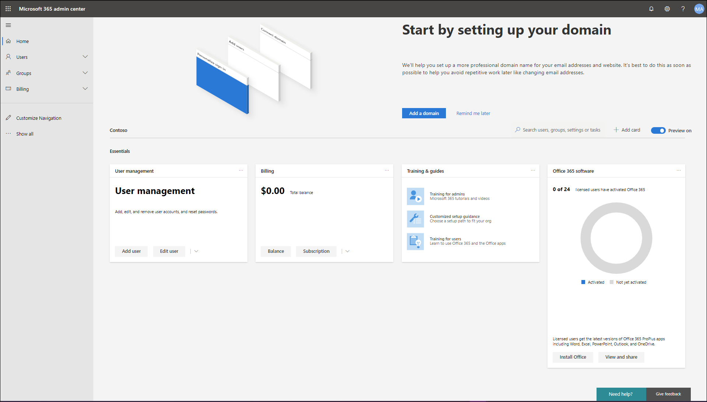

# Nieuwe in het Microsoft 365-beheercentrumWhat's new in the Microsoft 365 admin center

::: moniker range="o365-21vianet"

> [!NOTE]
> Sommige van de gegevens in dit artikel zijn mogelijk niet van toepassing op Office 365 dat wordt beheerd door 21Vianet.Some of the information in this article may not apply to Office 365 operated by 21Vianet.

::: moniker-end

We voegen voortdurend nieuwe functies toe aan [het Microsoft 365-beheercentrum,](microsoft-365-admin-center-preview.md)lossen problemen op waarover we meer te weten komen en wijzigingen aan te brengen op basis van uw feedback.We're continuously adding new features to [the Microsoft 365 admin center](microsoft-365-admin-center-preview.md), fixing issues we learn about, and making changes based on your feedback. Bekijk hieronder wat er vandaag voor u beschikbaar is.Take a look below to see what's available for you today. Sommige functies worden met verschillende snelheden uitgerold naar onze klanten.Some features get rolled out at different speeds to our customers. Als u nog geen functie ziet, [probeert u uzelf toe te voegen aan gerichte release.](manage/release-options-in-office-365.md)If you aren't seeing a feature yet, [try adding yourself to targeted release](manage/release-options-in-office-365.md).

> [!IMPORTANT]
> **"Klassieke" admin center pensionering vanaf maart****"Classic" admin center retirement starting in March**  
Wanneer u zich aanmeldt bij het Microsoft 365-beheercentrum, gaat u nu elke keer naar het nieuwe beheercentrum.When you sign in to the Microsoft 365 admin center, you'll now go to the new admin center every time. En in maart zijn we begonnen met het uitschakelen van de mogelijkheid om terug te schakelen naar het klassieke admin center.And in March, we started disabling the ability to switch back to the classic admin center. Voor nu u nog steeds terugschakelen, maar als het nieuwe beheercentrum op gelijke voet komt (en deze overschrijdt) schakelen we de schakelaar voor alle organisaties uit.For now, you can still switch back, but as the new admin center comes to parity (and exceeds it) we will turn off the switch for all organizations.    *Laatst bijgewerkt: 11 mei 2020**Last updated: May 11, 2020*

En als u wilt weten wat er nieuw is met andere Microsoft-cloudservices:And if you'd like to know what's new with other Microsoft cloud services:

- [Nieuwe gegevens in Azure Active DirectoryWhat's new in Azure Active Directory](https://docs.microsoft.com/azure/active-directory/fundamentals/whats-new)
- [Nieuwe in het Exchange-beheercentrumWhat's new in the Exchange admin center](https://docs.microsoft.com/Exchange/whats-new)
- [Nieuwe mogelijkheden in Microsoft IntuneWhat's new in Microsoft Intune](https://docs.microsoft.com/mem/intune/fundamentals/whats-new)
- [Nieuw in het Microsoft 365 compliance centerWhat's new in the Microsoft 365 compliance center](https://docs.microsoft.com/Office365/SecurityCompliance/whats-new)
- [Wat is er nieuw in Microsoft Threat ProtectionWhat's new in Microsoft Threat Protection](https://docs.microsoft.com/microsoft-365/security/mtp/whats-new)
- [Nieuwe informatie in het SharePoint-beheercentrumWhat's new in the SharePoint admin center](https://docs.microsoft.com/sharepoint/what-s-new-in-admin-center)
- [Office-updatesOffice updates](https://docs.microsoft.com/OfficeUpdates/)

## Mei 2020May 2020

### Nieuw updatekanaal voor OfficeNew update channel for Office

Op 12 mei kondigden we de beschikbaarheid aan van een nieuw updatekanaal voor Office: Monthly Enterprise Channel.On May 12, we announced the availability of a new update channel for Office:  Monthly Enterprise Channel. Dit updatekanaal biedt uw gebruikers één keer per maand nieuwe Office-functies, op de tweede dinsdag van de maand.This update channel provides your users with new Office features once a month, on the 2nd Tuesday of the month.

Als u uw gebruikers toestaat Office zelf te installeren vanuit de portal, u maandelijks Enterprise Channel voor hen selecteren.If you allow your users to self-install Office from the portal, you can select Monthly Enterprise Channel for them. Meld u hiervoor aan bij het Microsoft 365-beheercentrum en ga naar De instellingen **van de**  > Instellingen organisatieinstellingen voor**Settings**  >  **Org settings**  >  **Services**  >  **Office-software downloaden weergeven.**To do this, sign in to the Microsoft 365 admin center and go to **Show all** >**Settings** > **Org settings** > **Services** > **Office software download settings**. Als u **Eenmaal per maand (Maandelijks Enterprise Channel)** selecteert, worden nieuwe zelfinstallaties van Office geconfigureerd om maandelijks Enterprise Channel te gebruiken.If you select **Once a month (Monthly Enterprise Channel)**, then any new self-installs of Office will be configured to use Monthly Enterprise Channel.

In combinatie met de release van Monthly Enterprise Channel herzien we ook de namen van de bestaande updatekanalen.In conjunction with the release of Monthly Enterprise Channel, we’re also revising the names of the existing update channels. Het maandkanaal wordt bijvoorbeeld hernoemd naar Huidige kanaal.For example, Monthly Channel is being renamed to Current Channel. De nieuwe namen gaan in op 9 juni 2020.The new names take effect on June 9, 2020.

Zie [Wijzigingen in updatekanalen voor Microsoft 365-apps voor](https://docs.microsoft.com/DeployOffice/update-channels-changes)meer informatie.For more information, see [Changes to update channels for Microsoft 365 Apps](https://docs.microsoft.com/DeployOffice/update-channels-changes).

### Nieuwe beheerdersrollenNew admin roles

We hebben een aantal nieuwe Azure Active Directory-beheerdersrollen toegevoegd aan het Microsoft 365-beheercentrum.We've added some new Azure Active Directory admin roles to the Microsoft 365 admin center.

- De rol van hybride identiteitsbeheerder geeft gebruikers toestemming om cloudinrichtings- en verificatieservices te beheren.Hybrid identity admin role gives users permission to manage cloud provisioning and authentication services.
- Met de functie Netwerkbeheerder kunnen gebruikers netwerklocaties beheren en netwerkinzichten voor Microsoft 365 Software as a Service-apps bekijken.Network admin role lets users manage network locations and review network insights for Microsoft 365 Software as a Service apps.
- Printerbeheerdersrol verleent toestemming voor het beheren van alle aspecten van printers en printerverbindingen.Printer admin role grants permission to manage all aspects of printers and printer connections.
- Printertechnicus is een subset van de printerbeheerdersrol waarbij deze gebruikers printers kunnen registreren en uitschrijven en de printerstatus kunnen bijwerken.Printer technician is a subset of the Printer admin role where those users can register and unregister printers, and update printer status.
[Zie Over beheerdersrollen voor](https://docs.microsoft.com/microsoft-365/admin/add-users/about-admin-roles)meer informatie over deze rollen.To find out more about these roles, see [About admin roles](https://docs.microsoft.com/microsoft-365/admin/add-users/about-admin-roles).

### Lijst met exportgroepenExport groups list

We hebben van veel beheerders gehoord dat ze informatie over groepen en het gebruik ervan moeten delen met mensen die geen toegang hebben tot de beheercentra.We've heard from a lot of admins that they need to share information about groups and their usage to people who don't have access to the admin centers. U de lijst Groepen nu exporteren naar een CSV-bestand voor controledoeleinden, wat betekent dat u dat oude PowerShell-script weggooien.You can now export the Groups list to a CSV file for auditing purposes, which means you can throw out that old PowerShell script. Als u het wilt **Groups**uitproberen, gaat u naar  >  **Groepengroepen**en selecteert u **Groepen exporteren** op de opdrachtbalk.To try it out, go to **Groups** > **Groups**, and then select **Export groups** from the command bar.

### Microsoft 365-oplossings- en architectuurcentrumMicrosoft 365 solution and architecture center

Nog deze maand hebben we een nieuwe site uitgebracht op [https://docs.microsoft.com](https://docs.microsoft.com) de [Microsoft 365-oplossing en het architectuurcentrum,](https://docs.microsoft.com/microsoft-365/solutions/solution-architecture-center)die de technische richtlijnen samenbrengt die u nodig hebt om geïntegreerde Microsoft 365-oplossingen te begrijpen, te plannen en te implementeren voor veilige en compatibele samenwerking.Just this month, we released a new site on [https://docs.microsoft.com](https://docs.microsoft.com) called the [Microsoft 365 solution and architecture center](https://docs.microsoft.com/microsoft-365/solutions/solution-architecture-center), which brings together the technical guidance you need to understand, plan, and implement integrated Microsoft 365 solutions for secure and compliant collaboration. In dit centrum vindt u:In this center, you'll find:

- Richtlijnen voor basisoplossingFoundational solution guidance
- Werkbelastingoplossingen en scenariobegeleidingWorkload solutions and scenario guidance
- Illustraties voor oplossingen en architectuur (De posters!!!)Solution and architecture illustrations (The posters!!!)
- Branchespecifieke richtlijnenIndustry specific guidance
- Enterprise architecture design principalsEnterprise architecture design principals

### Documenten, training en video'sDocs, training, and videos

- **Nieuw in de Microsoft 365-videoserie**: Deze maand behandelen we de nieuwe ondersteuningservaring in de Teams-beheer- en beveiligings- en compliancecentra, planner-integratie met het Berichtencentrum en de nieuwe 3x3-video-indeling in Microsoft Teams.**What's new in Microsoft 365 video series**: This month, we cover the new support experience in the Teams admin and Security and Compliance Centers, Planner integration with the Message Center, and the new 3x3 video layout in Microsoft Teams. [Nieuwe in Microsoft 365What's New in Microsoft 365](https://go.microsoft.com/fwlink/p/?linkid=2118096)
- De [helphubpagina van het Microsoft 365-beheercentrum](https://docs.microsoft.com/microsoft-365/admin/) is bijgewerkt om u te helpen sneller te vinden wat u nodig hebt.The [Microsoft 365 admin center help](https://docs.microsoft.com/microsoft-365/admin/) hub page was updated to help you find what you need more quickly. En als je nu naar die pagina gaat kijken, hebben we een kaart toegevoegd om je op de hoogte te stellen van belangrijke updates en wijzigingen.And if you go look at that page right now, we've added a card to inform you of important updates and changes.

## April 2020April 2020

### Intune roles managementIntune roles management

[April 2020April 2020](#april-2020)

Nou, het is ons gelukt!Well, we did it! We hebben de tweede stap gezet naar een uniforme rolervaring en u nu Intune-rollen beheren in het Microsoft 365-beheercentrum.We've taken the second step towards a unified roles experience and you can now manage Intune roles in the Microsoft 365 admin center. U ook gebruikmaken van functies, zoals de mogelijkheid om te zoeken naar rollen en rolmachtigingen weer te geven.You can also leverage features such as the ability to search for roles and view role permissions. Dit betekent dat u geen twee afzonderlijke hulpprogramma's nodig hebt om rollen voor Microsoft 365 en Intune te beheren.This means you don’t need two separate tools to manage roles for Microsoft 365 and Intune. Wanneer u zich aanmeldt bij het Microsoft 365-beheercentrum, ziet u dat er twee draaipunten zijn op de pagina Rollen, een voor Azure AD en een voor Intune.When you sign into the Microsoft 365 admin center, you’ll see that there are two pivots on the Roles page, one for Azure AD and one for Intune.

:::image type="content" source="../media/MAC-WN-IntuneRoles.png" alt-text="Rollenpagina met de intune-draaipunt geselecteerd":::

### Berichten van Berichtencentrum synchroniseren met PlannerSync Message Center posts to Planner

Vanaf mei zien beheerders die zich in Gerichte release bevinden de knop 'Planner synchroniseren' in het berichtencentrum.Starting in May, admins who are in Targeted release will start seeing the "Planner syncing" button in the message center. U nu berichten bijhouden die actie nodig hebben, het type berichten selecteren dat u wilt bijhouden, berichten toewijzen om bij te houden als taken en berichten taggen voor latere aandacht.You can now track messages that need action, select the type of messages you'd like to track, assign messages to track as tasks, and tag messages for later attention.

[Word lid van Targeted Release](manage/release-options-in-office-365.md) om aan de slag te gaan![Join Targeted Release](manage/release-options-in-office-365.md) to get started!

### "Hulp nodig?""Need help?" gelanceerd in Teams admin center & Security and Compliance centerslaunched in Teams admin center & Security and Compliance centers

Het Teams-beheercentrum, het beveiligingscentrum en het Compliance Center gebruiken nu hetzelfde 'Hulp nodig?'The Teams admin center, Security center, and Compliance center are now using the same "Need help?" functie die het Microsoft 365-beheercentrum gebruikt voor het vinden van hulp en het contact opnemen met ondersteuning.feature that the Microsoft 365 admin center uses for finding help and contacting support. We hebben veel feedback ontvangen van beheerders dat je hetzelfde niveau van hulp en ondersteuning wilde en we zijn blij om dat aan u te brengen.We've received a lot of feedback from admins that you wanted the same level of help and support and we're happy to bring that to you. Probeer het uit en geef ons uw feedback!Try it out and give us your feedback!

#### Chat nodig?Need chat?

Onze ondersteuningsmedewerkers hebben vanuit huis gewerkt terwijl we nog steeds klantaanvragen en beperkingen op de internetbandbreedte nemen terwijl thuiswerken van invloed kan zijn op de kwaliteit van het gesprek van klanten.Our support agents have been working from home while still taking customer cases and limitations on internet bandwidth while working from home can impact customer call quality. Om u te blijven ondersteunen, hebben we een live chat-ondersteuningsoptie gelanceerd voor commerciële klanten in het Microsoft 365-beheercentrum.In order to continue supporting you, we have launched live chat support option for commercial customers in the Microsoft 365 admin center.

Tijdens het maken van een serviceaanvraag ziet u nu ook chat als een optie, naast telefoon en e-mail.While creating a service request, you'll now see chat as an option, in addition to phone and email. Selecteer chat als voorkeurskanaal voor communicatie en maak het verzoek.Select chat as a preferred channel of communication and create the request. Zodra u het verzoek hebt gemaakt, u de chat starten wanneer u klaar bent om te chatten met Microsoft-agents.Once you've created the  request, you can start the chat when you are ready to chat with Microsoft agents.

### Teams updatesTeams updates

Met het toegenomen gebruik van Teams hebben we een aantal functies toegevoegd om u te helpen deze te beheren.With the increased usage of Teams, we've added a few features to help you manage them.

- Een nieuwe aanbevelingskaart op de startpagina van het beheercentrum laat zien welke gebruikers Teams gedurende 30 dagen niet actief hebben gebruikt.A new recommendation card on the admin center Home page shows which users have not actively used Teams for 30 days. U deze gebruikers een trainingse-mail sturen om ze aan de slag te krijgen met Teams.You can send those users a training email to get them started using Teams.
- **Mensen samenbrengen met teams:** Ga naar **Setup** om een nieuwe pagina te bekijken om teams in te schakelen voor gelicentieerde gebruikers en gasttoegang te verlenen, zodat u werken met externe klanten in Teams.**Bring people together with teams**: Go to **Setup** to see a new page to help you turn on Teams for licensed users and allow guest access, so you can work with external customers in Teams.
- Een Microsoft Teams-kaart is nu standaard vastgemaakt aan uw startpagina.A Microsoft Teams card is now pinned by default to your Home page. Hieruit wordt weergegeven of Teams is ingeschakeld en of gasttoegang is toegestaan.It shows whether Teams is turned on, and if guest access is allowed. U ook de installatiestatus voor nieuw gelicentieerde Teams-gebruikers controleren en controleren of netwerkproblemen van invloed kunnen zijn op Teams-gebruikers.It also allows you to check the setup status for newly licensed Teams users, and check if network issues might be impacting Teams users.
- Ten slotte is Teams nu een stap in de oorspronkelijke set-up flow als u een licentie hebt gekocht die Teams bevat.Finally, Teams is now a step in the initial set up flow if you purchased a license that includes Teams.

### ProductiviteitsscoreProductivity score

Productivity Score geeft inzicht in hoe mensen Microsoft-cloudservices gebruiken en de technologische ervaringen die hen ondersteunen.Productivity Score gives insights about how people use Microsoft cloud services and the technology experiences that support them. De score weerspiegelt de prestaties van uw organisatie ten opzichte van metingen van werknemers- en technologie-ervaring en vergelijkt uw score met organisaties als de uwe.The score reflects your organization’s performance against employee and technology experience measures and compares your score with organizations like yours. Deze maand introduceren we de volgende nieuwe concepten in de preview-ervaring:This month, we are introducing the following new concepts to the preview experience:

- Trendweergave van primaire inzichten op startpagina- en categoriedetailspagina's -Endpoint Analytics- en Netwerkconnectiviteitscategorieën toegevoegd aan Technologie-ervaringTrend view of primary insights on home page and category detail pages -Endpoint Analytics and Network Connectivity categories added to Technology Experience
- Relevant Technology Experience inzicht getoond in Employee Experience categorieënRelevant Technology Experience insight shown in Employee Experience categories
- Nieuwe communicatiecategorie als onderdeel van Employee ExperienceNew Communications category as part of Employee Experience
- Gebruikersgegevens met metagegevens van organisaties in de categorieën Employee ExperienceUser details with organizational metadata in Employee Experience categories

Als u meer wilt weten, bekijk dan de blog: [Meet en verbeter de Microsoft 365-ervaring met Microsoft Productivity Score](https://techcommunity.microsoft.com/t5/microsoft-365-blog/measure-and-improve-the-microsoft-365-experience-with-microsoft/ba-p/1348618).If you'd like to learn more, check out the blog: [Measure and improve the Microsoft 365 experience with Microsoft Productivity Score](https://techcommunity.microsoft.com/t5/microsoft-365-blog/measure-and-improve-the-microsoft-365-experience-with-microsoft/ba-p/1348618). De productiviteitsscore bevindt zich momenteel in een privévoorbeeld.Productivity score is currently in private preview. [Neem deel aan de privévoorbeeld van de productiviteitsscore](https://aka.ms/productivityscorepreview) om aan de slag te gaan.[Join the Productivity score private preview](https://aka.ms/productivityscorepreview) to get started.

### Groepen updatesGroups updates

We hebben deze maand twee updates voor groepen:We've got two updates for Groups this month:

- U nu e-mailadressen bewerken voor Office 365-groepen (ook bekend als Groepen in Outlook en binnenkort Microsoft 365-groepen worden genoemd).You can now edit email addresses for Office 365 groups (Also known as Groups in Outlook, and soon to be known as Microsoft 365 groups).
- We hebben uw feedback gehoord en we hebben duidelijkere foutberichten toegevoegd waarom u een groep niet converteren naar een Microsoft Team.We've heard your feedback and we've added clearer error messaging for why you can't convert a group to a Microsoft Team.

### Documenten, video's en training (april)Docs, videos, and training (April)

**Nieuw in de Video-serie van Microsoft 365:** Deze maand behandelen we tips en bronnen om kleine bedrijven te helpen bij de overgang naar extern werk, waaronder hoe u Microsoft Teams uitrollen, externe werktrainingsbronnen om in contact te blijven met klanten en partners en het nieuwe Microsoft 365 Business Voice-abonnement.**What's new in Microsoft 365 video series**: This month, we cover tips and resources to help small businesses transition to remote work including how to roll out Microsoft Teams, remote work training resources to stay connected with clients and partners, and the new Microsoft 365 Business Voice plan. [Nieuwe in Microsoft 365What's New in Microsoft 365](https://go.microsoft.com/fwlink/p/?linkid=2118096)

#### Voor uw gebruikersFor your users

- [Een vergadering plannenSchedule a meeting](https://support.microsoft.com/office/c61b4f61-ee62-4a06-8bf7-0a1cd302700a)
- [Deelnemen aan een Teams-vergaderingJoin a Teams meeting](https://support.microsoft.com/office/078e9868-f1aa-4414-8bb9-ee88e9236ee4)
- [Een organisatiebreed team makenCreate an org-wide team](https://support.microsoft.com/office/037bb27a-bcc9-48fe-8d72-44d9482420a3)
- [Een team met gasten makenCreate a Team with guests](https://support.microsoft.com/office/11fbb083-52ee-434d-8c6e-63711fdafac7)
- [Word lid van een team als gastJoin a Team as a guest](https://support.microsoft.com/office/928d1eef-61e2-49ec-b754-c2fe86b34824)
- [Een groepse-mailadres makenCreate a group email address](https://support.microsoft.com/office/ded875f9-a9de-437f-b559-2ae4f235bb2b)

#### Voor beheerders en ondernemersFor admins and business owners

- [Geef uw kleine bedrijf werk op afstand kracht bij het werk op afstandEmpower your small business with remote work](https://support.microsoft.com/office/9b91a85a-39b4-40a6-a590-0f9bea0ba8e6)
- [Het runnen van een klein bedrijf op afstandRunning a remote small business](https://support.microsoft.com/office/9ac1a0f1-789b-4143-b954-5821d5d89298)
- [Aanmelden voor Microsoft Business BasicSign up for Microsoft Business Basic](https://support.microsoft.com/office/9ac1a0f1-789b-4143-b954-5821d5d89298)
- [Aanmelding met twee factoren instellenSetting up two-factor sign-in](https://support.microsoft.com/office/9ac1a0f1-789b-4143-b954-5821d5d89298)

## Maart 2020March 2020

### Aanbevolen feedback fix: Verbeteren "toevoegen gebruiker" betrouwbaarheid voor licentiesFeatured Feedback Fix: Improve "add user" reliability for licensing

We hebben veel feedback ontvangen van beheerders over hoe moeilijk het is om licenties toe te wijzen bij het toevoegen van gebruikers.We received a lot of feedback from admins about the how hard it is to assign licenses when adding users. We hebben de eerste update van deze oplossing gemaakt en we zijn gemigreerd naar een betrouwbaardere service achter de schermen om die aanvragen te verwerken.We've made the first update to this fix and we've migrated to a more reliable behind-the-scenes service to process those requests. En als er iets misgaat, krijg je nu een foutmelding waarmee je het opnieuw proberen.And if something goes wrong, you'll now get an error message that lets you to try again.

:::image type="content" source="../media/MAC-WN-ImprovedLicensing.png" alt-text="Voeg de bevestigingspagina van de gebruiker toe met de foutmelding.":::

### Microsoft Teams-startpaginakaartMicrosoft Teams home page card

Met de toename in het gebruik van Teams krijgen sommige organisaties een vastgepinde dashboardkaart die het inschakelen van Teams beter vindbaar maakt.With the uptick in Teams usage, some orgs will get a pinned dashboard card that makes turning Teams on more discoverable. De kaart heeft ook links naar training en documenten om uw organisatie te helpen over te stappen op afstand werken.The card also has links to training and docs to help your org transition to remote work. Ga gewoon naar de **startpagina** om de nieuwe kaart te zien.Just go to the **Home** page to see the new card.

:::image type="content" source="../media/MAC-WN-TeamsCard.PNG" alt-text="Microsoft Teams-startpaginakaart":::

### Het sharepoint-app-thema van uw organisatie aanpassenCustomize your organization's SharePoint mobile app theme

Met het Microsoft 365-beheercentrum u nu het thema van uw organisatie aanpassen in de mobiele SharePoint-app voor de mobiele iOS- en SharePoint-app voor Android.Using the Microsoft 365 admin center, you can now customize your organization's theme in SharePoint mobile app for iOS and SharePoint mobile app for Android. Deze functie biedt gemakkelijk een mobiele intranet-app-ervaring die uw SharePoint Online kan afstemmen voor werknemers onderweg.This feature conveniently provides a mobile intranet app experience that can match your SharePoint Online for employees on the go. Thema-aanpassing omvat uw logoafbeelding, navigatiebalkkleuren, tekst- en pictogramkleuren en accentkleuren, waardoor u gemakkelijk herkennen.Theme customization includes your logo image, navigation bar color, text and icon colors, and accent colors, making for easy recognition.

:::image type="content" source="../media/MAC-WN-CustThemeSP.png" alt-text="Diagram brengt de instellingen van het beheercentrum in kaart aan de mobiele app.":::

### Verbeteringen aan de wizard Een groep toevoegenImprovements to the "Add a group" wizard

Wanneer beheerders een nieuwe groep hebben gemaakt en er tegelijkertijd een team van maakten, kunnen ze eigenaren toewijzen die geen licentie hebben die Teams bevat.When admins created a new group - and made it a Team at they same time, they could assign owners who don't have a license that includes Teams. En dat zorgde voor wat hoofdpijn.And that created some headaches. We hebben de wizardstroom bijgewerkt om te controleren of eigenaren een Teams-licentie hebben en of ze niet de optie hebben om de groep om te zetten in een team, is uitgeschakeld.We've updated the wizard flow to verify that owners have a Teams license and if they don't the option to turn the group into a Team is disabled.

### Microsoft 365-aanbiedingen voor kleine en middelgrote bedrijvenMicrosoft 365 offerings for small and medium businesses

We weten dat dit een aankondiging is voor volgende maand, maar we willen er zeker van zijn dat je voorbereid bent.We know that this is an announcement for next month, but we want to make sure you're prepared.

Vanaf 21 april voeren we wijzigingen aan met betrekking tot onze Office 365-abonnementen voor kleine en middelgrote bedrijven en office 365 ProPlus.Starting on April 21, we're making changes related to our Office 365 subscriptions for small and medium businesses – and to Office 365 ProPlus. Deze producten zullen nu gebruik maken van het microsoft 365 merk.These products will now use the Microsoft 365 brand.

De nieuwe productnamen gaan in op 21 april 2020.The new product names go into effect on April 21, 2020. Dit is alleen een wijziging in de productnaam en er zijn op dit moment geen prijs- of functiewijzigingen.This is a change to the product name only, and there are no pricing or feature changes at this time.

|Huidige naamCurrent name |Nieuwe naamNew name  |
|---------|---------|
|Office 365 Business EssentialsOffice 365 Business Essentials     |   Microsoft 365 Business BasicMicrosoft 365 Business Basic      |
|Office 365 Business PremiumOffice 365 Business Premium     |    Microsoft 365 Business StandardMicrosoft 365 Business Standard     |
|Microsoft 365 BusinessMicrosoft 365 Business     |    Microsoft 365 Business PremiumMicrosoft 365 Business Premium     |
|Office 365 BusinessOffice 365 Business     |    Microsoft 365-apps voor bedrijvenMicrosoft 365 Apps for business       |
|Office 365 ProPlusOffice 365 ProPlus    |   Microsoft 365-apps voor bedrijvenMicrosoft 365 apps for enterprise      |

### Video's, training en documentenVideos, training, and docs

[Nieuwe functies in microsoft 365-webseries:](https://go.microsoft.com/fwlink/p/?linkid=2118096)In de aflevering van deze maand belichten we het 3-jarig bestaan van Microsoft Teams en bespreken we nieuwe functies, waaronder verbeterde audiokwaliteit in online vergaderingen, gerichte communicatie voor firstline-managers met de Shifts-app, Teams en Skype-interoperabiliteit van consumenten en meer.[What's New in Microsoft 365 web series](https://go.microsoft.com/fwlink/p/?linkid=2118096): In this month's episode, we highlight the 3-year anniversary of Microsoft Teams and cover new features including improved audio quality in online meetings, Targeted Communications for firstline managers with the Shifts app, Teams and Skype consumer interoperability, and more.

## Februari 2020February 2020

### Aanbevolen feedback fix: multi-organisatie switcherFeatured Feedback Fix: Multi-organization switcher

We kregen veel feedback van partners en beheerders over de uitdagingen van het beheren van meerdere Microsoft cloud-organisaties.We received a lot of feedback from partners and admins about the challenges of managing multiple Microsoft cloud orgs. Een van onze eerste multi-org management functies is de **Organisatie switcher**, waarmee u veranderen tussen de orgs die u beheert in slechts 2 klikken.One of our first multi-org management features is the **Organization switcher**, which lets you change between the orgs that you manage in just 2 clicks.
> [!TIP]
> U hoeft niets te doen om de organisatieswitch te laten verschijnen zolang u de partner van record bent voor ten minste één organisatie.You don't have to do anything to make the organization switcher appear as long as you are the Partner of record for at least one organization.

1. Selecteer in het Microsoft 365-beheercentrum de naam van de organisatie.In the Microsoft 365 admin center, select the org name.

2. Selecteer in de organisatieswitcher de organisatie die u wilt beheren.In the organization switcher, select the org you want to manage.

Dat is het letterlijk!!!That's literally it!!!

### GroepenGroups

Een paar veranderingen in de groepen gebied deze maand:A couple of changes in the groups area this month:

- **Sorteren op groepsnaam**: U de lijst met groepen alfabetisch sorteren door de kolom **Groepsnaam te** selecteren.**Sort by group name**: You can sort the groups list alphabetically, by selecting the **Group name** column.
- **Verwijderde Microsoft 365-groepen herstellen**: u hoeft niet meer naar het Exchange-beheercentrum te gaan om verwijderde Microsoft 365-groepen te herstellen.**Restore deleted Microsoft 365 groups**: You don't have to go to the Exchange admin center anymore to restore  deleted Microsoft 365 groups. Ga naar de groep Groepen verwijderde groepen **van Microsoft 365-beheercentrum** \> **Groups** \> **Deleted groups** \> (selecteer een groep in de lijst) \> **Groep Herstellen**.Go to **Microsoft 365 admin center** \> **Groups** \> **Deleted groups** \> (select a group from the list) \> **Restore group**. Hiermee wordt de groep teruggehersteld naar de lijst **Groepen** en worden de e-mail, gesprekken, notitieblok, bestanden en agenda van de groep hersteld.It'll restore the group back to the **Groups** list and restore the group's email, conversations, notebook, files, and calendar.

### Video's, training en documenten (februari)Videos, training, and docs (February)

- **Nieuw in de Microsoft 365-videoserie:** Deze maand richten we ons op aangepaste zoekmogelijkheden voor SharePoint Online, de beheerfunctie 'Wat is er nieuw', waarmee u specifieke functies van eindgebruikers weergeven of verbergen via het helpvenster in de app, de nieuwste beveiligings- en nalevingsupdates in Yammer en meer.**What's new in Microsoft 365 video series**: This month, we're focused on custom search capabilities for SharePoint Online, the Office "What's New" management feature that lets you show or hide specific features from end-users via the in-app help pane, the latest security and compliance updates in Yammer, and more. Hier is de nieuwste aflevering: [What's New in Microsoft 365](https://go.microsoft.com/fwlink/p/?linkid=2118096)Here's the latest episode: [What's New in Microsoft 365](https://go.microsoft.com/fwlink/p/?linkid=2118096)

- **Documenten verplaatsen**: We hebben de webartikelen van Office 365-beheerders gecombineerd met de Microsoft 365-inhoud en u hebt de nieuwe URL misschien opgemerkt.**Docs move**: We combined the Office 365 admin web articles with the Microsoft 365 content and you might've noticed the new URL. Dit artikel werd bijvoorbeeld gehost op: **docs.microsoft.com/Office365/Admin/whats-new-in-preview**, maar de URL is nu: **docs.microsoft.com/microsoft-365/admin/whats-new-in-preview**.For example, this article used to be hosted at: **docs.microsoft.com/Office365/Admin/whats-new-in-preview**, but the URL is now: **docs.microsoft.com/microsoft-365/admin/whats-new-in-preview**. Als je pagina's hebt bladwijzers, moet je je links bijwerken. echter, inhoud links zullen worden doorgestuurd naar de nieuwe inhoud repo.If you've bookmarked pages, you should update your links; however, content links will be redirected to the new content repo.

## Januari 2020 - Gelukkig NieuwjaarJanuary 2020 - Happy New Year

> [!NOTE]
> Wist u dat er een [What's New in Microsoft 365](https://go.microsoft.com/fwlink/p/?linkid=2118096) video-serie op YouTube?Did you know that there's a [What's New in Microsoft 365](https://go.microsoft.com/fwlink/p/?linkid=2118096) video series on YouTube? Het belicht de nieuwste functies die we hebben uitgerold naar gebruikers.It highlights the latest features that we've rolled out to users. Elke maand gaan we linken naar de nieuwste aflevering in de sectie [Video's, training en documenten.](#videos-training-and-docs)Every month, we'll start linking to the latest episode in the [Videos, training, and docs](#videos-training-and-docs) section.     Hier is de nieuwste aflevering: [What's New in Microsoft 365](https://go.microsoft.com/fwlink/p/?linkid=2118096)Here's the latest episode: [What's New in Microsoft 365](https://go.microsoft.com/fwlink/p/?linkid=2118096)

### Donkere modusDark mode

Toen we voor het eerst de donkere modus uitrolden, was deze alleen beschikbaar op de startpagina.When we first rolled out dark mode, it was only available on the Home page. De donkere modus is nu uit preview en is in Gerichte release op de meeste pagina's in het beheercentrum.Dark mode is now out of preview and is in Targeted release across most pages in the admin center.

1. Eerst moet je Gerichte release inschakelen: Ga **Settings** naar voorkeuren voor \> **Settings** \> **het organisatieprofiel** release van \> **Release preferences**instellingen.First, you'll need to turn on Targeted Release: Go to **Settings** \> **Settings** \> **Organization profile** \> **Release preferences**.
1. En ga vervolgens naar de **startpagina** om de donkere modus in te schakelen en selecteer vervolgens de knop **Donkere modus.**And then to turn on dark mode, go to the **Home** page, and then select the **Dark mode** button. (Het is naast het veld **Zoeken** en dit artikel **is wat is de nieuwe** link.)(It's next to the **Search** field and this article's **What's new** link.)
1. Voor elke pagina met een donkere modus beschikbaar is, staat de knop bovenaan de pagina, naast de nieuwe schakelknop van **het beheercentrum.**For any page that has dark mode available, the button is at the top of the page, next to **The new admin center** toggle.

### Office Wat is nieuw beheerOffice What's New management

Beheerders willen controle over hoe Microsoft 'Wat is er nieuw' communiceert met hun gebruikers in de Office-apps - en u hebt nu die controle.Admins want control over how Microsoft communicates "What's New" to their users in the Office apps - and you now have that control. Ga naar **Instellingen** \> **Office Wat is er nieuw beheervoorbeeld**.Go to **Settings** \> **Office What's New management Preview**. Selecteer een functie om de details weer te geven en vervolgens u de knop **Verbergen voor gebruikers** selecteren als u niet wilt dat uw gebruikers een bepaald bericht 'nieuw' zien.Select a feature to view its details, and then you can select the **Hide from users** button if you don't want your users to see a particular "what's new" message. Uw organisatie wacht bijvoorbeeld om gebruikers op de hoogte te stellen van een functie totdat iedereen in uw organisatie erop is getraind.For example, your organization might be waiting to let users know about a feature until everyone in your org is trained on it.

Deze functie werd voor het eerst uitgebracht om een preview in november, maar er zijn een paar functie-updates die u moet weten over: [Office What's New management preview updates nu beschikbaar](https://techcommunity.microsoft.com/t5/microsoft-365-blog/office-what-s-new-management-preview/ba-p/1020438)This feature was first released to preview in November, but there have been a few feature updates that you should know about: [Office What's New management preview updates now available](https://techcommunity.microsoft.com/t5/microsoft-365-blog/office-what-s-new-management-preview/ba-p/1020438)

### PartnersPartners

Howdy, Partners!Howdy, Partners! (Kon het niet helpen mezelf.) We hebben deze maand ook een update voor je.(Couldn't help myself.) We've got an update for you this month, as well. Er is een nieuwe functie waarmee partners CSP-klanten de mogelijkheid kunnen geven om hun Microsoft Customer Agreement (MCA) te accepteren in het gedeelte **Factureringsaccounts** van het beheercentrum.There's a new feature that allows Partners to give CSP customers the option to accept their Microsoft Customer Agreement (MCA) in the **Billing accounts** section of the admin center. In deze nieuwe ervaring:In this new experience:

1. De klant ontvangt een uitnodigingsmail met een link om de partnerrelatie en de MCA te accepteren.The customer receives an invitation email with a link to accept the partner relationship and the MCA.
2. Nadat de klant zich heeft aanmelden, kunnen ze de MCA- en partnermachtigingen bekijken en accepteren - rechtstreeks vanuit het beheercentrum.After the customer signs in, they can view and accept the MCA and partner permissions - right from the admin center.

### ResourcepostvakkenResource mailboxes

De lijst Met resourcepostvakken is bijgewerkt naar de nieuwe stijl.The Resource mailboxes list has been updated to the new style. Ga in het Microsoft 365-beheercentrum naar **Resources** \> **Rooms &-apparatuur**.In the Microsoft 365 admin center, go to **Resources** \> **Rooms & equipment**.

### Video's, training en documenten (januari)Videos, training, and docs (January)

Bekijk de training voor beheerders voor kleine bedrijven die we in januari hebben uitgebracht:Check out the small business admin training that we released in January:

- [Uw bedrijfswebsite makenCreate your business website](https://support.microsoft.com/office/3325d50e-d131-403c-a278-7f3296fe33a9)
- [Antwoorden en hulp vindenFind answers and help](https://support.microsoft.com/office/7f681212-c649-4a3e-a43b-32b1d1e58988)
- [Hulp of ondersteuning krijgenGet help or support](https://support.microsoft.com/office/18948a4c-3eb1-4b30-b1bc-a4cc29eb7655)
- [Een gebruiker verwijderenDelete a user](https://support.microsoft.com/office/6bcdad7b-732a-4260-997a-8c176bc3d9d6)
- [Een Microsoft-abonnement kiezenChoose a Microsoft subscription](https://support.microsoft.com/office/b9f7c78e-430f-4117-89ec-2eeb1dced2ca)
- [Overzicht van Microsoft 365 voor bedrijfsbeveiligingOverview of Microsoft 365 for business security](https://support.microsoft.com/office/3274b159-a825-46d7-9421-7d6e209389d1)

## November en december 2019November and December 2019

We combineren het nieuws van november en december, want na Ignite hadden we weinig aankondigingen te doen.We're combining November's and December's news because after Ignite we had very few announcements to make. Tot ziens in het nieuwe jaar!See you in the new year!

### Overstappen van creditcard naar factuurbetalingChange from credit card to invoice payment

We beginnen de mogelijkheid uit te rollen om uw betalingsmethode te wijzigen van creditcard naar factuur.We've starting to roll out the ability to change your payment method from credit card to an invoice. Ga naar **Facturering** \> **Uw producten,** selecteer een abonnement en selecteer vervolgens de koppeling **Bewerken** naast de creditcardbetaling.Go to **Billing**\> **Your products**, select a subscription, and then select the **Edit** link next to the credit card payment.

Wilt u er meer over lezen?Want to read more about it? [Wijzigen van creditcard of bankrekening naar factuurChange from credit card or bank account to invoice](../commerce/billing-and-payments/change-payment-method.md)

### Algemene lezerGlobal reader

We noemden de Global reader rol in de [oktober 2019 - Ignite Edition](#october-2019---ignite-edition), maar aangezien het breder uitrolt, laten we enkele details bespreken:We mentioned the Global reader role in the [October 2019 - Ignite Edition](#october-2019---ignite-edition), but as it's rolling out more broadly, let's discuss some details:

- De rol Global reader is de alleen-lezen tegenhanger van de globale beheerdersrol.The Global reader role is the read-only counterpart to the Global admin role. De globale lezer kan alles zien waartoe de Global-beheerder toestemming heeft.The Global reader can see everything that the Global admin has permission to do.
- Op een paar uitzonderingen na, zoals sommige compliance- en beveiligingsfuncties, hebben globale lezers toegang tot alle Microsoft-cloudbeheercentra die uw organisatie mag gebruiken, kunnen bekijken.With a few exceptions, like some compliance and security features, Global readers have access to view all of the Microsoft cloud admin centers that your org is licensed to use.
- Wijs de rol Global-lezer toe aan gebruikers die deze nodig hebben voor planning, audits en onderzoeken.Assign the Global reader role to users who need it for planning, audits, and investigations.
- U de globale lezersrol ook combineren met een andere rol met minder machtigingen.You can also combine the global reader role with another role that has fewer permissions. Een eigenaar van een klein bedrijf kan bijvoorbeeld de globale lezersrollen **voor factureringsbeheerders**toegewezen krijgen,  +  **Global reader** zodat deze de facturen kan betalen en op de hoogte kan blijven van wijzigingen in hun cloudorganisatie.For example, a small business owner might be assigned the **Billing admin** + **Global reader** roles so that they can pay the bills and stay on top of changes to their cloud organization.
- Wereldwijde lezers kunnen naar elke pagina in het Microsoft 365-beheercentrum gaan.Global readers can go to any page in the Microsoft 365 admin center. Wanneer ze een bewerkbare pagina openen, wordt bovenaan een waarschuwing weergegeven waarin staat dat ze geen toestemming hebben om wijzigingen op te slaan en wordt de knop Opslaan uitgeschakeld.When they open an editable page,  there will be a warning at the top telling them that they don't have permission to save changes, and the save button will be disabled.

We krijgen graag uw feedback over de wereldwijde lezersrol en een van de op rollen gebaseerde machtigingen die u in de toekomst wilt zien.We'd love to get your feedback about the global reader role and any of the role-based permissions that you'd like to see in the future. [Feedback geven voor machtigingen op basis van rollenGive feedback for role-based permissions](https://office365.uservoice.com/forums/273493-office-365-admin/suggestions/10115430-have-a-consistent-experience-when-assigning-admin)

### Pagina Nieuwe instellingenNew Settings page

Het **organisatieprofiel,** **beveiligings- & privacy**en services & **invoegpagina's** zijn allemaal gecombineerd tot één pagina met 3 verticale tabbladen.The **Organization profile**, **Security & privacy**, and **Services & add-ins** pages have all been combined into one page with 3 vertical tabs. En het beste deel -- vanaf één locatie kun je nu zoeken naar alle instellingen.And the best part -- from one single location, you can now search for all settings.

### Training & documentenTraining & Docs

Deze sectie is een nieuw kenmerk van dit artikel, waar we beginnen te koppelen aan nieuwe training en documentatie die we denken dat je interessant zult vinden.This section is a new feature of this article, where we'll start linking to new training and documentation that we think you will find interesting.

In november hebben we een flink aantal leerpaden naar [de Website van Microsoft Learn](https://docs.microsoft.com/learn/) vrijgegeven om IT-professionals te helpen meer te weten te komen over en getraind te worden in Microsoft 365.In November, we released quite a few learning paths to [Microsoft Learn](https://docs.microsoft.com/learn/) website to help IT pros learn about and get trained on Microsoft 365. Bekijk ze:Check them out:

- [Microsoft 365 basisprincipesMicrosoft 365 fundamentals](https://docs.microsoft.com/learn/paths/m365-fundamentals/)
- [Office-fundamentals uitbreidenExtend Office fundamentals](https://docs.microsoft.com/learn/paths/extend-office-fundamentals/)
- [Microsoft 365 - Uw bedrijfsimplementatie moderniseren met Windows 10 en Microsoft 365 Apps voor bedrijvenMicrosoft 365 - Modernize your enterprise deployment with Windows 10 and Microsoft 365 Apps for enterprise](https://docs.microsoft.com/learn/paths/m365-getmodern/)
- [Uw bedrijfsimplementatie beheren met Microsoft 365Manage your enterprise deployment with Microsoft 365](https://docs.microsoft.com/learn/paths/manage-enterprise-deployment-m365/)
- [Microsoft Office voor IT op schaal upgradenUpgrade Microsoft Office for IT at scale](https://docs.microsoft.com/learn/paths/m365-office-for-it/)
- [Externe bureaubladen en apps vanuit Azure leveren met Windows Virtual DesktopDeliver remote desktops and apps from Azure with Windows Virtual Desktop ](https://docs.microsoft.com/learn/paths/m365-wvd/)
- [Moderniseer uw werkplek met Microsoft 365 en Surface for BusinessModernize your workplace with Microsoft 365 and Surface for Business](https://docs.microsoft.com/learn/paths/modernize-workplace-with-m365-and-surface/)
- [Identiteit en toegang beveiligen met Microsoft 365Protect identity and access with Microsoft 365](https://docs.microsoft.com/learn/paths/m365-identity/)
- [Bedrijfsgegevens beveiligen met Microsoft 365Protect enterprise information with Microsoft 365](https://docs.microsoft.com/learn/paths/m365-information-protection/)
- [Beveiliging beheren met Microsoft 365Manage security with Microsoft 365](https://docs.microsoft.com/learn/paths/m365-security-management/)
- [Verdedigen tegen bedreigingen met Microsoft 365 en Microsoft threat protectionDefend against threats with Microsoft 365 and Microsoft threat protection](https://docs.microsoft.com/learn/paths/m365-security-threat-protection/)
- [Teamsamenwerking beheren met Microsoft TeamsManage team collaboration with Microsoft Teams](https://docs.microsoft.com/learn/paths/m365-manage-team-collaboration/)
- [Samenwerken met SharePoint in Microsoft 365Collaborate with SharePoint in Microsoft 365](https://docs.microsoft.com/learn/paths/m365-teams-sharepoint/)

## Oktober 2019 - Ignite EditionOctober 2019 - Ignite Edition

Welkom bij de Ignite Edition van de What's new in het Microsoft 365 admin center!Welcome to the Ignite Edition of the What's new in the Microsoft 365 admin center! Natuurlijk, dit is niet een volledige lijst van aankondigingen, maar hier zijn een paar hoogtepunten.Of course, this isn't a complete list of announcements, but here are a few highlights. Bekijk ook de Ignite blogs voor meer geweldige info over releases:Also, check out the Ignite blogs for more great info about releases:

- [ADMIN - Beveiligings-, productiviteits- en netwerkverbeteringen voor Microsoft 365](https://techcommunity.microsoft.com/t5/Microsoft-365-Blog/ADMIN-Security-Productivity-and-Network-Enhancements-for/ba-p/964019).[ADMIN - Security, Productivity, and Network Enhancements for Microsoft 365](https://techcommunity.microsoft.com/t5/Microsoft-365-Blog/ADMIN-Security-Productivity-and-Network-Enhancements-for/ba-p/964019).
- [Nieuwe apps in Microsoft Teams - Ignite 2020](https://techcommunity.microsoft.com/t5/Microsoft-Teams-Blog/What-s-New-in-Microsoft-Teams-Ignite-2019/ba-p/937025).[What's New in Microsoft Teams - Ignite 2020](https://techcommunity.microsoft.com/t5/Microsoft-Teams-Blog/What-s-New-in-Microsoft-Teams-Ignite-2019/ba-p/937025).

### Toegangsbeheer op basis van rollenRole-based access control

Er zijn veel veranderingen voor Rollen in het beheercentrum sinds we in juni zijn begonnen met de uitrol:There have been a lot of changes for Roles in the admin center since we started rolling out in June:

- **Rollen vergelijken** - Selecteer maximaal 3 rollen om de machtigingen voor elke rol te vergelijken.**Compare roles** - Select up to 3 roles to compare the permissions for each one. Dit zal u helpen bij het vinden van de minst tolerante rol toe te wijzen aan gebruikers.This will help you find the least permissive role to assign to users. Ga naar **Rollen**, gebruik het selectievakje met meerdere opties in de eerste kolom om maximaal 3 rollen te kiezen en selecteer **Vervolgens Rollen vergelijken**.Go to **Roles**, use the multi-select checkbox in the first column to choose up to 3 roles, and then select **Compare roles**.

    

- **Favorieten** - U een ster toevoegen aan uw favoriete of meest gebruikte rollen, zodat u ze gemakkelijk vinden door de kolom te sorteren of een filter te maken.**Favorites** - You can add a star to your favorite or most-used roles, so that you can easily find them by sorting the column or creating a filter.
- **Actieve gebruikers**  >  **Rollen beheren** - Dit is bijgewerkt om af te stemmen op de wijzigingen in Rollen.**Active users** > **Manage roles** - This has been updated to align with the changes in Roles. Net als bij de lijst Rollen hebben we de standaardlijst met rollen naar de meest nuttige scopes beperkt, maar u alle rollen zien door **Weergeven alles per categorie**uit te breiden.As with the Roles list, we've scoped the default list of roles to the most useful, but you can see all roles by expanding **Show all by category**.
- **Global reader rol** - Je vroeg erom!**Global reader role** - You asked for it! Je hebt het!You got it! De [wereldwijde lezersrol!](add-users/about-admin-roles.md)The [Global reader](add-users/about-admin-roles.md) role!

### Een probleem meldenReport an issue

De servicestatus is bijgewerkt naar de nieuwe stijl en als u wordt beïnvloed door een probleem dat niet wordt weergegeven op uw servicestatusdashboard, u **een probleem melden** om microsoft dit te laten weten.Service health has been updated to the new style and if you are impacted by an issue that is not showing up on your Service health dashboard, you can **Report an issue** to let Microsoft know. Ga naar **health**  >  **service gezondheid**.Go to **Health** > **Service health**.

### "Virale" abonnementen"Viral" subscriptions

Zoals u weet, kunnen gebruikers gratis abonnementen inschakelen op een groot aantal producten zoals Power BI en App Connect.As you know, users can turn on free subscriptions to a myriad of products like Power BI and App Connect. U nu de virale abonnementen zien die uw gebruikers hebben geprobeerd.You can now see the "viral subscriptions" that your users have been trying. Ga naar **Facturering**  >  **uw producten**.Go to **Billing** > **Your products**. Selecteer het filter **Accounttype** op het tabblad Abonnementen om de door de gebruiker gekochte abonnementen te bekijken.Select the **Account type** filter on the subscriptions tab to see the user-purchased subscriptions. Indien nodig u deze abonnementen nu uit uw account verwijderen.If needed, you now have the ability to remove these subscriptions from your account.

### GebruikerssjablonenUser templates

Met sjablonen u eenvoudig veel gebruikers toevoegen door de gedeelde instellingen voor deze gebruikers op te slaan en opnieuw te gebruiken.Templates allow you to easily add many users by saving and reusing the shared settings for these users. U waarden opslaan voor rollen, toegewezen licenties, contactgegevens, locatie en meer.You can save values for roles, licenses assigned, contact information, location, and more. Wanneer u de sjabloon gebruikt om een nieuwe gebruiker te maken, krijgt deze automatisch de opgeslagen waarde voor deze instellingen.When you use the template to create a new user, they will automatically get the saved value for these settings. Ga **Users**naar  >  **Gebruikers Actieve gebruikers**en selecteer **Gebruikerssjablonen** om het uit te proberen.Go to **Users** > **Active users**, and then select **User templates** to try it out.

### Beheer Office 'Nieuw' (Voorbeeld)Office "What's New" management (Preview)

Wanneer een belangrijke Office-functie wordt vrijgegeven voor een Office-app, krijgen gebruikers een 'Nieuwe' kaart voor meer informatie over de nieuwe functie.When an important ‎Office‎ feature is released to an Office app, users will get a "What's new" card to learn about the new feature. Als u niet wilt dat gebruikers de kaart zien, u deze verbergen.If you don't want users to see the card, you can hide it. U ook kiezen wanneer u wilt dat gebruikers de kaart zien door deze te laten zien.You can also choose when you'd like users to see the card by showing it. Ga naar **Instellingen**  >  **Office Wat is nieuw beheer** om het te controleren.Go to **Settings** > **Office What's New management** to check it out.

### Url-wijziging van SharePointSharePoint URL change

Technisch gezien is dit niet het nieuws van het Microsoft 365-beheercentrum om te vertellen, maar we zijn zo opgewonden dat we ervoor wilden zorgen dat je dit nieuws ziet:Technically, this isn't the Microsoft 365 admin center's news to tell, but we're so excited we wanted to make sure you see this news:
> [!IMPORTANT]
> U nu naar uw SharePoint-beheercentrum gaan met een gewone URL:[https://admin.microsoft.com/SharePoint](https://admin.microsoft.com/SharePoint)You can now get to YOUR SharePoint admin center with a regular URL: [https://admin.microsoft.com/SharePoint](https://admin.microsoft.com/SharePoint)

Zie [Nieuw in het SharePoint-beheercentrum](https://docs.microsoft.com/sharepoint/what-s-new-in-admin-center)voor meer informatie.For more info, see [What's new in the SharePoint admin center](https://docs.microsoft.com/sharepoint/what-s-new-in-admin-center).

## September 2019September 2019

We zijn op zoek naar een aantal spannende feature releases op Ignite 2019, dus we kondigen alleen een paar nieuwe functies aan die in september zijn uitgebracht.We are ramping up for some exciting feature releases at Ignite 2019, so we're only announcing a few new features that were released in September. Maar stay tuned voor het artikel van volgende maand, zal het worden gepubliceerd op de eerste dag van Ignite!But stay tuned for next month's article, it'll be published on the first day of Ignite!

### Aanbevolen feedback oplossing - De optie om het postvak van de verwijderde gebruiker om te zetten naar een gedeeld postvak is terugFeatured Feedback Fix – The option to convert the deleted user's mailbox to a shared mailbox is back

We hoorden uw feedback luid en duidelijk en we brachten de mogelijkheid om iemand anders toegang tot het postvak van een verwijderde gebruiker te geven door het om te zetten in een **gedeelde mailbox.**We heard your feedback loud and clear and we brought back the ability to give someone else access to a deleted user's mailbox by converting it to a **shared mailbox**. Als u deze weer toevoegt aan de wizard Gebruiker verwijderen, u beslissen wat u met de gegevens moet doen:Adding this back to the delete user wizard lets you decide what to do with the data:

- E-mail: geef iemand anders toegang tot het postvak van de verwijderde gebruiker door het te converteren naar een gedeeld postvak.Email: Give someone else access to the deleted user's mailbox by converting it to a shared mailbox.
- Bestanden: Sla hun OneDrive-bestanden op en geef iemand anders toegang.Files: Save their OneDrive files and give someone else access.
- Machtigingen: machtigingen verwijderen als anderen toegang hadden tot dit postvak.Permissions: Remove permissions if others had access to this mailbox.
- Aliassen: Verwijder e-mailaliassen, zodat ze direct voor een andere gebruiker kunnen worden gebruikt.Aliases: Remove email aliases so they are available to use for another user right away.

### Eerste installatieInitial setup

Er is een update voor een andere van onze eerste setup wizards: Microsoft 365 voor bedrijven.There's been an update to another of our initial setup wizards: Microsoft 365 for business. De stappen zijn gestroomlijnd en we hebben twee van de ingestelde taken verplaatst naar de pagina Setup:The steps have been streamlined and we've moved two of the set up tasks into the Setup page:

- **Beveilig Windows 10-computers** - stel beleid in om uw Windows 10-apparaten beter te beschermen tegen virussen, malware en aanvallen door hackers.**Secure Windows 10 computers** - set up policies to better protect your Windows 10 devices from viruses, malware, and attacks by hackers.
- **Office automatisch installeren** - Wanneer u dit inschakelt en gebruikers hun pc's hebben verbonden met Microsoft 365 Business, worden hun computers automatisch bijgewerkt naar de nieuwste Office-apps en blijft ze up-to-date.**Automatically install Office** - When you turn this on and users have connected their PCs to Microsoft 365 Business, their computers will automatically update to the latest Office apps - and stay up to date.

## Augustus 2019August 2019

### FactureringBilling

We hebben een aantal updates voor facturering en abonnementen deze maand:We've got some updates for billing and subscriptions this month:

- Abonnementen op basis van apparaten: u **Microsoft 365 Apps for Education (device)** licenties toewijzen of ontwijgen aan apparaten in het Microsoft 365-beheercentrum.Device-based subscriptions: You can assign or unassign **Microsoft 365 Apps for Education (device)** licenses to devices in the Microsoft 365 admin center. **Microsoft 365 Apps for Education (apparaat)** is een invoeglicentie waarmee u een licentie aan een apparaat toewijzen.**Microsoft 365 Apps for Education (device)** is an add-on license that will lets you to assign a license to a device. Ga naar **Facturering**  >  **Uw producten** om de licentie te vinden en te kopen.Go to **Billing** > **Your products** to find and purchase the license.
- Gebruikerslicentiebeheer: we hebben bijgewerkt hoe u licenties in **Gebruikers**actieve gebruikers aan  >  **Active users** de nieuwe stijl toewijst.User-based license management: We've updated how you assign licenses in **Users** > **Active users** to the new style. Zie voor meer informatie:For more information, see:
  - [Licenties toewijzen aan gebruikersAssign licenses to users](manage/assign-licenses-to-users.md)
  - [Licenties van gebruikers verwijderenUnassign licenses from users](manage/remove-licenses-from-users.md)

### Pagina-updates instellenSetup page updates

Setup heeft nu categorieën en secties, waaronder een **sectie Aanbevolen voor u** waarin we op intelligente wijze uw volgende stap voorstellen om functies in te schakelen en uw organisatie in te stellen.Setup now has categories and sections, including a **Recommended for you** section where we intelligently suggest your next step in turning on features and setting up your organization. We hebben ook een nieuwe functie toegevoegd om in te stellen:We've also added a new feature to set up:

- **Office Advanced Threat Protection** - Als uw organisatie een licentie heeft om Office ATP te gebruiken en u deze nog niet hebt geconfigureerd of ingeschakeld, ziet u deze pagina.**Office Advanced Threat Protection** - If your org is licensed to use Office ATP and you haven't configured it or turned it on yet, you'll see this page. Ga naar **Setup** om het uit te proberen.Go to **Setup** to try it out.

### Een probleem melden (augustus)Report an issue (August)

Als u wordt beïnvloed door een probleem dat niet wordt weergegeven op uw servicestatusdashboard, biedt de functie **Een probleem melden** u een snelle en eenvoudige manier om ons dit te laten weten.If you are impacted by an issue that is not showing up on your Service health dashboard, the **Report an issue** feature will provide you with a quick and easy way to let us know. Ga naar **health**  >  **service gezondheid**.Go to **Health** > **Service health**.

## Juli 2019July 2019

### BerichtencentrumMessage center

Het Message center is bijgewerkt naar het nieuwe ontwerp en het ziet er geweldig uit!The Message center has been updated to the new design and it looks amazing!

- U **berichten**nu bekijken op status.You can now view **Messages by status**. Selecteer een van de tabbladen: **Alle actieve berichten**, Hoog **belang,** **Ongelezen berichten**en **verwijderde berichten**.Just select one of the tabs: **All active messages**, **High importance**, **Unread messages**, and **Dismissed messages**.
- U ook filteren op categorie **Gegevensprivacy,** **Plannen voor wijziging,** **Problemen voorkomen of oplossen**en **rubrieken van berichten blijven.**You can also filter by category **Data privacy**, **Plan for change**, **Prevent or fix issues**, and **Stay informed** message categories.
- Selecteer een bericht in de lijst en je hebt een paar opties op de opdrachtbalk: **Afkeuren,** **Markeren als gelezen** of Markeren **als ongelezen**of **Delen**.Select a message from the list and you have a few options in the command bar: **Dismiss**, **Mark as read** or **Mark as unread**, or **Share**.
- En wanneer u een bericht opent, hebt u nog meer opties:And when you open a message, you have even more options:
  - Kopieer een koppeling van het bericht naar uw klembord om het voor later op te slaan of om het te delen met collega's.Copy a link of the message to your clipboard to save it for later or to share it with colleagues.
  - Berichten markeren als **Gelezen** of **Ongelezen**.Mark messages as **Read** or **Unread**.
  - Geef feedback over een bericht door **Vind ik leuk** of niet **leuk**te selecteren, er wordt een feedbackvenster geopend waarin u wordt gevraagd specifieke feedback te geven over wat u wel of niet leuk vond aan dit bericht.Give feedback about a message by selecting **Like** or **Dislike**, a feedback pane opens asking you to provide specific feedback on what you liked or didn't like about this message.

### Intelligentie van navigatiedeelvensterNavigation pane intelligence

 Het navigatiedeelvenster onthoudt nu uw laatste acties en toont u het deelvenster in de laatste status waarin u het hebt achtergelaten.The navigation pane now remembers your last actions and shows you the pane in the last state that you left it in. Het zal ook veelgebruikte items standaard zichtbaar maken.It will also make frequently used items visible by default.

### Eerste installatie & de pagina SetupInitial setup & the Setup page

We hebben een aantal spannende wijzigingen om u te helpen uw organisatie op te zetten.We've got some exciting changes to help you get your organization set up. Laten we eerst het verschil bespreken tussen **de installatie** en de **pagina Setup.**First off, let's discuss the difference between **setup** and the **Setup page**. **Setup** verwijst naar de initiële installatiewizard die u hebt gebruikt om aan boord te gaan van de online services van Microsoft.**Setup** refers to the initial setup wizard that you used to onboard to Microsoft's online services. Dit omvat meestal drie specifieke stappen: **Een domein verbinden,** **gebruikers toevoegen**en **De Office-apps downloaden**.That usually includes three specific steps: **Connect a domain**, **Add users**, and **Download the Office apps**. De **pagina Setup** is de pagina in het beheercentrum die heeft aanbevolen taken in te stellen om ervoor te zorgen dat u het meeste uit uw abonnementen haalt, zoals het inschakelen van functies waarvoor u licenties hebt gekocht.The **Setup page** is the page in the admin center that has recommended set up tasks to ensure that you're getting the most out of your subscriptions - like turning on features you've purchased licenses for.

- **Setup** - De eerste wizard Setup is bijgewerkt voor **Microsoft 365 voor zakelijke** abonnementen.**Setup** - The initial setup wizard has been updated for **Microsoft 365 for business** subscriptions. Dit nieuwe ontwerp zal nieuwe organisaties helpen om sneller en met meer succes door de wizard te komen.This new design will help new organizations get through the wizard faster and with greater success.
- **Instellingspagina** - **Op de** pagina Setup u de services die bij uw abonnementen worden geleverd, voltooien en beveiligen.**Setup page** - The **Setup** page helps you finish setting up and securing the services that come with your subscriptions. U ook afgewezen aanbevelingen zien op de pagina **Setup.**You can also see any dismissed recommendations on the **Setup** page. Als u wilt zien of deze nog beschikbaar is voor uw abonnementen, gaat u naar het **Microsoft 365-beheercentrum**  >  **Setup**.To see if it's available for your subscriptions yet, go to the **Microsoft 365 admin center** > **Setup**.

### Facturering & abonnementenBilling & subscriptions

- **Softwareproducttype** - U nu softwareproducten bekijken die zijn gekocht via een Cloud Service Provider (CSP).**Software** product type - You can now view software products purchased through a Cloud Service Provider (CSP). Ga naar het tabblad **Software factureren**om uw downloads en sleutels te  >  **Your products**  >  **Software** bekijken.To see your downloads and keys, go to **Billing** > **Your products** > **Software** tab.
- U moderne Azure-producten en -services bekijken vanuit het Microsoft 365-beheercentrum, of u ze nu hebt gekocht bij Microsoft of een externe provider.You can view Modern Azure products and services from the Microsoft 365 admin center, whether you purchased them from Microsoft or a third-party provider. Voorbeelden van moderne Azure-producten waren:Examples of Modern Azure products included:
  - Azure gereserveerde virtuele exemplarenAzure Reserved Virtual Instances
  - Azure-ondersteuningsplannenAzure Support Plans
  - Azure Hybrid Use Benefits (AHUB)Azure Hybrid Use Benefits (AHUB)
  - Toepassingen beherenManage Applications
  - ApparaatservicesDevice Services
  - Azure-abonnementenAzure Subscriptions

### Multi-factor authenticatie vereenvoudigenSimplify multi-factor authentication

Beheerders hebben toegang tot gevoelige informatie in uw organisatie.Admins have access to sensitive information in your organization. Alle beheerders moeten meervoudige verificatie gebruiken wanneer ze zich aanmelden.Require all admins to use multi-factor authentication when signing in. De nieuwe wizard helpt je om het gedaan te krijgen met slechts één stap.The new wizard helps you get it done with just one step. Ga naar **Installatie**  >  **Versterken van aanmeldingsbeveiliging**om het uit te proberen.To try it out, go to **Setup** > **Strengthen sign-in security**.

### GebruikersUsers

De **pagina's Verwijderde gebruikers** en **gastgebruikers** zijn bijgewerkt naar de nieuwe stijl.The **Deleted users** and **Guest users** pages were updated to the new style.

- **Gastgebruikers**: u voegt gastgebruikers toe door hen uit te nodigen om bestanden vanuit SharePoint of OneDrive te bekijken of te delen.**Guest users**: You add guest users by inviting them to view or share files from SharePoint or OneDrive. U gastgebruikers bekijken van **gebruikers**  >  **van gebruikers.**You can view guest users from **Users** > **Guest users**.
- **Verwijderde gebruikers**: Op de bijgewerkte pagina **Verwijderde gebruikers** u alle acties uitvoeren die u in het oudere beheercentrum zou kunnen uitvoeren, maar nu voegt u kolommen toe en verwijdert u deze.**Deleted users**: On the updated **Deleted users** page, you can do all the actions that you could in the older admin center, but now you add and remove columns. En we hebben veel kolomopties om uit te kiezen.And we have a lot of column options to choose from. In feite zijn het dezelfde kolommen die u kiezen op de pagina **Actieve gebruikers.**In fact, it's the same columns that you can choose on the **Active users** page.

## Juni 2019June 2019

### Aanbevolen feedbackverzoek - Donkere modusFeatured feedback request - Dark mode

Het bekijken van het admin center in donkere modus is in preview!Viewing the admin center in dark mode is in preview! Je het nu alleen op de **startpagina** testen.You can test it out on the **Home** page only right now. Op de **startpagina** bevindt de knop **Donkere modus** zich in de opdrachtbalk naast de **nieuwe koppeling.**On the **Home** page, the **Dark mode** button is in the command bar next to the **What's new** link.

### RolbeheerRoles management

Eind juni zijn we begonnen met het uitrollen van nieuwe manieren om admin rollen te beheren.At the end of June we started rolling out new way to manage admin roles. Wanneer het voor u beschikbaar **Roles**is, gaat u naar  >  **Rollenrollen**.When it's available for you, go to **Roles** > **Roles**. Tot dan, neem een kijkje - het is geweldig!Until then, take a look - it's awesome!
    

Deze nieuwe ervaring maakt het gemakkelijker om te zien wie beheerdersmachtigingen heeft en om rollen toe te wijzen die het juiste niveau van toegang aan uw beheerders verlenen.This new experience makes it easier to see who has admin permissions and to assign roles that grant the right level of access to your admins. En we hebben ook meer rollen van Azure AD toegevoegd, zodat u geen tijd verspilt aan het gaan naar meerdere beheercentra.And we also added more roles from Azure AD so that you don't waste time going to multiple admin centers.
Wat kun je hier nog meer doen?What else can you do here?

- Exporteer een lijst met alle beheerders in uw organisatie die Azure Active Directory-rollen toegewezen hebben gekregen in Microsoft 365.Export a list of all admins in your org who are assigned Azure Active Directory roles in Microsoft 365.  
- Bekijk alle beheerders die aan een specifieke rol zijn toegewezen, voeg of verwijder beheerders uit een specifieke rol, zoek naar rollen op naam en trefwoord en leer meer over wat elke rol een gebruiker toestaat te doen.View all admins assigned to a specific role, add or remove admins from a specific role, search for roles by name and keyword, and learn more about what each role allows a user to do.
- Zoek snel naar een specifieke rol en maak filters.Quickly search for a specific role and create filters.

### BetalingsmethodePayment method

We hebben de manier waarop u voor uw abonnementen betaalt, bijgewerkt.We've updated how you pay for your subscriptions. Ga **Billing**naar  >  **Factureringsrekeningen &**  >  **betalingsmethoden betalingen**.Go to **Billing** > **Bills & payments** > **Payment methods**. U uw betalingsmethoden zien in een lijstweergave.You can see your payment methods in a list view. Selecteer een item in de lijst om het te verwijderen, te bewerken en eenvoudig te zien aan welk abonnement die betalingsmethode is gekoppeld.Select any item in the list to remove it, edit it, and easily see which subscription that payment method is associated with.

## Mei 2019May 2019

### May's aanbevolen fix - Case gevoeligheidMay's featured fix - Case sensitivity

Wanneer u nu zoekt naar gedeelde postvakken, contactpersonen, bronnen en postvakmachtigingen, hoeven uw zoektermen niet voor de zaak gevoelig te zijn.Now when you search for shared mailboxes, contacts, resources, and mailbox permissions, your search terms don't have to be case-sensitive.

**Gebruikers- en groepsbeheer** Deze maand hebben we **de pagina's Blokkeren,** **Wachtwoord opnieuw instellen**, **lijstweergave contactpersonen,** lijstweergave **Groepen** en de **pagina's Voor** de details van groepen bijgewerkt naar de nieuwe stijl van het beheercentrum.**User and group management** This month, we updated **Block user**, **Reset password**, **Contacts** list view, **Groups** list view, and the **Groups** details pages to the new admin center style.

- Met de nieuwe lijstweergave **Groepen** krijgt u rijkere gegevens over uw groepen en u de manier waarop u uw gegevens ziet aanpassen en de lijst met groepen onthoudt hoe u uw gegevens wilt zien.With the new **Groups** list view, you get richer data about your groups, and you can customize the way you see your data -- and the groups list remembers how you want to see your data. U nu bijvoorbeeld **filteren** op Groepen met Teams om te zien of uw groepen deel uitmaken van een team en u de **statuskolom Teams** toevoegen.For example, you can now filter on **Groups with Teams** to see if your groups are part of a Team and you can add the **Teams status** column.
- De lijst met groepen brengt ook alle verbeteringen met zich mee die we hebben aangebracht in de lijstervaring in gebruikersbeheer, inclusief snelle acties en de contextuele opdrachtbalk.The groups list also brings with it all the improvements we made to the list experience in user management, including quick actions and the contextual command bar.

**Aanbevelingen****Recommendations** 
Misschien ziet u een nieuwe aanbeveling pop-up in uw admin center - we hebben net 4 nieuwe toegevoegd.You might see a new recommendation pop-up in your admin center - we just added 4 new ones. Natuurlijk ziet u alleen aanbevelingen als we denken dat dit uw organisatie ten goede komt.Of course, you'll only see recommendations if we think it will benefit your organization. Maar wacht niet tot we u de aanbeveling laten zien - u het toevoegen vanuit de kaartbibliotheek.But don't wait until we show you the recommendation - you can add it from the card library.

- **Wachtwoord verloopt** - We raden aan dat wachtwoorden worden ingesteld op **Nooit verlopen.****Password expiry** - We recommend that passwords get set to **Never expire**. En als uw organisatie een andere instelling heeft, ziet u deze aanbeveling misschien wel.And if your org has a different setting, you might just see this recommendation.
- **Te veel globale beheerders** - Omdat het hebben van te veel globale beheerders een bedreiging voor de beveiliging is, zie je deze aanbeveling als je meer dan 4 globale beheerders hebt.**Too many global admins** - Because having too many global admins is a security threat, if you have more than 4 global admins, you'll see this recommendation. We raden gebruikers aan om alleen de toegang te geven die ze nodig hebben om hun werk gedaan te krijgen.We suggest giving users only the access they need to get their job done.
- **Intune-apparaatbeveiliging** - Als uw licenties Intune bevatten en we ontdekken dat u nog niet klaar bent met het instellen van Intune of uw apparaten hebt ingeschreven, raden we u aan een Intune-beleid te maken om de bestanden van uw organisatie te beschermen wanneer gebruikers ze openen vanaf hun mobiele apparaten.**Intune device protection** - If your licenses include Intune and we detect that you either haven't finished setting up Intune or enrolled your devices, we'll recommend that you create an Intune policy to protect your organization's files when users access them from their mobile devices.
- **Ontvang maandelijkse Updates van Office-functies** - We hebben feedback gekregen van onze zeer kleine klanten dat wanneer ze maandelijkse Updates van Office-functies ontvangen, hun gebruikers gelukkiger zijn.**Get monthly Office feature updates** - We've gotten feedback from our very small customers that when they get monthly Office feature updates, their users are  happier. Dus als u een zeer klein bedrijf bent en u ontvangt momenteel om de zes maanden updates van uw Office-functie, ziet u deze aanbeveling.So, if you're a very small business and you're currently get your Office feature updates every six months, you'll see this recommendation.

**Instellingen****Settings**  
Wat betreft de instellingen, zijn er nogal wat veranderingen.As for settings, there have been quite a few changes. Meestal, gewoon het bijwerken van de bestaande instellingen naar de nieuwe admin center stijl.Mostly, just updating the existing settings to the new admin center style. Als we verder gaan en nieuwe instellingen toevoegen die je nog nooit eerder hebt gezien, zullen we ze hier beginnen te vermelden.As we're moving forward and add new settings that you've never seen before, we'll start mentioning them here. En we hebben een hele instelling aan te kondigen: **Moderne authenticatie**.And we've got one-whole setting to announce: **Modern authentication**. Ja, er is een nieuwe instelling om **moderne verificatie**in te schakelen!Yes, there is a new setting to turn on **Modern authentication**! Ga naar **Settings**  >  **Instellingenservices & invoegtoepassingen**Moderne verificatie om het te  >  **Modern authentication**controleren.To check it out, go to **Settings** > **Services & add-ins** > **Modern authentication**.

## April 2019April 2019

Dingen zijn op zoek geweldig voor de admin center.Things are looking great for the admin center. We hebben het lezen van uw feedback en suggesties, het beantwoorden van de meeste van hen, en echt nemen alles wat je te zeggen hebt ter harte.We've been reading your feedback and suggestions, answering most of them, and really taking all you have to say to heart. Natuurlijk doen we nog steeds het werk om ervoor te zorgen dat alles op gelijke voet staat met het oude admin center.Of course, we're still doing the work to make sure everything is up to parity with the old admin center. En vergeet niet - als we nieuwe functies uitrollen, krijg je het misschien niet meteen.And please remember - as we roll out new features, you might not get it right away.

### Aanbevolen functie - Gebruikers toevoegenFeatured feature - Add users

Voor april hebben we de wizard **Gebruiker toevoegen** die je door... wachten tot het ... het toevoegen van gebruikers.For April, we're featuring the **Add user** wizard that walks you through...wait for it...adding users. Het is stap voor stap om de basisgegevens van de gebruiker toe te voegen, zoals e-mail en weergavenaam, het toewijzen van een licentie en een rol, het toevoegen van hun contactgegevens en vervolgens het account van de gebruiker te controleren voordat u zich verbindt.It's a step-by-step to add the user's basic info like email and display name, assigning a license and a role, adding their contact information, and then reviewing the user's account before you commit. **Waarom hebben we deze verandering gemaakt?****Why did we make this change?** We hoorden uw feedback dat u niet graag de bijna oneindige scroll om gebruikers toe te voegen in de vorige ervaring.We heard your feedback that you didn't like the nearly infinite scroll to add users in the previous experience.
    

Er zijn twee manieren waarop u het controleren:There are two ways you can check it out:  

1. Selecteer op **de** startpagina de optie Gebruiker **toevoegen** op de **gebruikersbeheerkaart.**From the **Home** page, select **Add user** from the **User management** card. De wizard wordt daar geopend, zodat u niet hoeft te navigeren vanaf het werk dat u op de **startpagina** doet.The wizard opens right there, so you don't have to navigate from any work you're doing on the **Home** page.
2. Ga **Users**naar  >  **Gebruikers Actieve gebruikers**en selecteer Gebruiker **toevoegen** op de opdrachtbalk.Go to **Users** > **Active users**, and then select **Add user** from the command bar.
  

We hebben nog een paar wijzigingen aangebracht in **gebruikersbeheer,** hier is een snelle lijst:We've made a few more changes to **user management**, here's a quick list:

- **Het deelvenster Rollen beheren** is bijgewerkt naar de nieuwe stijl en is toegankelijk.The **Manage roles** pane has been updated to the new style and is accessible. We hebben ook de **gebruikersvensters Blokkeren** en **Gebruikersvensters verwijderen** naar de nieuwe stijl bijgewerkt.We've also updated the **Block user** and **Delete user** panes to the new style.
- **Productlicenties beheren** veranderde van positie op de opdrachtbalk.**Manage product licenses** changed position in the command bar.
- Het wijzigen van de foto van een gebruiker is nu eenvoudiger.Changing a user's photo is now easier. In **Actieve gebruikers** selecteert u een gebruiker en **wijzigt u de foto** onder hun afbeelding.In **Active users** select a user, and then **Change photo** under their picture.

### Maar wacht!But wait! Er is meerThere's more

- Er is een nieuwe installatiebanner op de **startpagina** die u ziet als u de ingestelde stappen nog niet hebt voltooid, zoals het toevoegen van een domein, het toevoegen van gebruikers en het downloaden van de Office-apps.There's a new setup banner on the **Home** page that you'll see if you haven't finished the set up steps, like adding a domain, adding users, and downloading the Office apps.
- De **lijst met groepen** en het detailvenster zijn bijgewerkt naar de nieuwe stijl.The **Group** list and details pane have been updated to the new style. Ga **Groups**naar  >  **Groepengroepen** om de wijzigingen weer te geven.Go to **Groups** > **Groups** to view the changes.
  - Over groepen gesproken, we hebben ook een tabblad **Microsoft Teams** toegevoegd aan het detailvenster voor groepen, waar u elke Microsoft 365-groep in een team veranderen.Speaking of groups, we've also added a **Microsoft Teams** tab to the groups details pane where you can turn any Microsoft 365 group into a Team. Als u een groep wilt 'samenwerken' selecteert u een Microsoft 365-groep in de lijst, selecteert u het tabblad **Microsoft Teams** en maakt **u Team**.To "teamify" a group select any Microsoft 365 group from the list, select the **Microsoft Teams** tab, and then **Create Team**. Als de groep al een team is, krijg je een koppeling om deze te beheren vanuit het **beheercentrum teams.**If the group is already a Team, you'll get a link to manage it from the **Teams admin center**.
  - Ten slotte u de **status Teams** toevoegen aan de **groepenlijst.**Finally, you can add the **Teams status** to the **groups** list. Selecteer in de kolomkop de optie **Kolommen**  >  **kiezen Teams status**  >  **Opslaan**.On the column header, select **Choose columns** > **Teams status** > **Save**.
- **Nieuwe beperkte beheerdersrollen** - We hebben een aantal nieuwe beheerdersrollen vrijgegeven, zodat u gebruikers alleen de toegang geven die ze nodig hebben.**New limited admin roles** - We've release some new admin roles so that you can give users only the access they need.
  - **Kaizala-beheerder**: Gebruikers in deze rol hebben toestemming om alle beheertaken binnen Microsoft Kaizala uit te voeren, waaronder het maken en beheren van gebruikers in de Kaizala-directory, het beheren van Kaizala-groepen, het beheren van actiekaarten en connectoren en het maken van serviceverzoeken.**Kaizala admin**: Users in this role have permission to perform all management tasks within Microsoft Kaizala, including create and manage users in Kaizala directory, manage Kaizala groups, manage action cards and connectors, and create service requests.
  - **Zoekbeheerder**: Gebruikers in deze rol hebben volledige toegang tot alle Microsoft Search-beheerfuncties in het Microsoft 365-beheercentrum.**Search admin**: Users in this role have full access to all Microsoft Search management features in the Microsoft 365 admin center. Zoekbeheerders kunnen de rollen Zoeken en Editor zoeken delegeren aan gebruikers en inhoud maken en beheren, zoals bladwijzers, Q&A-items en locaties.Search admins can delegate the Search admin and Search editor roles to users, and create and manage content, like bookmarks, Q&A items, and locations. Bovendien kunnen deze gebruikers het Berichtencentrum bekijken, de status van de service controleren en serviceaanvragen maken.Additionally, these users can view the Message center, monitor service health, and create service requests.
  - **Zoekeditor**: gebruikers in deze rol kunnen inhoud voor Microsoft Search maken, beheren en verwijderen in het Microsoft 365-beheercentrum, inclusief bladwijzers, Q&A-items en locaties.**Search editor**: Users in this role can create, manage, and delete content for Microsoft Search in the Microsoft 365 admin center, including bookmarks, Q&A items, and locations.
- Er is een bonanza van **facturering** veranderingen deze maand ...There's a bonanza of **Billing** changes this month...
  - U de CVV nu bijwerken voor bestaande creditcards zonder deze te hoeven verwijderen en opnieuw toe te voegen.You can now update the CVV for existing credit cards without having to delete it and add it again. U de CVV **Bills**bijwerken door naar  >  **betaalmethoden te**gaan.You can update the CVV by going to **Bills** > **Payment methods**.
    - We hebben het gemakkelijker gemaakt om uw facturen te vinden en inzicht te krijgen in eventuele **factureringsproblemen** die uw account mogelijk heeft.We've made it easier to locate your **Invoices** and understand any billing issues your account may be having. En nu u uw rekeningen in de webbrowser zien in plaats van de PDF te hoeven downloaden.And now you can see your Bills in the web browser instead of having to download the PDF. Ga **Bills**naar  >  **Facturen facturen**.Go to **Bills** > **Invoices**.
    - Op de pagina **Uw producten** voegen we nu uw abonnementsgegevens samen als u meerdere abonnementen van hetzelfde type hebt.On the **Your products** page, we now aggregate your subscription information if you've got multiple subscriptions of the same type.

## Maart 2019 - We hebben het admin center officieel uitgebrachtMarch 2019 - We've officially released the admin center

Nou, als je het spannende nieuws gemist, hebben we officieel de release van de nieuwe en verbeterde Microsoft 365 admin center!Well, if you missed the exciting news, we've officially release the new and improved Microsoft 365 admin center! Hier is de blogpost waar we het aangekondigd: [De nieuwe Microsoft 365 admin center vandaag beschikbaar](https://techcommunity.microsoft.com/t5/Microsoft-365-Blog/The-new-Microsoft-365-admin-center-available-today/ba-p/377870).Here's the blog post where we announced it: [The new Microsoft 365 admin center available today](https://techcommunity.microsoft.com/t5/Microsoft-365-Blog/The-new-Microsoft-365-admin-center-available-today/ba-p/377870). Voor maart, zullen we vertrouwen op de blogpost voor u om te controleren of de functies vrijgegeven - plus, u ook lezen de post voor de functies die worden vrijgegeven in de nabije toekomst, die we niet mogen doen in de kern inhoud.For March, we'll rely on the blog post for you to check out the features released - plus, you can also read the post for the features that are getting released in the near future, which we're not allowed to do in core content.
    
We hebben wel een wijziging in **het gebied facturering & abonnementen** dat we willen vermelden.We do have one change to the **Billing & subscriptions** area that we'd like to mention. Jullie dachten toch niet dat we klaar waren met het verbeteren?I mean, y'all didn't think we were done with improving it, did you? Omdat dat niet zo is!Because we're not! In feite hebben we deze maand de mogelijkheid toegevoegd **Billing**om uw partnerrelaties te beheren voor factureringsfactureringsaccounts.  >  **Billing accounts**In fact, this month we added added the ability to manage your partner relationships to **Billing** > **Billing accounts**. Vanaf hier u uw partnerrelaties bekijken tussen adviseurs, CSP en Indirecte resellers.From here you can review your partner relationships across Advisor, CSP, and Indirect resellers. U ook nieuwe partnerrelatieaanvragen accepteren, inclusief gedelegeerde beheerdersmachtigingen.You can also accept new partner relationship requests, including delegated admin permissions.

Zoals altijd, uw feedback is belangrijk voor ons, dus houd het komen!As always, your feedback is important to us, so keep it coming! Op elke pagina in het beheercentrum u feedback geven door **feedback geven** in de rechterbenedenknop te selecteren, naast **Hulp nodig?**On any page in the admin center, you can give feedback by selecting **Give feedback** in the bottom-right, next to **Need help?**

## Februari 2019 - Facturering & Subscriptions EditionFebruary 2019 - Billing & Subscriptions Edition

Deze maand gaan we ons richten op alle verbeteringen die we hebben aangebracht op de gebieden die liefkozend "Facturering en abonnementen" worden genoemd.This month, we're going to focus on all the improvements we've made to the areas affectionately referred to as "Billing and subscriptions". In het verleden heb je waarschijnlijk niet verwijzen naar die dingen liefdevol, maar we denken dat je nu ...In the past, you probably didn't refer to those things affectionately, but we think you will now...

- **Betalingsmethoden** - We hoorden uw feedback dat het bijwerken van uw betalingsmethode moeilijk was en we hebben er veel wijzigingen omheen aangebracht.**Payment methods** - We heard your feedback that updating your payment method was difficult and we've made a lot of changes around it. Ga **Billing**naar  >  **Betaalmethoden factureren**.Go to **Billing** > **Payment methods**. U eenvoudig uw betalingsmethoden zien, zoals uw Visa-kaart, en aan welk abonnement het is gekoppeld.You can easily see your payment methods, like your Visa card, and which subscription it is associated with. Selecteer in uw lijst met betalingsmethoden het menu **Meer** (3 puntjes naast de vervaldatum) en selecteer **Vervolgens Abonnementen weergeven.**In your list of payment methods, select the **More** menu (3 little dots next to the expiration date), and then select **View subscriptions**. U uw betalingsmethoden ook bewerken en verwijderen via het menu **Meer.**You can also edit and delete your payment methods using the **More** menu.
- **Factureringsaccount** - Klanten met een gerichte release zien eerst de nieuwe pagina met factureringsaccounts en vervolgens zullen we deze wereldwijd uitrollen.**Billing account** - Targeted release customers will see the new Billing account page first and then we'll roll it out to world-wide. Wanneer het voor u beschikbaar **Billing**is, gaat u naar factureringsfactureringsaccount  >  **Billing account**.When it's available for you, go to **Billing** > **Billing account**. Wat u doen op de nieuwe pagina met factureringsaccounts?What can you do on the new billing account page? Ik ben blij dat je vroeg:I'm glad you asked:
  - Werk het adres en andere contactgegevens in uw organisatieprofiel rechtstreeks vanaf deze pagina bij.Update the address and other contact information in your organizational profile directly from this page. U hoeft niet naar **het**profiel Instellingen organisatie te  >  **Organization profile**gaan, tenzij u dat wilt.You don't have to go to **Settings** > **Organization profile**, unless you want to.
  - En we maken het leven voor direct- of volumelicentieklanten gemakkelijker, u klantovereenkomsten accepteren en controleren via **factureringsaccounts.**And we're making life easier for Direct or Volume licensing customers, you can accept and review customer agreements from **Billing accounts**. U ook verbinding maken met andere organisaties, zodat u de orgs koppelen om licenties en bronnen te delen.You can also connect with other orgs allowing you to link the orgs together to share licenses and resources.
- We hebben ook een paar kleinere verbeteringen en bugfixes gedaan:We've also done a few smaller enhancements and bug fixes:
  - Een abonnement opnieuw activeren met een factuurbetalingReactivate a subscription with an Invoice payment
  - Het servicegebruiksadres voor uw abonnementen bewerkenEdit the service usage address for your subscriptions
  - En op de pagina Voorraaddetails hebben we enkele meldingen toegevoegd, koppelen we je aan de werkelijke pagina waar je het werk doen en zijn er meer acties op de kaart voor voorraadgegevens.And on the Inventory details page, we've added some notification enhancements, we link you to the actual page where you can do the work, and there are more actions on the inventory details card. Ga naar Gegevens **van**  >  **factureringsfacturen**  >  **bekijken** op een factuur.Go to **Billing** > **Bills** > **View details** on any invoice.

## Januari 2019 - Gelukkig nieuwjaarJanuary 2019 - Happy New Year

- Nog steeds toevoegen in **Services & invoegtoepassingen** - We hebben meer van de **instellingen > Services bijgewerkt & invoegtoepassingspagina's.**Still adding in **Services & add-ins** - We've updated more of the **Settings > Services & add-ins** pages. Probeer geïntegreerde apps of rapporten om het laatste nieuws te zien.Try Integrated Apps or Reports to see the latest.
- **Op zoek naar verbeteringen?****Searching for improvements?** Zoek niet verder dan het vak **Zoeken** in de opdrachtbalk.Look no further than the **Search** box in the command bar. Het is bijgewerkt om u te laten zoeken naar taken.It's been updated to let you search for tasks. Probeer bijvoorbeeld 'wachtwoordreset' of 'een gebruiker toevoegen'.For example, try "password reset" or "add a user".

### Aanbevolen feedback fix - Licenties en appsFeatured Feedback Fix - Licenses and apps

We combineren **licenties en apps** opnieuw in het deelvenster Gebruikersgegevens op basis van uw feedback.We re-combined **Licenses and apps** in the user details pane based on your feedback. We hebben in eerste instantie de twee functies gescheiden om ruimte te bieden voor de details van alle licenties en alle app-mogelijkheden.We initially separated the two features to provide space for the details of all license and all app possibilities. We hoorden van u dat het scheiden van licenties en apps in twee ruiten verwarring heeft toegevoegd.We heard from you that separating licenses and apps into two panes added confusion. We luisterden, en bracht licenties en apps weer bij elkaar in een tabblad. U er nu voor zorgen dat een app is uitgeschakeld in alle licenties die aan een gebruiker in één deelvenster zijn toegewezen.We listened, and brought licenses and apps back together into one tab. Now you can make sure that an app is turned off in all licenses assigned to a user in one pane. Melk en koekjes.Milk and cookies. Licenties en apps.Licenses and apps. We krijgen het nu.We get it now.

Bekijk het: **Gebruikers > Actieve gebruikers > gebruikers bewerken** of toevoegen > **licenties en apps**Check it out: **Users > Active users > Edit** or **Add user > Licenses and Apps**
