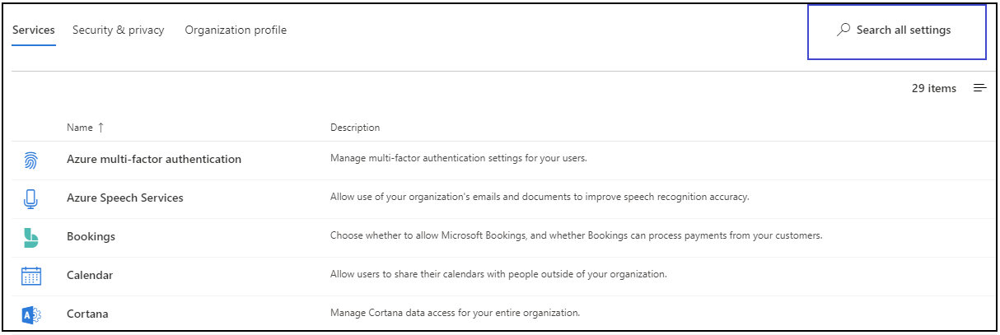
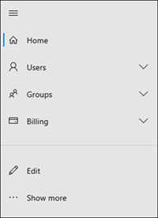
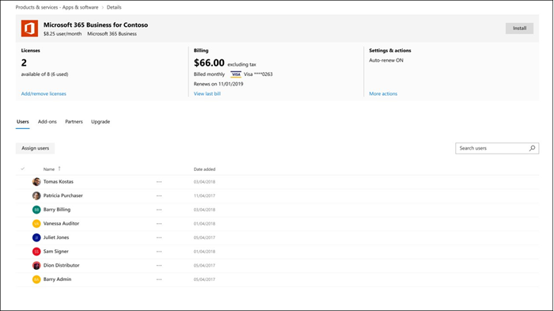

# Nieuwe nieuws in het Microsoft 365-beheercentrumWhat's new in the Microsoft 365 admin center

We voegen voortdurend nieuwe functies toe aan [het Microsoft 365-beheercentrum,](microsoft-365-admin-center-preview.md)oplossen van problemen waarover we meer te weten komen en wijzigingen aanbrengen op basis van uw feedback.We're continuously adding new features to [the Microsoft 365 admin center](microsoft-365-admin-center-preview.md), fixing issues we learn about, and making changes based on your feedback. Neem hieronder een kijkje om te zien wat er vandaag voor u beschikbaar is.Take a look below to see what's available for you today. Sommige functies worden op verschillende snelheden uitgerold naar onze klanten.Some features get rolled out at different speeds to our customers. Als u nog geen functie ziet, [probeert u uzelf toe te voegen aan gerichte release.](manage/release-options-in-office-365.md)If you aren't seeing a feature yet, [try adding yourself to targeted release](manage/release-options-in-office-365.md).

> [!IMPORTANT]
> **"Klassieke" admin center pensioen vanaf maart****"Classic" admin center retirement starting in March**  
Wanneer u zich aanmeldt bij admin.microsoft.com, gaat u nu elke keer naar het nieuwe beheercentrum.When you sign-in to admin.microsoft.com, you'll now go to the new admin center every time. En in maart zullen we beginnen met het uitschakelen van de mogelijkheid om terug te schakelen naar de klassieke admin center.And in March, we will start disabling the ability to switch back to the classic admin center. Voor nu u nog steeds terug schakelen, maar als het nieuwe beheercentrum tot pariteit komt (en het overschrijdt) zullen we de schakelaar voor alle organisaties uitschakelen.For now, you can still switch back, but as the new admin center comes to parity (and exceeds it) we will turn off the switch for all organizations.    *Laatst bijgewerkt: 2 maart 2020**Last updated: March 2, 2020*

En als je geïnteresseerd bent in wat er nieuw is in andere beheercentra:And if you're interested in what's new in other admin centers:

- [Nieuwe nieuwe artikelen in het Microsoft 365-compliancecenterWhat's new in the Microsoft 365 compliance center](https://docs.microsoft.com/Office365/SecurityCompliance/whats-new)
- [Nieuwe informatie in het SharePoint-beheercentrumWhat's new in the SharePoint admin center](https://docs.microsoft.com/sharepoint/what-s-new-in-admin-center)

## Februari 2020February 2020

### Aanbevolen feedbackoplossing: switcher voor meerdere organisatiesFeatured Feedback Fix: Multi-organization switcher

We kregen veel feedback van partners en beheerders over de uitdagingen van het beheren van meerdere Microsoft-cloudorganisaties.We received a lot of feedback from partners and admins about the challenges of managing multiple Microsoft cloud orgs. Een van onze eerste multi-org management functies is de **Organization switcher**, waarmee u wisselen tussen de orgs die u beheert in slechts 2 klikken.One of our first multi-org management features is the **Organization switcher**, which lets you change between the orgs that you manage in just 2 clicks.
> [!TIP]
> U hoeft niets te doen om de organisatieswitcher te laten verschijnen zolang u de partner van record bent voor ten minste één organisatie.You don't have to do anything to make the organization switcher appear as long as you are the Partner of record for at least one organization.

1. Selecteer in het Microsoft 365-beheercentrum de naam van de organisatie.In the Microsoft 365 admin center, select the org name.

2. Selecteer in de organisatieswitcher de organisatie die u wilt beheren.In the organization switcher, select the org you want to manage.

Dat is het letterlijk!!!That's literally it!!!

### GroepenGroups

Een paar veranderingen in de groepen gebied deze maand:A couple of changes in the groups area this month:

- **Sorteren op groepsnaam**: U de lijst met groepen alfabetisch sorteren door de kolom **Groepsnaam** te selecteren.**Sort by group name**: You can sort the groups list alphabetically, by selecting the **Group name** column.
- **Verwijderde Office 365-groepen herstellen:** u hoeft niet meer naar het Exchange-beheercentrum te gaan om verwijderde Office 365-groepen te herstellen.**Restore deleted Office 365 groups**: You don't have to go to the Exchange admin center anymore to restore  deleted Office 365 groups. Ga naar **Microsoft 365-beheercentrumgroepen** \> **Groups** \> **Verwijderde groepen** \> (selecteer \> een groep in de lijst) **Groep Herstellen**.Go to **Microsoft 365 admin center** \> **Groups** \> **Deleted groups** \> (select a group from the list) \> **Restore group**. Hiermee wordt de groep teruggezet naar de lijst **Groepen** en wordt de e-mail, gesprekken, notitieblokken en agenda van de groep hersteld.It'll restore the group back to the **Groups** list and restore the group's email, conversations, notebook, files, and calendar.

### Video's, training en documentenVideos, training, and docs

- **Nieuw in Microsoft 365-videoreeksen:** Deze maand richten we ons op aangepaste zoekmogelijkheden voor SharePoint Online, de Office-beheerfunctie 'Wat is er nieuw' waarmee u specifieke functies voor eindgebruikers weergeven of verbergen via het in-app helpvenster, de nieuwste beveiligings- en nalevingsupdates in Yammer en meer.**What's new in Microsoft 365 video series**: This month, we're focused on custom search capabilities for SharePoint Online, the Office "What's New" management feature that lets you show or hide specific features from end-users via the in-app help pane, the latest security and compliance updates in Yammer, and more. Hier is de nieuwste aflevering: [Wat is er nieuw in Microsoft 365](https://go.microsoft.com/fwlink/p/?linkid=2118096)Here's the latest episode: [What's New in Microsoft 365](https://go.microsoft.com/fwlink/p/?linkid=2118096)

- **Documenten verplaatsen**: We hebben de webartikelen van Office 365-beheerders gecombineerd met de Microsoft 365-inhoud en u hebt de nieuwe URL mogelijk opgemerkt.**Docs move**: We combined the Office 365 admin web articles with the Microsoft 365 content and you might've noticed the new URL. Dit artikel werd bijvoorbeeld gehost op: **docs.microsoft.com/Office365/Admin/whats-new-in-preview**, maar de URL is nu: **docs.microsoft.com/microsoft-365/admin/whats-new-in-preview**.For example, this article used to be hosted at: **docs.microsoft.com/Office365/Admin/whats-new-in-preview**, but the URL is now: **docs.microsoft.com/microsoft-365/admin/whats-new-in-preview**. Als u pagina's met bladwijzers hebt gemaakt, moet u uw koppelingen bijwerken. inhoudskoppelingen worden echter doorgestuurd naar de nieuwe inhoudsrepo.If you've bookmarked pages, you should update your links; however, content links will be redirected to the new content repo.

## Januari 2020 - Gelukkig NieuwjaarJanuary 2020 - Happy New Year

> [!NOTE]
> Wist u dat er een [What's New in Microsoft 365](https://go.microsoft.com/fwlink/p/?linkid=2118096) video-serie op YouTube?Did you know that there's a [What's New in Microsoft 365](https://go.microsoft.com/fwlink/p/?linkid=2118096) video series on YouTube? Het belicht de nieuwste functies die we hebben uitgerold naar gebruikers.It highlights the latest features that we've rolled out to users. Elke maand beginnen we te linken naar de nieuwste aflevering in de sectie [Video's, training en documenten.](#videos-training-and-docs)Every month, we'll start linking to the latest episode in the [Videos, training, and docs](#videos-training-and-docs) section.     Hier is de nieuwste aflevering: [Wat is er nieuw in Microsoft 365](https://go.microsoft.com/fwlink/p/?linkid=2118096)Here's the latest episode: [What's New in Microsoft 365](https://go.microsoft.com/fwlink/p/?linkid=2118096)

### Donkere modusDark mode

Toen we de donkere modus voor het eerst uitrolden, was deze alleen beschikbaar op de startpagina.When we first rolled out dark mode, it was only available on the Home page. De donkere modus is nu uit de preview en is in Targeted release over de meeste pagina's in het beheercentrum.Dark mode is now out of preview and is in Targeted release across most pages in the admin center.

1. Eerst moet u Gerichte release inschakelen: Ga **naar** \> **Settings** \> Instellingen **Organisatieprofiel** \> **Release voorkeuren**.First, you'll need to turn on Targeted Release: Go to **Settings** \> **Settings** \> **Organization profile** \> **Release preferences**.
1. En als u de donkere modus wilt inschakelen, gaat u naar de **startpagina** en selecteert u de knop **Donkere modus.**And then to turn on dark mode, go to the **Home** page, and then select the **Dark mode** button. (Het is naast het veld **Zoeken** en dit artikel **is Wat is de nieuwe** link.)(It's next to the **Search** field and this article's **What's new** link.)
1. Voor elke pagina met een donkere modus die beschikbaar is, bevindt de knop zich boven aan de pagina, naast de schakelaar **van het nieuwe beheercentrum.**For any page that has dark mode available, the button is at the top of the page, next to **The new admin center** toggle.

### Office Wat is nieuw beheerOffice What's New management

Beheerders willen controle over hoe Microsoft 'Wat is er nieuw' communiceert met hun gebruikers in de Office-apps - en u hebt nu die controle.Admins want control over how Microsoft communicates "What's New" to their users in the Office apps - and you now have that control. Ga naar **Instellingen** \> **office Wat is nieuw beheer Voorbeeld**.Go to **Settings** \> **Office What's New management Preview**. Selecteer een functie om de details te bekijken en selecteer vervolgens de knop **Verbergen van gebruikers** als u niet wilt dat uw gebruikers een bepaald bericht 'wat is nieuw' zien.Select a feature to view its details, and then you can select the **Hide from users** button if you don't want your users to see a particular "what's new" message. Uw organisatie wacht bijvoorbeeld om gebruikers op de hoogte te stellen van een functie totdat iedereen in uw organisatie erop is getraind.For example, your organization might be waiting to let users know about a feature until everyone in your org is trained on it.

Deze functie werd voor het eerst uitgebracht om te bekijken in november, maar er zijn een paar functie-updates die u moet weten over: [Office What's New management preview updates nu beschikbaar](https://techcommunity.microsoft.com/t5/microsoft-365-blog/office-what-s-new-management-preview/ba-p/1020438)This feature was first released to preview in November, but there have been a few feature updates that you should know about: [Office What's New management preview updates now available](https://techcommunity.microsoft.com/t5/microsoft-365-blog/office-what-s-new-management-preview/ba-p/1020438)

### PartnersPartners

Howdy, Partners!Howdy, Partners! (Kon het niet helpen mezelf.) We hebben deze maand ook een update voor je.(Couldn't help myself.) We've got an update for you this month, as well. Er is een nieuwe functie waarmee partners CSP-klanten de mogelijkheid kunnen bieden om hun Microsoft Customer Agreement (MCA) te accepteren in het gedeelte **Factureringsaccounts** van het beheercentrum.There's a new feature that allows Partners to give CSP customers the option to accept their Microsoft Customer Agreement (MCA) in the **Billing accounts** section of the admin center. In deze nieuwe ervaring:In this new experience:

1. De klant ontvangt een uitnodigingsmail met een link om de partnerrelatie en de MCA te accepteren.The customer receives an invitation email with a link to accept the partner relationship and the MCA.
2. Nadat de klant zich heeft aanmeldt, kunnen ze de MCA- en partnermachtigingen bekijken en accepteren - direct vanuit het beheercentrum.After the customer signs in, they can view and accept the MCA and partner permissions - right from the admin center.

### BronpostvakkenResource mailboxes

De lijst met bronpostvakken is bijgewerkt naar de nieuwe stijl.The Resource mailboxes list has been updated to the new style. Ga in het Microsoft 365-beheercentrum naar **Resources** \> **Rooms & apparatuur.**In the Microsoft 365 admin center, go to **Resources** \> **Rooms & equipment**.

### Video's, training en documenten (januari)Videos, training, and docs (January)

Bekijk de kleine bedrijven admin training die we uitgebracht in januari:Check out the small business admin training that we released in January:

- [Uw bedrijfswebsite makenCreate your business website](https://support.office.com/article/3325d50e-d131-403c-a278-7f3296fe33a9)
- [Antwoorden en hulp vindenFind answers and help](https://support.office.com/article/7f681212-c649-4a3e-a43b-32b1d1e58988)
- [Hulp of ondersteuning krijgenGet help or support](https://support.office.com/article/18948a4c-3eb1-4b30-b1bc-a4cc29eb7655)
- [Een gebruiker verwijderenDelete a user](https://support.office.com/article/6bcdad7b-732a-4260-997a-8c176bc3d9d6)
- [Een Microsoft-abonnement kiezenChoose a Microsoft subscription](https://support.office.com/article/b9f7c78e-430f-4117-89ec-2eeb1dced2ca)
- [Overzicht van microsoft 365 Business-beveiligingOverview of Microsoft 365 Business security](https://support.office.com/article/3274b159-a825-46d7-9421-7d6e209389d1)

## November en december 2019November and December 2019

We combineren het nieuws van november en december, want na Ignite hadden we weinig aankondigingen te doen.We're combining November's and December's news because after Ignite we had very few announcements to make. Tot ziens in het nieuwe jaar!See you in the new year!

### Wijzigen van creditcard naar factuurbetalingChange from credit card to invoice payment

We zijn begonnen met het uitrollen van de mogelijkheid om uw betalingsmethode te wijzigen van creditcard naar factuur.We've starting to roll out the ability to change your payment method from credit card to an invoice. Ga naar\> **Factureringsproducten** **& services,** selecteer een abonnement en selecteer vervolgens de koppeling **Bewerken** naast de creditcardbetaling.Go to **Billing**\> **Products & services**, select a subscription, and then select the **Edit** link next to the credit card payment.

Wilt u er meer over lezen?Want to read more about it? [Overstappen van creditcard of bankrekening naar factuurChange from credit card or bank account to invoice](../commerce/billing-and-payments/change-payment-method.md#change-from-credit-card-or-bank-account-to-invoice)

### Algemene lezerGlobal reader

We noemden de Wereldwijde lezersrol in de [Ignite Edition van oktober 2019](#october-2019---ignite-edition), maar als het breder uitrolt, laten we een aantal details bespreken:We mentioned the Global reader role in the [October 2019 - Ignite Edition](#october-2019---ignite-edition), but as it’s rolling out more broadly, let’s discuss some details:

- De rol van globale lezer is de alleen-lezen tegenhanger van de globale adminrol.The Global reader role is the read-only counterpart to the Global admin role. De globale lezer kan alles zien dat de globale admin toestemming heeft om te doen.The Global reader can see everything that the Global admin has permission to do.
- Op een paar uitzonderingen na, zoals sommige nalevings- en beveiligingsfuncties, hebben wereldwijde lezers toegang tot alle Microsoft-cloudbeheercentra waarvoor uw organisatie een licentie heeft om te gebruiken.With a few exceptions, like some compliance and security features, Global readers have access to view all of the Microsoft cloud admin centers that your org is licensed to use.
- Wijs de rol van de globale lezer toe aan gebruikers die deze nodig hebben voor planning, audits en onderzoeken.Assign the Global reader role to users who need it for planning, audits, and investigations.
- U de rol van de globale lezer ook combineren met een andere rol met minder machtigingen.You can also combine the global reader role with another role that has fewer permissions. Een eigenaar van een klein bedrijf kan bijvoorbeeld de functies **van Factureringsbeheerder** + **Global reader** toegewezen krijgen, zodat hij of zij de facturen kan betalen en op de hoogte kan blijven van wijzigingen in hun cloudorganisatie.For example, a small business owner might be assigned the **Billing admin** + **Global reader** roles so that they can pay the bills and stay on top of changes to their cloud organization.
- Wereldwijde lezers kunnen naar elke pagina in het Microsoft 365-beheercentrum gaan.Global readers can go to any page in the Microsoft 365 admin center. Wanneer ze een bewerkbare pagina openen, wordt er bovenaan een waarschuwing weergegeven waarin staat dat ze geen toestemming hebben om wijzigingen op te slaan en wordt de knop Opslaan uitgeschakeld.When they open an editable page,  there will be a warning at the top telling them that they don't have permission to save changes, and the save button will be disabled.

We ontvangen graag uw feedback over de wereldwijde lezersrol en een van de op rollen gebaseerde machtigingen die u in de toekomst wilt zien.We’d love to get your feedback about the global reader role and any of the role-based permissions that you’d like to see in the future. [Feedback geven voor op rollen gebaseerde machtigingenGive feedback for role-based permissions](https://office365.uservoice.com/forums/273493-office-365-admin/suggestions/10115430-have-a-consistent-experience-when-assigning-admin)

### Pagina Nieuwe instellingenNew Settings page

Het **organisatieprofiel,** **beveiliging & privacy**en & **invoegpagina's** van Services zijn gecombineerd tot één pagina met 3 verticale tabbladen.The **Organization profile**, **Security & privacy**, and **Services & add-ins** pages have all been combined into one page with 3 vertical tabs. En het beste deel - vanaf één locatie u nu zoeken naar alle instellingen.And the best part -- from one single location, you can now search for all settings.

### Training & DocsTraining & Docs

Deze sectie is een nieuwe functie van dit artikel, waar we zullen beginnen met het koppelen aan nieuwe training en documentatie die we denken dat je interessant zult vinden.This section is a new feature of this article, where we'll start linking to new training and documentation that we think you will find interesting.

In november hebben we een flink aantal leertrajecten naar [de Microsoft Learn-website](https://docs.microsoft.com/learn/) uitgebracht om IT-professionals te helpen meer te weten te komen over en getraind te worden op Microsoft 365.In November, we released quite a few learning paths to [Microsoft Learn](https://docs.microsoft.com/learn/) website to help IT pros learn about and get trained on Microsoft 365. Bekijk ze eens:Check them out:

- [Microsoft 365 fundamentalsMicrosoft 365 fundamentals](https://docs.microsoft.com/learn/paths/m365-fundamentals/)
- [Office-fundamenten uitbreidenExtend Office fundamentals](https://docs.microsoft.com/learn/paths/extend-office-fundamentals/)
- [Microsoft 365 - Uw bedrijfsimplementatie moderniseren met Windows 10 en Office 365 ProPlusMicrosoft 365 - Modernize your enterprise deployment with Windows 10 and Office 365 ProPlus](https://docs.microsoft.com/learn/paths/m365-getmodern/)
- [Uw bedrijfsimplementatie beheren met Microsoft 365Manage your enterprise deployment with Microsoft 365](https://docs.microsoft.com/learn/paths/manage-enterprise-deployment-m365/)
- [Microsoft Office voor IT op schaal upgradenUpgrade Microsoft Office for IT at scale](https://docs.microsoft.com/learn/paths/m365-office-for-it/)
- [Externe bureaubladen en apps leveren vanuit Azure met Windows Virtual DesktopDeliver remote desktops and apps from Azure with Windows Virtual Desktop ](https://docs.microsoft.com/learn/paths/m365-wvd/)
- [Moderniseer uw werkplek met Microsoft 365 en Surface for BusinessModernize your workplace with Microsoft 365 and Surface for Business](https://docs.microsoft.com/learn/paths/modernize-workplace-with-m365-and-surface/)
- [Identiteit en toegang beveiligen met Microsoft 365Protect identity and access with Microsoft 365](https://docs.microsoft.com/learn/paths/m365-identity/)
- [Bedrijfsinformatie beveiligen met Microsoft 365Protect enterprise information with Microsoft 365](https://docs.microsoft.com/learn/paths/m365-information-protection/)
- [Beveiliging beheren met Microsoft 365Manage security with Microsoft 365](https://docs.microsoft.com/learn/paths/m365-security-management/)
- [Verdedigen tegen bedreigingen met Microsoft 365 en Microsoft bedreigingsbeveiligingDefend against threats with Microsoft 365 and Microsoft threat protection](https://docs.microsoft.com/learn/paths/m365-security-threat-protection/)
- [Teamsamenwerking met Microsoft Teams beherenManage team collaboration with Microsoft Teams](https://docs.microsoft.com/learn/paths/m365-manage-team-collaboration/)
- [Samenwerken met SharePoint in Microsoft 365Collaborate with SharePoint in Microsoft 365](https://docs.microsoft.com/learn/paths/m365-teams-sharepoint/)

## Oktober 2019 - Ignite EditionOctober 2019 - Ignite Edition

Welkom bij de Ignite Edition van de Nieuwe In het Microsoft 365-beheercentrum!Welcome to the Ignite Edition of the What's new in the Microsoft 365 admin center! Natuurlijk, dit is niet een volledige lijst van aankondigingen, maar hier zijn een paar hoogtepunten.Of course, this isn't a complete list of announcements, but here are a few highlights. Bekijk ook de Ignite blogs voor meer geweldige informatie over releases:Also, check out the Ignite blogs for more great info about releases:

- [ADMIN - Beveiligings-, productiviteits- en netwerkverbeteringen voor Microsoft 365](https://techcommunity.microsoft.com/t5/Microsoft-365-Blog/ADMIN-Security-Productivity-and-Network-Enhancements-for/ba-p/964019).[ADMIN - Security, Productivity, and Network Enhancements for Microsoft 365](https://techcommunity.microsoft.com/t5/Microsoft-365-Blog/ADMIN-Security-Productivity-and-Network-Enhancements-for/ba-p/964019).
- [Nieuw in Microsoft Teams - Ignite 2020](https://techcommunity.microsoft.com/t5/Microsoft-Teams-Blog/What-s-New-in-Microsoft-Teams-Ignite-2019/ba-p/937025).[What's New in Microsoft Teams - Ignite 2020](https://techcommunity.microsoft.com/t5/Microsoft-Teams-Blog/What-s-New-in-Microsoft-Teams-Ignite-2019/ba-p/937025).

### Op rollen gebaseerd toegangscontroleRole-based access control

Er zijn veel veranderingen voor rollen in het beheercentrum sinds we begonnen met de uitrol in juni:There have been a lot of changes for Roles in the admin center since we started rolling out in June:

- **Rollen vergelijken** - Selecteer maximaal 3 rollen om de machtigingen voor elke rollen te vergelijken.**Compare roles** - Select up to 3 roles to compare the permissions for each one. Dit zal u helpen bij het vinden van de minst tolerante rol toe te wijzen aan gebruikers.This will help you find the least permissive role to assign to users. Ga naar **Rollen,** gebruik het selectievakje Multi-select in de eerste kolom om maximaal 3 rollen te kiezen en selecteer **Rollen vergelijken**.Go to **Roles**, use the multi-select checkbox in the first column to choose up to 3 roles, and then select **Compare roles**.

    

- **Favorieten** : u een ster toevoegen aan uw favoriete of meest gebruikte rollen, zodat u deze gemakkelijk vinden door de kolom te sorteren of een filter te maken.**Favorites** - You can add a star to your favorite or most-used roles, so that you can easily find them by sorting the column or creating a filter.
- **Actieve gebruikers** > **Rollen beheren** - Dit is bijgewerkt om af te stemmen op de wijzigingen in rollen.**Active users** > **Manage roles** - This has been updated to align with the changes in Roles. Net als bij de lijst Rollen hebben we de standaardlijst met rollen zo goed mogelijk ingedeeld, maar u alle rollen bekijken door **Alles weergeven uit te**vouwen op categorie.As with the Roles list, we've scoped the default list of roles to the most useful, but you can see all roles by expanding **Show all by category**.
- **Wereldwijde lezer rol** - Je vroeg erom!**Global reader role** - You asked for it! Je hebt het!You got it! De [wereldwijde lezersrol!](add-users/about-admin-roles.md#roles-available-in-the-microsoft-365-admin-center)The [Global reader](add-users/about-admin-roles.md#roles-available-in-the-microsoft-365-admin-center) role!

### Een probleem meldenReport an issue

De servicestatus is bijgewerkt naar de nieuwe stijl en als u wordt beïnvloed door een probleem dat niet wordt weergegeven op uw dashboard voor servicestatus, u **een probleem melden** om Microsoft op de hoogte te stellen.Service health has been updated to the new style and if you are impacted by an issue that is not showing up on your Service health dashboard, you can **Report an issue** to let Microsoft know. Ga naar **health** > **service gezondheid**.Go to **Health** > **Service health**.

### "Virale" abonnementen"Viral" subscriptions

Zoals u weet, kunnen gebruikers gratis abonnementen op een groot aantal producten zoals Power BI en App Connect inschakelen.As you know, users can turn on free subscriptions to a myriad of products like Power BI and App Connect. U nu de virale abonnementen zien die uw gebruikers hebben geprobeerd.You can now see the "viral subscriptions" that your users have been trying. Ga naar **Services voor factureringsproducten** > **&**.Go to **Billing** > **Products & services**. Selecteer het filter **Accounttype** op het tabblad Abonnementen om de door de gebruiker gekochte abonnementen weer te geven.Select the **Account type** filter on the subscriptions tab to see the user-purchased subscriptions. Indien nodig u deze abonnementen nu uit uw account verwijderen.If needed, you now have the ability to remove these subscriptions from your account.

### GebruikerssjablonenUser templates

Met sjablonen u eenvoudig veel gebruikers toevoegen door de gedeelde instellingen voor deze gebruikers op te slaan en opnieuw te gebruiken.Templates allow you to easily add many users by saving and reusing the shared settings for these users. U waarden opslaan voor rollen, toegewezen licenties, contactgegevens, locatie en meer.You can save values for roles, licenses assigned, contact information, location, and more. Wanneer u de sjabloon gebruikt om een nieuwe gebruiker te maken, krijgt deze automatisch de opgeslagen waarde voor deze instellingen.When you use the template to create a new user, they will automatically get the saved value for these settings. Ga naar **Gebruikers** > **actieve gebruikers**en selecteer Vervolgens **Gebruikerssjablonen** om het uit te proberen.Go to **Users** > **Active users**, and then select **User templates** to try it out.

### Office -beheer 'Nieuw' (Voorbeeld)Office "What's New" management (Preview)

Wanneer een belangrijke Office-functie wordt uitgebracht in een Office-app, krijgen gebruikers een 'Wat is er nieuw'-kaart om meer te weten te komen over de nieuwe functie.When an important ‎Office‎ feature is released to an Office app, users will get a "What's new" card to learn about the new feature. Als u niet wilt dat gebruikers de kaart zien, u deze verbergen.If you don't want users to see the card, you can hide it. U ook kiezen wanneer u wilt dat gebruikers de kaart zien door deze weer te geven.You can also choose when you'd like users to see the card by showing it. Ga naar **Instellingen** > **Office Wat is nieuw beheer** om het te controleren.Go to **Settings** > **Office What's New management** to check it out.

### SharePoint-URL-wijzigingSharePoint URL change

Technisch gezien is dit niet het nieuws van het Microsoft 365-beheercentrum om te vertellen, maar we zijn zo opgewonden dat we ervoor wilden zorgen dat je dit nieuws ziet:Technically, this isn't the Microsoft 365 admin center's news to tell, but we're so excited we wanted to make sure you see this news:
> [!IMPORTANT]
> U nu naar uw SharePoint-beheercentrum gaan met een normale URL:[https://admin.microsoft.com/SharePoint](https://admin.microsoft.com/SharePoint)You can now get to YOUR SharePoint admin center with a regular URL: [https://admin.microsoft.com/SharePoint](https://admin.microsoft.com/SharePoint)

Zie Nieuwe informatie [in het SharePoint-beheercentrum](https://docs.microsoft.com/sharepoint/what-s-new-in-admin-center) voor meer informatieFor more info, see [What's new in the SharePoint admin center](https://docs.microsoft.com/sharepoint/what-s-new-in-admin-center)

## September 2019September 2019

We zijn opzoek naar een aantal spannende feature releases op Ignite 2019, dus we kondigen slechts een paar nieuwe functies aan die in september zijn uitgebracht.We are ramping up for some exciting feature releases at Ignite 2019, so we're only announcing a few new features that were released in September. Maar stay tuned voor het artikel van volgende maand, zal het worden gepubliceerd op de eerste dag van Ignite!But stay tuned for next month's article, it'll be published on the first day of Ignite!

### Aanbevolen feedbackoplossing : de optie om het postvak van de verwijderde gebruiker om te zetten naar een gedeeld postvak is terugFeatured Feedback Fix – The option to convert the deleted user’s mailbox to a shared mailbox is back

We hoorden uw feedback luid en duidelijk en we brachten de mogelijkheid om iemand anders toegang te geven tot het postvak van een verwijderde gebruiker door het te converteren naar een **gedeelde mailbox.**We heard your feedback loud and clear and we brought back the ability to give someone else access to a deleted user’s mailbox by converting it to a **shared mailbox**. Als u dit terugvoegt aan de wizard Gebruiker verwijderen, u bepalen wat u met de gegevens wilt doen:Adding this back to the delete user wizard lets you decide what to do with the data:

- E-mail: Geef iemand anders toegang tot het postvak van de verwijderde gebruiker door het te converteren naar een gedeeld postvak.Email: Give someone else access to the deleted user's mailbox by converting it to a shared mailbox.
- Bestanden: sla hun OneDrive-bestanden op en geef iemand anders toegang.Files: Save their OneDrive files and give someone else access.
- Machtigingen: Verwijder machtigingen als anderen toegang hadden tot dit postvak.Permissions: Remove permissions if others had access to this mailbox.
- Aliassen: Verwijder e-mailaliassen zodat ze meteen voor een andere gebruiker kunnen worden gebruikt.Aliases: Remove email aliases so they are available to use for another user right away.

### Initiële installatieInitial setup

Er is een update geweest voor een andere van onze eerste setup wizards: Microsoft 365 voor bedrijven.There's been an update to another of our initial setup wizards: Microsoft 365 for business. De stappen zijn gestroomlijnd en we hebben twee van de set-uptaken verplaatst naar de pagina Setup:The steps have been streamlined and we've moved two of the set up tasks into the Setup page:

- **Beveilig Windows 10-computers** - stel beleid in om uw Windows 10-apparaten beter te beschermen tegen virussen, malware en aanvallen door hackers.**Secure Windows 10 computers** - set up policies to better protect your Windows 10 devices from viruses, malware, and attacks by hackers.
- **Office automatisch installeren** - Wanneer u dit inschakelt en gebruikers hun pc's hebben aangesloten op Microsoft 365 Business, worden hun computers automatisch bijgewerkt naar de nieuwste Office-apps en blijven ze up-to-date.**Automatically install Office** - When you turn this on and users have connected their PCs to Microsoft 365 Business, their computers will automatically update to the latest Office apps - and stay up to date.

## Augustus 2019August 2019

### FactureringBilling

We hebben deze maand een aantal updates voor facturering en abonnementen:We've got some updates for billing and subscriptions this month:

- Abonnementen op apparaat: u **Office 365 ProPlus for Education -licenties (apparaat)** toewijzen of niet toewijzen aan apparaten in het Microsoft 365-beheercentrum.Device-based subscriptions: You can assign or unassign **Office 365 ProPlus for Education (device)** licenses to devices in the Microsoft 365 admin center. **Office 365 ProPlus for Education (apparaat)** is een add-on licentie waarmee u een licentie toewijzen aan een apparaat.**Office 365 ProPlus for Education (device)** is an add-on license that will lets you to assign a license to a device. Ga naar > **Factureringsproducten & services** om de licentie te vinden en te kopen. **Billing**Go to **Billing** > **Products & services** to find and purchase the license.
- Licentiebeheer op basis van gebruikers: we hebben de manier bijgewerkt waarop u licenties toewijst in **Gebruikers** > **actieve gebruikers** aan de nieuwe stijl.User-based license management: We've updated how you assign licenses in **Users** > **Active users** to the new style. Zie voor meer informatie:For more information, see:
  - [Licenties toewijzen aan gebruikersAssign licenses to users](manage/assign-licenses-to-users.md)
  - [Licenties van gebruikers verwijderenUnassign licenses from users](manage/remove-licenses-from-users.md)

### Updates van de installatiepaginaSetup page updates

Setup heeft nu categorieën en secties, waaronder een **aanbevolen sectie voor u,** waarin we op intelligente wijze uw volgende stap voorstellen bij het inschakelen van functies en het instellen van uw organisatie.Setup now has categories and sections, including a **Recommended for you** section where we intelligently suggest your next step in turning on features and setting up your organization. We hebben ook een nieuwe functie toegevoegd om in te stellen:We've also added a new feature to set up:

- **Office Advanced Threat Protection** - Als uw organisatie een licentie heeft om Office ATP te gebruiken en u deze nog niet hebt geconfigureerd of ingeschakeld, ziet u deze pagina.**Office Advanced Threat Protection** - If your org is licensed to use Office ATP and you haven't configured it or turned it on yet, you'll see this page. Ga naar **Setup** om het uit te proberen.Go to **Setup** to try it out.

### Een probleem melden (augustus)Report an issue (August)

Als u wordt beïnvloed door een probleem dat niet wordt weergegeven op uw dashboard voor servicestatus, biedt de functie **Een probleem melden** u een snelle en eenvoudige manier om ons dit te laten weten.If you are impacted by an issue that is not showing up on your Service health dashboard, the **Report an issue** feature will provide you with a quick and easy way to let us know. Ga naar **health** > **service gezondheid**.Go to **Health** > **Service health**.

## Juli 2019July 2019

### BerichtencentrumMessage center

Het Message center is bijgewerkt naar het nieuwe ontwerp en het ziet er geweldig uit!The Message center has been updated to the new design and it looks amazing!

- U **berichten**nu bekijken op status.You can now view **Messages by status**. Selecteer een van de tabbladen: **Alle actieve berichten,** **Hoog belang,** **Ongelezen berichten**en Ontslagen **berichten**.Just select one of the tabs: **All active messages**, **High importance**, **Unread messages**, and **Dismissed messages**.
- U ook filteren op categorie **Gegevensprivacy,** **Plannen voor wijziging,** **Problemen voorkomen of oplossen**en Geïnformeerde berichtcategorieën **behouden.**You can also filter by category **Data privacy**, **Plan for change**, **Prevent or fix issues**, and **Stay informed** message categories.
- Selecteer een bericht in de lijst en u hebt een paar opties in de opdrachtbalk: **Markeren,** **markeren als gelezen** of markeren **als ongelezen**of **Delen**.Select a message from the list and you have a few options in the command bar: **Dismiss**, **Mark as read** or **Mark as unread**, or **Share**.
- En wanneer u een bericht opent, hebt u nog meer opties:And when you open a message, you have even more options:
  - Kopieer een koppeling van het bericht naar uw klembord om het op te slaan voor later of om het te delen met collega's.Copy a link of the message to your clipboard to save it for later or to share it with colleagues.
  - Berichten markeren als **Gelezen** of **Ongelezen**.Mark messages as **Read** or **Unread**.
  - Feedback geven over een bericht door **Vind ik leuk** of afkeer **te**selecteren , er wordt een feedbackvenster geopend waarin u wordt gevraagd specifieke feedback te geven over wat u wel of niet leuk vond aan dit bericht.Give feedback about a message by selecting **Like** or **Dislike**, a feedback pane opens asking you to provide specific feedback on what you liked or didn't like about this message.

### NavigatievensterintelligentieNavigation pane intelligence

 Het navigatiedeelvenster onthoudt nu uw laatste acties en toont u het deelvenster in de laatste staat waarin u het hebt achtergelaten.The navigation pane now remembers your last actions and shows you the pane in the last state that you left it in. Het maakt ook veelgebruikte items standaard zichtbaar.It will also make frequently used items visible by default.

### Eerste installatie & de pagina SetupInitial setup & the Setup page

We hebben een aantal spannende wijzigingen om u te helpen uw organisatie in te richten.We've got some exciting changes to help you get your organization set up. Ten eerste, laten we bespreken het verschil tussen **setup** en de **setup pagina**.First off, let's discuss the difference between **setup** and the **Setup page**. **Setup** verwijst naar de eerste installatiewizard die u gewend was aan boord te nemen van de online services van Microsoft.**Setup** refers to the initial setup wizard that you used to onboard to Microsoft's online services. Dat omvat meestal drie specifieke stappen: **Maak een domein**verbinden, Gebruikers **toevoegen**en **de Office-apps downloaden**.That usually includes three specific steps: **Connect a domain**, **Add users**, and **Download the Office apps**. De **pagina Setup** is de pagina in het beheercentrum waarin taken zijn ingesteld om ervoor te zorgen dat u het meeste uit uw abonnementen haalt, zoals het inschakelen van functies waarvoor u licenties hebt gekocht.The **Setup page** is the page in the admin center that has recommended set up tasks to ensure that you're getting the most out of your subscriptions - like turning on features you've purchased licenses for.

- **Setup** - De wizard Eerste instelling is bijgewerkt voor **Office 365 voor** Bedrijven-abonnementen.**Setup** - The initial setup wizard has been updated for **Office 365 for Business** subscriptions. Dit nieuwe ontwerp zal nieuwe organisaties helpen sneller en met meer succes door de wizard te komen.This new design will help new organizations get through the wizard faster and with greater success.
- **Installatiepagina** - Met de pagina **Setup** u de services die bij uw abonnementen worden geleverd, voltooien en beveiligen.**Setup page** - The **Setup** page helps you finish setting up and securing the services that come with your subscriptions. U ook afgewezen aanbevelingen zien op de **pagina Setup.**You can also see any dismissed recommendations on the **Setup** page. Ga naar het **Microsoft 365-beheercentrum** > **Setup**om te zien of deze nog beschikbaar is voor uw abonnementen.To see if it's available for your subscriptions yet, go to the **Microsoft 365 admin center** > **Setup**.

### Facturering& abonnementenBilling & subscriptions

- **Softwareproducttype** - U nu softwareproducten bekijken die zijn gekocht via een Cloud Service Provider (CSP).**Software** product type - You can now view software products purchased through a Cloud Service Provider (CSP). Als u uw downloads en sleutels wilt bekijken, gaat u naar het tabblad >  **Factureringsproducten** > **& services\*\*\*\*Software.**To see your downloads and keys, go to **Billing** > **Products & services** > **Software** tab.
- U moderne Azure-producten en -services bekijken vanuit het Microsoft 365-beheercentrum, of u ze nu hebt gekocht bij Microsoft of een externe provider.You can view Modern Azure products and services from the Microsoft 365 admin center, whether you purchased them from Microsoft or a third-party provider. Voorbeelden van moderne Azure-producten zijn:Examples of Modern Azure products included:
  - Azure Gereserveerde virtuele exemplarenAzure Reserved Virtual Instances
  - Azure-ondersteuningsplannenAzure Support Plans
  - Azure Hybrid Use Benefits (AHUB)Azure Hybrid Use Benefits (AHUB)
  - Toepassingen beherenManage Applications
  - ApparaatservicesDevice Services
  - Azure-abonnementenAzure Subscriptions

### Multi-factor authenticatie vereenvoudigenSimplify multi-factor authentication

Beheerders hebben toegang tot gevoelige informatie in uw organisatie.Admins have access to sensitive information in your organization. Vereisen dat alle beheerders multi-factor authenticatie gebruiken bij het aanmelden.Require all admins to use multi-factor authentication when signing in. De nieuwe wizard helpt je om het gedaan te krijgen met slechts een stap.The new wizard helps you get it done with just one step. Als u het wilt uitproberen, gaat u naar **De** > **aanmeldingsbeveiliging van Setup versterken**.To try it out, go to **Setup** > **Strengthen sign-in security**.

### GebruikersUsers

De **pagina's Verwijderde gebruikers** en **gastgebruikers** zijn bijgewerkt naar de nieuwe stijl.The **Deleted users** and **Guest users** pages were updated to the new style.

- **Gastgebruikers**: U voegt gastgebruikers toe door hen uit te nodigen om bestanden van SharePoint of OneDrive te bekijken of te delen.**Guest users**: You add guest users by inviting them to view or share files from SharePoint or OneDrive. U gastgebruikers van **gebruikers** > **gastgebruikers**bekijken.You can view guest users from **Users** > **Guest users**.
- **Verwijderde gebruikers**: Op de bijgewerkte pagina **Verwijderde gebruikers** u alle acties uitvoeren die u in het oudere beheercentrum uitvoeren, maar nu kolommen toevoegen en verwijderen.**Deleted users**: On the updated **Deleted users** page, you can do all the actions that you could in the older admin center, but now you add and remove columns. En we hebben een heleboel kolom opties om uit te kiezen.And we have a lot of column options to choose from. In feite zijn het dezelfde kolommen die u kiezen op de pagina **Actieve gebruikers.**In fact, it's the same columns that you can choose on the **Active users** page.

## Juni 2019June 2019

### Aanbevolen feedbackverzoek - Donkere modusFeatured feedback request - Dark mode

Het bekijken van het beheercentrum in de donkere modus is in preview!Viewing the admin center in dark mode is in preview! U het nu alleen op de **startpagina** testen.You can test it out on the **Home** page only right now. Op de **startpagina** bevindt de knop **Donkere modus** zich in de opdrachtbalk naast de koppeling Wat is **er nieuw.**On the **Home** page, the **Dark mode** button is in the command bar next to the **What's new** link.

### RollenbeheerRoles management

Eind juni zijn we begonnen met de uitrol van nieuwe manieren om admin rollen te beheren.At the end of June we started rolling out new way to manage admin roles. Als het voor u beschikbaar is, gaat u naar **Rollen** > **rollen**.When it's available for you, go to **Roles** > **Roles**. Tot dan, neem een kijkje - het is geweldig!Until then, take a look - it's awesome!
    

Deze nieuwe ervaring maakt het gemakkelijker om te zien wie beheerdersmachtigingen heeft en om rollen toe te wijzen die het juiste niveau van toegang verlenen aan uw beheerders.This new experience makes it easier to see who has admin permissions and to assign roles that grant the right level of access to your admins. En we hebben ook meer rollen van Azure AD toegevoegd, zodat u geen tijd verspilt aan het naar meerdere beheercentra gaan.And we also added more roles from Azure AD so that you don't waste time going to multiple admin centers.
Wat kun je hier nog meer doen?What else can you do here?

- Exporteer een lijst met alle beheerders in uw organisatie aan wie Azure Active Directory-rollen in Microsoft 365 zijn toegewezen.Export a list of all admins in your org who are assigned Azure Active Directory roles in Microsoft 365.  
- Bekijk alle beheerders die aan een specifieke rol zijn toegewezen, voeg beheerders toe of verwijder deze uit een specifieke rol, zoek naar rollen op naam en trefwoord en meer informatie over wat elke rol een gebruiker kan doen.View all admins assigned to a specific role, add or remove admins from a specific role, search for roles by name and keyword, and learn more about what each role allows a user to do.
- Zoek snel naar een specifieke rol en maak filters.Quickly search for a specific role and create filters.

### BetalingsmethodePayment method

We hebben een update bijgewerkt hoe u voor uw abonnementen betaalt.We've updated how you pay for your subscriptions. Ga naar > **Factureringsfacturen &** >  **Billing\*\*\*\*betalingsmethoden**.Go to **Billing** > **Bills & payments** > **Payment methods**. U uw betalingsmethoden zien in een lijstweergave.You can see your payment methods in a list view. Selecteer een item in de lijst om het te verwijderen, te bewerken en eenvoudig te zien aan welk abonnement die betalingsmethode is gekoppeld.Select any item in the list to remove it, edit it, and easily see which subscription that payment method is associated with.

## Mei 2019May 2019

### May's featured fix - Case sensitivityMay's featured fix - Case sensitivity

Wanneer u nu zoekt naar gedeelde postvakken, contactpersonen, resources en machtigingen voor postvaks, hoeven uw zoektermen niet hoofdlettergevoelig te zijn.Now when you search for shared mailboxes, contacts, resources, and mailbox permissions, your search terms don't have to be case-sensitive.

**Gebruikers- en groepsbeheer** Deze maand hebben we **De gebruiker blokkeren**bijgewerkt , wachtwoord opnieuw **instellen,** lijstweergave **contactpersonen,** **lijstweergave Groepen** en de **pagina's Met details groepen** naar de nieuwe stijl van het beheercentrum.**User and group management** This month, we updated **Block user**, **Reset password**, **Contacts** list view, **Groups** list view, and the **Groups** details pages to the new admin center style.

- Met de nieuwe **lijstweergave Groepen** krijgt u rijkere gegevens over uw groepen en u de manier aanpassen waarop u uw gegevens ziet en wordt in de lijst met groepen wordt nagegaan hoe u uw gegevens wilt zien.With the new **Groups** list view, you get richer data about your groups, and you can customize the way you see your data -- and the groups list remembers how you want to see your data. U nu bijvoorbeeld filteren op **Groepen met Teams** om te zien of uw groepen deel uitmaken van een team en u de kolom **Teams-status** toevoegen.For example, you can now filter on **Groups with Teams** to see if your groups are part of a Team and you can add the **Teams status** column.
- De lijst met groepen brengt ook alle verbeteringen met zich mee die we hebben aangebracht in de lijstervaring in gebruikersbeheer, inclusief snelle acties en de contextuele opdrachtbalk.The groups list also brings with it all the improvements we made to the list experience in user management, including quick actions and the contextual command bar.

**Aanbevelingen****Recommendations** 
Mogelijk ziet u een nieuwe aanbeveling pop-up in uw admin center - we hebben net 4 nieuwe toegevoegd.You might see a new recommendation pop-up in your admin center - we just added 4 new ones. Natuurlijk ziet u alleen aanbevelingen als we denken dat dit uw organisatie ten goede komt.Of course, you'll only see recommendations if we think it will benefit your organization. Maar wacht niet tot we u de aanbeveling laten zien - u het toevoegen vanuit de kaartbibliotheek.But don't wait until we show you the recommendation - you can add it from the card library.

- **Wachtwoord verlopen** - We raden aan dat wachtwoorden worden ingesteld op **Nooit verlopen.****Password expiry** - We recommend that passwords get set to **Never expire**. En als uw organisatie een andere instelling heeft, ziet u misschien gewoon deze aanbeveling.And if your org has a different setting, you might just see this recommendation.
- **Te veel globale beheerders** - Omdat het hebben van te veel globale beheerders een bedreiging voor de veiligheid is, ziet u deze aanbeveling als u meer dan 4 globale beheerders hebt.**Too many global admins** - Because having too many global admins is a security threat, if you have more than 4 global admins, you'll see this recommendation. We raden gebruikers aan om gebruikers alleen de toegang te geven die ze nodig hebben om hun werk gedaan te krijgen.We suggest giving users only the access they need to get their job done.
- **Intune-apparaatbeveiliging** - Als uw licenties Intune bevatten en we detecteren dat u nog niet klaar bent met het instellen van Intune of uw apparaten hebt ingeschreven, raden we u aan een Intune-beleid te maken om de bestanden van uw organisatie te beschermen wanneer gebruikers ze openen vanaf hun mobiele apparaten.**Intune device protection** - If your licenses include Intune and we detect that you either haven't finished setting up Intune or enrolled your devices, we'll recommend that you create an Intune policy to protect your organization's files when users access them from their mobile devices.
- **Ontvang maandelijkse Office-functie-updates** - We hebben feedback gekregen van onze zeer kleine klanten dat wanneer ze maandelijkse Office-functie-updates krijgen, hun gebruikers gelukkiger zijn.**Get monthly Office feature updates** - We've gotten feedback from our very small customers that when they get monthly Office feature updates, their users are  happier. Dus als u een zeer klein bedrijf bent en u momenteel uw Office-functieupdates om de zes maanden ontvangt, ziet u deze aanbeveling.So, if you're a very small business and you're currently get your Office feature updates every six months, you'll see this recommendation.

**Instellingen****Settings**  
Zoals voor instellingen, zijn er nogal wat veranderingen.As for settings, there have been quite a few changes. Meestal, gewoon het bijwerken van de bestaande instellingen naar de nieuwe admin center stijl.Mostly, just updating the existing settings to the new admin center style. Terwijl we verder gaan en nieuwe instellingen toevoegen die je nog nooit eerder hebt gezien, zullen we ze hier gaan noemen.As we're moving forward and add new settings that you've never seen before, we'll start mentioning them here. En we hebben een hele instelling aan te kondigen: **Moderne authenticatie**.And we've got one-whole setting to announce: **Modern authentication**. Ja, er is een nieuwe instelling om **moderne verificatie**in te schakelen!Yes, there is a new setting to turn on **Modern authentication**! Ga naar **Instellingenservices** > **& invoegtoepassing** > **Moderne verificatie**om het te bekijken.To check it out, go to **Settings** > **Services & add-ins** > **Modern authentication**.

## April 2019April 2019

Dingen zijn op zoek naar geweldig voor het admin center.Things are looking great for the admin center. We hebben het lezen van uw feedback en suggesties, het beantwoorden van de meeste van hen, en echt het nemen van alles wat je te zeggen hebt ter harte.We've been reading your feedback and suggestions, answering most of them, and really taking all you have to say to heart. Natuurlijk doen we nog steeds het werk om ervoor te zorgen dat alles op peil is met het oude beheercentrum.Of course, we're still doing the work to make sure everything is up to parity with the old admin center. En vergeet niet - als we nieuwe functies uitrollen, krijg je het misschien niet meteen.And please remember - as we roll out new features, you might not get it right away.

### Aanbevolen functie - Gebruikers toevoegenFeatured feature - Add users

Voor april, we zijn met de **wizard Gebruiker toevoegen** die u door loopt ... wachten op het ... gebruikers toevoegen.For April, we're featuring the **Add user** wizard that walks you through...wait for it...adding users. Het is een stap voor stap om de basisgegevens van de gebruiker toe te voegen, zoals e-mail en weergavenaam, het toewijzen van een licentie en een rol, het toevoegen van hun contactgegevens en vervolgens het account van de gebruiker te controleren voordat u zich verbindt.It's a step-by-step to add the user's basic info like email and display name, assigning a license and a role, adding their contact information, and then reviewing the user's account before you commit. **Waarom hebben we deze verandering gemaakt?****Why did we make this change?** We hoorden uw feedback dat u niet graag de bijna oneindige scroll om gebruikers toe te voegen in de vorige ervaring.We heard your feedback that you didn't like the nearly infinite scroll to add users in the previous experience.
    

Er zijn twee manieren waarop je het bekijken:There are two ways you can check it out:  

1. Selecteer op **de** startpagina De optie Gebruiker **toevoegen** op de **gebruikersbeheerkaart.**From the **Home** page, select **Add user** from the **User management** card. De wizard wordt daar geopend, zodat u niet hoeft te navigeren vanaf het werk dat u op de **startpagina** doet.The wizard opens right there, so you don't have to navigate from any work you're doing on the **Home** page.
2. Ga naar **Gebruikers** > **Actieve gebruikers**en selecteer Gebruiker **toevoegen** op de opdrachtbalk.Go to **Users** > **Active users**, and then select **Add user** from the command bar.
  

We hebben nog een paar wijzigingen aangebracht in **gebruikersbeheer,** hier is een snelle lijst:We've made a few more changes to **user management**, here's a quick list:

- Het deelvenster **Rollen beheren** is bijgewerkt naar de nieuwe stijl en is toegankelijk.The **Manage roles** pane has been updated to the new style and is accessible. We hebben ook de **gebruiker Blokkeren** en **Gebruikersdeelvensters verwijderen** bijgewerkt naar de nieuwe stijl.We've also updated the **Block user** and **Delete user** panes to the new style.
- **Productlicenties beheren** veranderde positie in de opdrachtbalk.**Manage product licenses** changed position in the command bar.
- Het wijzigen van de foto van een gebruiker is nu eenvoudiger.Changing a user's photo is now easier. Selecteer in **Actief** een gebruiker en **wijzig vervolgens de foto** onder de afbeelding.In **Active users** select a user, and then **Change photo** under their picture.

### Maar wacht!But wait! Er is meerThere's more

- Er is een nieuwe installatiebanner op de **startpagina** die u ziet als u de ingestelde stappen nog niet hebt voltooid, zoals het toevoegen van een domein, het toevoegen van gebruikers en het downloaden van de Office-apps.There's a new setup banner on the **Home** page that you'll see if you haven't finished the set up steps, like adding a domain, adding users, and downloading the Office apps.
- De **lijst met groepen** en het detailvenster zijn bijgewerkt naar de nieuwe stijl.The **Group** list and details pane have been updated to the new style. Ga naar > **Groepengroepen** om de wijzigingen te bekijken. **Groups**Go to **Groups** > **Groups** to view the changes.
  - Over groepen gesproken, we hebben ook een **tabblad Microsoft Teams** toegevoegd aan het paginadetailsvenster voor groepen, waar u elke Office 365-groep in een team veranderen.Speaking of groups, we've also added a **Microsoft Teams** tab to the groups details pane where you can turn any Office 365 group into a Team. Als u een groep wilt 'teamificeren', selecteert u een Office 365-groep in de lijst, selecteert u het tabblad **Microsoft Teams** en maakt u **Team .**To "teamify" a group select any Office 365 group from the list, select the **Microsoft Teams** tab, and then **Create Team**. Als de groep al een team is, krijg je een koppeling om deze te beheren vanuit het **Team-beheercentrum.**If the group is already a Team, you'll get a link to manage it from the **Teams admin center**.
  - Ten slotte u de **status Teams** toevoegen aan de lijst **met groepen.**Finally, you can add the **Teams status** to the **groups** list. Selecteer in de kolomkop de optie **Kolommen selecteren** > **De status** > **Opslaan van**Teams .On the column header, select **Choose columns** > **Teams status** > **Save**.
- **Nieuwe beperkte beheerdersrollen** - We hebben een aantal nieuwe beheerdersrollen uitgebracht, zodat u gebruikers alleen de toegang geven die ze nodig hebben.**New limited admin roles** - We've release some new admin roles so that you can give users only the access they need.
  - **Kaizala-beheerder**: Gebruikers in deze rol hebben toestemming om alle beheertaken binnen Microsoft Kaizala uit te voeren, inclusief het maken en beheren van gebruikers in kaizala-directory, het beheren van Kaizala-groepen, het beheren van actiekaarten en connectoren en het maken van serviceaanvragen.**Kaizala admin**: Users in this role have permission to perform all management tasks within Microsoft Kaizala, including create and manage users in Kaizala directory, manage Kaizala groups, manage action cards and connectors, and create service requests.
  - **Zoekbeheerder**: Gebruikers in deze rol hebben volledige toegang tot alle functies voor Microsoft Search-beheer in het Microsoft 365-beheercentrum.**Search admin**: Users in this role have full access to all Microsoft Search management features in the Microsoft 365 admin center. Zoekbeheerders kunnen de rol van de zoekbeheerder en de editor search delegeren aan gebruikers en inhoud maken en beheren, zoals bladwijzers, Q-&A-items en locaties.Search admins can delegate the Search admin and Search editor roles to users, and create and manage content, like bookmarks, Q&A items, and locations. Bovendien kunnen deze gebruikers het Berichtencentrum bekijken, de servicestatus controleren en serviceaanvragen maken.Additionally, these users can view the Message center, monitor service health, and create service requests.
  - **Zoekeditor**: Gebruikers in deze rol kunnen inhoud voor Microsoft Search maken, beheren en verwijderen in het Microsoft 365-beheercentrum, inclusief bladwijzers, Q-&A-items en -locaties.**Search editor**: Users in this role can create, manage, and delete content for Microsoft Search in the Microsoft 365 admin center, including bookmarks, Q&A items, and locations.
- Er is een bonanza van **facturering** veranderingen deze maand ...There's a bonanza of **Billing** changes this month...
  - U de CVV nu bijwerken voor bestaande creditcards zonder deze te hoeven verwijderen en opnieuw toe te voegen.You can now update the CVV for existing credit cards without having to delete it and add it again. U de CVV bijwerken door naar**betalingsmethoden** **voor facturen** > te gaan.You can update the CVV by going to **Bills** > **Payment methods**.
    - We hebben het gemakkelijker gemaakt om uw **facturen** te vinden en inzicht te krijgen in eventuele factureringsproblemen die uw account mogelijk heeft.We've made it easier to locate your **Invoices** and understand any billing issues your account may be having. En nu u uw rekeningen in de webbrowser zien in plaats van de PDF te moeten downloaden.And now you can see your Bills in the web browser instead of having to download the PDF. Ga naar **facturen .** > **Invoices**Go to **Bills** > **Invoices**.
    - Op de pagina **Producten & services** voegen we uw abonnementsgegevens nu samen als u meerdere abonnementen van hetzelfde type hebt.On the **Products & services** page, we now aggregate your subscription information if you've got multiple subscriptions of the same type.

## Maart 2019 - We hebben het admin center officieel uitgebrachtMarch 2019 - We've officially released the admin center

Nou, als je het spannende nieuws gemist, hebben we officieel de release van de nieuwe en verbeterde Microsoft 365 admin center!Well, if you missed the exciting news, we've officially release the new and improved Microsoft 365 admin center! Hier is de blogpost waar we het aangekondigd: [De nieuwe Microsoft 365 admin center vandaag beschikbaar](https://techcommunity.microsoft.com/t5/Microsoft-365-Blog/The-new-Microsoft-365-admin-center-available-today/ba-p/377870).Here's the blog post where we announced it: [The new Microsoft 365 admin center available today](https://techcommunity.microsoft.com/t5/Microsoft-365-Blog/The-new-Microsoft-365-admin-center-available-today/ba-p/377870). Voor maart, zullen we vertrouwen op de blogpost voor u om te controleren of de functies vrijgegeven - plus, u ook lezen van de post voor de functies die worden vrijgegeven in de nabije toekomst, die we niet mogen doen in de kern inhoud.For March, we'll rely on the blog post for you to check out the features released - plus, you can also read the post for the features that are getting released in the near future, which we're not allowed to do in core content.
    
We hebben één wijziging in het gebied **facturering & abonnementen** die we willen vermelden.We do have one change to the **Billing & subscriptions** area that we'd like to mention. Ik bedoel, jullie dachten niet dat we er klaar mee waren om het te verbeteren, of wel?I mean, y'all didn't think we were done with improving it, did you? Omdat we dat niet zijn!Because we're not! Deze maand hebben we de mogelijkheid toegevoegd om uw partnerrelaties te beheren aan > **factureringsrekeningen.** **Billing**In fact, this month we added added the ability to manage your partner relationships to **Billing** > **Billing accounts**. Vanaf hier u uw partnerrelaties bekijken in Advisor, CSP en Indirect resellers.From here you can review your partner relationships across Advisor, CSP, and Indirect resellers. U ook nieuwe partnerrelatieaanvragen accepteren, inclusief gedelegeerde beheerdersmachtigingen.You can also accept new partner relationship requests, including delegated admin permissions.

Zoals altijd, uw feedback is belangrijk voor ons, dus houd het komen!As always, your feedback is important to us, so keep it coming! Op elke pagina in het beheercentrum u feedback geven door **rechtsonder feedback geven** te selecteren naast **Hulp nodig?**On any page in the admin center, you can give feedback by selecting **Give feedback** in the bottom-right, next to **Need help?**

## Februari 2019 - Editie facturering & abonnementenFebruary 2019 - Billing & Subscriptions Edition

Deze maand gaan we ons richten op alle verbeteringen die we hebben aangebracht in de gebieden die liefkozend worden aangeduid als "Facturering en abonnementen".This month, we're going to focus on all the improvements we've made to the areas affectionately referred to as "Billing and subscriptions". In het verleden heb je waarschijnlijk niet liefdevol naar die dingen verwezen, maar we denken dat je dat nu wel zult doen...In the past, you probably didn't refer to those things affectionately, but we think you will now...

- **Betalingsmethoden** - We hebben uw feedback gehoord dat het bijwerken van uw betalingsmethode moeilijk was en dat we er veel wijzigingen in hebben aangebracht.**Payment methods** - We heard your feedback that updating your payment method was difficult and we've made a lot of changes around it. Ga naar **Betalingsmethoden** > **facturering**.Go to **Billing** > **Payment methods**. U eenvoudig uw betaalmethoden zien, zoals uw Visa-kaart en aan welk abonnement het is gekoppeld.You can easily see your payment methods, like your Visa card, and which subscription it is associated with. Selecteer in uw lijst met betalingsmethoden het menu **Meer** (3 puntjes naast de vervaldatum) en selecteer **Abonnementen weergeven.**In your list of payment methods, select the **More** menu (3 little dots next to the expiration date), and then select **View subscriptions**. U uw betalingsmethoden ook bewerken en verwijderen via het menu **Meer.**You can also edit and delete your payment methods using the **More** menu.
- **Factureringsaccount** - Klanten met gerichte release zien eerst de nieuwe pagina met factureringsaccounts en vervolgens rollen we deze wereldwijd uit.**Billing account** - Targeted release customers will see the new Billing account page first and then we'll roll it out to world-wide. Wanneer het voor u beschikbaar is, gaat u naar > **factureringsfactureringsaccount**. **Billing**When it's available for you, go to **Billing** > **Billing account**. Wat u doen op de nieuwe rekeningpagina voor facturering?What can you do on the new billing account page? Ik ben blij dat je vroeg:I'm glad you asked:
  - Werk het adres en andere contactgegevens in uw organisatieprofiel rechtstreeks vanaf deze pagina bij.Update the address and other contact information in your organizational profile directly from this page. U hoeft niet naar **het** > profiel van**instellingenorganisatie**te gaan, tenzij u dat wilt.You don't have to go to **Settings** > **Organization profile**, unless you want to.
  - En we maken het leven gemakkelijker voor direct of volume licentie klanten, u accepteren en beoordelen van klantovereenkomsten van **Facturering rekeningen**.And we're making life easier for Direct or Volume licensing customers, you can accept and review customer agreements from **Billing accounts**. U ook verbinding maken met andere organisaties, zodat u de orgs aan elkaar koppelen om licenties en bronnen te delen.You can also connect with other orgs allowing you to link the orgs together to share licenses and resources.
- We hebben ook een paar kleinere verbeteringen en bug fixes gedaan:We've also done a few smaller enhancements and bug fixes:
  - Een abonnement opnieuw activeren met een factuurbetalingReactivate a subscription with an Invoice payment
  - Het servicegebruiksadres voor uw abonnementen bewerkenEdit the service usage address for your subscriptions
  - En op de pagina Inventarisdetails hebben we een aantal meldingen toegevoegd, we koppelen je aan de werkelijke pagina waar je het werk doen en er zijn meer acties op de kaart met voorraadgegevens.And on the Inventory details page, we've added some notification enhancements, we link you to the actual page where you can do the work, and there are more actions on the inventory details card. Ga naar > **Factuurrekeningen** > **Weergave gegevens** op een factuur. **Billing**Go to **Billing** > **Bills** > **View details** on any invoice.

## Januari 2019 - Gelukkig NieuwjaarJanuary 2019 - Happy New Year

- Nog steeds toevoegen aan **Services & invoegingen** - We hebben meer van de instellingen > Services bijgewerkt **& invoegpagina's.**Still adding in **Services & add-ins** - We've updated more of the **Settings > Services & add-ins** pages. Probeer geïntegreerde apps of rapporten om het laatste nieuws te bekijken.Try Integrated Apps or Reports to see the latest.
- **Op zoek naar verbeteringen?****Searching for improvements?** Zoek niet verder dan het vak **Zoeken** in de opdrachtbalk.Look no further than the **Search** box in the command bar. Het is bijgewerkt om u te laten zoeken naar taken.It's been updated to let you search for tasks. Probeer bijvoorbeeld 'wachtwoord reset' of 'een gebruiker toevoegen'.For example, try "password reset" or "add a user".

### Aanbevolen feedbackoplossing - Licenties en appsFeatured Feedback Fix - Licenses and apps

We hebben **licenties en apps** opnieuw gecombineerd in het deelvenster gebruikersgegevens op basis van uw feedback.We re-combined **Licenses and apps** in the user details pane based on your feedback. We scheidden in eerste instantie de twee functies om ruimte te bieden voor de details van alle licentie en alle app-mogelijkheden.We initially separated the two features to provide space for the details of all license and all app possibilities. We hoorden van u dat het scheiden van licenties en apps in twee deelvensters verwarring toevoegde.We heard from you that separating licenses and apps into two panes added confusion. We luisterden en brachten licenties en apps weer bij elkaar in één tabblad. Nu u ervoor zorgen dat een app is uitgeschakeld in alle licenties die in één deelvenster aan een gebruiker zijn toegewezen.We listened, and brought licenses and apps back together into one tab. Now you can make sure that an app is turned off in all licenses assigned to a user in one pane. Melk en koekjes.Milk and cookies. Licenties en apps.Licenses and apps. We krijgen het nu.We get it now.

Bekijk het: **gebruikers > actieve gebruikers >** gebruikers > licenties en apps bewerken of **toevoegen**Check it out: **Users > Active users > Edit** or **Add user > Licenses and Apps**

## December 2018December 2018

- **Services & add-ins** - In oktober hebben we **Instellingen** \> Services bijgewerkt **& add-ins** met onze nieuwe ontwerpstijl, maar alle instellingenpagina's waren nog in de klassieke stijl.**Services & add-ins** - In October we updated **Settings** \> **Services & add-ins** with our new design style, but all of the settings pages were still in the classic style. Deze maand zijn we begonnen met het bijwerken van de werkelijke instellingen voor het nieuwe ontwerp.This month, we've started updating the actual settings to the new design. Bekijk **Boekingen** om de nieuwe look te zien.Check out **Bookings** to see the new look.
- **Gebruikersbeheer** - Gebruikersnaam, alias, primair e-mailadres beheren.**User management** - Manage username, alias, primary email address.
- We hebben twee thuiskaarten aan de bibliotheek toegevoegd.We've added two Home cards to the library. U hun volledige beschrijvingen lezen in de bibliotheek.You can read their full descriptions in the library.
  - **Inschrijving voor intune-apparaten****Intune Device enrollment**
  - **Domeinen****Domains**
- **Aanbevelingen** : mogelijk ziet u een nieuwe aanbeveling in uw beheercentrum.**Recommendations** - You might see a new recommendation pop-up in your admin center. Natuurlijk ziet u alleen aanbevelingen als we denken dat dit uw organisatie ten goede komt.Of course, you'll only see recommendations if we think it will benefit your organization. Maar wacht niet tot we u de aanbeveling laten zien - u het toevoegen vanuit de kaartbibliotheek.But don't wait until we show you the recommendation - you can add it from the card library.
  - **Gevoelige informatie beveiligen** - We raden u aan een DLP-beleid (Data Loss Prevention) te maken om te detecteren wanneer items met gevoelige informatie worden gedeeld met mensen buiten uw organisatie.**Protect sensitive info** - We recommend creating a data loss prevention (DLP) policy to detect when items containing sensitive info are shared with people outside your organization.

## November 2018November 2018

- Het vak Zoeken is terug!The Search box is back! En we hebben het een beetje verplaatst.And we moved it slightly. Het is nog steeds aan de bovenkant van de startpagina, maar het is nu aan de rechterkant van de pagina in de buurt van de **knop Kaart toevoegen.**It's still at the top of the Home page, but it's now on the right-side of the page near the **Add card** button.   

- We hebben kaarten toegevoegd voor het dashboard.We've added cards for the dashboard. Ga gewoon naar het beheercentrum en selecteer **Kaart toevoegen** om de nieuwe kaarten te zien:Just go to the admin center and select **Add card** to see the new cards:
  - **Rapport office 365 Active-gebruikers :** Controleer het gebruik van de Office 365-services die u hebt gekocht.**Office 365 Active users report** - Monitor the usage of the Office 365 services you've purchased.
  - **Office 365-software** - Installeer of implementeer Office 365 ProPlus-software en bekijk hoeveel gelicentieerde gebruikers deze hebben geactiveerd.**Office 365 software** - Install or deploy Office 365 ProPlus software and see how many licensed users have activated it.
  - **Azure Active Directory** - Geeft u snel toegang tot veelvoorkomende Azure AD-taken zoals zelfgebruikswachtwoordresets, het aanpassen van aanmelding en het toevoegen van apps.**Azure Active Directory** - Gives you quick access to common Azure AD tasks like self-serve password resets, customizing sign-in, and adding apps.
- De snelle taak **Gebruikers exporteren** is toegevoegd aan de opdrachtbalk op de pagina Actieve gebruikers.The **Export users** quick task has been added to command bar on the Active users page. 
- Inkoopservices heeft extra verbeteringen voor november.Purchase services has additional enhancements for November. En ze zijn allemaal goed!And they are ALL good! Ga naar Services facturering > om daar te komen.To get there, go to Billing > Purchase services.  

  > 1. Boven aan de pagina u draaien tussen bedrijfs- en onderwijsplannen.At the top of the page, you can pivot between Business and Education plans. Dat zal je helpen vinden wat je zoekt.That will help you find what you're looking for.
  > 2. We hebben een zoekvak toegevoegd, zodat je niet eindeloos hoeft te scrollen om te vinden wat je zoekt.We added a search box so you don't have to scroll endlessly to find what you're looking for.
  > 3. Tot slot hebben we logisch de plannen die u kopen gesorteerd in secties die u uitbreiden en samenvouwen.Finally, we logically sorted the plans you can purchase into sections that you can expand and collapse. Hebt u geen van de **Office-apps en -services**nodig?Don't need purchase any of the **Office apps and services**? Vouw dat gedeelte samen en richt u op Microsoft 365-abonnementen.Collapse that section and focus on Microsoft 365 plans.

## Oktober 2018October 2018

- Er is een nieuwe manier om abonnementen te kopen in het Microsoft 365-beheercentrum.There's a new way to buy subscriptions in the Microsoft 365 admin center. Ga naar **Inkoopservices** om de volledig opnieuw ontworpen winkelervaring te zien die het gemakkelijk maakt om plannen te zoeken, te vergelijken en andere geweldige nieuwe functies die het kopen van een abonnement gemakkelijker maken.Go to **Purchase services** to see the completely redesigned shopping experience that makes it easy to search, compare plans, and other great new features that helps make purchasing a subscription easier.  

- De pagina **Services en invoegingen** is bijgewerkt naar de nieuwe look en feel, maar al het andere werkt precies hetzelfde.The **Services and add-ins** page has been updated to the new look and feel, but everything else works exactly the same. Natuurlijk moet u de opdrachtbalk bekijken om te zien wat nieuwe dingen u doen, zoals filteren en de lijst wijzigen in compacte weergave.Of course, you should check out the command bar to see what new things you can do, like filtering and changing the list to compact view. Ga in het navigatiedeelvenster naar \*\*invoegtoepassing &amp; \*\* **Instellingen** \> services om het uit te zoeken.In the navigation pane, go to **Settings** \> **Services &amp; add-ins** to check it out.  

## September 2018September 2018

- **De verbeteringen van het huis** De startpagina is volledig opnieuw gedaan en we kunnen niet wachten tot u om het uit te proberen en te zien wat je denkt.**Home improvements** The Home page has been completely re-done and we can't wait for you to try it out and see what you think. Dit is uw persoonlijke startpagina en u hebt geen invloed op de startpagina's van andere beheerders in uw organisatie.This is your personal Home page and you won't affect the Home pages of other admins in your organization.  

  - U startpaginakaarten toevoegen, verwijderen en verplaatsen rond de startpagina.You can add, remove, and move home page cards around the Home page. Selecteer **+ Selecteer kaarten in** de rechterbovenhoek om te zien welke kaarten beschikbaar zijn in de kaartbibliotheek en sleep ze vervolgens overal op de startpagina.Select **+ Add card** in the top right corner to see which cards are available in the card library, and then drag them anywhere on the Home page. Hou je er niet van waar het landde?Don't like where it landed? Sleep het naar waar je het wilt.Drag it to where you want it. Je hoeft niet eens meer te sparen.You don't even have to save any more.

  - Breng de organisatie naar een hoger niveau door kaarten te groeperen in secties.Take organization to the next level by grouping cards into sections. We hebben twee standaardsecties voor je gemaakt: **basisbeginselen** en **apparaten en updates.**We've created two default sections for you: **Basics** and **Devices and updates.** Zeer binnenkort u secties toevoegen, verwijderen en hernoemen om een startpagina te ontwerpen die voor u werkt.Very soon, you'll be able to add, remove, and rename sections to design a Home page that works for you.

  - De meeste kaarten zijn informatief en bruikbaar, wat betekent dat u net-in-time informatie krijgt om u te helpen uw dagelijkse taken sneller en slimmer uit te voeren.Most of the cards are informative and actionable, which means that you'll be provided with just-in-time information to help you do your daily tasks faster and smarter.

  - Het navigatiedeelvenster is opnieuw ingedeeld en u het aanpassen voor uw snelle taken.The navigation pane has been re-organized and you can customize it for your quick tasks. Selecteer **Bewerken** onder aan het navigatiedeelvenster om te beginnen met aanpassen.Just select **Edit** from the bottom of the navigation pane to start customizing.  

- **Facturering** U zult waarschijnlijk enkele van de grootste wijzigingen in het Microsoft 365-beheercentrum opmerken in de sectie Facturering.**Billing** You'll probably notice some of the biggest changes to the Microsoft 365 admin center in the Billing section. U abonnementen en apps beheren die u bij Microsoft of een andere leverancier hebt gekocht, waaronder nieuwe ervaringen voor voorraadbeheer, ordergeschiedenis, betalingsmethoden en facturering.You can manage subscriptions and apps you've bought from Microsoft or another vendor, including new experiences for inventory management, order history, payment methods, and invoicing.

  - Abonnementsbeheer is opnieuw ontworpen om u een nieuwe ervaring voor voorraadbeheer te bieden voor meer producttypen, waaronder apps, software en invoegingen. Het heet nu \*\* &amp; Producten diensten\*\* om beter de ondersteuning voor nieuwe productsoorten worden toegevoegd weerspiegelen.Subscription management has been redesigned to give you a new inventory management experience for more product types including apps, software, and add-ins. It's now called **Products &amp; services** to better reflect the support for new product types being added. U er nu voor kiezen om een kaart of tabelweergave van de producten en services te hebben en u zoeken en filteren om snel te vinden wat u zoekt.You can now choose to have a card or table view of the products and services, and you can search and filter to quickly find what you're looking for.  

  - Het is nu eenvoudiger dan ooit om een productlicentie toe te wijzen aan uw gebruikers.It's now easier than ever to assign a product license to your users. Selecteer uw gekochte product en vervolgens u het product toewijzen.Select your purchased product and then you can assign the product. U ook zien welke gebruikers al een bepaald product hebben toegewezen.You can also see which users have already been assigned a particular product.  

  - **Switch-abonnementen** heten nu **Upgrades** en ten slotte gebeuren de abonnementsupgrades achter de schermen, zodat u de upgrade niet hoeft te zien voltooien.**Switch plans** is now called **Upgrades** and finally the subscription upgrades happen behind the scenes so you don't have to watch the upgrade complete. Ten slotte is er niet langer een licentiebeperking voor upgrades.Lastly, there is no longer a license limitation on upgrades.

- **Gebruikersbeheer** We hebben veel wijzigingen aangebracht in gebruikersbeheer om u te helpen uw werk sneller gedaan te krijgen.**User management** We've made a lot of changes to user management to help you get your work done faster. We hebben de pagina **Actieve gebruikers** en het detailvenster van de gebruiker bijgewerkt.We've updated the **Active users** page and the user's details pane. Hier is een aantal van de meer geweldige veranderingen:Here's some of the more awesome changes:

  - Er is een nieuw ontwerp en een nieuwe lay-out op de pagina **Actieve gebruikers.**There's a new design and new layout to the **Active users** page. Hou je niet van de manier waarop de lijst eruit ziet?Don't like the way the list looks? Selecteer **Weergave wijzigen** (naast **Filter)** en u de lijst wijzigen **van de lijst Normaal** in de **lijst Compact**.Select **Change view** (next to **Filter**) and you can change the list from **Normal list** to **Compact list**. Compacte lijst is vooral handig als u veel gebruikers in uw organisatie hebt.Compact list is especially helpful if you've got a lot of users in your organization.  

  - De opdrachtbalk (waar **Zoeken** leeft) is dynamisch en de lijst met acties verandert afhankelijk van het aantal gebruikers dat u hebt geselecteerd: geen gebruikers, één gebruiker of meerdere gebruikers.The command bar (where **Search** lives) is dynamic and the list of actions will change depending on the number of users you've selected: no users, one user, or multiple users. U ziet ook hoeveel gebruikers u hebt geselecteerd naast **Zoeken.**You'll also see how many users you have selected next to **Search**.  

  - U snelle taken uitvoeren, zoals het opnieuw instellen van wachtwoorden voor één of meerdere gebruikers rechtstreeks vanuit de lijstweergave.You can perform quick tasks like resetting passwords for single or multiple users directly from the list view.

  - De details en instellingen van de gebruiker zijn nu geordend op de volgende tabbladen: **Account**, **Apparaten,** **Licenties,** **Apps,** **E-mail**en **OneDrive**.The User's details and settings are now organized by the following tabs: **Account**, **Devices**, **Licenses**, **Apps**, **Mail**, and **OneDrive**. Voorheen waren veel van deze instellingen zich op meerdere schermen.Previously, many of these settings were located across multiple screens.   
