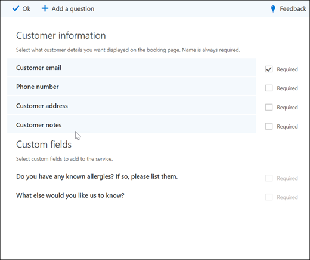
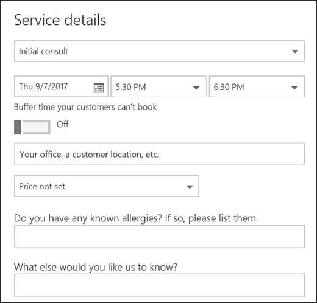

# Aangepaste en vereiste vragen toevoegen aan de reserveringspagina

Met Bookings kunt u vragen maken om uw klanten te vragen wanneer ze afspraken boeken. U kunt ook kiezen welke vragen u nodig hebt.

U koppelt de vragen aan een service, zodat elke service een andere set vragen kan hebben. Een kapper kan bijvoorbeeld klanten die een afspraak voor haarkleuring boeken, vragen of ze een bekende allergieën voor bleekwater of tinten hebben. Hierdoor kunnen u en uw klanten tijd besparen wanneer ze voor hun afspraak aankomen.

De klanten zien de aangepaste vragen wanneer ze hun afspraak maken op de boekingspagina. Medewerkers zien de aangepaste vragen wanneer ze een nieuwe reservering maken vanuit de Bookings-agenda of wanneer ze een bestaande afspraak bekijken. Bookings slaat al uw vragen op in een basislijst, zodat u niet voor elke service dezelfde vragen hoeft te maken. U kunt ook kiezen of vragen vereist of optioneel zijn.

> [!NOTE]
> De antwoorden van de klant op de vragen zijn zichtbaar wanneer u hun afspraak bekijkt in de boekingsagenda.

Zie Uw boekingspagina aanpassen voor meer informatie over het aanpassen en aanpassen van uw [reserveringspagina.](customize-booking-page.md)

## Aangepaste vragen toevoegen aan uw services

1. Meld u aan bij Microsoft 365 en ga naar **Bookings.**

1. Ga naar **Services** en bewerk een bestaande service of **Voeg een service toe.**

1. Schuif omlaag naar de **sectie Aangepaste velden** en selecteer Vervolgens **Wijzigen.**

   We hebben al enkele basisvragen over klantgegevens toegevoegd: e-mail van klanten, telefoonnummer, klantadres en klantnotities. De eerste keer dat u dit doet, worden de vragen over klantgegevens grijs gemarkeerd. Dit betekent dat de gebruiker deze vraag ziet. Als u de vraag selecteert, verdwijnt het markeringsvak eromheen en wordt uw klant die vraag niet gesteld.

   In dit voorbeeld zijn telefoonnummers en klantnotities uitgeschakeld en hebben we twee nieuwe aangepaste vragen gemaakt om te stellen.

   

1. Als u de vraag nodig wilt maken, **selecteert** u het selectievakje Vereist. Uw klant kan de reservering pas voltooien als hij of zij de vereiste vragen heeft beantwoord.

1. Als u een aangepaste vraag wilt maken, **selecteert u Een vraag toevoegen** boven aan het deelvenster. Schrijf uw vraag en selecteer **opslaan.**

1. Klik op de vraag om deze in te stellen. Er wordt een gemarkeerd vak omheen weergegeven en de vraag is ingeschakeld.

1. Klik **boven** aan de pagina op Ok en vervolgens **op De service opslaan.**

Boekingen slaan al uw aangepaste vragen op in een basislijst, zodat u eenvoudig vragen aan elke service kunt toevoegen zonder dat u herhaaldelijk dezelfde vragen hoeft te typen. Als u bijvoorbeeld een andere service opent, wordt de vraag die u hebt gemaakt voor de eerste service in de sectie Aangepaste velden, maar deze wordt uitgeschakeld. Klik op de vraag zodat er een gemarkeerde rechthoek wordt weergegeven en de vraag is ingeschakeld.

In dit voorbeeld ziet u dat de vragen die zijn toegevoegd voor de eerste service, beschikbaar zijn voor deze service. Alle vragen die u voor deze service maakt, zijn beschikbaar voor alle services.

   

Als uw boekingspagina al is gepubliceerd, hoeft u verder niets te doen. Klanten zien de vragen de volgende keer dat ze bij u boeken. Als uw boekingspagina nog niet is  gepubliceerd, gaat u naar de boekingspagina van Outlook op internet en selecteert u **Opslaan en publiceren.**

> [!WARNING]
> U kunt ook vragen uit de basislijst verwijderen. Als u echter een vraag verwijdert, wordt deze uit elke service verwijderd. U wordt aangeraden de vraag uit te schakelen door deze te selecteren om ervoor te zorgen dat u geen invloed hebt op andere services. U kunt zien dat een vraag is uitgeschakeld als deze niet wordt omgeven door een gemarkeerde rechthoek.

## Klantervaring

Wanneer uw klanten een afspraak met u boeken, worden de basisvragen over klantgegevens in de sectie **Uw gegevens toevoegen.** Eventuele aangepaste vragen die u toevoegt, vindt u in **de sectie Aanvullende informatie** verstrekken.

## Ervaring met personeel

Wanneer uw klanten een afspraak met u boeken, ziet uw personeel de vragen en antwoorden van de klant in de boekingsagenda. Als u het wilt zien, gaat **u naar Bookings** \> **Calendar** en opent u een afspraak.

