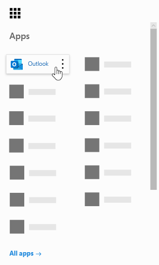
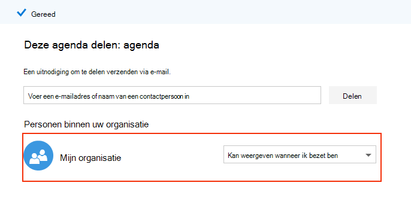
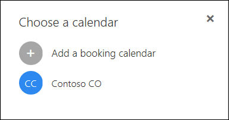

# Veelgestelde vragen over Microsoft Bookings

## Algemeen

### Wat is Microsoft Bookings?

Microsoft Bookings is een Microsoft 365-app waarmee u eenvoudig afspraken kunt plannen en beheren. Bookings bevat een webboekingsagenda en integreert met Outlook om de agenda van uw personeel te optimaliseren, zodat uw klanten flexibiliteit hebben om een tijd te boeken die voor hen het beste werkt. Automatische e-mailberichten voor meldingen verminderen no-shows en organisaties besparen tijd met minder terugkerende planningstaken. Met Bookings kunt u eenvoudig virtuele afspraken uitvoeren via Skype of Microsoft Teams en kunt u de dagelijkse planning beheren via de Bookings-app in Teams. Met de ingebouwde mogelijkheid om aan te passen, is Bookings ontworpen om te voldoen aan de behoeften van meerdere onderdelen van een organisatie.

### Hoe gebruik ik Microsoft Bookings?

Bookings is een onlineservice, dus u hoeft niets te downloaden. Ga naar de app-kiezer binnen de Microsoft 365 Web-ervaring. Beheerders kunnen ook de bookings companion-app gebruiken om op de hoogte te blijven van de meest recente informatie over klanten en hun afspraken.

### Wie heeft toegang tot Microsoft Bookings?

Bookings is standaard beschikbaar en actief voor klanten van Microsoft 365 Business Premium, Microsoft 365 Business Standard, A3, A5, E3 en E5. Bookings is ook beschikbaar in Office 365 beheerd door 21Vianet.

### Zien mijn klanten mijn persoonlijke of zakelijke agenda?

Uw klanten zien alleen de Bookings-agenda die u online publiceert voor de services, tijden en personeelsleden die u wilt registreren.

### Hoe wijzig ik een boekbaar kenmerk onder Personeel beheren?

Wanneer personeelsleden werden toegevoegd, zouden ze een e-mail hebben ontvangen om de aanvraag te accepteren of te weigeren. Ze kunnen hetzelfde e-mailbericht openen en 'Weigeren' selecteren om ze zo te maken dat ze niet kunnen worden geboekt. We hebben momenteel geen manier om dit in te schakelen vanuit de app.

### Hoe hebben eindgebruikers toegang tot de Bookings-app?

Iedereen die een licentie heeft voor Microsoft 365 Business Premium, Microsoft 365 Business Standard, A3, A5, E3, E5 of wordt toegevoegd als personeelslid in de rollen Beheerder of Viewer, heeft toegang tot Bookings in de app-kiezer binnen de Microsoft 365-webervaring. Er is ook een begeleidende app beschikbaar voor iOS en Android.

### Kan ik Bookings gebruiken op mijn eigen website?

Ja. We bieden u een manier om uw Bookings-agenda in tesluiten op uw site via een iFrame. Koppelingsinsluitcode bevindt zich op het **paginatabblad Bookings** in de Bookings-app.

### Kan ik Bookings gebruiken, zelfs als ik geen webpagina voor mijn bedrijf heb?

Ja. We bieden een koppeling naar uw boekingspagina op het tabblad **Reserveringspagina** in de web-app. U hoeft alleen die koppeling naar uw klanten of klanten op te geven en ze zien de meest recente beschikbaarheidsgegevens voor uw bedrijf. U kunt ook de boekingspagina delen op sociale media of zelfs de functie insluiten gebruiken om deze te hosten in een iFrame. U hebt ook de mogelijkheid om te bepalen wie toegang heeft tot de pagina door het indexeren van directe zoekmachines uit te stellen en de toegang tot alleen personen binnen uw organisatie te beperken.

### Kan onze IT-afdeling bepalen of eindgebruikers toegang hebben tot Bookings?

Bookings is standaard beschikbaar in Microsoft 365 Business Premium, Microsoft 365 Business Standard, M365 A3/A5- en E3/E5-tenants, maar beheerders kunnen het uitschakelen in het Microsoft 365-beheercentrum als ze dat willen. Volg deze instructies om [dit te doen.](turn-bookings-on-or-off.md)

Als een klant de toegang tot Bookings voor bepaalde in aanmerking komende licenties in zijn tenant wil uitschakelen, kan hij of zij een groepsbeleid gebruiken om licenties te beperken of een OWA-postvakbeleid implementeren dat beperkt wie nieuwe Bookings-agenda's kan maken.

Als u een OWA-postvakbeleid gebruikt om de toegang tot Bookings uit te schakelen, hebben alle gebruikers een Bookings-licentie, maar wanneer ze de app proberen te openen, zijn ze alleen succesvol als ze deel uitmaken van het beleid of als ze als personeel aan een bestaande Bookings-agenda zijn toegevoegd. Details [hier](turn-bookings-on-or-off.md) in de sectie 'Alleen geselecteerde gebruikers toestaan om Bookings-agenda's te maken'.

### Is Bookings aanpasbaar?

Ja, Bookings is aanpasbaar en kan worden gebruikt voor verschillende scenario's. Bij het instellen van een Bookings-agenda kunnen veel aspecten van de webplanningspagina, uw bedrijfsgegevens, personeelsgegevens, servicetypen en planningsbeleid worden aangepast.

### Is alle functionaliteit van de oorspronkelijke Bookings Web-app beschikbaar in Microsoft Teams?

Een lichtgewicht versie van Bookings is nu beschikbaar als app in Teams. De eerste aankondiging is [hier.](https://www.microsoft.com/microsoft-365/blog/2020/03/06/empowering-care-teams-with-new-tools-in-microsoft-365/) Er is een deep link-functionaliteit beschikbaar in de web-app en na de installatie kan het dagelijks gebruik van Bookings worden uitgevoerd zonder Teams te verlaten. Informatiestromen over verschillende platforms.

### Is Bookings een aanbieding voor kleine bedrijven of een Enterprise-aanbieding of beide?

Bookings is een ideale oplossing voor zowel zakelijke als kleine zakelijke klanten in verschillende bedrijfstakken. Use cases include:

- Financiële services
    - overleg
    - bank- en verzekeringsservices
    - belastingaangiften

- Personeelszaken (HR)
    - sollicitatiegesprekken met kandidaten
    - onboarding
    - hulp bij het verlenen van voordelen
    - training en seminars

- Gezondheidszorg
    - patiëntbezoeken
    - samenwerking tussen provider en provider
    - verzekerings consulten

- Overheidssector & overheidssector
    - rechtszittingen en rechtszaken
    - openbare diensten
    - afdelingsafspraken

- Onderwijs -- K-12
    - ouder-docent-vergaderingen
    - schoolstadhuis
    - bezoeken van student-raadgever

- Onderwijs -- Hoger Ed
    - kantooruren
    - bijles
    - studentenservices
    - aanmelding voor examens

- Detailhandel
    - assisted shopping
    - planning van aannemer
    - ontwerpservices

- Algemene behoeften voor ondernemingen en kleine bedrijven
    - klant- en klantvergaderingen
    - technische ondersteuning
    - juridische beoordelingen
    - faciliteiten

## Prijzen en licenties

### Hoe kan ik Microsoft Bookings krijgen?

Bookings is beschikbaar in Microsoft 365 voor klanten met Microsoft 365 Business Premium, Microsoft 365 Business Standard, A3, A5, E3 en E5-licenties, samen met een iOS- en Android-companion-app. Bookings is niet beschikbaar als zelfstandige app. Outlook Web App of de webversie van Outlook moet zijn ingeschakeld voor het gebruik van Bookings, omdat gegevens in Outlook worden opgeslagen.

Een Bookings-licentie biedt volledige functionaliteit voor het product, waaronder het maken en beheren van agenda's. Hiermee kunnen gebruikers ook bestaande agenda's weergeven en bewerken, wanneer deze gebruikers worden toegevoegd als personeel in een rol beheerder of viewer.

### Moet ik mijn e-mailaccount migreren van mijn huidige provider naar Microsoft 365?

U kunt uw huidige provider behouden, maar Bookings stuurt alle meldingen naar de e-mail die wordt gebruikt in uw Microsoft 365-account.

### Kunnen mijn werknemers Bookings gebruiken zonder een Microsoft 365-account?

Ja. U kunt uw medewerkers toevoegen met elk e-mailbericht en ze ontvangen nog steeds de e-mailbevestiging en de agenda-uitnodiging wanneer iemand een afspraak met hen boekt.

### Kan ik meer dan één Bookings-agenda maken onder hetzelfde Microsoft 365-account en ertussen schakelen?

Ja. U kunt meer dan één Bookings-agenda met één account maken en beheren. U kunt ertussen schakelen met de caret naast de bedrijfsnaam in de Bookings Web-app.

### Wat gebeurt er als mijn organisatie gemengde licenties heeft met F1/F3, E1 en E3/E5?

We erkennen dat veel organisaties een combinatie van Microsoft 365-licenties hebben. Een klant kan bijvoorbeeld M365 E3-licenties hebben voor werknemers in het hoofdkantoor, maar M365 E1 (of F1 of F3) licenties voor hun winkelmedewerkers.

In dit voorbeeld hebben de werknemers van het hoofdkantoor met een M365 E3-licentie volledige toegang tot Bookings, wat betekent dat ze nieuwe agenda's kunnen maken, instellingen kunnen bewerken, personeel kunnen toevoegen, een boekingspagina kunnen publiceren, afspraken in de agenda kunnen maken en beheren en rapporten kunnen op halen.

Werknemers met een E1/F1/F3-licentie of zonder licenties kunnen nog steeds als personeel worden toegevoegd aan agenda's in een gastrol en vervolgens geboekt voor afspraken, en ze ontvangen bevestigingsberichten wanneer ze worden geboekt. Ze kunnen nog steeds worden geboekt tijdens hun beschikbare/geplande uren, zoals vermeld op het tabblad Personeel. De beschikbaarheid van de Bookings-agenda beperkt de boekbare tijden door de in te stellen uren en serviceuren.

De winkelmedewerkers worden ook weergegeven als niet beschikbaar in Bookings als er op dat moment al een afspraak is gepland via de Bookings Web-app. Afspraken die zijn geboekt via Bookings, worden weergegeven als bezet in de agenda van een personeelslid binnen Bookings. Personeelsleden met een licentie die niet voor Bookings is ingeschakeld, kunnen nog steeds hun persoonlijke agenda beïnvloeden op hun beschikbaarheid in Bookings, mits ze binnen dezelfde tenant zijn.

Personen in de rol Gasten kunnen alle informatie bekijken die de klant heeft verstrekt tijdens het maken van de eerste afspraak. Als bijvoorbeeld de vertegenwoordiger van de winkel die voor de afspraak is geboekt, de klant moet bellen vóór de afspraak, heeft hij of zij toegang tot de informatie die de klant tijdens het planningsproces verstrekt. Het personeelslid dat is geboekt, heeft toegang tot alle informatie die wordt weergegeven in de bevestigings-e-mail en de .ics-agendagebeurtenis (zoals het telefoonnummer van de klant als deze is ingevoerd).

Personen in de rol Gast hebben geen toegang tot de Bookings Web-app om instellingen te wijzigen of afspraken weer te geven en te beheren (toevoegen, annuleren en opnieuw plannen). Ze kunnen echter afspraken maken namens klanten via de selfservicepagina, op dezelfde manier als een klant een afspraak zou maken.

We raden u aan een business manager of beheerder van elke winkel een licentie toe te kennen die in aanmerking komt voor Bookings om pagina's en afspraken in te stellen en te beheren. De rest van het personeel werkt dan samen met de werknemer met een licentie voor Bookings om een reservering opnieuw te plannen of te annuleren.

## Productfuncties

### Waar worden Bookings-agenda's in mijn Microsoft 365-tenant gevonden?**

Elke nieuwe Bookings-agenda maakt een bijbehorend postvak in Exchange, evenals een gerelateerde vermelding in Azure Active Directory (AAD), waar de vermelding wordt weergegeven als een gebruiker zonder een vergunning.

### Kan ik een eerder gemaakte Bookings-agenda verwijderen?

Als u een Bookings-agenda wilt verwijderen, moet u het bijbehorende postvak in Exchange verwijderen.

### Als ik een agenda maak en iemand anders toegang heeft tot Bookings, kunnen ze dan mijn agenda zien?

De enige personen die toegang hebben tot Bookings-agenda's die u maakt (via de web-app), zijn personen die als personeel zijn toegevoegd, in een rol van beheerder of viewer. Tenantbeheerders kunnen een lijst zien met alle Bookings-postvakken in Exchange en AAD.

### Zijn videovergaderingen geïntegreerd in de Bookings-app?

Onlinevergaderingen zijn beschikbaar binnen Bookings wanneer u de Skype- of Microsoft Teams-clients gebruikt. Onlinevergaderingen kunnen worden ingeschakeld op serviceniveau en de vergaderingsclient die u kiest (Skype of Teams) is standaard ingesteld voor een geboekt personeelslid. Als u wilt deelnemen aan de onlinevergaderingen, bevat elke nieuwe afspraak een unieke koppeling voor de vergadering aan de afspraak, en daarnaast worden eenvoudige opties voor deelnemen opgenomen in de gebeurtenis en in bevestigingsmails.

### Hoe werkt planningsbeleid?

Een instelling met **de naam Maximale** doorlooptijd bepaalt het verste van tevoren (gemeten in dagen) dat een reservering kan worden gemaakt. Er moeten ten minste 24 uur tussen **Minimale** doorlooptijd (de minimale doorlooptijd, in uren, voor boekingen en annuleringen) en Maximale doorlooptijd zijn. Maximale doorlooptijd kan worden ingesteld op één dag als minimale doorlooptijd is ingesteld op 0 uur, wat in dit geval betekent dat een klant een reservering kan annuleren tot het moment dat deze begint en klanten alleen boekingen kunnen plannen als de afspraak binnen de volgende dag valt.

:::image type="content" source="media/bookings-faq-scheduling.png" alt-text="Planning in Bookings":::

### Hoe werken Bookings in tijdzones?

Alle tijden zijn standaard in de zakelijke tijdzone (uw lokale tijdzone). Elke instelling die u configureert voor een Bookings-agenda, zoals werkuren, wordt weergegeven in deze tijdzone. De selfservicepagina heeft de mogelijkheid om alle afspraaktijden weer te geven in de tijdzone van de eindgebruiker, die desgewenst kan worden uitgeschakeld. Als **tijdsvakken altijd in** de zakelijke tijdzone worden weergegeven, blijft dit uitgeschakeld op het paginatabblad Bookings, dan zien personen die de pagina bezoeken tijdsvakken in hun eigen lokale tijdzones.

:::image type="content" source="media/bookings-faq-region.png" alt-text="Instellingen voor reserveringsregio's en tijdzone":::

Er is geen voorziening voor het instellen van tijdzone voor personeel in Bookings. De tijdzone van het personeel, en dus de werkuren, bevindt zich in de bedrijfstijdzone.

### Kunnen e-mailmeldingen worden verzonden als de tenantdomeinnaam?

De e-mailadressen worden beheerd en beheerd op het niveau van microsoft 365-instellingen en zijn afhankelijk van de instellingen voor domeinconfiguratie daar. Meer informatie vindt u [hier.](/powershell/module/exchange/get-accepteddomain)

### Is de mogelijkheid om sms-berichten te verzenden afhankelijk van een andere service of specifieke configuratie?

Sms-berichten zijn momenteel beschikbaar in Noord-Amerika en een Skype- of Twilio-account wordt gebruikt voor sms-bezorging.

### Hoe kunnen bookings-afspraken in de agenda van een persoon worden gemaakt?

De bevestiging van de reservering wordt verzonden naar zowel de Postvak IN van de serviceprovider als de klant. De bevestigings-e-mail bevat een *.ics-bestandsbijlage, die vervolgens met alle relevante afspraakdetails aan de agenda van de gebruiker kan worden toegevoegd.

### Wat triggers serviceprovider of personeel en e-mailberichten van klanten?

E-mailberichten worden geactiveerd op basis van instellingen op het tabblad Services in de Bookings Web-app. Een reservering die door de klant is gemaakt op de selfservicepagina of op het tabblad Agenda in de Bookings Web-app, leidt tot een bevestiging en/of een herinneringsmail. Hetzelfde gebeurt wanneer iemand de reservering wijzigt  via de knop Reservering beheren in de bevestigings-e-mail of in de web-app. E-mailberichten met herinneringen worden verzonden in een bepaalde periode vóór een afspraak, zoals beschreven op het tabblad Services in de Bookings Web-app.

### Kan ik afspraken in klasstijl boeken die 1:veel zijn in plaats van 1:1?

Ja, we hebben een groepsboekingsfunctionaliteit waarmee meerdere personen tegelijk dezelfde afspraak kunnen boeken (bijvoorbeeld voor een fitnessles). Deze functionaliteit wordt hier in detail [beschreven.](https://techcommunity.microsoft.com/t5/microsoft-bookings-blog/microsoft-bookings-now-supports-online-meetings-and-group/ba-p/1214120)

### Kunnen agenda's niet worden gepubliceerd (niet openbaar), maar toch toegankelijk voor aangewezen gebruikers?

Ja. Er is een selectievakje op het tabblad Reserveringspagina in de web-app: Een **Microsoft 365- of Office 365-account** van mijn organisatie vereisen om te boeken. Als u dit selectievakje incheckt, wordt de toegang tot de selfservicepagina beperkt tot alleen de pagina's binnen uw tenant. De Bookings-agenda die zich in de web-app bevindt voor het maken en beheren, kan alleen worden gebruikt door personen die als personeel aan de pagina zijn toegevoegd met beheerders- of viewerrollen.

:::image type="content" source="media/bookings-faq-access-ctrl.png" alt-text="Toegangsbeheer voor boekingspagina's in Bookings":::

### Hoe vaak wordt de startpagina bijgewerkt?

De meest recente gegevens die aan uw startpagina zijn gekoppeld, worden opgehaald wanneer de web-app wordt geladen. Zie dit ondersteuningsartikel voor meer informatie over het type gegevens dat door Bookings [wordt bijgeboekt.](metrics-and-activity-tracking.md)

### Kan ik de e-mailmeldingen uitschakelen voor Time Off?

Als u time-off opneemt in de Bookings Web-app, wordt er altijd een meldingsbericht naar personeelsleden verzonden. Als personeelsleden niet weten wat de melding is, raden we u aan meer details toe te voegen aan de notities of titel van de melding Time Off, om het personeel beter te informeren over wat er aan de beheerderszijde gebeurt.

### Kunnen Bookings-agenda's worden gekloond of gedupliceerd en kunnen ze worden templatized voor eenvoudige schaalbaarheid?

Het proces zou zijn om de Graph-API te gebruiken om postvakgegevens op te halen en vervolgens deze gegevens te gebruiken om een nieuw postvak te maken. API-documentatie is [hier.](/graph/api/resources/booking-api-overview?view=graph-rest-beta)

### Welke rapportage is beschikbaar in Bookings?

Alle Bookings-medewerkers die zijn toegewezen aan de rol Beheerder, kunnen een door tabbladen gescheiden waarden downloaden (. TSV)-bestand met alle boekingen die in de afgelopen 120 dagen zijn gemaakt. Boekingsrapporten kunnen worden gedownload in . TSV-formulier op het tabblad Start van de pagina Bookings. De Bookings API kan ook worden gebruikt om deze gegevens te verzamelen voor meer aangepaste en specifieke doeleinden.

### Is het mogelijk om slechts één service tegelijk te delen op de pagina Selfservice?

Ja, u kunt afzonderlijke Bookings-agenda's maken voor elke service, of u kunt naar het tabblad Services gaan, een service bewerken en boven aan de pagina ziet u een optie om alleen een URL voor die specifieke service te delen.

### Welke opties zijn beschikbaar voor het insluiten van een toestemmingsformulier of openbaarmaking voor degenen die een afspraak boeken?

We raden u aan **het** selectievakje Toestemming voor het gebruik van klantgegevens in te stellen op de pagina Reservering en de formulering aan te passen om de openbaarmakings- of toestemmingsvereisten van uw organisatie correct over te brengen. Een andere optie is om een aangepast veld toe te voegen aan de service met een koppeling naar het toestemmingsformulier en klanten te vragen te bevestigen dat ze het formulier hebben ingevuld voordat ze een afspraak kunnen maken. U kunt ook de URL van het toestemmingsformulier toevoegen als aanvullende notities in bevestigings- en herinnerings-e-mailberichten, maar dit voorkomt niet dat gebruikers een afspraak kunnen maken.

### Welke wijzigingen kunnen worden aangebracht in de selectiemogelijkheden voor personeel op de pagina Selfservice-reservering?

De mogelijkheid voor klanten om specifieke personeelsleden te selecteren wanneer  ze boeken, kan volledig worden verwijderd door de optie Toestaan dat klanten een specifieke persoon voor de reserveringsoptie kiezen uit de sectie Reservering of Services te verwijderen. Bookings wijst automatisch een beschikbaar personeelslid willekeurig toe aan de reservering, op basis van de beschikbaarheid van het personeel.

### Kunnen Bookings veel gelijktijdige boekingsaanvragen en selfservicepaginabezoeken ondersteunen?

Reservering kan een grote hoeveelheid bezoekers en boekingen tegelijk ondersteunen. Als de pagina een zeer grote hoeveelheid verkeer ervaart, krijgen gebruikers een foutmelding 'server bezet'. De beschikbaarheid van afspraken wordt bijgewerkt wanneer de pagina wordt geladen, evenals wanneer een reservering wordt gemaakt. Als meerdere personen tegelijk dezelfde afspraak proberen te boeken, kan slechts één persoon die tijd boeken en een melding aan de andere potentiële klanten sturen en hen vragen een ander tijdstip te zoeken.

## Privacy

### Waar worden Bookings-gegevens opgeslagen?

Bookings is een Microsoft 365-app, wat betekent dat alle gegevens worden opgeslagen op het Microsoft 365-platform en in Exchange. Bookings volgt alle beleidsregels voor gegevensopslag die zijn ingesteld door Microsoft, hetzelfde beleid dat alle Office-apps volgen. Bookings gebruikt gedeelde postvakken in Exchange om klant-, personeel-, service- en afspraakgegevens op te slaan. Compliancebeleid voor gedeelde postvakken in Exchange is ook van toepassing op Bookings-postvakken. Alle klantgegevens (inclusief gegevens die door klanten worden verstrekt bij het boeken) worden vastgelegd in Bookings en worden opgeslagen in de app, zodat deze worden opgeslagen in Exchange. Microsoft Bookings gebruikt hetzelfde beleid dat wordt gebruikt door Microsoft 365, die u hier [kunt vinden.](https://www.microsoft.com/online/legal/v2/?docid=22&langid=en-us)

### Is er een manier om Bookings-agenda's centraal te beheren voor alle gebruikers?

Elke Bookings-agenda wordt onafhankelijk van elkaar onderhouden. Er is geen samengevoegde weergave, anders dan de vervolgkeuzepagina zoeken nadat u op de caret op de startpagina hebt geklikt.

### Hoe worden gebruikers geverifieerd?

Toegang tot de Bookings Web-app bestaat uit verificatie via de reguliere AAD-verificatie (Azure Active Directory). De selfserviceboekingspagina kan beschikbaar worden gesteld aan iedereen met de koppeling Webpagina. Wanneer echter de instelling Een **Microsoft 365- of Office 365-account** van mijn organisatie vereisen om te boeken is geselecteerd, is de pagina alleen beperkt voor gebruik binnen de Microsoft 365-tenant (met AAD-verificatie).

:::image type="content" source="media/bookings-faq-access-ctrl.png" alt-text="Toegangsbeheer voor boekingspagina's in Bookings":::

### Verlaten klantgegevens het productiesysteem om welke reden dan ook?

Ja, aangezien Bookings deel uitmaakt van Exchange, kunnen klanten hun eigen gegevens downloaden waarvoor ze toegang hebben.

### Is er de mogelijkheid om e-mailadressen voor antwoorden van klanten aan te passen?

Er is de mogelijkheid om te definiëren naar welke e-mailadresklant de antwoorden worden verzonden. Deze instelling vindt u op het **tabblad Bedrijfsgegevens.** De naam van het Bookings-postvak zelf kan ook worden gewijzigd in Exchange, via gebruikelijke exchange-postvaknaamingsprocessen.

### We willen dat de klant onze voorwaarden accepteert tijdens het reserveringsproces. Is dat mogelijk?

Deze functie bestaat al voor avg-naleving. De pagina Reservering heeft een veld voor aangepaste toestemming, direct onder de sectie publicatiedetails. Als u dat vakje incheckt en uw eigen aangepaste toestemmingsbericht schrijft, wordt het weergegeven als een verplicht veld op de pagina Selfservice. De datum en tijd waarop de klant toestemming verleent, wordt vastgelegd.

Deze sectie biedt geen ondersteuning voor tekst met uitgebreide tekst, maar denkt dat koppelingen kunnen worden toegevoegd onder de sectie bedrijfsgegevens en net onder het selectievakje toestemming worden weergegeven.

### Hoe kunnen aan Bookings gekoppelde postvakken in Exchange worden geïdentificeerd?

De volgende opdracht kan worden gebruikt om informatie op te halen van alle Bookings-postvakken en gebruikers die toegang tot deze postvakken hebben.

`Get-Mailbox -RecipientTypeDetails SchedulingMailbox -ResultSize:Unlimited | Get-MailboxPermission |Select-Object Identity,User,AccessRights | Where-Object {($_.user -like '*@*')}`

## Technische vragen

### Als een gebruiker een afspraak plant voor een service die bestaat uit een onlinevergadering, hoe ontvangen ze dan de koppeling Microsoft Teams naar de vergadering als ze het optionele e-mailadresveld leeg laten?

Als het systeem niet de e-mailgegevens van de klant bevat, kan de bevestigingsmail niet worden bezorgd bij de klant en ontvangen ze dus geen Teams-koppeling. De oplossing is om het e-mailadres in te stellen als een verplicht veld, wat u kunt doen op het tabblad Services van Bookings. Houd er rekening mee dat wanneer u een nieuwe service maakt in Bookings, het e-mailveld van de klant standaard is ingesteld als een verplicht veld.

### Hoe wordt personeel toegewezen aan afspraken wanneer 'Iedereen' is geselecteerd of wanneer klanten niet de mogelijkheid hebben om een personeelslid voor de afspraak te kiezen?

Personeelsleden worden willekeurig toegewezen in deze scenario's, van alle personeelsleden die beschikbaar zijn op het moment dat de afspraak wordt geboekt. Op dit moment is er geen manier om een gelijke verdeling van willekeurig toegewezen afspraken over alle personeelsleden te garanderen of om het aantal toegewezen afspraken aan elk personeelslid te limieten. Als er na een aantal willekeurige opdrachten taakverdeling moet worden uitgevoerd voor uw personeel, kunt u dit handmatig doen op het tabblad Agenda op de pagina Bookings.

### Hoe kunnen gebruikers zich afmelden voor het ontvangen van sms-berichten als ze zich eerder al hebben voormeld?

Wanneer een afspraak met sms-berichten is ingeschakeld, worden klanten gevraagd het opt-in-vak in te checken wanneer ze boeken. Klanten kunnen ook rechtstreeks reageren op het sms-bericht (de sms-provider) om aan te geven dat ze de berichten willen stoppen, waarna er geen verdere sms-berichten naar dat telefoonnummer worden verzonden. Als de klant zich afmeldt voor het ontvangen van sms-berichten van de provider, niet van Bookings zelf, ontvangen ze in de toekomst geen sms-berichten meer, zelfs niet wanneer ze zich via de pagina Bookings aanmelden.

## Problemen oplossen

### De agenda van dit personeelslid kan niet worden gesynchroniseerd

Als u de fout 'De agenda van dit personeelslid kan niet worden gesynchroniseerd' ontvangt, bevat deze sectie verschillende procedures voor het oplossen van de fout.

> [!NOTE]
> Bookings is standaard ingeschakeld voor klanten die de Microsoft 365 Business Standard, Microsoft 365 A3 of Microsoft 365 A5-abonnementen hebben. Bookings is ook beschikbaar voor klanten met Office 365 Enterprise E3 en Office 365 Enterprise E5, maar deze is standaard uitgeschakeld. Zie Toegang krijgen tot Microsoft Bookings om aan de slag [te gaan.](get-access.md) Zie Bookings in- of uitschakelen voor uw organisatie als u Bookings wilt in- of [uitschakelen.](turn-bookings-on-or-off.md)

Zie Personeel toevoegen aan Bookings als u informatie zoekt over het synchroniseren van de agenda van [uw personeel.](add-staff.md) Zorg ervoor dat op de **pagina Personeelsgegevens** gebeurtenissen **in de agenda zijn ingeschakeld** die van invloed zijn op de beschikbaarheid.

### Het personeelslid moet zijn of haar agendamachtigingen wijzigen

Als Bookings op de juiste manier kan worden gesynchroniseerd met de agenda's van uw personeelsleden, moet elk personeelslid zijn of haar agenda delen. Elk personeelslid moet deze instructies volgen om zijn of haar eigen agenda te delen.

1. Meld u aan bij Microsoft 365 en selecteer **Outlook** in het start startteken voor apps.

   > [!div class="mx-imgBorder"]
   > 

1. Selecteer Agenda delen boven  aan de \> **pagina.**

   

1. Selecteer in **de sectie** Personen in uw organisatie de vervolgkeuzekeuze naast **Mijn** organisatie en selecteer vervolgens Kan weergeven wanneer ik **bezet ben.**

   > [!NOTE]
   > Met deze instelling deelt u uw gratis/drukke informatie met Bookings en met andere gebruikers in uw organisatie. Het bevat geen andere informatie, zoals welk type afspraak u hebt gepland, met wie u de afspraak hebt gepland of de locatie.

   > [!div class="mx-imgBorder"]
   > 

1. Selecteer **Gereed**.

### We kunnen geen personeelslid in onze organisatie vinden

Als een werknemer uw bedrijf heeft verlaten en u deze hebt verwijderd uit uw Microsoft 365- of Office 365-organisatie, moet u die gebruiker nog steeds verwijderen uit Bookings, zodat deze niet in de agenda wordt opdagen en klanten geen afspraken met hen kunnen maken.

1. Meld u aan bij Microsoft 365 en ga naar **Bookings** \> **Staff.**

1. Plaats de muisaanwijzer op de naam van het personeelslid. **Pictogrammen** bewerken **en** verwijderen worden rechts van de kolom **Telefoon** weergegeven.

1. Selecteer het **pictogram** Verwijderen.

1. Selecteer OK in het **bevestigingsvak.**

> [!NOTE]
> Als u meerdere boekingsagenda's hebt, moet u de gebruiker uit alle agenda's verwijderen.

Als u wilt controleren of u meerdere agenda's hebt, selecteert u in het linkermenu de vervolgkeuzepijl naast uw bedrijfsnaam en selecteert u **Vervolgens Openen.** Als u maar één agenda hebt, ziet u alleen de optie om een boekingsagenda toe te voegen. In dit voorbeeld ziet u dat er een tweede agenda is met de naam 'Contoso CO'.

### Er is een synchronisatiefout die we niet kunnen identificeren

Dit is een tijdelijke fout en treedt meestal op vanwege een instabiele internetverbinding. Deze problemen lossen zichzelf meestal na enkele minuten op.

Als u deze fout na een langere periode nog steeds ziet of als u deze vaak ziet, neem dan contact op met de ondersteuning.

## Aanvullende bronnen

  - [Microsoft Bookings breidt de beschikbaarheid in de blog ondernemingen uit](https://techcommunity.microsoft.com/t5/microsoft-bookings-blog/microsoft-bookings-expands-availability-in-enterprises/ba-p/1214065)

  - [Video hoe Microsoft Bookings werkt](https://support.office.com/article/microsoft-bookings-69c45b78-6de4-4f28-9449-cdcc18b7ae45)

  - [Microsoft Bookings gebruiken](get-access.md)

  - [Microsoft Bookings in- of uitschakelen](turn-bookings-on-or-off.md)

  - [Gebruikers afzonderlijk of bulksgewijs toevoegen](../admin/add-users/add-users.md?view=o365-worldwide.)

  - [Medewerkers toevoegen aan Bookings](add-staff.md)

  - [API-onderdelen die moeten worden automatiseren nadat de sjabloon is gedefinieerd](/graph/api/bookingbusiness-post-bookingbusinesses)

  - [URL naar Bookings Calendar for Display](https://outlook.office.com/bookings/calendar)

  - [Compliancebeleid voor bookings](/compliance/regulatory/gdpr-dsr-Office365?view=o365-worldwide#bookings)

  - [Uw reserveringspagina aanpassen en publiceren](customize-booking-page.md)

  - [Tenantpostvakconfiguratie](/powershell/module/exchange/get-accepteddomain)

  - [Groepsboekingen](https://techcommunity.microsoft.com/t5/microsoft-bookings-blog/microsoft-bookings-now-supports-online-meetings-and-group/ba-p/1214120)

  - [Bookings metrics and activity tracking](metrics-and-activity-tracking.md)

  - [Openbare routekaart voor M365](https://www.microsoft.com/microsoft-365/roadmap?filters=&searchterms=bookings)

  - Feedback verzenden via [UserVoice](https://outlook.uservoice.com/forums/314907-microsoft-bookings/suggestions/39505261-365-admins-should-have-full-access-to-all-bookings)
