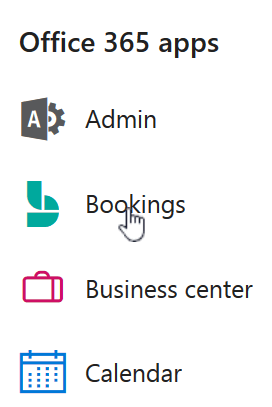

# Handmatig reserveren maken

Reserveringen kunnen op twee manieren worden gepland en van personeel worden voorzien. De eerste manier is door de klant met behulp van een zelfstandige boekings pagina of een ingesloten reserverings pagina die u aan de website toevoegt. De andere manier is voor u of een van uw werknemers om de boekingen handmatig in te voeren, bijvoorbeeld wanneer een klant belt voor een afspraak. In dit artikel worden de stappen voor het handmatig invoeren van reserveringen behandeld.

1. In Microsoft 365 selecteert u het startprogramma voor apps en selecteert u vervolgens **Bookings**.

   

1. Selecteer in het navigatiedeelvenster **Agenda** \> **Nieuwe reservering**.

   

1. Selecteer de service die moet worden geboden. Zie [de serviceaanbiedingen definiëren in Microsoft Bookings](define-service-offerings.md) instructies voor service-instellingen.

1. Voer de klantgegevens in, zoals de naam, het e-mailadres, het telefoonnummer en andere relevante gegevens.

1. Selecteer het personeelslid dat de service moet bieden. De lijst met personeelsleden die wordt weergegeven, is gebaseerd op wat u instelt op de pagina met services.

   

1. Voer de servicedetails in, zoals de datum, de tijd, de locatie en andere relevante gegevens. Als u een geldig e-mailadres voor de klant hebt ingevoerd, verandert de knop **Opslaan** in **Verzenden** en ziet u de tekst dat een bevestiging naar de klant wordt verzonden. De klantbevestiging bevat een bijlage die de klant aan de agenda kan toevoegen. Geselecteerde personeelsleden ontvangen bij de afspraakgegevens ook uitnodigingen voor vergaderingen, zodat ze deze aan hun persoonlijke agenda kunnen toevoegen.

1. Selecteer **Een herinnering per e-mail toevoegen**.

1. Geef aan wanneer de herinnering moet worden verzonden, waarop de herinnering moet worden verzonden (**klant**, **medewerkers**, **alle deelnemers**) en geef het herinneringsbericht op.

1. Select **Save** \> **Send**.

   Hier ziet u een voorbeeld van een e-mail van de herinnering dat uw klant ontvangt:

:::image type="content" source="../media/bookings-confirmed-email.png" alt-text="Schermafbeelding: voorbeeld van een e-mailbericht van een handmatige reservering":::