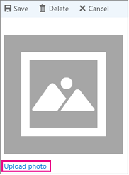

# Uw bedrijfsgegevens invoerenEnter your business information

In Microsoft Bookings is de pagina met bedrijfsgegevens in de web-app alle details die u meestal op een pagina over ons van het bedrijf vindt.In Microsoft Bookings, the Business Information page within the web app contains all the details that you'd typically find on a business' "About us" page. Deze gegevens zijn inclusief de naam, het adres, het telefoonnummer, de website-URL, de URL van het privacybeleid, het logo en de kantooruren.These details include your a relevant name, address, phone number, web site URL, privacy policy URL, logo, and business hours.

De gegevens die u hier opgeeft, worden weergegeven op de pagina-klanten en klanten die gebruikmaken van afspraken (de reserverings pagina genoemd) en in berichten en herinneringen die naar deze persoon worden verzonden via bookings.The information you provide here will be displayed on the page customers and clients use to book appointments (known as the booking page) and in messages and reminders sent to them by Bookings. Hieronder ziet u een voorbeeld van deze informatie op de boekings pagina.An example of this information on the booking page is highlighted below.

   

> [!NOTE]
> Bookings is standaard ingeschakeld voor klanten met de Microsoft 365 Business Standard Standard, Microsoft 365 a3 of Microsoft 365 A5-abonnementen.Bookings is turned on by default for customers who have the Microsoft 365 Business Standard, Microsoft 365 A3, or Microsoft 365 A5 subscriptions. Bookings is ook beschikbaar voor klanten met Office 365 Enterprise E3 en Office 365 Enterprise E5, maar het is standaard uitgeschakeld.Bookings is also available to customers who have Office 365 Enterprise E3 and Office 365 Enterprise E5, but it is turned off by default. Als u aan de slag wilt gaan, raadpleegt [u toegang krijgen tot Microsoft Bookings](get-access.md).To get started, see [Get access to Microsoft Bookings](get-access.md). Zie [bookings in-of uitschakelen voor uw organisatie](turn-bookings-on-or-off.md)om bookings in of uit te schakelen.To turn Bookings on or off, see [Turn Bookings on or off for your organization](turn-bookings-on-or-off.md).

## Bedrijfsnaam en contactgegevens opgevenProvide business name and contact information

1. In Microsoft 365 selecteert u het startprogramma voor apps en selecteert u vervolgens **Bookings**.In Microsoft 365, select the App launcher, and then select **Bookings**.

1. Selecteer **Bedrijfsgegevens** in het navigatiedeelvenster.In the navigation pane, select **Business information**.

1. Voer de naam, het adres en het telefoonnummer in dat u wilt gebruiken voor uw Bookings-agenda.Enter the relevant name, address, and phone number you would like to use for your Bookings calendar.

1. Typ bij **antwoord van klant verzenden naar**het e-mailadres van de geadresseerde waarbij e-mail antwoorden op reserverings bevestigingen en herinneringen moeten worden doorgeschakeld.In **Send customer replies to**, type the preferred email address where email replies to booking confirmations and reminders should be forwarded.

1. Voer in het veld **website-URL** de URL van de startpagina voor uw bedrijf in.In the **Website URL** field, enter the URL of the home page for your business.

1. Voer het **Privacybeleid** en de **voorwaarden &** url's in.Enter the **privacy policy** and **terms & conditions** URLs.

1. Selecteer **Opslaan**.Select **Save**.

## Uw kantooruren instellenSet your business hours

Standaard worden de kantooruren in de app Boekingen ingesteld op 8:00 tot 17:00 van maandag tot en met vrijdag. U kunt tijden opgeven in intervallen van vijftien minuten. In de app Boekingen wordt gebruikgemaakt van de 12-uurs klok.By default, the business hours in the Bookings app are set to 8 a.m. to 5 p.m., Monday through Friday. Times are provided in 15-minute increments. The Bookings app uses the 12-hour clock.

Stel **kantooruren** in op uw kantooruren.Set **business hours** to your operational hours. Dit zijn de uren waarop alle reserveringen worden toegestaan.These are the hours to which all bookings are restricted. Aanvullende tijdsbeperkingen van wanneer afspraken kunnen worden vastgelegd, kunnen worden ingesteld voor elke service, en voor elk personeelslid in de pagina's en medewerkers.Additional time restrictions of when appointments can be booked can be set for each service and for each staff member in the Services and Staff pages, respectively.

1. Gebruik de vervolgkeuzelijsten op de pagina Business information (Bedrijfsgegevens) om de begin- en eindtijd voor elke dag te selecteren.On the Business information page, under Business hours, use the dropdowns to select start and end times for each day.

1. Klik **+** om begin-en eindtijd te selecteren.Click **+** to add start- and end-time selectors.

## Uren instellen voor een gesplitste werktijdHow to set hours for a split shift

Het kan zijn dat u een deel van elke dag of week moet blokkeren om personeelsvergaderingen te kunnen houden, de voorraad bij te werken of andere Rhythm van uw bedrijf te ondernemen.You might need to block out a portion of each day or week to have staff meetings, update inventory, or take care of other rhythm-of-business details. Met de app Bookings kunt u de afspraken van klanten beperken tot uw opgegeven tijds sleuven.The Bookings app allows you to limit customer appointments to your specified time slots.

U hebt bijvoorbeeld iedere donderdag van 1 uur tot 2:30 en wil dit tijdstip blokkeren, zodat al uw personeelsleden kunnen deelnemen.For example, you have staff meetings every Thursday from 1 o'clock to 2:30 and want to block out that time so all of your staff members can attend. Als u dit wilt doen:To do this:

1. Open de pagina Business information (Bedrijfsgegevens) en selecteer onder Business hours (Kantooruren) een begin- en eindtijd voor donderdagen. In dit voorbeeld stellen we 8:00 tot 13:00 uur in.On the Business information page, under Business hours, select a start and end time for Thursdays. In this example we'll set 8:00 a.m. to 1:00 p.m.

1. Selecteer het plusteken ( **+**) om een nieuwe rij te maken voor donderdag.Select **+** to create a new row for Thursday.

   

1. Selecteer 2:30 p.m. in de nieuwe rij.In the new row, select 2:30 p.m. voor de begintijd en 6:00 uurfor the start time and 6:00 p.m. voor de eindtijd.for the end time.

   

1. Selecteer Opslaan.Select Save.

    Wanneer een klant naar uw reserveringspagina gaat, ziet deze dat uw bedrijf op donderdag is gesloten van 13:00 tot 14:30.When a customer goes to your booking page, he or she will see that your business is closed from 1 to 2:30 on Thursdays.

## Uw logo uploadenUpload your logo

Als u uw bedrijfslogo nog niet hebt geüpload naar de app Bookings, kunt u dit doen op de pagina Business information (Bedrijfsgegevens).If you haven't already uploaded your business logo to the Bookings app, you can do it from the Business information page.

1. Selecteer op de pagina Business Information onder logo uploaden de optie **Change**.On the Business information page, under Upload logo, select **Change**.

1. Selecteer **Foto uploaden**.Select **Upload photo**.

   

1. Selecteer **Opslaan**.Select **Save**.
