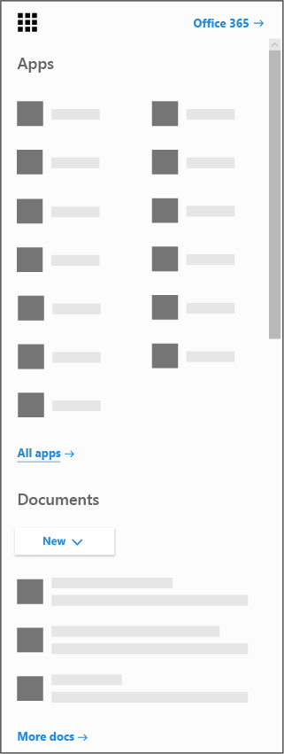

# De app Microsoft Bookings downloaden voor iOS en Android

Bedankt voor het downloaden van de Microsoft-boekingen-app. Microsoft Bookings is beschikbaar als een mobiele app voor iOS en Android. De Boekingen-app voor iOS is beschikbaar in alle regio's en landen die Apple ondersteunt. U kunt de app downloaden in de [iTunes App Store](https://apps.apple.com/app/microsoft-bookings/id1065657468). De Bookings-app voor Android is beschikbaar voor downloads in de [Google Play Store](https://play.google.com/store/apps/details?id=com.microsoft.exchange.bookings) in de VS en Canada.

U moet de webversie van Boekingen instellen voordat u aan de slag kunt.

1. Kunt u de app die u zoekt niet vinden? Selecteer in het startprogramma voor apps alle apps om een alfabetische lijst te zien met de Microsoft 365-apps die voor u beschikbaar zijn. Vervolgens kunt u zoeken naar een bepaalde app

   

2. Selecteer op [de startpagina van Office](https://office.com) en klik in het startprogramma voor apps op **Bookings**.

3. Selecteer **Nu downloaden**.

4. Geef de naam op van uw bedrijfstype, bijvoorbeeld een kapperszaak of tandartspraktijk, en selecteer **Naar Boekingen**.

5. U kunt nu Bookings voor uw organisatie instellen. Volg de stappen in het onderwerp [Microsoft Bookings](bookings-overview.md) om het instellen van reserveringen te voltooien. Ga terug naar uw mobiele apparaat en meld u af bij de mobiele app. Meld u opnieuw aan bij de nieuwe agenda met boekingen.

## De modus alleen-weergeven

Gebruikers die niet zijn gemachtigd voor lezen-schrijftoegang in Bookings, kunnen de mobiele app gebruiken in de modus alleen-weergeven. Iedereen met een boekings licentie die wordt toegevoegd aan een boekings agenda, kan hun eigen organisatie en de planning van hun collega's, afspraak Details en bedrijfsinformatie zien. Een gebruiker met alleen-lezen toegang kan geen wijzigingen aanbrengen of bewerken en geen toegang tot de klantenlijst.
