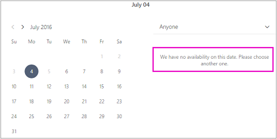

# Sluitingstijden van het bedrijf, verlof en vakanties plannen

Af en toe wilt u uw bedrijf sluiten voor feestdagen of teamgebeurtenissen, anders hebben uw werknemers verlof nodig wanneer ze ziek zijn, op vakantie zijn of om andere redenen niet beschikbaar zijn. U kunt een time-off plannen vanuit de Microsoft Bookings-agenda en de werknemer is niet beschikbaar voor boekingen gedurende de opgegeven tijd. Zodra het bedrijf opnieuw wordt geopend of werknemers weer aan het werk gaan, wordt iedereen weergegeven op de boekingspagina op basis van de vaste werkuren.

Bekijk deze video of volg de onderstaande stappen om bedrijfssluitingen of werknemers uit te plannen.

> [!VIDEO https://www.microsoft.com/videoplayer/embed/RE2TxDC]

## Ad-hocsluitingstijden van het bedrijf plannen

1. Selecteer Microsoft 365 start voor apps en selecteer vervolgens Bookings.

1. Selecteer **Agenda** \> **Verlof** in het navigatiedeelvenster.

   

1. Vul de gegevens in, waaronder een titel, begin- en eindtijden, locatie en aanvullende notities.

1. Selecteer **Duurt hele dag**.

1. Selecteer alle personeelsleden.

1. Selecteer **Opslaan**.

Als een klant een afspraak wil plannen op een dag dat het kantoor is gesloten, wordt een bericht weergegeven op de boekingspagina.

   

## Verlof van medewerkers plannen

1. Selecteer Microsoft 365 start voor apps en selecteer **vervolgens Bookings**.

   

1. Selecteer **Agenda** \> **Verlof** in het navigatiedeelvenster.

   

1. Vul de gegevens in, waaronder een titel, begin- en eindtijden, locatie en aanvullende notities. Als de medewerker een hele dag of enkele dagen afwezig is, selecteert u **Duurt hele dag**.

1. Selecteer het personeelslid of de personeelsleden die verlof nemen.

1. Selecteer **Opslaan**.
