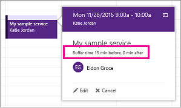

# Buffertijd instellen in Microsoft BookingsSet buffer time in Microsoft Bookings

Voor sommige afspraken is mogelijk een tijd nodig voordat of nadat u met uw klant hebt samenontmoetd om uw vergaderruimte en apparatuur in te stellen, op te schonen of opnieuw in te stellen.Some of your appointments might require time before or after you meet with your customer to set up, clean up, or reset your room and equipment. Als u onderweg bent, kunt u ervoor zorgen dat u en uw team tussen afspraken kunnen overstappen zonder dat de klant hoeft te wachten.Or if you’re on the road between customer appointments, you may need time to ensure you and your team can travel between appointments without making the customer wait.

U kunt de buffertijd voor het begin van afspraken instellen, na einde van de afspraak of beide om medewerkers een extra tijdstip te geven waarop ze de volgende afspraak moeten voorbereiden.You can set buffer time before appointments start, after appointments end, or both to give staff the extra time they need to prepare for their next appointment.

## Standaardwaarden voor buffertijd instellenSet buffer time defaults

Standaardwaarden voor buffer tijd worden ingesteld op de pagina **service Details** in bookings.Buffer time defaults are set on the **Service details** page in Bookings. De standaardinstellingen van de service zijn ingesteld op deze pagina, en u kunt deze standaardwaarden bewerken voor een specifieke boeking om aan de behoeften van bepaalde klanten te voldoen.Like all service defaults set on this page, these defaults can be edited by you for a specific booking to meet specific customer needs.

U vindt de instelling voor buffertijd op de pagina **service Details** onder de **standaardduur** kiezers.The buffer time setting can be found just below the **Default duration** pickers on the **Service details** page. Voordat deze kan worden ingesteld voor een bepaalde service, moet u de instelling voor buffertijd inschakelen door de wisselknop buffertijd te selecteren.Before it can be set for a given service, you must enable the buffer time setting by selecting the buffer time toggle. Hiermee wordt de vervolgkeuzelijst **voor** en **na** weergegeven, die wordt gebruikt voor het kiezen van de standaardperiode voor en na elke boeking, zoals hier wordt weergegeven:This causes the **Before** and **After** drop-downs to appear, which are used to pick the default amount of time to hold before and after each booking, as shown here:

   

## Buffertijd en tijdsinstelling van afsprakenBuffer time and appointment timing

Om verwarring te voorkomen over wanneer klanten u verwachten te ontmoeten, worden de buffertijd en het werkelijke tijdstip van de afspraak (het tijdstip waarop klanten u verwachten te ontmoeten) in Bookings in de agenda en in e-mailbevestigingen en herinneringen voor het betreffende personeel vermeld.To avoid confusion about when customers expect to meet with you, Bookings shows buffer time and actual appointment time (the time your customers expect to meet with you) on your calendar, and in email confirmations and reminders to relevant staff. Hieronder ziet u een voorbeeld van een klant met een klant die een afspraak bevat van een klant met een klant die 15 minuten vooraf is uitgerust met een timer voor een afspraak.For example, below is what you’d see in Bookings for an appointment with a customer that includes 15 minutes of pre-appointment buffer time.

U ziet dat de gebeurtenis zelf (links in de onderstaande afbeelding) een lichtere arcering toont voor de buffertijd en een donkerdere arcering voor de werkelijke afspraak met de klant.Note that the event itself (on the left in the image below) shows lighter shading for the buffer time and darker shading for the actual customer appointment. De oproep uitbellen (die automatisch wordt geopend wanneer u de gebeurtenis selecteert) geeft de voorkeur aan dat de afspraak uit 9:00AM tot 10:00AM met Katie Jordanië bevat en de buffertijd van 15 minuten na de afspraak bevat.The appointment call-out (which is opened when you select the event) specifically states that the appointment is from 9:00AM to 10:00AM with Katie Jordan and includes 15 minutes of buffer time before the appointment and 0 minutes after the appointment. Bevestigingen en herinneringen voor personeel, vergelijkbaar met een specifieke buffer en tijdstip van de afspraak, terwijl de klant alleen bevestigingen en herinneringen voor een bepaald 9:00AM moet 10:00AM afspraak tijdstip.Confirmations and reminders to staff similarly reference specific buffer and appointment time while the customer would only get confirmations and reminders that reference a 9:00AM to 10:00AM appointment time.

   

## Buffertijd en beschikbaarheidBuffer time and availability

Uw klanten zien de door u ingestelde buffer tijden niet rechtstreeks en kunnen deze niet wijzigen.Your customers don’t directly see and cannot change the buffer times you set. Aangezien de buffertijd wordt gebruikt om de totale serviceduur te berekenen, zien klanten u en uw relevante personeel onder de boekings tijd en de normale afspraken.However, because buffer time is used to calculate overall service duration, customers will see you and your relevant staff as booked during both buffer and regular appointment times. Klanten zien ook de beschikbaarheid voor u en uw medewerkers als er voldoende tijd voor de afspraak en de buffertijd is.Customers also only see availability for you and your staff if there is enough time for both the appointment and its buffer time.

Voorbeeld: een afspraak van één uur met een buffertijd van minimaal 15 minuten vereist een beschikbare periode van minimaal 1 uur en 15 minuten.As an example, a one-hour appointment with a 15-minute pre-appointment buffer time requires an available time block of at least 1 hour and 15 minutes. Een afspraak voor deze service werd daarom ook een tijdsblok van een 75-minuten in uw agenda ingevuld en de beschikbaarheid van 75 minuten voor een boek zonder conflict.An appointment for this service would therefore fill a 75-minute block of time on your calendar and needs 75 minutes of availability to book without conflict.
