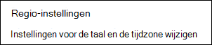
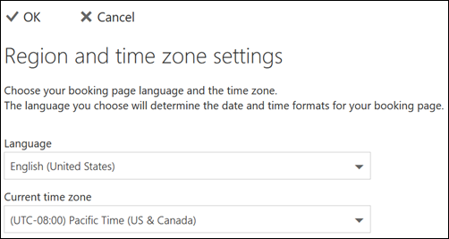

# Taal en tijdzones instellen in Microsoft Bookings

Als u Microsoft Bookings en Bookings gebruikt, kunt u op het verkeerde moment de instellingen voor de tijdzone wijzigen. Ook als sommige Bookings een onjuiste taal bevat, moet u mogelijk uw taalinstellingen wijzigen.

Er zijn twee aparte instellingen voor de taal en de tijdzone voor bookings. Met de eerste instelling beheert u de taal en tijdzone van de boekings agenda en wordt ingesteld met de instellingen van de webversie van Outlook voor de persoonlijke agenda van de aangemelde gebruiker. De tweede instelling is van invloed op de selfservice boekings pagina die door uw klanten wordt gebruikt en is ingesteld met behulp van een ' Landinstellingen ' pagina waarmee de taal en de tijdzone alleen voor die pagina worden bestuurd.

## Taal en tijdzone instellen voor een boekingsagenda

Voor de boekings agenda worden de instellingen voor de taal en de tijdzone van gebruikers van de aangemelde gebruiker gebruikt. Als de tijdzone van de aangemelde gebruiker bijvoorbeeld is ingesteld op Eastern Standard Time (EST), worden in de boekings agenda bestaande begin-en eindtijden van afspraken weergegeven in het onderzoek. Deze tijdzone werd oorspronkelijk ingesteld wanneer de Microsoft 365 en de webversie van Outlook van de gebruiker zijn gemaakt.

De taal en tijdzone instellen voor de boekings agenda:

1. Meld u aan bij Microsoft 365 en selecteer de Outlook-tegel op de openingspagina (zoals weergegeven in de onderstaande schermafbeelding) of in het startprogramma voor apps van Microsoft 365.

   

1. Wanneer Outlook is geopend, selecteert u het **tandwiel pictogram** in de rechterbovenhoek van het scherm om uw persoonlijke instellingen en accountinstellingen te openen en zoekt u naar ' tijdzone ' in het zoekvak van het deelvenster **instellingen** . Het deelvenster wordt bijgewerkt en toont de persoonlijke taal- en tijdzone-instellingen die momenteel voor dit account worden gebruikt. Zoals al vermeld bepaalt deze instelling ook de taal en de tijdzone van de boekingsagenda.

1. Wijzig de taal of de tijdzone door de vervolgkeuzepijl in het vak **taal of de huidige tijdzone** te selecteren en de gewenste instelling te kiezen.

1. Klik op **Opslaan**. Het deelvenster instellingen wordt gesloten, de webversie van Outlook wordt opnieuw gestart en de nieuwe instellingen voor de taal en de tijdzone worden toegepast.

## Taal en tijdzone instellen voor de boekingspagina

1. In Microsoft 365 selecteert u het startprogramma voor apps en selecteert u vervolgens **Bookings**.

1. Selecteer **reserverings pagina** in het navigatiedeelvenster en selecteer **taal-en tijdzone-instellingen wijzigen**.

   

1. Selecteer uw taal en de huidige tijdzone en kies OK.

   
