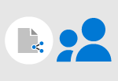

# Overzicht van het delen van zakelijke bestanden

U moet bestanden delen met klanten, klanten, partners, leveranciers en andere personen in uw bedrijf. Hoe kunt u bestanden delen zodat iedereen ze kan vinden, openen en bewerken?

| [Een bestand delen met iemand buiten uw bedrijf](#share-a-file-with-someone-outside-of-your-company)|  [Delen en samenwerken met een klant of zakenpartner](#share-and-collaborate-with-a-client-or-business-partner) |   [Delen binnen uw bedrijf](#share-inside-your-business) |
|--|--|--|

## Een bestand delen met iemand buiten uw bedrijf

- Deel een bestand met iemand buiten uw bedrijf (zoals een klant of een klant) via e-mail als u het maar in één keer nodig hebt.
- Als u een antwoord nodig hebt of als u wilt dat ze bepaalde informatie invullen en terugsturen, kunt u SharePoint of Microsoft Teams gebruiken om het te delen met een bewerkingskoppeling.

Meer informatie over het delen [van bestanden buiten uw organisatie](securely-share-files-externally.md) met veilige koppelingen en het delen van bestanden met een koppeling naar [iedereen.](share-files-externally.md)

## Delen en samenwerken met een klant of zakenpartner

Delen als onderdeel van een project? Of als onderdeel van een doorlopende relatie met een zakelijke partner of leverancier? U kunt iets meer tijd inbrengen en een team instellen in Microsoft Teams en een continue plaats hebben om te delen en samen te werken. Het is eenvoudig om met personen buiten uw bedrijf te werken en u kunt zelfs afzonderlijke kanalen instellen voor aanvullende leveranciers of partners om alles recht te houden.

1. Het team maken.
1. Upload uw bestanden.
1. Nodig uw partners of leveranciers uit voor het team als gastgebruikers om hen toegang te geven.

Meer informatie over het delen [van bestanden buiten uw organisatie met beveiligde koppeling](https://support.microsoft.com/office/7266f44e-3e06-4736-b9d3-0580c24bba34)en.

## Delen binnen uw bedrijf

Als u met bestanden werkt die u in uw bedrijf deelt, is het ook een goed idee om een team in te stellen in Microsoft Teams. Deel uw bestanden daar en iedereen in uw bedrijf kan ze gemakkelijk vinden en bewerken, en u weet dat u allemaal aan dezelfde pagina werkt.

1. Maak het team en nodig uw team voor het team uit.
1. Upload uw bestanden.

Meer informatie over [bestandsopslag voor bedrijven](https://support.microsoft.com/office/e4d98e10-3532-4eed-85d6-92728454e32b) en [bestandsopslag voor werknemers.](https://support.microsoft.com/office/12dbe3e4-dbef-48f8-a90e-87f1bc607073)

## Hoe u dit voor elkaar krijgt

Hebt u wat hulp nodig? Meer informatie over het volgende:

- [Bijlagen verzenden en ontvangen](https://support.microsoft.com/en-us/office/sending-and-receiving-attachments-d32cd5ad-c7c5-49df-814d-4c17a5d3beb0)
- [Bestanden en mappen delen met OneDrive](https://support.microsoft.com/en-us/office/share-files-and-folders-with-microsoft-365-business-72f26d6c-bf9e-432c-8b96-e3c2437f5b65)
- [Een team voor het hele bedrijf maken](https://support.microsoft.com/en-us/office/create-an-org-wide-team-037bb27a-bcc9-48fe-8d72-44d9482420a3)
- [Gasten toevoegen aan een team](https://support.microsoft.com/en-us/office/add-guests-to-a-team-in-teams-fccb4fa6-f864-4508-bdde-256e7384a14f)

Download een infographic voor een kort overzicht van de manieren waarop u uw zakelijke bestanden kunt delen. 

[PDF](https://go.microsoft.com/fwlink/?linkid=2079435)  |  [PowerPoint](https://go.microsoft.com/fwlink/?linkid=2079438)