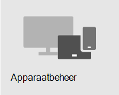

# Overzicht van beveiligingOverview of security

> [!VIDEO https://www.microsoft.com/videoplayer/embed/RE4mzxI?autoplay=false]

Microsoft 365 Business Premium biedt functies voor bedreigingsbeveiliging, gegevensbescherming en apparaatbeheer om u te helpen uw bedrijf te beschermen tegen onlinebedreigingen en ongeautoriseerde toegang, en om bedrijfsgegevens op uw telefoons, tablets en computers te beveiligen en te beheren.Microsoft 365 Business Premium provides threat protection, data protection, and device management features to help you protect your company from online threats and unauthorized access, as well as protect and manage company data on your phones, tablets, and computers.

| [BedreigingsbeveiligingThreat protection](#threat-protection)|  [GegevensbeschermingData protection](#data-protection) |   [ApparaatbeheerDevice management](#device-management) |
|--|--|--|

## BedreigingsbeveiligingThreat protection

Microsoft 365 Business Premium bevat Office 365 Advanced Threat Protection (ATP), een cloud-gebaseerde e-mailfilterservice die u beschermt tegen malware, ransomware, schadelijke koppelingen en meer.Microsoft 365 Business Premium includes Office 365 Advanced Threat Protection (ATP), a cloud-based email filtering service that protects you from malware, ransomware, harmful links, and more. ATP Safe Koppelingen beschermt u tegen schadelijke URL's in e-mail of Office documenten.ATP Safe Links protects you from malicious URLs in email or Office documents. ATP Safe bijlagen beschermt u tegen malware en virussen die zijn gekoppeld aan berichten of documenten.ATP Safe Attachments protects you from malware and viruses attached to messages or documents.

Voor meervoudige verificatie (MFA) of verificatie in twee stappen moet u een tweede vorm van verificatie presenteren, zoals een verificatiecode, om uw identiteit te bevestigen voordat u toegang hebt tot resources.Multi-factor authentication (MFA), or two-step verification, requires you to present a second form of authentication, such as a verification code, to confirm your identity before you can access resources.  

Windows Defender biedt uitgebreide beveiliging voor uw systeem, bestanden en onlineactiviteiten tegen virussen, malware, spyware en andere bedreigingen.Windows Defender provides comprehensive protection for your system, files, and online activities from viruses, malware, spyware, and other threats.

## GegevensbeschermingData protection

Gegevensbeveiligingsfuncties in Microsoft 365 Business Premium zorgen ervoor dat belangrijke gegevens veilig blijven en dat alleen geautoriseerde personen er toegang toe hebben.Data protection features in Microsoft 365 Business Premium help ensure that important data stays secure and only authorized people have access to it.

U kunt DLP-beleid (Data Loss Prevention) gebruiken om gevoelige informatie te identificeren en te beheren, zoals sociale zekerheid of creditcardnummers, zodat deze niet per ongeluk worden gedeeld.You can use data loss prevention (DLP) policies to identify and manage sensitive information, such as Social Security or credit card numbers, so that it isn't mistakenly shared. 

Office 365-berichtversleuteling versleutelings- en toegangsrechten combineert om ervoor te zorgen dat alleen beoogde geadresseerden berichtinhoud kunnen bekijken.Office 365 Message Encryption combines encryption and access rights capabilities to help ensure that only intended recipients can view message content. Office 365-berichtversleuteling werkt met Outlook.com, Yahoo! en Gmail en andere e-mailservices.Office 365 Message Encryption works with Outlook.com, Yahoo!, and Gmail, and other email services.

Exchange Online Archiving is een op de cloud gebaseerde archiveringsoplossing die werkt met Microsoft Exchange of Exchange Online om geavanceerde archiveringsmogelijkheden te bieden, waaronder opslag en redundantie van gegevens.Exchange Online Archiving is a cloud-based archiving solution that works with Microsoft Exchange or Exchange Online to provide advanced archiving capabilities, including holds and data redundancy. U kunt bewaarbeleid gebruiken om uw organisatie te helpen de verplichtingen voor e-mail en andere communicatie te beperken.You can use retention policies to help your organization reduce the liabilities associated with email and other communications. Als uw bedrijf verplicht is om communicatie met betrekking tot rechtszaken te behouden, kunt u In-Place Bewaar- en procesprocedures gebruiken om gerelateerde e-mail te behouden.If your company is required to retain communications related to litigation, you can use In-Place Holds and Litigation Holds to preserve related email.

## ApparaatbeheerDevice management

Microsoft 365 Business Premium geavanceerde apparaatbeheerfuncties kunt u controleren en bepalen wat gebruikers kunnen doen met geregistreerde apparaten.Microsoft 365 Business Premium advanced device management features let you monitor and control what users can do with enrolled devices. Deze functies omvatten voorwaardelijke toegang, MDM (Mobile Device Management), BitLocker en automatische updates.These features include conditional access, Mobile Device Management (MDM), BitLocker, and automatic updates.

U kunt beleid voor voorwaardelijke toegang gebruiken om extra beveiligingsmaatregelen voor bepaalde gebruikers en taken te vereisen.You can use conditional access policies to require additional security measures for certain users and tasks. U kunt bijvoorbeeld meervoudige verificatie (MFA) vereisen of clients blokkeren die geen ondersteuning bieden voor voorwaardelijke toegang.For example, you can require multi-factor authentication (MFA) or block clients that don't support conditional access.

Met MDM kunt u helpen bij het beveiligen en beheren van mobiele apparaten van uw gebruikers, zoals iPhones, iPads, Androids en Windows telefoons.With MDM, you can help secure and manage your users' mobile devices like iPhones, iPads, Androids, and Windows phones. U kunt beveiligingsbeleid voor apparaten maken en beheren, op afstand een apparaat wissen om alle bedrijfsgegevens te verwijderen, een apparaat opnieuw instellen op fabrieksinstellingen en gedetailleerde apparaatrapporten bekijken.You can create and manage device security policies, remotely wipe a device to remove all company data, reset a device to factory settings, and view detailed device reports. 

U kunt een BitLocker gebruiken om gegevens te beschermen in geval van verlies of diefstal van een apparaat en u kunt Windows Exploit Guard inschakelen om geavanceerde beveiliging tegen ransomware te bieden.You can enable BitLocker encryption to help protect data in case a device is lost or stolen, and enable Windows Exploit Guard to provide advanced protection against ransomware.

U kunt automatische updates zo configureren dat de nieuwste beveiligingsfuncties en -updates worden toegepast op alle gebruikersapparaten.You can configure automatic updates so that the latest security features and updates are applied to all user devices. 

## Aanbevolen beveiligingsadviesRecommended security guidance

Als u Microsoft Business Premium, kunt u de beveiliging het snelste instellen en veilig samenwerken door de richtlijnen in deze bibliotheek te volgen: Microsoft 365 voor kleinere bedrijven en [campagnes.](../campaigns/index.md)If you have Microsoft Business Premium, the quickest way to setup security and begin collaborating safely is to follow the guidance in this library: [Microsoft 365 for smaller businesses and campaigns](../campaigns/index.md). Deze richtlijnen zijn ontwikkeld in samenwerking met het Microsoft Defending Democracy-team om alle kleine zakelijke klanten te beschermen tegen cyberdreigingen die zijn gestart door geavanceerde hackers.This guidance was developed in partnership with the Microsoft Defending Democracy team to protect all small business customers against cyber threats launched by sophisticated hackers.