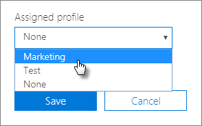

# AutoPilot-profielen maken en bewerken

## Een profiel maken

Een profiel geldt voor een apparaat of een groep apparaten.
  
1. Kies In het Microsoft 365 Business Admin Center de optie **Apparaten** \> **AutoPilot**.
  
2. Kies op de pagina **AutoPilot** het tabblad **Profielen** \> **maken**.
    
3. Voer op de pagina **Profiel maken** een naam in voor het profiel waarmee u deze identificeren, bijvoorbeeld Marketing. Schakel de gewenste instelling in en kies **Opslaan**. Zie [Instellingen voor AutoPilot-profiel voor](autopilot-profile-settings.md)meer informatie over de profielinstellingen van AutoPilot.
    
    
  
### Een profiel toepassen op een apparaat

Nadat u een profiel hebt gemaakt, u het toepassen op een apparaat of een groep apparaten. U een bestaand profiel kiezen in de [stapsgewijze handleiding](add-autopilot-devices-and-profile.md) en het toepassen op nieuwe apparaten of een bestaand profiel vervangen voor een apparaat of groep apparaten. 
  
1. Kies op de pagina **Windows voorbereiden** het tabblad **Apparaten**. 
    
2. Schakel het selectievakje naast een apparaatnaam in en kies in het deelvenster **Apparaat** \> een profiel in de vervolgkeuzelijst **Toegewezen profiel** **opslaan**.
    
    
  
## Een profiel bewerken of verwijderen

Wanneer u een profiel aan een apparaat hebt toegewezen, kunt u dit bijwerken, zelfs als u het apparaat al aan een gebruiker hebt gegeven. Wanneer het apparaat verbinding maakt met internet, wordt de nieuwste versie van uw profiel gedownload tijdens het installatieproces. Als de gebruiker het apparaat herstelt naar de fabrieksinstellingen, worden de nieuwste updates opnieuw naar uw profiel gedownload. 
  
### Een profiel bewerken

1. Kies op de pagina **Windows voorbereiden** het tabblad **Profielen**. 
    
2. Schakel het selectievakje naast een apparaatnaam **** in en werk in het \> deelvenster Profiel een van de beschikbare instellingen **Opslaan**bij.
    
    Als u dit doet voordat een gebruiker het apparaat verbindt met internet, wordt het profiel toegepast tijdens het installatieproces.
    
### Een profiel verwijderen

1. Kies op de pagina **Windows voorbereiden** het tabblad **Profielen**. 
    
2. Schakel het selectievakje naast een apparaatnaam in en selecteer in het deelvenster **Profiel** **profiel** \> **opslaan**.
    
    Wanneer u een profiel verwijdert, wordt dit verwijderd van het apparaat of de groep apparaten waaraan dit was toegewezen.
    
### Een profiel verwijderen

1. Kies op de pagina **Windows voorbereiden** het tabblad **Apparaten**. 
    
2. Schakel het selectievakje naast een apparaatnaam **** in en kies in het deelvenster Apparaat \> **Geen** in de vervolgkeuzelijst **Toegewezen profiel** **Opslaan**.
    
