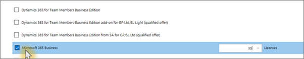

# Microsoft 365 Business kopenGet Microsoft 365 Business

## Microsoft 365 Business verkrijgen bij MicrosoftGet Microsoft 365 Business from Microsoft

Als u niet met een partner werkt en Microsoft 365 Business wilt kopen, kunt u [contact opnemen met ](https://www.microsoft.com/en-US/microsoft-365/business).If you don't have a partner and want to get Microsoft 365 Business, you can [buy it here](https://www.microsoft.com/en-US/microsoft-365/business).

Zie [Aanmelden voor Microsoft 365 Business](sign-up.md) voor gedetailleerde instructies.See [sign up for Microsoft 365 Business](sign-up.md) for detailed instructions.

U ook naar een [Microsoft Store](https://www.microsoft.com/en-us/store/locations/find-a-store?icid=en_US_Store_UH_FAS) gaan om Microsoft 365 Business te kopen en installatiehulp te krijgen.You can also head over to a [Microsoft Store](https://www.microsoft.com/en-us/store/locations/find-a-store?icid=en_US_Store_UH_FAS) to buy Microsoft 365 Business and get setup help.
  
## Microsoft 365 Business verkrijgen via Microsoft Partner CenterGet Microsoft 365 Business from Microsoft Partner Center

1. Meld u aan bij [Microsoft Partner Center](https://go.microsoft.com/fwlink/p/?linkid=849910) met de referenties die u hebt gemaakt tijdens uw inschrijving bij het CSP-programma (cloudserviceprovider).Sign in at [Microsoft Partner Center](https://go.microsoft.com/fwlink/p/?linkid=849910) by using the credentials you created when you enrolled to the Cloud Service Provider (CSP) program. 
    
2. Kies in het partnerdashboard **Klanten**en selecteer vervolgens uw klant of voeg een nieuwe klant toe voordat u Microsoft 365 Business krijgt.On the Partner Dashboard, choose **Customers**, then select your customer or add a new customer before you get Microsoft 365 Business.
    
    
  
3. Selecteer op de pagina **Abonnement** van de klant **een abonnement toevoegen**, kies de optie Kleine bedrijven onder Catalogus en kies vervolgens Microsoft **365 Business**.On the customer's **Subscription** page, select **Add subscription**, choose the Small business option under Catalog, and then choose **Microsoft 365 Business**.
    
    Selecteer het aantal licenties dat u nodig hebt (maximaal 300).Select the number of licenses you need (up to 300). Als u meer dan 300 gebruikers hebt, raadpleeg dan [Microsoft 365 Enterprise](https://go.microsoft.com/fwlink/p/?linkid=862316).If you have more than 300 users, see [Microsoft 365 Enterprise](https://go.microsoft.com/fwlink/p/?linkid=862316) instead. 
    
    
  
    Voer de rest van de stappen uit voor het toevoegen van een nieuwe klant, inclusief de bedrijfsnaam.Complete the rest of the steps for adding a new customer, including the business name.
    

