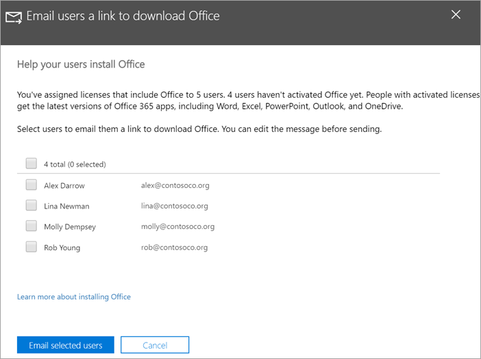

# Uw gebruikers helpen bij het Office op Windows 10 apparatenHelp your users install Office on Windows 10 devices

U kunt snel en eenvoudig Office op Windows 10 pc's installeren vanuit het Microsoft 365 beheercentrum.You can quickly and easily install Office on Windows 10 PCs from the Microsoft 365 admin center.
  
Lees [Office-clientinstallatie voorbereiden](prepare-for-office-client-deployment.md) voordat u begint als u wilt weten hoe dit werkt met eerder geïnstalleerde Office-apps.To understand how this works with previously installed Office apps, read [Prepare for Office client installation](prepare-for-office-client-deployment.md) before you get started.

Bekijk een korte video over het installeren van Office apps.Watch a short video about installing Office apps.  

> [!VIDEO https://www.microsoft.com/videoplayer/embed/acce002c-0756-4b64-ac5d-2198ee96a9b1] 

Als u deze video nuttig vond, raadpleegt u dan de [complete reeks trainingen voor kleine bedrijven en nieuwe gebruikers van Microsoft 365](../business-video/index.yml).If you found this video helpful, check out the [complete training series for small businesses and those new to Microsoft 365](../business-video/index.yml).

## Office-implementaties beherenManage Office deployments

1. Ga naar het beheercentrum bij <a href="https://go.microsoft.com/fwlink/p/?linkid=2024339" target="_blank">https://admin.microsoft.com</a> en meld u aan met globale beheerdersreferenties.Go to the admin center at <a href="https://go.microsoft.com/fwlink/p/?linkid=2024339" target="_blank">https://admin.microsoft.com</a>, and sign in with global admin credentials. 

2. Ga naar **Setup** in het linkernavigatiedeelvenster en schuif op **de** pagina Setup naar **Apps en updates.**Go to **Setup** in the left navigation pane, and on the **Setup** page, scroll to **Apps and updates**.
    > [!NOTE]
    > Mogelijk ziet u deze kaart niet als al uw gebruikers Office geïnstalleerd.You might not see this card if all of your  users have installed Office apps.
  
3. Kies op **de Help-gebruikers hun Office app-kaart** weergeven **en** klik vervolgens op Aan de **slag.**On the **Help users install their Office apps** card, choose **View**, and then **Get started**.
    
4. Selecteer in **het deelvenster E-mailgebruikers** een koppeling om Office te downloaden de gebruikers die u wilt e-mailen en vervolgens Geselecteerde gebruikers **e-mailen.**On the **Email users a link to download Office** panel, select the users you want to email, and then **Email selected users**.

   

## Voor meer informatie over het instellen en gebruiken van Microsoft 365 Business PremiumFor more on setting up and using Microsoft 365 Business Premium

[Trainingsvideo's voor Microsoft 365 voor bedrijvenMicrosoft 365 for business training videos](../business-video/index.yml)