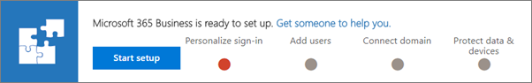

# Migreren naar Microsoft 365 Business van Office 365 Business PremiumMigrate to Microsoft 365 Business from Office 365 Business Premium

Als u al een Office 365 voor zakelijke abonnement, bijvoorbeeld Office 365 Business Premium, kunt u eenvoudig licenties toevoegen aan Microsoft 365 Business en deze toewijzen aan bepaalde of alle gebruikers.If you already have an Office 365 for business subscription, for example, Office 365 Business Premium, you can easily add licenses to Microsoft 365 Business, and assign them to some, or all users.
  
> [!NOTE]
> U kunt de knop [Switch plannen](https://support.office.com/article/73318661-8f33-478b-bcc7-fb8d69dbb22a?.aspx#switchbutton) niet gebruiken voor een upgrade naar Microsoft 365 Business nog.You can't use the [Switch plans](https://support.office.com/article/73318661-8f33-478b-bcc7-fb8d69dbb22a?.aspx#switchbutton) button to upgrade to Microsoft 365 Business yet. 
  
## Microsoft 365 Business licenties toevoegenAdd Microsoft 365 Business licenses

Er zijn twee manieren om Microsoft 365 Business. Als u een partner hebt, kan hij of zij kopen Microsoft 365 Business voor u bij [Microsoft Partner Center](get-microsoft-365-business.md). Uw partner kunt u ook de overgang naar Microsoft 365 Business.You have two ways to get Microsoft 365 Business. If you have a partner, he or she can purchase Microsoft 365 Business for you from [Microsoft Partner Center](get-microsoft-365-business.md). Your partner can also help you transition to Microsoft 365 Business.
  
Als u zelf uw abonnement beheren, kunt u [contact op met sales](https://www.microsoft.com/microsoft-365/business) Microsoft 365 Business licenties kopen.If you manage your own subscription, you can [contact sales](https://www.microsoft.com/microsoft-365/business) to purchase Microsoft 365 Business licenses. 
  
Zie [toevoegen, wijzigen of verwijderen van een abonnement advisor partner](https://support.office.com/article/f86e8177-936e-491e-9024-44dea2b296ff) om erachter te komen hoe u kunt aan de slag met een partner.See [Add, change, or delete a subscription advisor partner](https://support.office.com/article/f86e8177-936e-491e-9024-44dea2b296ff) to find out how you can start working with a partner. 
  
Als u een koppeling naar uw licenties te kopen, wordt een wizard zoals in de onderstaande doorlopen. Kies **Ja, voeg toe aan Mijn account**. U kunt ook het nummer van het certificaat en de betalingsmethode kiezen.If you are given a link to purchase your licences, you will walk through a wizard like the one below. Choose **Yes, add it to my account**. You can also pick the number of licences and the method of payment.
  

  
## Licenties voor Microsoft 365 toewijzenAssign Microsoft 365 licenses

1. Zodra u nieuwe licenties hebt aangeschaft en dit is de eerste keer dat u hebt gedaan, wordt het spandoek setup voor Microsoft 365 Business op het admin center weergegeven.Once you have purchased new licenses, and this is the first time you did, the setup banner for Microsoft 365 Business will display on top of the admin center.
    
    > [!NOTE]
    > De setup banner is een gelegenheid voor nieuwe gebruikers, een nieuw domein toevoegen en e-mailadres voor nieuwe gebruikers migreren. Als u niet doen wilt, u nog steeds de wizard en standaardopties kiezen om te maken van de introductiepagina voor beheer.The setup banner is an opportunity to add new users, a new domain, and migrate email for new users. If you don't plan to do any, you should still go through the wizard and choose default options to make it disappear from the admin home page. 
  
   
  
    Kies **Setup starten**.Choose **Start setup**.
    
2. Op de pagina **aanpassen, het aanmelden en e-mailadres** , kunt u een domein door **verbinding maken met een domein dat u al eigenaar** kiezen als u gebruiken de opportunity wilt naar een ander domein toevoegen aan uw abonnement toevoegen.On the **Personalize your sign-in and email** page, you can add a domain by choosing **Connect a domain you already own** if you want to use this opportunity to add another domain to your subscription. 
    
    Als u al een domein hebt ingesteld, het tweede veld dat wordt aangegeven en vanzelfsprekend **Doorgaan met behulp van** \< _de domeinnaam_ \> **voor e-mail en het aanmelden**. Als u een domein met u abonnement niet hebt ingesteld, wordt dat **Doorgaan met behulp van** \< _de name.onmicrosoft.com van uw bedrijf_ \> **voor e-mail en het aanmelden**.    If you have already set up a domain, the second field will indicate that and will say **Continue using** \<  _your domain name_\> **for email and signing in**. If you haven't set up a domain with you subscription, it will say **Continue using** \<  _your company name.onmicrosoft.com_\> **for email and signing in**.
    
    Kies **Volgende**.Choose **Next**.
    
    
  
3. U kunt op de pagina **nieuwe gebruikers toevoegen** , nieuwe gebruikers toevoegen als u nieuwe werknemers die u wilt toewijzen aan de licenties voor Microsoft 365 Business.On the **Add new users** page, you can add new users, if you have new employees that you want to assign the Microsoft 365 Business licenses to. 
    
    Als u geen nieuwe werknemers toevoegen en certificaten toewijzen aan bestaande gebruikers wilt, kies **volgende**.If you don't have new employees to add and want to assign licences to existing users, choose **Next**.
    
4. Op de \*\* migreren e-mailberichten \*\* pagina u kiezen kunt voor het migreren van e-mailadres voor alle nieuwe gebruikers die u in stap 3 hebt toegevoegd. U kunt deze stap ook overslaan. Kies **volgende**.On the \*\* Migrate email messages \*\* page you can choose to migrate email for any of the new users you added in step 3. You can skip this step also. Choose **Next**.
    
5. Kies **Ga naar het beheercentrum**en doorgaan met setup er op de laatste pagina.On the last page, choose **go to the admin center**, and continue setup there.
    
6. Ga in het beheercentrum op **gebruikers** \> **actieve gebruikers**.In the admin center, go to **Users** \> **Active users**.
    
7. Selecteer de gebruiker aan wie u wilt de **Microsoft 365 Business** licentie toewijzen en kies vervolgens **bewerken** naast **Productlicenties**.Select the user to whom you want to assign the **Microsoft 365 Business** license to, and then choose **Edit** next to **Product Licenses**.
    
    
  
8. Dia in de **productlicenties van** **Microsoft 365 Business** **aan** \> **Opslaan**, en vervolgens op **sluiten**.In **Product licenses** slide **Microsoft 365 Business** to **On** \> **Save**, and then **Close**.
    
Nadat u de oorspronkelijke licentie hebt aangeschaft voor Microsoft 365 Business, kunt u nu ook toevoegen meer in **Facturering** \> **Inkoop services**. U kunt op de pagina **services kopen** klikt u op de weglatingstekens op het visitekaartje van **Microsoft 365** en **licentie-aantal wijzigen** meer kiezen.Once you have purchased the initial license for Microsoft 365 Business, you can now also add more in **Billing** \> **Purchase services**. On the **Purchase services** page you can click on the ellipses on the **Microsoft 365 Business** card, and choose **Change license quantity** to purchase more. 
  
## Gebruikersapparaten en -bestanden beveiligenProtect user devices and files

Nadat u licenties hebt toegewezen aan Microsoft 365 Business, kunt u beginnen met het beschermen van apparaten en bestanden van de gebruikers.After you have assigned licenses to Microsoft 365 Business, you can start protecting the users' devices and files.
  
1. Ga naar **apparaten** in het admin center, in de Linkernavigatie \> **beleid**.In the admin center, in the left nav, go to **Devices** \> **Policies**.
    
2. Kies op de pagina **beleid voor apparaat** **toevoegen**.On the **Device policies** page, choose **Add**.
    
3. Het beleid een naam geven in het deelvenster **beleid toevoegen** en kies een **type beleid** in de vervolgkeuzelijst.In the **Add policy** pane give the policy a name, and then choose a **Policy type** from the drop-down. 
    
    U kunt beleidsregels voor toepassingen voor het beveiligen van bestanden op Android en iPhone-apparaten, evenals Windows 10 instellen en kunt u een apparaat configuratie van beleid voor een bedrijf dat eigendom is Windows 10-apparaten instellen. Zie de volgende koppelingen voor meer informatie:You can set up application policies for protecting files on Android and iPhone devices, as well as Windows 10, and you can set up device configuration policies for company owned Windows 10 devices. See the following links for details:
    
  - [Instellingen voor app-beveiliging instellen voor Android- of iOS-apparatenSet app protection settings for Android or iOS devices](app-protection-settings-for-android-and-ios.md)
    
  - [Instellingen voor toepassingsbeveiliging instellen voor Windows 10-apparatenSet application protection settings for Windows 10 devices](protection-settings-for-windows-10-devices.md)
    
  - [Instellingen voor apparaatbeveiliging instellen voor Windows 10-pc'sSet device protection settings for Windows 10 PCs](protection-settings-for-windows-10-pcs.md)
    
   
  
4. Als u een beleid ingesteld, kunnen u en uw medewerkers-apparaten instellen:Once you set up policies, you and your employees can set up devices:
    
  - Als Windows niet al op Pro Maker Windows update, moet u [deze Pro makers van Update voor Windows bijwerken](upgrade-to-windows-pro-creators-update.md).If your Windows aren't already on Windows Pro Creator update, you will need to [upgrade them to Windows Pro Creators Update](upgrade-to-windows-pro-creators-update.md).
    
  - Zie [Windows-apparaten voor gebruikers van Microsoft 365 Business](set-up-windows-devices.md) voor stappen voor Windows-apparaten.See [Set up Windows devices for Microsoft 365 Business users](set-up-windows-devices.md) for steps for Windows devices. 
    
  - Zie [mobiele apparaten voor gebruikers van Microsoft 365 Business](set-up-mobile-devices.md) voor stappen voor Android-telefoons en iPhones.See [Set up mobile devices for Microsoft 365 Business users](set-up-mobile-devices.md) for steps for Android phones and iPhones. 
    
5. Zie [voorbereiden voor clientimplementatie Office van Microsoft 365 Business](prepare-for-office-client-deployment.md) en [automatisch installeren of verwijderen van Office voor Windows 10-apparaten](auto-install-or-uninstall-office.md)automatisch installeren van Office-clienttoepassingen.To automatically install Office client apps, see [Prepare for Office client deployment by Microsoft 365 Business](prepare-for-office-client-deployment.md) and [Automatically install or uninstall Office on Windows 10 devices](auto-install-or-uninstall-office.md).
    

