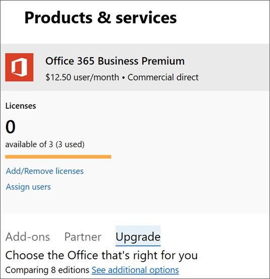

# Upgraden naar Microsoft 365 Business vanuit Office 365 Business PremiumUpgrade to Microsoft 365 Business from Office 365 Business Premium

Als u een [abonnement op Office 365 voor Bedrijven](https://products.office.com/compare-all-microsoft-office-products-4-column?activetab=tab:primaryr2)hebt, bijvoorbeeld Office 365 Business Premium, u eenvoudig upgraden naar Microsoft 365 Business.If you have an [Office 365 for business subscription](https://products.office.com/compare-all-microsoft-office-products-4-column?activetab=tab:primaryr2), for example, Office 365 Business Premium, you can easily upgrade to Microsoft 365 Business. Upgrade naar Microsoft 365 Business als u het:Upgrade to Microsoft 365 Business if you want to add: 
- Windows 10 Pro (naar pc's met Windows 8 of hoger)Windows 10 Pro (to PCs running Windows 8 or later)
- Eenvoudige besturingselementen die bedrijfsgegevens op apparaten beherenSimple controls that manage business data on devices
- Geavanceerde beveiligingsmogelijkheden.Advanced security capabilities.
Meer informatie over Microsoft 365 Business op [Microsoft.com](https://www.microsoft.com/microsoft-365/business)Find out more about Microsoft 365 Business at [Microsoft.com](https://www.microsoft.com/microsoft-365/business)

## Wat is het verschil tussen Office 365 Business Premium en Microsoft 365 Business?What's the difference between Office 365 Business Premium and Microsoft 365 Business?
We hebben een vergelijking naast elkaar van deze twee abonnementen toegevoegd aan de [Microsoft 365 Business Service Description](https://docs.microsoft.com/office365/servicedescriptions/microsoft-365-service-descriptions/microsoft-365-business-service-description).We've added a side-by-side comparison of these two plans to the [Microsoft 365 Business Service Description](https://docs.microsoft.com/office365/servicedescriptions/microsoft-365-service-descriptions/microsoft-365-business-service-description). 

## Voordat u aan de slag gaatBefore you get started

- **Wanneer moet ik ervoor kiezen om te upgraden?****When should I choose to upgrade?** Upgraden is de juiste keuze wanneer u **alle gebruikers** wilt upgraden die aan één abonnement zijn toegewezen.Upgrade is the right choice when you want to upgrade **all users** assigned to a single plan. Wanneer u voor een upgrade kiest, worden alle abonnementsgebruikers tegelijkertijd overgeschakeld naar een ander abonnement.When you choose upgrade, all plan users get switched to another plan at the same time. Als u niet iedereen wilt upgraden die aan één abonnement is toegewezen, koopt u licenties voor het nieuwe abonnement (in dit geval Microsoft 365 Business) en wijst u [deze licenties afzonderlijk toe](https://docs.microsoft.com/office365/admin/manage/assign-licenses-to-users) aan elke gebruiker die u wilt upgraden.If you don't want to upgrade everyone assigned to a single plan, buy licenses for the new plan (in this case Microsoft 365 Business), and [assign those licenses individually](https://docs.microsoft.com/office365/admin/manage/assign-licenses-to-users) to each user that you want to upgrade. 
- **Sommige add-ons kunnen de upgrade voorkomen** Als u een upgrade probeert te starten en u een add-on hebt die voorkomt dat u doorgaat, u de add-on eerst verwijderen en deze later weer toevoegen als u deze nog nodig hebt.**Some add-ons might prevent the upgrade** If you try to start an upgrade and you have an add-on that prevents you from continuing, you can remove the add-on first, and then add it back later if you still need it. 
- **Als u uw abonnement hebt betaald** Er is geen eenvoudig upgradepad voor prepaidabonnementen.**If you prepaid your plan** There isn't a straightforward upgrade path for prepaid plans. U weet of u een prepaidabonnement hebt omdat u uw abonnement hebt ingesteld met een product-id die u mogelijk in een winkel hebt gekocht.You'll know if you have a prepaid plan because you set up your plan using a product ID that you might have purchased in a store. Neem contact op met een partner, ga naar de Microsoft Store of wacht tot uw prepaidabonnement verloopt om over te schakelen naar een nieuw abonnement.Contact a partner, go to the Microsoft Store, or wait until your prepaid plan expires to switch to a new plan.

## Upgraden naar Microsoft 365 BusinessUpgrade to Microsoft 365 Business
Koop uw licenties door deze stappen te volgen in het [nieuwe beheercentrum:](https://docs.microsoft.com/office365/admin/microsoft-365-admin-center-preview)Buy your licenses by following these steps in the [new admin center](https://docs.microsoft.com/office365/admin/microsoft-365-admin-center-preview):
1. Meld u aan <a href="https://go.microsoft.com/fwlink/p/?linkid=837890" target="_blank">https://admin.microsoft.com</a>bij het beheercentrum bij .Sign into the admin center at <a href="https://go.microsoft.com/fwlink/p/?linkid=837890" target="_blank">https://admin.microsoft.com</a>.
2. Ga naar het navigatiedeelvenster en selecteer \> **Factureringsproducten & Services**. \*\*\*\*Go to the navigation pane and select **Billing** \> **Products & Services**. Zoek uw Office 365-abonnement en selecteer het om de details te bekijken.Find your Office 365 subscription and select it to view the details. 

    

3. Selecteer op de volgende pagina **Upgraden**.On the next page, select **Upgrade**. 

      

  > [!NOTE]
  > Als u een bericht ziet waarin staat dat het upgraden van **uw abonnement niet wordt ondersteund met groepslicenties in Azure Active Directory,** u dit veilig negeren, tenzij u een zeer grote organisatie hebt.If you see a message that says **Upgrading your subscription is not supported with group-based licensing in Azure Active Directory**, you can safely ignore this unless you have a very large organization. Organisaties die deze optie hebben geselecteerd, zijn zich ervan bewust dat ze groepslicenties gebruiken.Organizations who have selected this option will be aware that they're using group-based licensing.

4. Vervolgens u een lijst met Office-abonnementen weergeven waarnaar u upgraden.Next, you can view a list of Office plans that you can upgrade to. Zoek in dit geval het Microsoft 365 Business-abonnement.In this case, find the Microsoft 365 Business plan. U omlaag scrollen als u alle Office-apps en -services wilt zien die bij dit abonnement zijn inbegrepen.You can scroll down if you want to see all the Office apps and services that are included with this plan. Selecteer onder **Microsoft 365 Business**de optie **Upgraden** om Microsoft 365 Business aan uw winkelwagentje toe te voegen.Under **Microsoft 365 Business**, select **Upgrade** to add Microsoft 365 Business to your cart.
5. In de kar:In the cart:
    1. We nemen automatisch licenties op voor al uw huidige gebruikers.We'll automatically include licenses for all your current users. Als u meer of minder licenties nodig hebt, moet u [deze licenties afzonderlijk kopen en toewijzen.](https://docs.microsoft.com/office365/admin/manage/assign-licenses-to-users)If you need more or fewer licenses, you need to [buy and assign those licenses individually](https://docs.microsoft.com/office365/admin/manage/assign-licenses-to-users).  
    2. U aanpassen hoe u wilt betalen: maandelijks of jaarlijks.You can adjust how you'd like to pay: monthly or yearly. Selecteer het vervolgkeuzemenu om uw keuze te maken.Select the drop-down menu to make your choice.
6. Selecteer **Ga naar Afhandeling** waar je een overzicht van je aankoop ziet, inclusief de betalingsmethode voor dit account.Select **Go to Checkout** where you'll see a summary of your purchase, including the payment method for this account. U hier ook een promocode toevoegen als u er een hebt.You can also add a promo code here if you have one.
7. Selecteer **Bestelling plaatsen** om uw aankoop te voltooien.Select **Place order** to complete your purchase.
Het duurt Microsoft een paar minuten om uw nieuwe serviceplannen in te stellen.It takes Microsoft a few minutes to set up your new service plans. Als u de voortgang wilt controleren, selecteert u **De upgradestatus controleren**.To check on progress, select **Check upgrade status**. 
1. Zodra uw abonnement klaar is, moet u mogelijk een aantal extra installatiestappen in het beheercentrum uitvoeren.Once your plan is ready, you might need to complete some additional setup steps in the admin center. Selecteer In het navigatiedeelvenster de optie **Start** om eventuele extra installatiestappen uit te voeren.In the navigation pane, select **Home** to complete any additional setup steps.

> [!NOTE]
> U ontvangt een prorata-terugbetaling voor de Office 365-licenties die u niet meer nodig hebt.You'll receive a prorated refund for the Office 365 licenses that you no longer need. Uw bankrekening of creditcard wordt ongeveer twee dagen na het instellen van het nieuwe abonnement in rekening gebracht.Your bank account or credit card will be charged about two days after you set up the new plan.
  
## Gebruikersapparaten en bestanden beveiligenProtect user devices and files

Nu Microsoft 365 Business-licenties zijn toegewezen, voert u stappen uit om apparaten en bestanden te beveiligen.Now that Microsoft 365 Business licenses have been assigned, complete steps to start protecting devices and files. U gebruikt een aantal nieuwe opties in het navigatiedeelvenster van het beheercentrum.You'll use some new options included in the admin center navigation pane.
  
1. Ga in het beheercentrum in het navigatiedeelvenster naar **Het beleid voor** **apparaten** \> .In the admin center, in the navigation pane, go to **Devices** \> **Policies**.
    
2. Selecteer op de pagina **Apparaatbeleid** de optie **Toevoegen**.On the **Device policies** page, select **Add**.
    
3. Geef in het **deelvenster Beleid toevoegen** het beleid een naam (bijvoorbeeld Werkbestanden beveiligen) en kies vervolgens een **beleidstype** in de vervolgkeuzelijst.In the **Add policy** pane give the policy a name (for example, Protect work files), and then choose a **Policy type** from the drop-down list. 
    
    U toepassingsbeleid instellen voor het beveiligen van bestanden op Android- en iPhone-apparaten en Windows 10 en u apparaatconfiguratiebeleid instellen voor Windows 10-apparaten die eigendom zijn van het bedrijf.You can set up application policies for protecting files on Android and iPhone devices, as well as Windows 10, and you can set up device configuration policies for company owned Windows 10 devices. Zie de volgende links voor meer informatie:See the following links for details:
    
  - [Instellingen voor app-beveiliging instellen voor Android- of iOS-apparatenSet app protection settings for Android or iOS devices](app-protection-settings-for-android-and-ios.md)
    
  - [Instellingen voor toepassingsbeveiliging instellen voor Windows 10-apparatenSet application protection settings for Windows 10 devices](protection-settings-for-windows-10-devices.md)
    
  - [Apparaatbeveiligingsinstellingen instellen voor Windows 10-pc'sSet device protection settings for Windows 10 PCs](protection-settings-for-windows-10-pcs.md)
    
  
4. Nadat u beleid hebt ingesteld, kunnen u en uw medewerkers apparaten instellen:After you set up policies, you and your employees can set up devices:
    
  - Als uw Windows-apparaten de Windows Pro Creator-update nog niet gebruiken, moet u [deze upgraden naar Windows Pro Creators Update.](upgrade-to-windows-pro-creators-update.md)If your Windows devices aren't already using the Windows Pro Creator update, you'll need to [upgrade them to Windows Pro Creators Update](upgrade-to-windows-pro-creators-update.md).
    
  - Zie [Windows-apparaten instellen voor Microsoft 365 Business-gebruikers](set-up-windows-devices.md) voor stappen voor Windows-apparaten.See [Set up Windows devices for Microsoft 365 Business users](set-up-windows-devices.md) for steps for Windows devices. 
    
  - Zie [Mobiele apparaten instellen voor Microsoft 365 Business-gebruikers](set-up-mobile-devices.md) voor stappen voor Android-telefoons en iPhones.See [Set up mobile devices for Microsoft 365 Business users](set-up-mobile-devices.md) for steps for Android phones and iPhones. 
