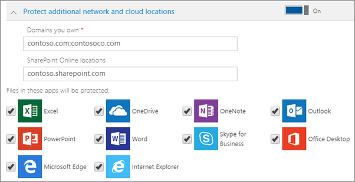

# Instellingen voor toepassingsbeveiliging instellen voor Windows 10-apparaten

Dit artikel is van toepassing op Microsoft 365 Business Premium.

## Beleid voor app-beheer maken voor Windows 10

Als uw gebruikers persoonlijke Windows 10-apparaten gebruiken voor hun werk, kunt u de gegevens op die apparaten ook beschermen.
  
1. Ga naar het beheercentrum via <a href="https://go.microsoft.com/fwlink/p/?linkid=837890" target="_blank">https://admin.microsoft.com</a>. 
    
2. Kies op het linkernavigatiesysteem **Devices** \> **Apparatenbeleid** \> **toevoegen**.

3. Voer in het deelvenster **Beleid toevoegen** een unieke naam in voor dit beleid. 
    
4. Kies onder **Type beleid** de optie **Toepassingsbeheer voor Windows 10**.
    
5. Kies **onder Apparaattype**de optie **Persoonlijk** of eigendom van **het bedrijf.**
    
6. De optie **Werkbestanden versleutelen** is automatisch ingeschakeld. 
    
7. Stel **Voorkomen dat gebruikers bedrijfsgegevens kopiëren naar persoonlijke bestanden en afdwingen dat werkbestanden worden opgeslagen in OneDrive voor Bedrijven** in op **Aan** als u niet wilt dat de gebruikers werkbestanden opslaan op hun pc. 
    
9. **Vouw Herstelgegevens uit op Windows-apparaten**. Wij raden u aan het **aan te**zetten.
    
    Voordat u naar de locatie van het certificaat voor de gegevensherstelagent kunt bladeren, moet u deze eerst maken. Zie Een [EFS-certificaat (Encrypting File System) Data Recovery Agent (DRA) maken en verifiëren](https://go.microsoft.com/fwlink/p/?linkid=853700)voor instructies.
    
    Werkbestanden worden standaard versleuteld met een geheime code die wordt opgeslagen op het apparaat en die gekoppeld is aan het profiel van de gebruiker. Alleen de gebruiker kan het bestand openen en ontsleutelen. Als een apparaat zoekraakt of als een gebruiker wordt verwijderd, kan een bestand echter blijven steken in versleutelde toestand. Een beheerder kan het DRA-certificaat (Data Recovery Agent) gebruiken om het bestand te decoderen.
    
    
  
10. Vouw **extra netwerk- en cloudlocaties** beveiligen als u extra domeinen of SharePoint Online-locaties wilt toevoegen om ervoor te zorgen dat bestanden in alle vermelde apps worden beveiligd. Als u meerdere items moet opgeven voor een veld, gebruikt u een puntkomma (;) tussen de items.
    
    
  
11. Bepaal nu **Voor wie zijn deze instellingen?** Als u niet de standaardbeveiligingsgroep **Alle gebruikers** wilt gebruiken, kiest u **Wijzigen**, zoekt u de beveiligingsgroep die deze instellingen krijgt \> **Selecteren**.
    
12. Kies ten slotte **Toevoegen** om het beleid op te slaan en dit toe te wijzen aan apparaten. 
