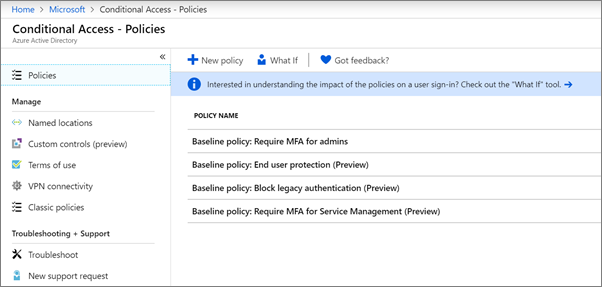

# Beleid voor voorwaardelijke toegang instellen

Dit artikel is van toepassing op Microsoft 365 Business Premium.

[Beleid voor voorwaardelijke toegang](https://docs.microsoft.com/azure/active-directory/conditional-access/overview) voegt aanzienlijke extra beveiliging toe. Microsoft biedt een set basislijnvoorwaarden voor voorwaardelijke toegang die voor alle klanten worden aanbevolen. Basislijnbeleid is een set vooraf gedefinieerde beleidsregels die organisaties helpen beschermen tegen veel voorkomende aanvallen. Deze veelvoorkomende aanvallen kunnen wachtwoordspray, herhaling en phishing omvatten.

Dit beleid vereist dat beheerders en gebruikers een tweede vorm van verificatie invoeren (multifactorauthenticatie of MFA genoemd) wanneer aan bepaalde voorwaarden is voldaan. Als een gebruiker zich bijvoorbeeld vanuit een ander land aanmeldt, kan de aanmelding als riskant worden beschouwd en moet de gebruiker een extra vorm van verificatie opgeven. 

Momenteel omvatten basislijnbeleid het volgende:
- **MFA nodig voor beheerders** &ndash; Vereist meervoudige verificatie voor de meest bevoorrechte beheerdersrollen, inclusief globale beheerder.
- **Beveiliging van eindgebruikers** &ndash; Vereist multi-factor authenticatie voor gebruikers alleen wanneer een aanmelding riskant is. 
- **Verouderde verificatie blokkeren** &ndash; Oudere client-apps en sommige nieuwe apps gebruiken geen nieuwere, veiligere verificatieprotocollen. Deze oudere apps kunnen het beleid voor voorwaardelijke toegang omzeilen en ongeautoriseerde toegang tot uw omgeving krijgen. Dit beleid blokkeert de toegang van clients die geen voorwaardelijke toegang ondersteunen. 
- **MFA vereisen voor servicebeheer** &ndash; Vereist meervoudige verificatie voor toegang tot beheerhulpprogramma's, waaronder Azure-portal (waar u basislijnbeleid configureert). 

Microsoft raadt u aan al deze basislijnregels in te schakelen. Nadat dit beleid is ingeschakeld, worden beheerders en gebruikers gevraagd zich te registreren voor Azure Multii-Factor-verificatie.

Zie [Wat zijn basislijnbeleid voor](https://docs.microsoft.com/azure/active-directory/conditional-access/concept-baseline-protection)meer informatie over dit beleid?

## Basislijnbeleid instellen

1. Ga naar [Azure-portal](https://portal.azure.com)en navigeer naar **Azure Active Directory** Voorwaardelijke \> **toegang**.
    
    Het basislijnbeleid wordt op de pagina weergegeven.    
    
1. Zie de volgende specifieke instructies voor elk beleid:

  - [MFA nodig voor beheerders](https://docs.microsoft.com/azure/active-directory/conditional-access/howto-baseline-protect-administrators)
- [MFA vereisen voor gebruikers](https://docs.microsoft.com/azure/active-directory/conditional-access/howto-baseline-protect-end-users)  
 - [Verouderde verificatie blokkeren](https://docs.microsoft.com/azure/active-directory/conditional-access/howto-baseline-protect-legacy-auth)
  - [MFA vereisen voor servicebeheer](https://docs.microsoft.com/azure/active-directory/conditional-access/howto-baseline-protect-azure)

U veel aanvullende beleidsregels instellen, zoals het vereisen van goedgekeurde client-apps. Zie de documentatie [voor voorwaardelijke toegang](https://docs.microsoft.com/azure/active-directory/conditional-access/)voor meer informatie .
