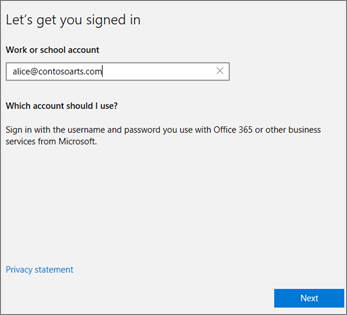
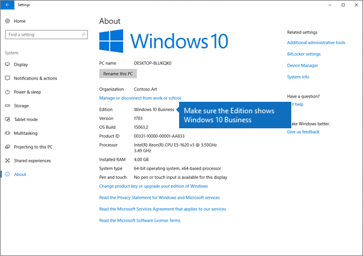

# Windows-pc's instellen voor gebruikers van Microsoft 365 Business

## Vereisten

Voordat u Windows-apparaten voor gebruikers van Microsoft 365 Business kunt instellen, moet u ervoor zorgen dat op alle Windows-apparaten Windows 10 Pro, versie 1703 (makersupdate) wordt uitgevoerd. Windows 10 Pro is een vereiste voor de implementatie van Windows 10 Business. Dat is een set cloudservices en apparaatbeheerfuncties die een aanvulling vormt op Windows 10 Pro en die het centrale beheer en de besturingselementen voor beveiliging van Microsoft 365 Business inschakelt.
  
Als u Windows-apparaten met Windows 7 Pro, Windows 8 Pro of Windows 8.1 Pro hebt, geeft uw abonnement op Microsoft 365 Business u recht op een upgrade naar Windows 10.
  
Volg de stappen in dit onderwerp voor meer informatie over het voor Windows-apparaten uitvoeren van een upgrade naar de Windows 10 Pro makersupdate. [Voor Windows-apparaten upgrade uitvoeren naar Windows Pro makersupdate](upgrade-to-windows-pro-creators-update.md).
  
Zie [Controleren of het apparaat is verbonden met Azure AD](#verify-the-device-is-connected-to-azure-ad) om te controleren of u de upgrade hebt of om te controleren of de upgrade is uitgevoerd.

Bekijk een korte video over het verbinden van Windows met Microsoft 365.  

> [!VIDEO https://www.microsoft.com/videoplayer/embed/RE3yXh3] 

Als u deze video nuttig vond, raadpleegt u dan de [complete training voor kleine bedrijven en degene die nieuw zijn bij Microsoft 365](https://support.office.com/article/6ab4bbcd-79cf-4000-a0bd-d42ce4d12816).
  
## Windows 10-apparaten koppelen aan Azure AD van uw organisatie

Wanneer alle Windows-apparaten in uw organisatie zijn geüpgraded naar Windows 10 Pro Creators Update of al Windows 10 Pro Creators Update uitvoeren, u lid worden van deze apparaten in de Azure Active Directory van uw organisatie. Zodra de apparaten zijn samengevoegd, worden ze automatisch geüpgraded naar Windows 10 Business, dat deel uitmaakt van uw Microsoft 365 Business-abonnement.
  
### Voor een Windows 10 Pro-apparaat dat nieuw is of waarvoor pas een upgrade is uitgevoerd

Voor een nieuw apparaat met Windows 10 Pro makersupdate of voor een apparaat waarvoor wel een upgrade is uitgevoerd naar Windows 10 Pro makersupdate maar waarvoor nog geen apparaatinstellingen voor Windows 10 zijn uitgevoerd, doorloopt u de volgende stappen.
  
1. Doorloop de apparaatinstellingen voor Windows 10 totdat u de pagina **Hoe wilt u instellen?** op uw scherm ziet. 
    
    
  
2. Kies hier voor **Instellen voor een organisatie** en typ vervolgens uw gebruikersnaam en wachtwoord voor Microsoft 365 Business. 
    
3. Voltooi de apparaatinstellingen voor Windows 10.
    
   Als u klaar bent, wordt de gebruiker verbonden met Azure AD van uw organisatie. In [Controleren of het apparaat is verbonden met Azure AD](#verify-the-device-is-connected-to-azure-ad) kunt u zien hoe u dit kunt controleren. 
  
### Voor een apparaat dat al is ingesteld en waarop Windows 10 Pro wordt uitgevoerd

 **Gebruikers verbinden met Azure AD**:
  
1. Klik op de Windows-pc van de gebruiker, waarop Windows 10 Pro, versie 1703 (makersupdate) wordt uitgevoerd (zie [vereisten](pre-requisites-for-data-protection.md)), op het Windows-logo en klik op het pictogram Instellingen.
  
   
  
2. Ga in **Instellingen** naar **Accounts**
  
   
  
3. Klik op de pagina **Uw info** op **Toegang tot werk of school** \> **Verbinden**.
  
   
  
4. Kies in het dialoogvenster **Een werk- of schoolaccount instellen** onder **Andere acties** de optie **Dit apparaat toevoegen aan Azure Active Directory**.
  
   
  
5. Voer uw werk- of school-e-mailadres in op de pagina **Aanmelden** \> **Volgende**.
  
   Voer op de pagina **Wachtwoord opgeven** uw wachtwoord in \> **Aanmelden**.
  
   
  
6. Controleer op de pagina **Controleren of dit uw organisatie is,** controleer of de informatie juist is en klik op **Deelnemen**.
  
   Klik op de pagina **U bent nu helemaal klaar** op **Gereed**.
  
   
  
Als u bestanden hebt geüpload naar OneDrive voor Bedrijven, kunt u deze weer terug synchroniseren. Als u een hulpprogramma van derden hebt gebruikt om profiel en bestanden te migreren, synchroniseert u deze ook met het nieuwe profiel.
  
## Controleren of het apparaat is verbonden met Azure AD

Als u de synchronisatiestatus wilt controleren, klikt u op de pagina **Toegang tot werk of school** in **Instellingen** in het gebied **Verbonden met** _ \<organization name\> _ om de knoppen **Info** en **Verbinding verbreken** weer te geven. Klik op **Info** om de synchronisatiestatus te bekijken. 
  
Klik op de pagina Synchronisatiestatus op Synchroniseren om het recentste beleid voor het beheren van mobiele apparaten naar de pc te downloaden.
  
Als u het Microsoft 365 Business-account wilt gebruiken, gaat u naar de **knop** Start van Windows, klikt u met de rechtermuisknop op uw weergegeven accountafbeelding en vervolgens van **account wisselen**. Meld u aan met het e-mailadres en wachtwoord van uw organisatie.
  

  
## Controleren of het apparaat is bijgewerkt naar Windows 10 Business

Controleer of voor de Windows 10-apparaten die aan Azure AD zijn gekoppeld, een upgrade naar Windows 10 Business is uitgevoerd, als onderdeel van uw abonnement op Microsoft 365 Business.
  
1. Ga naar **Instellingen** \> **Systeem** \> **Info**.
    
2. Controleer of bij **Editie** **Windows 10 Business** wordt vermeld.
    
    
  
## Volgende stappen

Voor het instellen van mobiele apparaten raadpleegt u [Mobiele apparaten instellen voor gebruikers van Microsoft 365 Business](set-up-mobile-devices.md). Voor het instellen van het beveiligingsbeleid voor apparaten of apps raadpleegt u [Microsoft 365 Business beheren](manage.md).
  
## Zie ook

[Trainingsvideo's voor Microsoft 365 Business](https://support.office.com/article/6ab4bbcd-79cf-4000-a0bd-d42ce4d12816)
