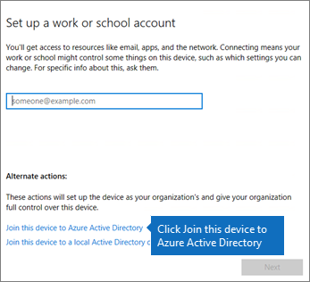

# Windows-apparaten instellen voor Microsoft 365 Business Premium-gebruikers

## Voorwaarden voor het instellen van Windows-apparaten voor Microsoft 365 Business Premium-gebruikers

Voordat u Windows-apparaten instellen voor Microsoft 365 Business Premium-gebruikers, controleert u of op alle Windows-apparaten Windows 10 Pro, versie 1703 (Creators Update) wordt uitgevoerd. Windows 10 Pro is een voorwaarde voor de implementatie van Windows 10 Business, een reeks cloudservices en mogelijkheden voor apparaatbeheer die windows 10 Pro aanvullen en de gecentraliseerde beheer- en beveiligingscontroles van Microsoft 365 Business Premium mogelijk maken.
  
Als u Windows-apparaten hebt met Windows 7 Pro, Windows 8 Pro of Windows 8.1 Pro, geeft uw Microsoft 365 Business Premium-abonnement recht op een Windows 10-upgrade.
  
Volg de stappen in dit onderwerp voor meer informatie over het voor Windows-apparaten uitvoeren van een upgrade naar de Windows 10 Pro makersupdate. [Voor Windows-apparaten upgrade uitvoeren naar Windows Pro makersupdate](upgrade-to-windows-pro-creators-update.md).
  
Zie [Controleren of het apparaat is verbonden met Azure AD](#verify-the-device-is-connected-to-azure-ad) om te controleren of u de upgrade hebt uitgevoerd of om te controleren of de upgrade heeft gewerkt.

Bekijk een korte video over het verbinden van Windows met Microsoft 365.  

> [!VIDEO https://www.microsoft.com/videoplayer/embed/RE3yXh3] 

Als u deze video nuttig vond, raadpleegt u dan de [complete reeks trainingen voor kleine bedrijven en nieuwe gebruikers van Microsoft 365](https://support.microsoft.com/office/6ab4bbcd-79cf-4000-a0bd-d42ce4d12816).
  
## Windows 10-apparaten koppelen aan Azure AD van uw organisatie

Wanneer alle Windows-apparaten in uw organisatie zijn geüpgraded naar Windows 10 Pro Creators Update of al Windows 10 Pro Creators Update draaien, u deze apparaten koppelen aan de Azure Active Directory van uw organisatie. Zodra de apparaten zijn aangesloten, worden ze automatisch geüpgraded naar Windows 10 Business, dat deel uitmaakt van uw Microsoft 365 Business Premium-abonnement.
  
### Voor een Windows 10 Pro-apparaat dat nieuw is of waarvoor pas een upgrade is uitgevoerd

Voor een nieuw apparaat met Windows 10 Pro makersupdate of voor een apparaat waarvoor wel een upgrade is uitgevoerd naar Windows 10 Pro makersupdate maar waarvoor nog geen apparaatinstellingen voor Windows 10 zijn uitgevoerd, doorloopt u de volgende stappen.
  
1. Doorloop de apparaatinstellingen voor Windows 10 totdat u de pagina **Hoe wilt u instellen?** op uw scherm ziet. 
    
    
  
2. Kies hier **Instellen voor een organisatie** en voer vervolgens uw gebruikersnaam en wachtwoord in voor Microsoft 365 Business Premium. 
    
3. Voltooi de apparaatinstellingen voor Windows 10.
    
   Once you're done, the user will be connected to your organization's Azure AD. See [Verify the device is connected to Azure AD](#verify-the-device-is-connected-to-azure-ad) to make sure. 
  
### Voor een apparaat dat al is ingesteld en waarop Windows 10 Pro wordt uitgevoerd

 **Gebruikers verbinden met Azure AD**:
  
1. Klik op de Windows-pc van de gebruiker, waarop Windows 10 Pro, versie 1703 (makersupdate) wordt uitgevoerd (zie [vereisten](pre-requisites-for-data-protection.md)), op het Windows-logo en klik op het pictogram Instellingen.
  
   
  
2. Ga in **Instellingen** naar **Accounts**
  
   
  
3. Klik op de pagina **Uw info** op **Toegang tot werk of school** \> **Verbinden**.
  
   
  
4. Kies in het dialoogvenster **Een werk- of schoolaccount instellen** onder **Andere acties** de optie **Dit apparaat toevoegen aan Azure Active Directory**.
  
   
  
5. Voer uw werk- of school-e-mailadres in op de pagina **Aanmelden** \> **Volgende**.
  
   Voer op de pagina **Wachtwoord opgeven** uw wachtwoord in \> **Aanmelden**.
  
   
  
6. Controleer op de pagina **Controleren of dit uw organisatie is,** controleer of de informatie juist is en klik op **Deelnemen**.
  
   On the **You're all set!** page, click **Done**.
  
   
  
Als u bestanden hebt geüpload naar OneDrive voor Bedrijven, kunt u deze weer terug synchroniseren. Als u een hulpprogramma van derden hebt gebruikt om profiel en bestanden te migreren, synchroniseert u deze ook met het nieuwe profiel.
  
## Controleren of het apparaat is verbonden met Azure AD

Als u uw synchronisatiestatus wilt verifiëren, klikt u op de pagina **Access-werk of school** in **Instellingen**in het gebied **Verbonden met** _ _ om de \<organization name\> knoppen **Info** en **Loskoppelen**bloot te leggen. Klik op **Info** om de synchronisatiestatus te bekijken. 
  
Klik op de pagina Synchronisatiestatus op Synchroniseren om het recentste beleid voor het beheren van mobiele apparaten naar de pc te downloaden.
  
Als u het Microsoft 365 Business Premium-account wilt gebruiken, gaat u naar de knop **Start** van Windows, klikt u met de rechtermuisknop op de afbeelding van uw huidige account en **schakelt u vervolgens van account .** Meld u aan met het e-mailadres en wachtwoord van uw organisatie.
  

  
## Controleren of het apparaat is bijgewerkt naar Windows 10 Business

Controleer of uw Azure AD-apparaten die zijn aangesloten bij Windows 10-apparaten zijn geüpgraded naar Windows 10 Business als onderdeel van uw Microsoft 365 Business Premium-abonnement.
  
1. Ga naar **Instellingen** \> **Systeem** \> **Info**.
    
2. Controleer of bij **Editie** **Windows 10 Business** wordt vermeld.
    
    
  
## Volgende stappen

Zie [Microsoft 365](set-up-mobile-devices.md) [voor bedrijven](manage.md)beheren als u uw mobiele apparaten wilt instellen.
  
## Voor meer informatie over het instellen en gebruiken van Microsoft 365 Business Premium

[Trainingsvideo's voor Microsoft 365 voor bedrijven](https://support.microsoft.com/office/6ab4bbcd-79cf-4000-a0bd-d42ce4d12816)
