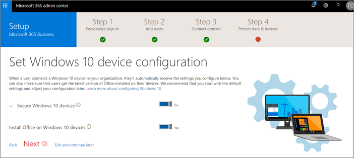

# Microsoft 365 Business instellenSet up Microsoft 365 Business

Voordat u begint, Zie [Microsoft 365 Business ophalen](get-microsoft-365-business.md) voor aanmelding details.Before you get started, see [Get Microsoft 365 Business](get-microsoft-365-business.md) for sign-up details.

Bekijk een [korte video over het instellen van Microsoft 365 Business](https://support.office.com/article/38003e30-9d10-44cf-b596-f1b5f662bfa1) met behulp van de wizard, en wanneer er een Active Directory op de gebouwenWatch a [short video on how to set up Microsoft 365 Business](https://support.office.com/article/38003e30-9d10-44cf-b596-f1b5f662bfa1) by using the set up wizard, and when you don't have an on-premises Active Directory
  

## OverzichtOverview

De meeste van de instellen van de stappen in de wizard setup kan worden uitgevoerd, maar de andere opties worden ook weergegeven.Most of the set up steps can be done in the setup wizard, but the other options are also listed.

1. [Uw domein toevoegen](#add-your-domain-to-personalize-sign-in) (als u uw domein tijdens het [aanmelden](sign-up.md)hebt gekocht, wordt deze stap hebt gedaan.)[Add your domain](#add-your-domain-to-personalize-sign-in) (if you bought your domain during [sign up](sign-up.md), this step is already done.)
2. Gebruikers toevoegen.Add users. U kunt dit op een van de drie manieren doen:You can do this in any of the three ways:
    - In de [wizard setup](#add-users-in-the-wizard).In the [setup wizard](#add-users-in-the-wizard).
    - Adreslijstsynchronisatie toevoegen van [gebruikers met Azure AD verbinding](#add-users-by-using-azure-ad-connect) gebruiken als u een Active directory op gebouwen.Use directory synchronization to [add users by using Azure AD Connect](#add-users-by-using-azure-ad-connect) if you have an on-premises Active directory.
    - U kunt ook [gebruikers later toevoegen](add-users-m365b.md) in het beheercentrum.You can also [add users later](add-users-m365b.md) in the admin center.
3. Beveiligingsbeleid instellen en configureren van apparaten.Set up security policies and configure devices. U kunt dit op een van de drie manieren doen:You can do this in any of the three ways:
    - In de [wizard setup](#set-up-policies-in-the-wizard).In the [setup wizard](#set-up-policies-in-the-wizard).  
    - In de [admin center](#modify-or-add-policies-in-the-admin-center).In the [admin center](#modify-or-add-policies-in-the-admin-center).
    - Klik in het [beheercentrum Intune](https://docs.microsoft.com/intune/what-is-device-management).In the [Intune admin center](https://docs.microsoft.com/intune/what-is-device-management).
4. Instellen en beheren van apparaten in Windows 10.Set up and manage Windows 10 devices.

    Wanneer u een apparaat met WIndows 10 naar Azure AD, krijgen alle beleidsregels toegepast op.When you join a WIndows 10 device to Azure AD, all the policies get applied to it.
    - Configuraties in de [wizard setup van](#set-up-policies-in-the-wizard)Windows 10 instellen.Set up Windows 10 device configurations in the [setup wizard](#set-up-policies-in-the-wizard).
    - Lid worden van een [nieuw apparaat met Windows 10](set-up-windows-devices.md#for-a-brand-new-or-newly-upgraded-windows-10-pro-device) naar Azure AD.Join a [new Windows 10 device](set-up-windows-devices.md#for-a-brand-new-or-newly-upgraded-windows-10-pro-device) to Azure AD.
    - Lid worden van een [bestaande Windows 10-apparaat](set-up-windows-devices.md#for-a-device-already-set-up-and-running-windows-10-pro) naar Azure AD.Join an [existing Windows 10 device](set-up-windows-devices.md#for-a-device-already-set-up-and-running-windows-10-pro) to Azure AD.
1. Installeer Office 365 Business.Install Office 365 Business.
    - Automatisch kunt in de Windows-apparaten u Office installeren met de [wizard setup](#set-up-policies-in-the-wizard).You can automatically install Office in the Windows devices by using the [setup wizard](#set-up-policies-in-the-wizard).
    - Automatisch [Office installeren](auto-install-or-uninstall-office.md) vanaf het admin center.Automatically [install Office](auto-install-or-uninstall-office.md) from the admin center.
    - Laat de gebruikers [installeren Office apps](https://docs.microsoft.com/office365/admin/setup/install-applications) voor Windows en apparaten.Let users [install Office apps](https://docs.microsoft.com/office365/admin/setup/install-applications) for Windows and devices.
     
1. Extra beveiliging instellen.Set up additional security.
    - De wizard setup voegt beleid om uw apparaten te beveiligen, maar kunt u ook profiteren van de mogelijkheden voor [Extra beveiliging](#additional-security-settings) kunt veilig uw gegevens, accounts en e-mailberichten.The setup wizard adds policies to secure your devices, but you can also take advantage of [additional security](#additional-security-settings) capabilities to helps secure your data, accounts, and emails. 

## Uw domein, gebruikers toevoegen en instellen van het beleidAdd your domain, users and set up policies

Wanneer u Microsoft 365 Business aanschaft, hebt u de mogelijkheid van een domein dat u de eigenaar of kopen tijdens de [aanmelding](sign-up.md).When you purchase Microsoft 365 Business, you have the option of using a domain you own, or buying one during the [sign-up](sign-up.md).

- Als u een nieuw domein gekocht toen u zich aanmeldde, uw domein is ingesteld op alle en u kunt [gebruikers toevoegen en toewijzen van licenties](#add-users-and-assign-licenses)kunt verplaatsen.If you purchased a new domain when you signed up, your domain is all set up and you can move to [Add users and assign licenses](#add-users-and-assign-licenses).

### Toevoegen van uw domein om aan te passen-inAdd your domain to personalize sign-in

1. Aanmelden bij [Microsoft 365 admin center](https://admin.microsoft.com) via uw globale Administrator-referenties.Sign in to [Microsoft 365 admin center](https://admin.microsoft.com) by using your global admin credentials. 

2. Kies **een domein toevoegen** om de wizard te starten.Choose **Add a domain** to start the wizard.

    
    
3. Voer in de wizard de naam van het domein dat u wilt gebruiken (zoals contoso.com).In the wizard, enter the domain name you want to use (like contoso.com).

    

    
4. Volg de stappen in de wizard [maken DNS-records bij een DNS-hosting provider voor Office 365](https://docs.microsoft.com/office365/admin/get-help-with-domains/create-dns-records-at-any-dns-hosting-provider) waarmee wordt gecontroleerd of dat u de eigenaar van het domein.Follow the steps in the wizard to [Create DNS records at any DNS hosting provider for Office 365](https://docs.microsoft.com/office365/admin/get-help-with-domains/create-dns-records-at-any-dns-hosting-provider) that verifies you own the domain. Als u uw domeinhost, Zie ook de [host-specifieke instructies](https://docs.microsoft.com/office365/admin/get-help-with-domains/set-up-your-domain-host-specific-instructions).If you know your domain host, see also the [host specific instructions](https://docs.microsoft.com/office365/admin/get-help-with-domains/set-up-your-domain-host-specific-instructions).

    Als uw hostingprovider GoDaddy, het proces is eenvoudig en wordt u automatisch gevraagd aangemeld en laten verifiëren namens Microsoft:If your hosting provider is GoDaddy, the process is easy and you will be automatically asked to sign in and let Microsoft authenticate on your behalf:

    

### Gebruikers toevoegen en licenties toewijzenAdd users and assign licenses

In de wizard kunt u gebruikers toevoegen, maar u kunt ook [gebruikers later toevoegen](add-users-m365b.md) in het beheercentrum.You can add users in the wizard, but you can also [add users later](add-users-m365b.md) in the admin center. Als er een lokale domeincontroller, kunt u ook gebruikers met [Azure AD verbinden](https://docs.microsoft.com/azure/active-directory/hybrid/how-to-connect-install-express)toevoegen.Additionally, if you have a local domain controller, you can add users with [Azure AD Connect](https://docs.microsoft.com/azure/active-directory/hybrid/how-to-connect-install-express).

#### Gebruikers toevoegen in de wizardAdd users in the wizard

Gebruikers die u in de wizard toevoegt krijgen automatisch een licentie van Microsoft 365 Business toegewezen.Any users you add in the wizard get automatically assigned a Microsoft 365 Business license.
Als u een lokale domeincontroller en Active Directory gebruikt, Zie [ddd gebruikers met Azure AD verbinding](#add-users-by-using-azure-ad-connect).If you have a local domain controller, and are using Active Directory, see [how to ddd users by using Azure AD Connect](#add-users-by-using-azure-ad-connect).

1. Als uw Microsoft 365 Business-abonnement bestaande gebruikers heeft (bijvoorbeeld als u Azure AD Connect hebt gebruikt), hebt u een optie om nu licenties aan hen toe te wijzen. Wijs nu licenties aan hen toe.If your Microsoft 365 Business subscription has existing users (for example, if you used Azure AD Connect) , you will get an option to assign licenses to them now. Go ahead and add licenses to them as well.

3. Nadat u de gebruikers hebt toegevoegd, krijgt u ook een optie voor het delen van referenties met de nieuwe gebruikers die u hebt toegevoegd.After you have added the users, you will also get an option to share credentials with the new users you added. U kunt deze afdrukken, hun een e-mail sturen of deze downloaden.You can choose to print them out, email them, or download them.

4. Sla het migreren van e-mailberichten over en kies **Volgende** op de pagina **E-mailberichten migreren**.Skip migrating email messages and choose **Next** on **Migrate email messages** page. 

    Als u van een andere e-mailprovider verplaatst en kopieer de gegevens later wilt, kunt u [e-mail migreren en contactpersonen voor Office 365](https://support.office.com/article/a3e3bddb-582e-4133-8670-e61b9f58627e).If you are moving from another email provider and want to copy your data later, you can [Migrate email and contacts to Office 365](https://support.office.com/article/a3e3bddb-582e-4133-8670-e61b9f58627e).

#### Gebruikers toevoegen met behulp van Azure AD verbindenAdd users by using Azure AD Connect

 Als er een lokale domeincontroller met Active Directory, gesynchroniseerd u uw gebruikers met Microsoft 365 Business met [Azure AD verbinding](https://docs.microsoft.com/azure/active-directory/hybrid/how-to-connect-install-express).If you have a local domain controller with Active Directory, you synchronize your users with Microsoft 365 Business by using [Azure AD Connect](https://docs.microsoft.com/azure/active-directory/hybrid/how-to-connect-install-express). Voltooien voordat u de wizard setup.Complete this before you start the setup wizard. U kunt deze in het admin center downloaden:You can download it in the admin center:

- Ga naar **gebruikers** \> **actieve gebruikers**, selecteer de ovalen boven aan de pagina en selecteer vervolgens **adreslijstsynchronisatie** Azure AD verbinden downloaden.Go to **Users** \> **Active users**, select the ellipses on the top of the page and then select **Directory synchronization** to download Azure AD Connect.

    

    > [!IMPORTANT]
    > Als u gebruikers op deze manier maakt, moet u nog steeds licenties hieraan toewijzen in het beheercentrum.If you create users this way, you will still have to assign licenses to them in the admin center.

##### Doorgaan naar deel uitmaakt van een domein apps en apparatenContinue to access domain-joined apps and devices

Als u doorgaan wilt naar deel uitmaakt van een domein apps en apparaten, lees de volgende artikelen voor twee verschillende richtingen die in te schakelen:If you want to continue to access domain-joined apps and devices, read the following articles for two different way of enabling that:
  
- [Toestaan dat aan een domein toegevoegde Windows 10-apparaten door Microsoft 365 Business worden beheerdEnable domain-joined Windows 10 devices to be managed by Microsoft 365 Business](manage-windows-devices.md)
    - Dit is de aanbevolen manier.This is the recommended way.

- [Toegang op-premises resources uit een Azure AD verbonden apparaat in Microsoft 365 BusinessAccess on-premises resources from an Azure AD-joined device in Microsoft 365 Business](access-resources.md)

### Uw domein verbindenConnect your domain

> [!NOTE]
> Als u wilt gebruiken het .onmicrosoft domein of verbinden met Azure AD gebruikt om gebruikers in te stellen, worden er niet in deze stap.If you chose to use the .onmicrosoft domain, or used Azure AD Connect to set up users, you will not see this step.
  
Als u services wilt instellen, moet u enkele records bij uw DNS-host of domeinregistrar bijwerken.To set up services, you have to update some records at your DNS host or domain registrar.
  
1. Meestal wordt uw registrar automatisch gedetecteerd met de installatiewizard en wordt een koppeling weergegeven naar stapsgewijze instructies voor het bijwerken van uw NS-records op de website van de registrar.The setup wizard typically detects your registrar and gives you a link to step-by-step instructions for updating your NS records at the registrar website. Als dat niet het geval, [nameservers voor het instellen van Office 365 met een domeinregistratieservice wijzigen](https://support.office.com/article/a8b487a9-2a45-4581-9dc4-5d28a47010a2).If it doesn't, [Change nameservers to set up Office 365 with any domain registrar](https://support.office.com/article/a8b487a9-2a45-4581-9dc4-5d28a47010a2). 

    - Als u bestaande DNS-records, bijvoorbeeld met een bestaande website, wilt u uw eigen DNS-records om ervoor te zorgen dat de bestaande services blijven beheren.If you have existing DNS records, for example an existing web site, you will want to manage your own DNS records to make sure the existing services stay connected. Zie [de grondbeginselen van het domein](https://docs.microsoft.com/office365/admin/get-help-with-domains/dns-basics) voor meer informatie.See [domain basics](https://docs.microsoft.com/office365/admin/get-help-with-domains/dns-basics) for more info.

        

2. Volg de stappen in de wizard en e-mailadres en andere diensten zal worden voor u ingesteld.Follow the steps in the wizard and email and other services will be set up for you.

### Instellen van beveiligingsbeleid en -configuratiesSet up security policies and device configurations 

Dit beleid van toepassing op alle gebruikers u een licentie verlenen tot, of een groep gebruikers als u verschillende soorten beleid toewijzen aan een groep gebruikers.These policies apply to every user you give a license to, or to a group of users if you decide to assign different policies to a set of users.

#### Instellen van het beleid van de wizardSet up policies in the wizard

Het beleid dat u hebt ingesteld in de wizard worden automatisch toegepast op de [groep](https://docs.microsoft.com/office365/admin/create-groups/compare-groups#security-groups) *Alle gebruikers*.The policies you set up in the wizard are applied automatically to a [Security group](https://docs.microsoft.com/office365/admin/create-groups/compare-groups#security-groups) called *All Users*.

1. Op het **werkbestanden op mobiele apparaten beveiligen** de optie is **Protect werkbestanden bij verlies of diefstal van de apparaten** standaard geselecteerd.On the **Protect your work files on mobile devices** the option **Protect work files when devices are lost or stolen** is selected by default. U hebt een optie om te **beheren hoe gebruikers toegang kunnen krijgen tot Office-bestanden op mobiele apparaten**inschakelen en deze optie wordt aanbevolen.You have an option to turn on **Manage how users access Office files on mobile devices**, and this is recommended.

    

     - Als u **de werkbestanden beveiligen wanneer apparaten zijn verloren of gestolen**uitvouwt, worden de [standaardwaarden](protect-work-files-on-lost-or-stolen-device.md) vooraf geselecteerde:If you expand **Protect work files when devices are lost or stolen**, the [default values](protect-work-files-on-lost-or-stolen-device.md) are pre-selected:

        

    - Als u selecteren **hoe gebruikers toegang kunnen krijgen tot Office-bestanden op mobiele apparaten beheren** en vouwen, worden de [standaardwaarden](manage-user-access-on-mobile-devices.md) weergegeven.If you select **Manage how users access Office files on mobile devices** and expand it, the [default values](manage-user-access-on-mobile-devices.md) are shown. Het is raadzaam dat u de standaardwaarden tijdens de installatie accepteert om beleid voor toepassingen voor Android, iOS en Windows 10 te maken die voor alle gebruikers gelden.We recommend you accept the default values during setup to create application policies for Android, iOS, and Windows 10 that apply to all users. Nadat de installatie is voltooid, kunt u meer beleidsregels maken.You can create more policies after setup completes.

        

2. De laatste stap op bescherming van gegevens en apparaten kunt u een beleid instellen voor het beveiligen van Windows 10-apparaten.The last step on protect data and devices allows you to set up policies to secure Windows 10 devices. Deze instellingen worden automatisch toegepast wanneer een gebruiker Windows 10 verbinding met uw organisatie maakt.These settings are applied automatically when a user's Windows 10 connects to your organization. U kunt **beveiligde Windows 10-apparaten** als u wilt zien en wijzigen van de [standaardwaarden](secure-windows-10-devices.md)kunt uitbreiden.You can expand **Secure Windows 10 devices** to see and modify the [default values](secure-windows-10-devices.md).
3. U kunt ook op Windows 10-apparaten [automatisch installeren van Office](install-office-on-windows-10-during-setup.md) .You can also choose to [automatically install Office](install-office-on-windows-10-during-setup.md) on Windows 10 devices.

    

#### Wijzigen of toevoegen van beleid in het admin centerModify or add policies in the admin center

Zie [Microsoft 365 Business beheren](manage.md) voor koppelingen naar onderwerpen over het weergeven en wijzigen van apparaat- en app-bescherming beleid, en hoe u kunt gegevens verwijderen uit of opnieuw ingesteld Gebruikersapparaten.See [manage Microsoft 365 Business](manage.md) for links to topics on how to view and modify device and app protection polices, and how to remove data from, or reset user devices.

## Implementeren en beheren van Windows 10Deploy and manage Windows 10
Zie [Windows apparaten voor gebruikers van Microsoft 365 Business instellen](set-up-windows-devices.md) handmatig verbinding maken met Azure AD, hetzij tijdens de installatie voor nieuwe computers, of door het profiel aanmelden voor bestaande computers wijzigen.See [Set up Windows devices for Microsoft 365 Business users](set-up-windows-devices.md) to manually connect to Azure AD, either during setup for new computers, or by changing sign-in profile for existing computers. 

### Automatische piloot gebruiken voor het instellen van nieuwe apparatenUse Autopilot to set up new devices

U kunt [Windows Automatische piloot](add-autopilot-devices-and-profile.md) automatisch vooraf configureren voor een gebruiker **nieuwe** Windows 10-apparaten, maar is het misschien gemakkelijker om een [partner](https://www.microsoft.com/solution-providers/search) die dit voor u kan doen.You can use [Windows Autopilot](add-autopilot-devices-and-profile.md) to automatically pre-configure **new** Windows 10 devices for a user, but it might be easier to get a [partner](https://www.microsoft.com/solution-providers/search) who can do this for you. U kunt ook gaat u naar de [Microsoft Store](https://go.microsoft.com/fwlink/?linkid=874598) en vragen een deskundige cloud-technologie nieuwe apparaten die u voor u aanschaft ingesteld.You can also go to [Microsoft Store](https://go.microsoft.com/fwlink/?linkid=874598) and ask a cloud technology expert set up new devices you purchase for you.

### Toegang op ruimten resourcesAccess on-premises resources

Als uw organisatie gebruikmaakt van Windows Server Active Directory op lokalen, kunt u Microsoft 365 Business instellen ter bescherming van uw Windows 10-apparaten, terwijl zij toch toegang tot bronnen voor ruimten die lokale verificatie vereisen.If your organization uses Windows Server Active Directory on-premises, you can set up Microsoft 365 Business to protect your Windows 10 devices, while still maintaining access to on-premises resources that require local authentication. Volg de stappen in [Windows 10-apparaten worden beheerd door Microsoft 365 Business domein behoren](manage-windows-devices.md) tot dit instellen.Follow the steps in [Enable domain-joined Windows 10 devices to be managed by Microsoft 365 Business](manage-windows-devices.md) to set this up. Dit is de aanbevolen methode en apparaten in deze toestand worden genoemd hybride Azure AD verbonden apparaten.This is the preferred method and devices in this state are called Hybrid Azure AD joined devices.

Als uw bedrijf een lokale Active Directory met sommige op-ruimten (zoals bestandsshares en printers), u kunt uw Azure AD verbonden apparaten toegang geven tot deze bronnen door de stappen hier: [toegang op-premises resources uit een Azure AD verbonden apparaat in Microsoft 365 Business](access-resources.md).If your business has a local Active Directory that contains some on-premises resources (such as file shares and printers) , you can give your Azure AD-joined devices access to these resources by following the steps here: [Access on-premises resources from an Azure AD-joined device in Microsoft 365 Business](access-resources.md).

## Office 365-clienttoepassingen installerenDeploy Office 365 client apps

Als u Office apps in automatisch geïnstalleerd tijdens de installatie van, installeert de apps op de Windows 10-apparaten nadat de gebruikers zijn aangemeld bij Azure AD van hun Windows-apparaten met de referenties van hun werk.If you chose to automatically install Office apps in during the set up, the apps will install on the Windows 10 devices once the users have signed in to Azure AD from their Windows devices with their work credentials.
Zie [mobiele apparaten voor Microsoft 365 zakelijke gebruikers](set-up-mobile-devices.md)Office installeren op mobiele iOS- of Android apparaten.To install Office on mobile iOS or Android devices, see [Set up mobile devices for Microsoft 365 Business users](set-up-mobile-devices.md).

U kunt Office ook afzonderlijk installeren.You can also install Office individually. Zie [Office op een PC of Mac installeren](https://support.office.com/article/4414eaaf-0478-48be-9c42-23adc471665) voor instructies.See [install Office on a PC or Mac](https://support.office.com/article/4414eaaf-0478-48be-9c42-23adc471665) for instructions.

## Extra beveiligingsinstellingenAdditional security settings

Naast de beveiliging en naleving instellen in de wizard setup kunt u ook de volgende aanvullende instellingen instellen:In addition to the security and compliance setting in the setup wizard, you can also set up the following additional settings:
  
- **E-mail beveiliging tegen ongewenste software****Email malware protection**
- **Geavanceerde Threat Protection (ATP) veilige bijlagen****Advanced Threat Protection (ATP) Safe Attachments**
- **ATP veilig koppelingen****ATP Safe Links**
- **APT anti-phishing****APT anti-phishing**
- **Exchange Online Archiving****Exchange Online Archiving**
- **Gegevensverlies voorkomen (DLP)****Data loss prevention (DLP)**
- **Azure informatiebescherming** (Plan 1)**Azure Information Protection** (Plan 1)
- **Intune portal beschikbaarheid****Intune portal availability**

Zie [Geavanceerde beveiligingsbeleid instellen](set-up-advanced-security.md)om op te halen is gestart.To get started see, [set up advanced security policies](set-up-advanced-security.md).

Zie ook de [top 10 manieren voor het beveiligen van uw bedrijf Microsoft 365](https://docs.microsoft.com/office365/admin/security-and-compliance/secure-your-business-data) voor een overzicht van aanbevolen beveiligingsprocedures.See also [top 10 ways to secure your Microsoft 365 Business](https://docs.microsoft.com/office365/admin/security-and-compliance/secure-your-business-data) for a roadmap of best security practices.