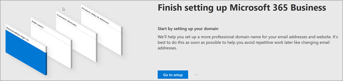

# Microsoft 365 Business Premium instellen in de wizard SetupSet up Microsoft 365 Business Premium in the setup wizard

Bekijk deze video voor een overzicht van microsoft 365 Business Premium setup.Watch this video for an overview of Microsoft 365 Business Premium setup.  

> [!VIDEO https://www.microsoft.com/videoplayer/embed/RE1FYSM] 

Als u deze video nuttig vond, raadpleegt u dan de [complete reeks trainingen voor kleine bedrijven en nieuwe gebruikers van Microsoft 365](https://support.office.com/article/6ab4bbcd-79cf-4000-a0bd-d42ce4d12816).If you found this video helpful, check out the [complete training series for small businesses and those new to Microsoft 365](https://support.office.com/article/6ab4bbcd-79cf-4000-a0bd-d42ce4d12816).

## Uw domein, gebruikers en beleid instellen toevoegenAdd your domain, users, and set up policies

Wanneer u Microsoft 365 Business Premium koopt, hebt u de mogelijkheid om een domein te gebruiken dat u bezit of er een te kopen tijdens de [aanmelding.](sign-up.md)When you purchase Microsoft 365 Business Premium, you have the option of using a domain you own, or buying one during the [sign-up](sign-up.md).

- Als u een nieuw domein hebt gekocht toen u zich hebt aangemeld, is uw domein helemaal ingesteld en u overgaan naar [Gebruikers toevoegen en licenties toewijzen.](#add-users-and-assign-licenses)If you purchased a new domain when you signed up, your domain is all set up and you can move to [Add users and assign licenses](#add-users-and-assign-licenses).

### Uw domein toevoegen om aanmelding te personaliserenAdd your domain to personalize sign-in

1. Meld u aan bij [het Microsoft 365-beheercentrum](https://admin.microsoft.com) met uw globale beheerdersreferenties.Sign in to [Microsoft 365 admin center](https://admin.microsoft.com) by using your global admin credentials. 

2. Kies **Ga naar setup om** de wizard te starten.Choose **Go to setup** to start the wizard.

    

3. Op de pagina **Uw Office-apps installeren** u de apps optioneel op uw eigen computer installeren.On the **Install your Office apps** page, you can optionally install the apps on your own computer.
    
4. Voer in de stap **Domein toevoegen** de domeinnaam in die u wilt gebruiken (zoals contoso.com).In the **Add domain** step, enter the domain name you want to use (like contoso.com).

    > [!IMPORTANT]
    > Als u tijdens de aanmelding een domein hebt gekocht, ziet u hier **geen domeinstap toevoegen.**If you purchased a domain during the sign-up, you will not see **Add a domain** step here. Ga in plaats daarvan naar [Gebruikers toevoegen.](#add-users-and-assign-licenses)Go to [Add users ](#add-users-and-assign-licenses) instead.

    

    
4. Volg de stappen in de wizard om [DNS-records te maken bij elke DNS-hostingprovider voor Office 365](https://docs.microsoft.com/office365/admin/get-help-with-domains/create-dns-records-at-any-dns-hosting-provider) die controleert of u eigenaar bent van het domein.Follow the steps in the wizard to [Create DNS records at any DNS hosting provider for Office 365](https://docs.microsoft.com/office365/admin/get-help-with-domains/create-dns-records-at-any-dns-hosting-provider) that verifies you own the domain. Als u uw domeinhost kent, raadpleegt u ook de [hostspecifieke instructies.](https://docs.microsoft.com/office365/admin/get-help-with-domains/set-up-your-domain-host-specific-instructions)If you know your domain host, see also the [host specific instructions](https://docs.microsoft.com/office365/admin/get-help-with-domains/set-up-your-domain-host-specific-instructions).

    Als uw hostingprovider GoDaddy is of een andere host die is ingeschakeld met [domeinverbinding,](https://docs.microsoft.com/office365/admin/get-help-with-domains/domain-connect)is het proces eenvoudig en wordt u automatisch gevraagd om u aan te melden en microsoft namens u te laten verifiëren.If your hosting provider is GoDaddy or another host enabled with [domain connect](https://docs.microsoft.com/office365/admin/get-help-with-domains/domain-connect), the process is easy and you'll be automatically asked to sign in and let Microsoft authenticate on your behalf.

    

### Gebruikers toevoegen en licenties toewijzenAdd users and assign licenses

U gebruikers toevoegen in de wizard, maar u later ook [gebruikers toevoegen](add-users-m365b.md) in het beheercentrum.You can add users in the wizard, but you can also [add users later](add-users-m365b.md) in the admin center. Als u een lokale domeincontroller hebt, u bovendien gebruikers toevoegen met [Azure AD Connect.](https://docs.microsoft.com/azure/active-directory/hybrid/how-to-connect-install-express)Additionally, if you have a local domain controller, you can add users with [Azure AD Connect](https://docs.microsoft.com/azure/active-directory/hybrid/how-to-connect-install-express).

#### Gebruikers toevoegen aan de wizardAdd users in the wizard

Gebruikers die u in de wizard toevoegt, krijgen automatisch een Microsoft 365 Business Premium-licentie toegewezen.Any users you add in the wizard get automatically assigned a Microsoft 365 Business Premium license.

1. Als uw Microsoft 365 Business Premium-abonnement bestaande gebruikers heeft (bijvoorbeeld als u Azure AD Connect hebt gebruikt), krijgt u nu de optie om licenties aan hen toe te wijzen.If your Microsoft 365 Business Premium subscription has existing users (for example, if you used Azure AD Connect), you get an option to assign licenses to them now. Wijs nu licenties aan hen toe.Go ahead and add licenses to them as well.

2. Nadat u de gebruikers hebt toegevoegd, krijgt u ook een optie om referenties te delen met de nieuwe gebruikers die u hebt toegevoegd.After you've added the users, you'll also get an option to share credentials with the new users you added. U kunt deze afdrukken, hun een e-mail sturen of deze downloaden.You can choose to print them out, email them, or download them.

### Uw domein verbindenConnect your domain

> [!NOTE]
> Als u ervoor kiest om het .onmicrosoft-domein te gebruiken of Azure AD Connect hebt gebruikt om gebruikers in te stellen, ziet u deze stap niet.If you chose to use the .onmicrosoft domain, or used Azure AD Connect to set up users, you will not see this step.
  
Als u services wilt instellen, moet u enkele records bij uw DNS-host of domeinregistrar bijwerken.To set up services, you have to update some records at your DNS host or domain registrar.
  
1. Meestal wordt uw registrar automatisch gedetecteerd met de installatiewizard en wordt een koppeling weergegeven naar stapsgewijze instructies voor het bijwerken van uw NS-records op de website van de registrar.The setup wizard typically detects your registrar and gives you a link to step-by-step instructions for updating your NS records at the registrar website. Als dit niet het geval is, [wijzigt u naamservers om Office 365 in te stellen bij een domeinregistrar.](https://support.office.com/article/a8b487a9-2a45-4581-9dc4-5d28a47010a2)If it doesn't, [Change nameservers to set up Office 365 with any domain registrar](https://support.office.com/article/a8b487a9-2a45-4581-9dc4-5d28a47010a2). 

    - Als u bestaande DNS-records hebt, bijvoorbeeld een bestaande website, maar uw DNS-host is ingeschakeld voor [domeinverbinding,](https://docs.microsoft.com/office365/admin/get-help-with-domains/domain-connect)kiest u **Records voor mij toevoegen**.If you have existing DNS records, for example an existing web site, but your DNS host is enabled for [domain connect](https://docs.microsoft.com/office365/admin/get-help-with-domains/domain-connect), choose **Add records for me**. Accepteer op de pagina **Uw onlineservices kiezen** alle standaardinstellingen en kies **Volgende**en kies **Autoriseren** op de pagina van uw DNS-host.On the **Choose your online services** page, accept all the defaults, and choose **Next**, and choose **Authorize** on your DNS host's page.
    - Als u bestaande DNS-records hebt met andere DNS-hosts (niet ingeschakeld voor domeinverbinding), wilt u uw eigen DNS-records beheren om ervoor te zorgen dat de bestaande services verbonden blijven.If you have existing DNS records with other DNS hosts (not enabled for domain connect), you'll want to manage your own DNS records to make sure the existing services stay connected. Zie [de basisprincipes van het domein](https://docs.microsoft.com/office365/admin/get-help-with-domains/dns-basics) voor meer informatie.See [domain basics](https://docs.microsoft.com/office365/admin/get-help-with-domains/dns-basics) for more info.

        

2. Volg de stappen in de wizard en e-mail en andere services worden voor u ingesteld.Follow the steps in the wizard and email and other services will be set up for you.

### Uw organisatie beschermenProtect your organization 

Het beleid dat u in de wizard hebt ingesteld, wordt automatisch toegepast op een [beveiligingsgroep](https://docs.microsoft.com/office365/admin/create-groups/compare-groups#security-groups) met de naam *Alle gebruikers*.The policies you set up in the wizard are applied automatically to a [Security group](https://docs.microsoft.com/office365/admin/create-groups/compare-groups#security-groups) called *All Users*. U ook extra groepen maken om beleid toe te wijzen in het beheercentrum.You can also create additional groups to assign policies to in the admin center.

1. In de **optiebeveiliging verhogen tegen geavanceerde cyberbedreigingen**wordt aanbevolen dat u de standaardinstellingen accepteert om [Office 365 Advance Threat Protection](https://docs.microsoft.com/microsoft-365/security/office-365-security/office-365-atp) bestanden en koppelingen in Office-apps te laten scannen.On the **Increase protection from advanced cyber threats**, it is recommended that you accept the defaults to let [Office 365 Advance Threat Protection](https://docs.microsoft.com/microsoft-365/security/office-365-security/office-365-atp) scan files and links in Office apps.

    

2. Accepteer op de pagina **Lekken van gevoelige gegevens** voorkomen de standaardinstellingen om Office 365 Data Loss Prevention (DLP) in te schakelen om gevoelige gegevens in Office-apps te volgen en het per ongeluk delen van deze gegevens buiten uw organisatie te voorkomen.On the **Prevent leaks of sensitive data** page, accept the defaults to turn on Office 365 Data Loss Prevention (DLP) to track sensitive data in Office apps and prevent the accidental sharing of these outside your organization.

3. Laat op de pagina **Gegevens beveiligen in Office voor mobiel** het beheer van mobiele apps aan, vouw de instellingen uit en bekijk deze en selecteer vervolgens Beleid voor beheer van mobiele apps **maken**.On the **Protect data in Office for mobile** page, leave mobile app management on, expand the settings and review them, and then select **Create mobile app management policy**.

    

## Beveiligde Windows 10-pc'sSecure Windows 10 PCs

Selecteer op de linkernavigatie de optie **Setup** en kies vervolgens onder Inzingen en beveiliging de optie **Uw Windows 10-computers beveiligen**. **Sing-in and security**On the left nav, select **Setup** and then, under **Sing-in and security**, choose **Secure your Windows 10 computers**. Kies **Weergave** om aan de slag te gaan.Choose **View** to get started. Bekijk [uw Windows 10-computers beveiligen](secure-win-10-pcs.md) voor volledige instructies.See [secure your Windows 10 computers](secure-win-10-pcs.md) for complete instructions.

## Office 365-client-apps implementerenDeploy Office 365 client apps

Als u ervoor kiest om Office-apps automatisch te installeren tijdens de installatie, worden de apps geïnstalleerd op de Windows 10-apparaten zodra de gebruikers zich vanaf hun Windows-apparaten hebben aangemeld bij Azure AD met behulp van hun werkreferenties.If you chose to automatically install Office apps during setup, the apps will install on the Windows 10 devices once the users have signed in to Azure AD from their Windows devices, using their work credentials.

Zie Mobiele apparaten instellen voor Microsoft [365 Business Premium-gebruikers](set-up-mobile-devices.md)als u Office wilt installeren op mobiele iOS- of Android-apparaten.To install Office on mobile iOS or Android devices, see [Set up mobile devices for Microsoft 365 Business Premium users](set-up-mobile-devices.md).

U Office ook afzonderlijk installeren.You can also install Office individually. Zie [Office installeren op een pc of Mac](https://support.office.com/article/4414eaaf-0478-48be-9c42-23adc4716658) voor instructies.See [install Office on a PC or Mac](https://support.office.com/article/4414eaaf-0478-48be-9c42-23adc4716658) for instructions.

## Zie ookSee also

[Microsoft 365 voor zakelijke trainingsvideo'sMicrosoft 365 for business training videos](https://support.office.com/article/6ab4bbcd-79cf-4000-a0bd-d42ce4d12816)
