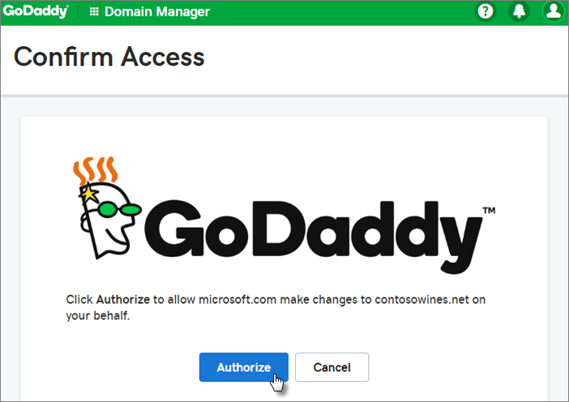

# Microsoft 365 Business Premium instellen in de wizard Setup

Bekijk deze video voor een overzicht van de microsoft 365 Business Premium-installatie.  

> [!VIDEO https://www.microsoft.com/videoplayer/embed/RE1FYSM] 

Als u deze video nuttig vond, raadpleegt u dan de [complete reeks trainingen voor kleine bedrijven en nieuwe gebruikers van Microsoft 365](https://support.microsoft.com/office/6ab4bbcd-79cf-4000-a0bd-d42ce4d12816).

## Uw domein, gebruikers en beleidsregels toevoegen

Wanneer u Microsoft 365 Business Premium koopt, u een domein gebruiken dat u bezit of een domein kopen tijdens de [aanmelding.](sign-up.md)

- Als u een nieuw domein hebt gekocht toen u zich aanmeldde, is uw domein helemaal ingesteld en u naar [Gebruikers toevoegen en licenties toewijzen.](#add-users-and-assign-licenses)

### Uw domein toevoegen om aanmelding te personaliseren

1. Meld u aan bij [microsoft 365-beheercentrum](https://admin.microsoft.com) met behulp van uw globale beheerdersreferenties. 

2. Kies **Ga naar setup** om de wizard te starten.

    

3. Op de pagina **Uw Office-apps installeren** u de apps optioneel op uw eigen computer installeren.
    
4. Voer in de stap **Domein toevoegen** de domeinnaam in die u wilt gebruiken (zoals contoso.com).

    > [!IMPORTANT]
    > Als u een domein hebt gekocht tijdens de aanmelding, ziet u hier **geen domeinstap toevoegen.** Ga in plaats daarvan naar [Gebruikers toevoegen.](#add-users-and-assign-licenses)

    

    
4. Volg de stappen in de wizard OM [DNS-records te maken bij een DNS-hostingprovider voor Office 365](https://docs.microsoft.com/office365/admin/get-help-with-domains/create-dns-records-at-any-dns-hosting-provider) die controleert of u eigenaar bent van het domein. Als u uw domeinhost kent, raadpleegt u ook de [specifieke instructies voor de host.](https://docs.microsoft.com/office365/admin/get-help-with-domains/set-up-your-domain-host-specific-instructions)

    Als uw hostingprovider GoDaddy is of een andere host ingeschakeld met [domeinverbinden,](https://docs.microsoft.com/office365/admin/get-help-with-domains/domain-connect)is het proces eenvoudig en wordt u automatisch gevraagd om u aan te melden en Microsoft namens u te laten verifiëren.

    

### Gebruikers toevoegen en licenties toewijzen

U gebruikers toevoegen aan de wizard, maar u later ook [gebruikers toevoegen](add-users-m365b.md) in het beheercentrum. Als u een lokale domeincontroller hebt, u bovendien gebruikers toevoegen met [Azure AD Connect](https://docs.microsoft.com/azure/active-directory/hybrid/how-to-connect-install-express).

#### Gebruikers toevoegen aan de wizard

Alle gebruikers die u in de wizard toevoegt, krijgen automatisch een Microsoft 365 Business Premium-licentie toegewezen.

1. Als uw Microsoft 365 Business Premium-abonnement bestaande gebruikers heeft (bijvoorbeeld als u Azure AD Connect hebt gebruikt), krijgt u een optie om nu licenties aan hen toe te wijzen. Wijs nu licenties aan hen toe.

2. Nadat u de gebruikers hebt toegevoegd, krijgt u ook een optie om referenties te delen met de nieuwe gebruikers die u hebt toegevoegd. U kunt deze afdrukken, hun een e-mail sturen of deze downloaden.

### Uw domein verbinden

> [!NOTE]
> Als u ervoor kiest om het .onmicrosoft-domein te gebruiken of Azure AD Connect hebt gebruikt om gebruikers in te stellen, ziet u deze stap niet.
  
Als u services wilt instellen, moet u enkele records bij uw DNS-host of domeinregistrar bijwerken.
  
1. Meestal wordt uw registrar automatisch gedetecteerd met de installatiewizard en wordt een koppeling weergegeven naar stapsgewijze instructies voor het bijwerken van uw NS-records op de website van de registrar. Als dit niet het geval is, [wijzigt u naamservers om Office 365 in te stellen met een domeinregistrar](https://docs.microsoft.com/microsoft-365/admin/get-help-with-domains/change-nameservers-at-any-domain-registrar). 

    - Als u bestaande DNS-records hebt, bijvoorbeeld een bestaande website, maar uw DNS-host is ingeschakeld voor [domeinbinding,](https://docs.microsoft.com/office365/admin/get-help-with-domains/domain-connect)kiest u **Records voor mij toevoegen.** Accepteer **op** de pagina Kies uw online services alle standaardinstellingen en kies **Volgende**en kies **Autoriseren** op de pagina van uw DNS-host.
    - Als u bestaande DNS-records hebt met andere DNS-hosts (niet ingeschakeld voor domeinverbintending), wilt u uw eigen DNS-records beheren om ervoor te zorgen dat de bestaande services verbonden blijven. Zie [basisprincipes van domeinen](https://docs.microsoft.com/office365/admin/get-help-with-domains/dns-basics) voor meer informatie.

        

2. Volg de stappen in de wizard en e-mail en andere services worden voor u ingesteld.

### Uw organisatie beveiligen 

Het beleid dat u in de wizard hebt ingesteld, wordt automatisch toegepast op een [beveiligingsgroep](https://docs.microsoft.com/office365/admin/create-groups/compare-groups#security-groups) met de naam *Alle gebruikers*. U ook extra groepen maken om beleid aan toe te wijzen in het beheercentrum.

1. Op de **verhoogingsbeveiliging tegen geavanceerde cyberbedreigingen**wordt aanbevolen dat u de standaardinstellingen accepteert om [Office 365 Advance Threat Protection](https://docs.microsoft.com/microsoft-365/security/office-365-security/office-365-atp) bestanden en koppelingen in Office-apps te laten scannen.

    

2. Accepteer op de pagina **Lekken van gevoelige gegevens voorkomen** de standaardinstellingen om Office 365 Data Loss Prevention (DLP) in te schakelen om gevoelige gegevens in Office-apps bij te houden en te voorkomen dat deze gegevens per ongeluk buiten uw organisatie worden gedeeld.

3. Laat **op** de pagina Gegevens beveiligen in Office voor mobiel het beheer van mobiele apps aan, vouw de instellingen uit en bekijk ze en selecteer **vervolgens Beleid voor beheer van mobiele apps**maken.

    

## Beveilig Windows 10-pc's

Selecteer aan de linkerkant **Setup** en kies onder Aanmelden en beveiliging **de optie Uw Windows 10-computers beveiligen.** **Sign-in and security** Kies **Weergave** om aan de slag te gaan. Zie [Uw Windows 10-computers beveiligen](secure-win-10-pcs.md) voor volledige instructies.

## Office 365-client-apps implementeren

Als u ervoor kiest om Office-apps automatisch te installeren tijdens de installatie, worden de apps geïnstalleerd op de Windows 10-apparaten zodra de gebruikers zich vanaf hun Windows-apparaten bij Azure AD hebben aangemeld met hun werkreferenties.

Zie Mobiele apparaten instellen voor Microsoft [365 Business Premium-gebruikers als](set-up-mobile-devices.md)u Office wilt installeren op mobiele iOS- of Android-apparaten.

U Office ook afzonderlijk installeren. Zie [Office installeren op een pc of Mac](https://support.microsoft.com/office/4414eaaf-0478-48be-9c42-23adc4716658) voor instructies.

## Zie ook

[Trainingsvideo's voor Microsoft 365 voor bedrijven](https://support.microsoft.com/office/6ab4bbcd-79cf-4000-a0bd-d42ce4d12816)
