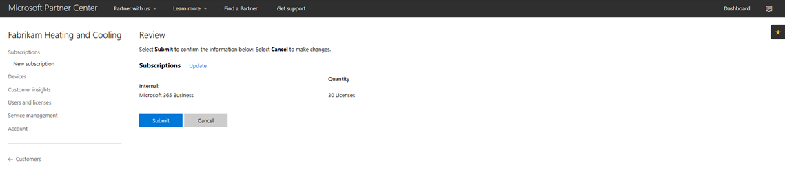
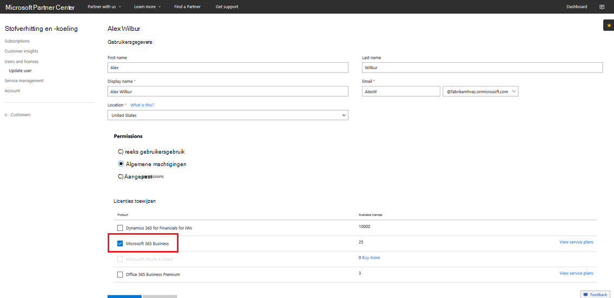

# Een Microsoft 365 Business CSP-abonnement overschakelenTransition a Microsoft 365 Business CSP subscription

Als u een Microsoft 365 Business Preview-CSP-abonnement hebt, volgt u deze handleiding om erachter te komen hoe u uw bestaande preview-abonnement overzetten naar Microsoft 365 Business GA (algemene beschikbaarheid).If you have a Microsoft 365 Business Preview CSP subscription, follow this guide to find out how you can transition your existing preview subscription to Microsoft 365 Business GA (general availability).

**Een voorbeeldabonnement overschakelen naar GA****How to transition a preview subscription to GA**

1. Meld u aan bij <a href="https://partnercenter.microsoft.com" target="_blank">Partner Center</a>.Sign in to <a href="https://partnercenter.microsoft.com" target="_blank">Partner Center</a>.
2. Selecteer **klanten**in het dashboard en zoek en selecteer vervolgens de bedrijfsnaam.From the dashboard, select **Customers**, and then find and select the company name.

    De abonnementen voor het bedrijf worden vermeld.The subscriptions for the company will be listed.

    
    
3. Selecteer op de pagina **Abonnementen van** het bedrijf de optie **Abonnement toevoegen**.On the company's **Subscriptions** page, select **Add subscription**.
4. Selecteer op de pagina **Nieuw abonnement** de optie **Klein bedrijf** en selecteer Vervolgens **Microsoft 365 Business** in de lijst.On the **New subscription** page, select **Small business** and then select **Microsoft 365 Business** from the list.
5. Voeg het aantal licenties toe en selecteer **Volgende: Controleer** het abonnement en selecteer **Vervolgens Verzenden**.Add the number of licenses and then select **Next: Review** to review the subscription and then select **Submit**.

    

    Op **licentiegebaseerde abonnementen** worden **Microsoft 365 Business Preview** en Microsoft **365 Business**weergegeven.The **License-based subscriptions** will show **Microsoft 365 Business Preview** and **Microsoft 365 Business**. U schorst het Preview-abonnement als volgende.You'll suspend the Preview subscription next.

6. Selecteer **Microsoft 365 Business Preview**.Select **Microsoft 365 Business Preview**.
7. Selecteer op de pagina **Microsoft 365 Business Preview** de optie **Opgeschort** om het Preview-abonnement op te schorten.On the **Microsoft 365 Business Preview** page, select **Suspended** to suspend the Preview subscription.

    

8. Selecteer **Verzenden** om te bevestigen.Select **Submit** to confirm.

    Controleer **op** de pagina Abonnementen of de **Microsoft 365 Business Preview-status** **opgeschort wordt weergegeven.**On the **Subscriptions** page, confirm that the **Microsoft 365 Business Preview** status shows **Suspended**.

    

9. Optioneel u ook de licentieovereenkomst valideren.Optionally, you can also validate the license agreement. Volg deze stappen om dit te doen:To do this, follow these steps:
    1. Selecteer **Gebruikers en licenties** op de pagina Abonnementen **van** het bedrijf.Select **Users and licenses** from the company's **Subscriptions** page.
    2. Selecteer **op** de pagina Gebruikers en licenties een gebruiker.On the **Users and licenses** page, select a user.
    3. Controleer op de pagina van de gebruiker de sectie **Licenties toewijzen** en controleer of microsoft **365 Business wordt**weergegeven.On the user's page, check the **Assign licenses** section and confirm that it shows **Microsoft 365 Business**.

        

## Impact voor klanten en gebruikers tijdens en na transitieImpact to customers and users during and after transition

Er is geen impact op klanten en gebruikers tijdens de overgang en na de overgang.There's no impact to customers and users during transition and post transition.

## Impact voor klanten die niet overstappenImpact to customers who don't transition

In de volgende tabel wordt een overzicht van de gevolgen voor klanten die niet overstappen van een Microsoft 365 Business Preview-abonnement naar een Microsoft 365 Business-abonnement.The following table summarizes the impact to customers who don't transition from a Microsoft 365 Business Preview subscription to a Microsoft 365 Business subscription.

|       | T-0 naar T+30T-0 to T+30     | T+30 naar T+60T+30 to T+60 | T+60 naar T+120T+60 to T+120 | Voorbij T+120Beyond T+120  |
|-------|-----------------|--------------|---------------|---------------|
| **Status****State** | In respijtperiodeIn grace period | VerlopenExpired      | HandicapDisabled      | GedeprovisioneerdDeprovisioned |
| **Gevolgen voor de service****Service impacts**                                                        |
| **Microsoft 365 Business-beheerportal****Microsoft 365 Business admin portal** | Geen invloed op functionaliteitNo impact to functionality | Geen invloed op functionaliteitNo impact to functionality | Kan gebruikers toevoegen/verwijderen, abonnementen kopen.Can add/delete users, purchase subscriptions.  Kan geen licenties toewijzen/intrekken.Can't assign/revoke licenses. | Het abonnement van de klant en alle gegevens worden verwijderd.Customer's subscription and all data is deleted. Beheerder kan andere betaalde abonnementen beheren.Admin can manage other paid subscriptions. |
| **Office-apps****Office apps**                         | Geen gevolgen voor de eindgebruikerNo end user impact | Geen gevolgen voor de eindgebruikerNo end user impact | Office voert de modus voor verminderde functionaliteit in.Office enters reduced functionality mode.  Gebruikers kunnen alleen bestanden bekijken.Users can view files only. | Office voert de modus voor verminderde functionaliteit in.Office enters reduced functionality mode.  Gebruikers kunnen alleen bestanden bekijken.Users can view files only. |
| **Cloudservices (SharePoint Online, Exchange Online, Skype, Teams en meer)****Cloud services (SharePoint Online, Exchange Online, Skype, Teams, and more)** | Geen gevolgen voor de eindgebruikerNo end user impact | Geen gevolgen voor de eindgebruikerNo end user impact | Eindgebruikers en beheerders hebben geen toegang tot gegevens in de cloud.End users and admins have no access to data in the cloud. | Het abonnement van de klant en alle gegevens worden verwijderd.Customer's subscription and all data are deleted. |
| **EM+S-componenten****EM+S components** | Geen impact van de beheerderNo admin impact  Geen gevolgen voor de eindgebruikerNo end user impact | Geen impact van de beheerderNo admin impact  Geen gevolgen voor de eindgebruikerNo end user impact | Capaciteit wordt niet langer afgedwongen.Capability is no longer enforced.  Zie [de gevolgen voor mobiele apparaten bij het verlopen van het abonnement](#mobile-device-impacts-upon-subscription-expiration) en windows [10-pc heeft gevolgen voor het verlopen van het abonnement](#windows-10-pc-impacts-upon-subscription-expiration) voor meer informatie.See [Mobile device impacts upon subscription expiration](#mobile-device-impacts-upon-subscription-expiration) and [Windows 10 PC impacts upon subscription expiration](#windows-10-pc-impacts-upon-subscription-expiration) for more info. | Capaciteit wordt niet langer afgedwongen.Capability is no longer enforced.  Zie [de gevolgen voor mobiele apparaten bij het verlopen van het abonnement](#mobile-device-impacts-upon-subscription-expiration) en windows [10-pc heeft gevolgen voor het verlopen van het abonnement](#windows-10-pc-impacts-upon-subscription-expiration) voor meer informatie.See [Mobile device impacts upon subscription expiration](#mobile-device-impacts-upon-subscription-expiration) and [Windows 10 PC impacts upon subscription expiration](#windows-10-pc-impacts-upon-subscription-expiration) for more info. |
| **Windows 10 Business****Windows 10 Business** | Geen impact van de beheerderNo admin impact  Geen gevolgen voor de eindgebruikerNo end user impact | Geen impact van de beheerderNo admin impact  Geen gevolgen voor de eindgebruikerNo end user impact | Capaciteit wordt niet langer afgedwongen.Capability is no longer enforced.  Zie [de gevolgen voor mobiele apparaten bij het verlopen van het abonnement](#mobile-device-impacts-upon-subscription-expiration) en windows [10-pc heeft gevolgen voor het verlopen van het abonnement](#windows-10-pc-impacts-upon-subscription-expiration) voor meer informatie.See [Mobile device impacts upon subscription expiration](#mobile-device-impacts-upon-subscription-expiration) and [Windows 10 PC impacts upon subscription expiration](#windows-10-pc-impacts-upon-subscription-expiration) for more info. | Capaciteit wordt niet langer afgedwongen.Capability is no longer enforced.  Zie [de gevolgen voor mobiele apparaten bij het verlopen van het abonnement](#mobile-device-impacts-upon-subscription-expiration) en windows [10-pc heeft gevolgen voor het verlopen van het abonnement](#windows-10-pc-impacts-upon-subscription-expiration) voor meer informatie.See [Mobile device impacts upon subscription expiration](#mobile-device-impacts-upon-subscription-expiration) and [Windows 10 PC impacts upon subscription expiration](#windows-10-pc-impacts-upon-subscription-expiration) for more info. |
| **Azure AD-aanmelding op een Windows 10-pc****Azure AD login to a Windows 10 PC** | Geen impact van de beheerderNo admin impact  Geen gevolgen voor de eindgebruikerNo end user impact | Geen impact van de beheerderNo admin impact  Geen gevolgen voor de eindgebruikerNo end user impact | Geen impact van de beheerderNo admin impact  Geen gevolgen voor de eindgebruikerNo end user impact | Zodra de tenant is verwijderd, kan een gebruiker zich alleen aanmelden met lokale referenties.Once the tenant is deleted, a user can sign in with local credentials only. Beeld het apparaat opnieuw op als er geen lokale referenties zijn.Re-image the device if there are no local credentials. |

## Gevolgen voor mobiele apparaten bij verlopen abonnementMobile device impacts upon subscription expiration

In de volgende tabel wordt een overzicht van de impact op het app-beheerbeleid op mobiele apparaten.The following table summarizes the impact to the app management policies on mobile devices.

|                            | Volledig gelicentieerde ervaringFully licensed experience                      | T+60 dagen na afloopT+60 days post expiration          |
|----------------------------|------------------------------------------------|------------------------------------|
| **Werkbestanden verwijderen van een inactief apparaat****Delete work files from an inactive device** | Werkbestanden worden verwijderd na geselecteerde dagenWork files are removed after selected days | Werkbestanden blijven op de persoonlijke apparaten van de gebruiker staanWork files remain on the user's personal devices |
| **Gebruikers dwingen om alle werkbestanden op te slaan in OneDrive voor Bedrijven****Force users to save all work files to OneDrive for Business** | Werkbestanden kunnen alleen worden opgeslagen in OneDrive voor BedrijvenWork files can only be saved to OneDrive for Business | Werkbestanden kunnen overal worden opgeslagenWork files can be saved anywhere |
| **Werkbestanden versleutelen****Encrypt work files** | Werkbestanden worden versleuteldWork files are encrypted | Werkbestanden worden niet meer versleuteld.Work files are no longer encrypted.  Beveiligingsbeleid wordt verwijderd en Office-gegevens in apps worden verwijderd.Security policies are removed and Office data on apps is removed. |
| **Pincode of vingerafdruk vereisen om toegang te krijgen tot Office-apps****Require PIN or fingerprint to access Office apps** | Beperkte toegang tot appsRestricted access to apps | Geen toegangsbeperking op app-niveauNo app-level access restriction |
| **Pincode opnieuw instellen wanneer aanmelding mislukt****Reset PIN when login fails** | Beperkte toegang tot appsRestricted access to apps | Geen toegangsbeperking op app-niveauNo app-level access restriction |
| **Gebruikers verplichten zich opnieuw aan te melden nadat Office-apps zijn inactief****Require users to sign in again after Office apps have been idle** | Aanmelden vereistSign-in required | Aanmelden is niet nodigNo sign-in required |
| **Toegang weigeren tot werkbestanden op opengebroken of geroote apparaten****Deny access to work files on jailbroken or rooted devices** | Werkbestanden zijn niet toegankelijk op jailbroken/gewortelde apparatenWork files can't be accessed on jailbroken/rooted devices | Werkbestanden kunnen worden geopend op jailbroken / geworteld apparatenWork files can be accessed on jailbroken/rooted devices |
| **Gebruikers toestaan inhoud van Office-apps naar Persoonlijke apps te kopiëren****Allow users to copy content from Office apps to Personal apps** | Kopiëren/plakken beperkt tot apps die beschikbaar zijn als onderdeel van het Microsoft 365-abonnementCopy/paste restricted to apps available as part of Microsoft 365 subscription | Kopiëren/plakken beschikbaar voor alle appsCopy/paste available to all apps |

## Windows 10 PC heeft gevolgen voor verlopen abonnementWindows 10 PC impacts upon subscription expiration

In de volgende tabel wordt een overzicht van de impact op het configuratiebeleid voor Windows 10-apparaten.The following table summarizes the impact to the Windows 10 device configuration policies.

|                            | Volledig gelicentieerde ervaringFully licensed experience                      | T+60 dagen na afloopT+60 days post expiration          |
|----------------------------|------------------------------------------------|------------------------------------|
| **Pc's beschermen tegen bedreigingen met Windows Defender****Help protect PCs from threats using Windows Defender** | In- en uitschakelen valt buiten de gebruikersbesturingselementTurn on/off is outside of user control | Gebruiker kan Windows Defender in- of uitschakelen op de Windows 10-pcUser can turn on/off Windows Defender on the Windows 10 PC |
| **Bescherm pc's tegen internetdreigingen in Microsoft Edge****Help protect PCs from web-based threats in Microsoft Edge** | Pc-beveiliging in Microsoft EdgePC protection in Microsoft Edge | Gebruiker kan pc-beveiliging in- of uitschakelen in Microsoft EdgeUser can turn on/off PC protection in Microsoft Edge |
| **Apparaatscherm uitschakelen wanneer u niet actief bent****Turn off device screen when idle** | Beheerder definieert intervalbeleid voor schermtime-outAdmin defines screen timeout interval policy | Schermtime-out kan worden geconfigureerd door de eindgebruikerScreen timeout can be configured by end user |
| **Gebruikers toestaan om apps te downloaden vanuit de Microsoft Store****Allow users to download apps from Microsoft Store** | Beheerder bepaalt of een gebruiker apps kan downloaden uit de Microsoft StoreAdmin defines if a user can download apps from Microsoft Store | Gebruiker kan op elk gewenst moment apps downloaden uit de Microsoft StoreUser can download apps from Microsoft Store anytime |
| **Gebruikers toestaan om Cortana te openen****Allow users to access Cortana** | Beheerder definieert beleid voor gebruikerstoegang tot CortanaAdmin defines policy on user access to Cortana | Gebruikersapparaten die Cortana in- of uitschakelenUser devices to turn on/off Cortana |
| **Gebruikers toestaan tips en advertenties van Microsoft te ontvangen****Allow users to receive tips and advertisements from Microsoft** | Beheerder definieert beleid voor gebruikers ontvangen tips en advertenties van MicrosoftAdmin defines policy on user receive tips and advertisements from Microsoft | Gebruiker kan tips en advertenties van Microsoft in- en uitschakelenUser can turn on/off tips and advertisements from Microsoft |
| **Gebruikers toestaan om inhoud uit Office-apps te kopiëren naar persoonlijke apps****Allow users to copy content from Office apps into personal apps** | Beheerder definieert beleid om Windows 10-apparaten up-to-date te houdenAdmin defines policy to keep Windows 10 devices up to date | Gebruikers kunnen beslissen wanneer ze Windows bijwerkenUsers can decide when to update Windows |
