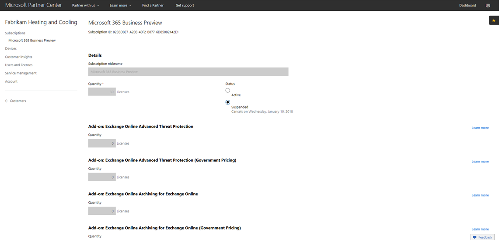

# Een Microsoft 365 Business CSP-abonnement wijzigen

Als u een Microsoft 365 Business Preview CSP-abonnement hebt, volgt u deze handleiding om te zien hoe u uw bestaande preview-abonnement overzetten naar Microsoft 365 Business GA (algemene beschikbaarheid).

**Een voorbeeldabonnement overschakelen naar GA**

1. Meld u aan bij <a href="https://partnercenter.microsoft.com" target="_blank">Partner Center</a>.
2. Selecteer **klanten**in het dashboard en zoek en selecteer vervolgens de bedrijfsnaam.

    De abonnementen voor het bedrijf worden vermeld.

    
    
3. Selecteer op de pagina **Abonnementen** van het bedrijf de optie **Abonnement toevoegen**.
4. Selecteer op de pagina **Nieuw abonnement** de optie **Kleine bedrijven** en selecteer Vervolgens **Microsoft 365 Business** in de lijst.
5. Voeg het aantal licenties toe en selecteer **Volgende: Controleer** het abonnement en selecteer **Verzenden.**

    

    De **op licenties gebaseerde abonnementen** tonen Microsoft **365 Business Preview** en Microsoft **365 Business.** Je schort het preview-abonnement vervolgens op.

6. Selecteer **Microsoft 365 Business Preview**.
7. Selecteer op de pagina **Microsoft 365 Business Preview** de optie **Opgeschort** om het preview-abonnement op te schorten.

    

8. Selecteer **Verzenden** om te bevestigen.

    Controleer op de pagina **Abonnementen** of de status **van Microsoft 365 Business Preview** opgeschort **wordt**weergegeven.

    

9. Optioneel u ook de licentieovereenkomst valideren. Volg deze stappen om dit te doen:
    1. Selecteer **Gebruikers en licenties** op de pagina **Abonnementen** van het bedrijf.
    2. Selecteer op de pagina **Gebruikers en licenties** een gebruiker.
    3. Controleer op de pagina van de gebruiker de sectie **Licenties toewijzen** en bevestig of deze **Microsoft 365 Business**weergeeft.

        

## Impact op klanten en gebruikers tijdens en na de overgang

Er is geen impact op klanten en gebruikers tijdens de overgang en na de overgang.

## Impact op klanten die niet overstappen

In de volgende tabel wordt de impact samengevat voor klanten die niet overstappen van een Microsoft 365 Business Preview-abonnement op een Microsoft 365 Business-abonnement.

|       | T-0 naar T+30     | T+30 naar T+60 | T+60 naar T+120 | Voorbij T+120  |
|-------|-----------------|--------------|---------------|---------------|
| **Status** | In respijtperiode | Verlopen      | Handicap      | Gedeprovisioneerd |
| **Service-effecten**                                                        |
| **Microsoft 365 Business-beheerportal** | Geen invloed op functionaliteit | Geen invloed op functionaliteit | Kan toevoegen / verwijderen van gebruikers, abonnementen kopen.  Kan geen licenties toewijzen/intrekken. | Het abonnement van de klant en alle gegevens worden verwijderd. De beheerder kan andere betaalde abonnementen beheren. |
| **Office-apps**                         | Geen impact van de eindgebruiker | Geen impact van de eindgebruiker | Office voert de modus met beperkte functionaliteit in.  Gebruikers kunnen alleen bestanden bekijken. | Office voert de modus met beperkte functionaliteit in.  Gebruikers kunnen alleen bestanden bekijken. |
| **Cloudservices (SharePoint Online, Exchange Online, Skype, Teams en meer)** | Geen impact van de eindgebruiker | Geen impact van de eindgebruiker | Eindgebruikers en beheerders hebben geen toegang tot gegevens in de cloud. | Het abonnement van de klant en alle gegevens worden verwijderd. |
| **EM+S-componenten** | Geen beheerdersimpact  Geen impact van de eindgebruiker | Geen beheerdersimpact  Geen impact van de eindgebruiker | Het vermogen wordt niet langer afgedwongen.  Zie [De gevolgen voor mobiele apparaten voor het verlopen van abonnementen](#mobile-device-impacts-upon-subscription-expiration) en de gevolgen van Windows [10-pc voor](#windows-10-pc-impacts-upon-subscription-expiration) het verlopen van het abonnement voor meer informatie. | Het vermogen wordt niet langer afgedwongen.  Zie [De gevolgen voor mobiele apparaten voor het verlopen van abonnementen](#mobile-device-impacts-upon-subscription-expiration) en de gevolgen van Windows [10-pc voor](#windows-10-pc-impacts-upon-subscription-expiration) het verlopen van het abonnement voor meer informatie. |
| **Windows 10 Business** | Geen beheerdersimpact  Geen impact van de eindgebruiker | Geen beheerdersimpact  Geen impact van de eindgebruiker | Het vermogen wordt niet langer afgedwongen.  Zie [De gevolgen voor mobiele apparaten voor het verlopen van abonnementen](#mobile-device-impacts-upon-subscription-expiration) en de gevolgen van Windows [10-pc voor](#windows-10-pc-impacts-upon-subscription-expiration) het verlopen van het abonnement voor meer informatie. | Het vermogen wordt niet langer afgedwongen.  Zie [De gevolgen voor mobiele apparaten voor het verlopen van abonnementen](#mobile-device-impacts-upon-subscription-expiration) en de gevolgen van Windows [10-pc voor](#windows-10-pc-impacts-upon-subscription-expiration) het verlopen van het abonnement voor meer informatie. |
| **Azure AD-inloging op een Windows 10-pc** | Geen beheerdersimpact  Geen impact van de eindgebruiker | Geen beheerdersimpact  Geen impact van de eindgebruiker | Geen beheerdersimpact  Geen impact van de eindgebruiker | Zodra de tenant is verwijderd, kan een gebruiker zich alleen aanmelden met lokale referenties. Afbeelding van het apparaat opnieuw als er geen lokale referenties zijn. |

## Mobiele apparaat heeft invloed op het verlopen van het abonnement

In de volgende tabel wordt een overzicht gemaakt van de impact op het beleid voor app-beheer op mobiele apparaten.

|                            | Volledig gelicentieerde ervaring                      | T+60 dagen na het verstrijken          |
|----------------------------|------------------------------------------------|------------------------------------|
| **Werkbestanden verwijderen van een inactief apparaat** | Werkbestanden worden na geselecteerde dagen verwijderd | Werkbestanden blijven op de persoonlijke apparaten van de gebruiker |
| **Gebruikers dwingen om alle werkbestanden op te slaan in OneDrive voor Bedrijven** | Werkbestanden kunnen alleen worden opgeslagen in OneDrive voor Bedrijven | Werkbestanden kunnen overal worden opgeslagen |
| **Werkbestanden versleutelen** | Werkbestanden zijn versleuteld | Werkbestanden worden niet meer versleuteld.  Beveiligingsbeleid wordt verwijderd en Office-gegevens in apps worden verwijderd. |
| **Pincode of vingerafdruk vereisen om toegang te krijgen tot Office-apps** | Beperkte toegang tot apps | Geen toegangsbeperking op app-niveau |
| **Pincode opnieuw instellen wanneer het inloggen mislukt** | Beperkte toegang tot apps | Geen toegangsbeperking op app-niveau |
| **Gebruikers verplichten zich opnieuw aan te melden nadat Office-apps niet actief zijn geweest** | Aanmelden vereist | Aanmelden is niet nodig |
| **Toegang weigeren tot werkbestanden op opengebroken of geroote apparaten** | Werkbestanden zijn niet toegankelijk op jailbroken/gewortelde apparaten | Werkbestanden kunnen worden geopend op jailbroken / geworteld apparaten |
| **Gebruikers toestaan inhoud van Office-apps naar persoonlijke apps te kopiëren** | Kopiëren/plakken beperkt tot apps die beschikbaar zijn als onderdeel van microsoft 365 Business-abonnement | Kopiëren/plakken beschikbaar voor alle apps |

## Windows 10 PC heeft invloed op het verlopen van het abonnement

In de volgende tabel wordt een overzicht gemaakt van de impact op het configuratiebeleid voor Windows 10-apparaten.

|                            | Volledig gelicentieerde ervaring                      | T+60 dagen na het verstrijken          |
|----------------------------|------------------------------------------------|------------------------------------|
| **Pc's beschermen tegen bedreigingen met Windows Defender** | In-/uit-of in- en uitschakelen valt buiten de gebruikersbesturing | Gebruiker kan Windows Defender in-/uitschakelen op de Windows 10-pc |
| **Bescherm pc's tegen internetdreigingen in Microsoft Edge** | PC-beveiliging in Microsoft Edge | Gebruiker kan pc-beveiliging in-/uitschakelen in Microsoft Edge |
| **Apparaatscherm uitschakelen wanneer u niet actief bent** | Beheerder definieert het schermtime-outintervalbeleid | Time-out voor het scherm kan worden geconfigureerd door de eindgebruiker |
| **Gebruikers toestaan om apps te downloaden vanuit de Microsoft Store** | Beheerder bepaalt of een gebruiker apps uit de Microsoft Store kan downloaden | Gebruiker kan apps downloaden uit de Microsoft Store op elk gewenst moment |
| **Gebruikers toestaan om Cortana te openen** | Beheerder definieert beleid voor gebruikerstoegang tot Cortana | Gebruikersapparaten om Cortana in/uit te schakelen |
| **Gebruikers toestaan tips en advertenties van Microsoft te ontvangen** | Beheerder definieert beleid voor gebruikersontvangen tips en advertenties van Microsoft | Gebruiker kan tips en advertenties van Microsoft in- en uitschakelen |
| **Gebruikers toestaan om inhoud uit Office-apps te kopiëren naar persoonlijke apps** | Beheerder definieert beleid om Windows 10-apparaten up-to-date te houden | Gebruikers kunnen beslissen wanneer ze Windows willen bijwerken |
