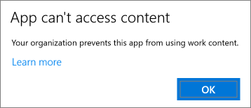

# Beveiligingsinstellingen voor apps op Windows 10-pc's valideren

## Controleren of gebruikers geen bedrijfsgegevens kunnen kopiëren naar persoonlijke bestanden op bedrijfsapparaten

Nadat u [beveiligingsbeleid voor apps hebt ingesteld](protection-settings-for-windows-10-devices.md), kan het enkele uren duren voordat het beleid van kracht wordt op apparaten van gebruikers. Als u de instelling **Voorkomen dat gebruikers bedrijfsgegevens kopiëren naar persoonlijke bestanden en afdwingen dat werkbestanden worden opgeslagen in OneDrive voor Bedrijven** hebt **ingeschakeld** op apparaten die eigendom zijn van het bedrijf, kunt u dit controleren op het apparaat van de gebruiker nadat deze verbinding heeft gemaakt met Azure AD en zich heeft aangemeld. 
  
 **Verbindingsinstellingen controleren**
  
1. Nadat u zich hebt aangemeld met Microsoft 365 Business-referenties en verbinding maakt met Azure AD (zoals beschreven in [Windows-apparaten instellen voor gebruikers van Microsoft 365 Business](set-up-windows-devices.md)), gaat u naar **Windows-instellingen** \> **Accounts** \> **Toegang tot werk of school**. Kies **Verbonden met Azure AD van \<naam tenant\>** en kies vervolgens **Info**.
    
    
  
2. Op de pagina **Beheerd door** \<naam tenant\> kunt u de **verbindingsgegevens** zien met een **adres van een beheerserver**, zoals in de volgende afbeelding. 
    
    
  
 **Controleren of u geen bedrijfsgegeven kunt plakken naar een niet-beheerde app**
  
1. Open Outlook 2016, geïnstalleerd door Microsoft 365 Business.
    
2. Open een e-mail en kopieer er een deel van de inhoud van.
    
    Open Kladblok en plak het deel hierin.
    
    U krijgt een foutmelding met de mededeling dat de app geen toegang heeft tot inhoud.
    
    
  
    U kunt echter wel dezelfde inhoud in Word 2016 plakken.
    
## Controleren of gebruikers geen bedrijfsgegevens kunnen kopiëren naar persoonlijke bestanden op persoonlijke apparaten

 **Verbindingsinstellingen controleren**
  
1. Ga op uw persoonlijke Windows 10-apparaat, waarop u als lokale gebruiker bent aangemeld, naar **Windows-instellingen** en klik of tik op **Accounts** \> **Toegang tot werk of school**.
    
2. Kies **Verbinden** onder **Toegang tot werk of school**.
    
3. Voer uw Microsoft 365 Business-referenties in in het dialoogvenster **Een werk- of schoolaccount instellen** \> **Aanmelden**.
    
4. Kies op de pagina **Toegang tot werk of school** de optie **Werk- of schoolaccount** en vervolgens **Info**.
    
    
  
5. Op de pagina **Toegang tot werk of school** ziet u de **verbindingsgegevens** met het **adres van de beheerserver**, zoals in de volgende afbeelding. Dit adres bevat de woorden  *wip*  en  *mam*  . 
    
    
  
 **Controleren of u geen bedrijfsgegeven kunt plakken naar een niet-beheerde app**
  
1. Open Outlook 2016 en voeg eventueel uw Microsoft 365 Business-account toe en meld u aan met uw Microsoft 365 Business-referenties.
    
2. Open een e-mail en kopieer er een deel van de inhoud van.
    
    Open Kladblok en plak het deel hierin.
    
    U krijgt een foutmelding met de mededeling dat de app geen toegang heeft tot inhoud.
    
    
  
    U kunt echter wel dezelfde inhoud in Word 2016 plakken.
    

