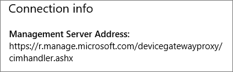

# Beveiligingsinstellingen voor apps op Windows 10-pc's valideren

## Controleren of gebruikers geen bedrijfsgegevens kunnen kopiëren naar persoonlijke bestanden op bedrijfsapparaten

Nadat u [beveiligingsbeleid voor apps hebt ingesteld](protection-settings-for-windows-10-devices.md), kan het enkele uren duren voordat het beleid van kracht wordt op apparaten van gebruikers. Als u  De instelling Voorkomen dat gebruikers bedrijfsgegevens kopiëren naar persoonlijke bestanden hebt ingeschakeld en ze dwingt om werkbestanden op te slaan in **OneDrive voor** Bedrijven voor apparaten die eigendom zijn van het bedrijf, kunt u dit controleren op het apparaat van de gebruiker nadat ze verbinding hebben gemaakt met Azure AD en zich hebben aangemeld. 
  
 **Verbindingsinstellingen controleren**
  
1. Nadat u zich hebt aanmelden met Microsoft 365 Business Premium-referenties en verbinding hebt met Azure AD, zoals beschreven in Windows-apparaten instellen voor [Microsoft 365 Business](set-up-windows-devices.md)Premium-gebruikers, gaat u naar **Windows Settings** Accounts Access werk of \>  \> **school.** Kies **Verbonden met Azure \<tenant name\> AD** en kies vervolgens **Info.**
    
    
  
2. Op de pagina Beheerd **door** ziet u de verbindingsgegevens met een Adres van \<tenant name\>  **managementserver,** zoals in de volgende afbeelding. 
    
    
  
 **Controleren of u geen bedrijfsgegevens in een niet-beheerde app kunt plakken**
  
1. Open Outlook 2016 die is geïnstalleerd door Microsoft 365 Business Premium.
    
2. Open een e-mail en kopieer er een deel van de inhoud van.
    
    Open Kladblok en plak het deel hierin.
    
    U krijgt een foutmelding dat de app geen toegang heeft tot inhoud.
    
    
  
    U kunt echter wel dezelfde inhoud in Word 2016 plakken.
    
## Controleren of gebruikers geen bedrijfsgegevens kunnen kopiëren naar persoonlijke bestanden op persoonlijke apparaten

 **Verbindingsinstellingen controleren**
  
1. Ga op uw persoonlijke Windows 10-apparaat waar u bent aangemeld als lokale gebruiker naar **Windows-instellingen** en klik of tik op Werk of school  \> **accountstoegang.**
    
2. Kies **Verbinden** onder **Toegang tot werk of school**.
    
3. Voer uw Microsoft 365 Business Premium-referenties in in het dialoogvenster Een werk- of **schoolaccount** \> **instellen Aanmelden.**
    
4. Kies op de pagina **Toegang tot werk of school** de optie **Werk- of schoolaccount** en vervolgens **Info**.
    
    
  
5. Op de **werk-** of schoolpagina  van Access kunt u de verbindingsgegevens zien met een Adres van **de beheerserver,** zoals in de volgende afbeelding, en worden de woorden wip *en* *mam* binnen weergegeven. 
    
    
  
 **Controleren of u geen bedrijfsgegevens in een niet-beheerde app kunt plakken**
  
1. Open Outlook 2016 en voeg zo nodig uw Microsoft 365 Business Premium-account toe en meld u aan met uw Microsoft 365 Business Premium-referenties.
    
2. Open een e-mail en kopieer er een deel van de inhoud van.
    
    Open Kladblok en plak het deel hierin.
    
    U ontvangt een foutmelding dat App geen toegang heeft tot inhoud.
    
    
  
    U kunt echter wel dezelfde inhoud in Word 2016 plakken.
    

