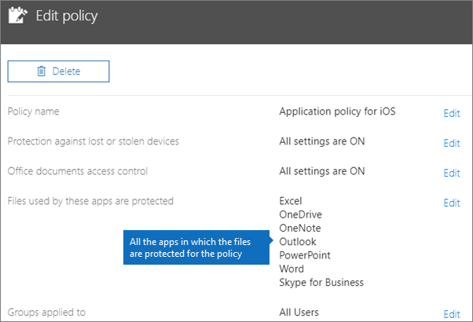

# Instellingen voor app-beveiliging valideren op Android- of iOS-apparatenValidate app protection settings on Android or iOS devices

Volg de instructies in de volgende secties om de instellingen voor app-beveiliging op Android- of iOS-apparaten te valideren.Follow the instructions in the following sections to validate app protection settings on Android or iOS devices.
  
## AndroidAndroid
  
### Controleren of de instellingen voor app-beveiliging werken op gebruikersapparatenCheck that the app protection settings are working on user devices

Nadat u [app-configuraties voor Android-apparaten hebt ingesteld](app-protection-settings-for-android-and-ios.md) om de apps te beschermen, kunt u deze stappen uitvoeren om te controleren of de gekozen instellingen goed werken.After you [set app configurations for Android devices](app-protection-settings-for-android-and-ios.md) to protect the apps, you can follow these steps to validate that the settings you chose work. 
  
Zorg er eerst voor dat het beleid van toepassing is op de app waarin u deze gaat valideren.First, make sure that the policy applies to the app in which you're going to validate it.
  
1. Ga in het Microsoft 365 Business **Policies** [Premium-beheercentrum](https://portal.office.com)naar \> **beleid bewerken**.In the Microsoft 365 Business Premium [admin center](https://portal.office.com), go to **Policies** \> **Edit policy**.
    
2. Kies **Toepassingsbeleid voor Android** voor de instellingen die u hebt gemaakt bij de installatie of een ander beleid dat u hebt gemaakt, en controleer of het bijvoorbeeld wordt afgedwongen voor Outlook.Choose **Application policy for Android** for the settings you created at setup, or another policy you created, and verify that it's enforced for Outlook, for example. 
    
    
  
### Een pincode of vingerafdruk vereisen om toegang te krijgen tot Office-apps validerenValidate Require a PIN or a fingerprint to access Office apps

Kies in het deelvenster **Beleid bewerken** de optie **Bewerken** naast **Toegangsbeheer Office-documenten**, vouw **Beheren hoe gebruikers Office-bestanden op mobiele apparaten openen** uit en zorg ervoor dat **Een pincode of vingerafdruk vereisen om toegang te krijgen tot Office-apps** is ingesteld op **Aan**.In the **Edit policy** pane, choose **Edit** next to **Office documents access control**, expand **Manage how users access Office files on mobile devices**, and make sure that **Require a PIN or fingerprint to access Office apps** is set to **On**.
  

  
1. Open Outlook op het Android-apparaat van de gebruiker en meld u aan met de Microsoft 365 Business Premium-referenties van de gebruiker.In the user's Android device, open Outlook and sign in with the user's Microsoft 365 Business Premium credentials.
    
2. U wordt ook gevraagd om een pincode in te voeren of een vingerafdruk te gebruiken.You'll also be prompted to enter a PIN or use a fingerprint.
    
    
  
### Pincode opnieuw instellen na aantal mislukte pogingen validerenValidate Reset PIN after number of failed attempts

Kies in het **beleidsvenster Bewerken** de optie **Bewerken** naast **het toegangsbeheer voor Office-documenten,** vouw **De manier waarop gebruikers toegang krijgen tot Office-bestanden op mobiele apparaten**uit en controleer of de pincode opnieuw instellen na het aantal mislukte **pogingen** is ingesteld op een bepaald aantal.In the **Edit policy** pane, choose **Edit** next to **Office documents access control**, expand **Manage how users access Office files on mobile devices**, and make sure that **Reset PIN after number of failed attempts** is set to some number. Dit is standaard 5.This is 5 by default. 
  
1. Open Outlook op het Android-apparaat van de gebruiker en meld u aan met de Microsoft 365 Business Premium-referenties van de gebruiker.In the user's Android device, open Outlook and sign in with the user's Microsoft 365 Business Premium credentials.
    
2. Voer net zo vaak een onjuiste pincode in als is aangegeven in het beleid.Enter an incorrect PIN as many times as specified by the policy. Er wordt een prompt te zien met **pincodeslimiet bereikt** om de pincode opnieuw in te stellen.You'll see a prompt that states **PIN Attempt Limit Reached** to reset the PIN. 
    
    
  
3. Druk op **Pincode opnieuw instellen**.Press **Reset PIN**. U wordt gevraagd om u aan te melden met de Microsoft 365 Business Premium-referenties van de gebruiker en vervolgens een nieuwe pincode in te stellen.You'll be prompted to sign in with the user's Microsoft 365 Business Premium credentials, and then required to set a new PIN.
    
### Gebruikers dwingen om alle werkbestanden op te slaan in OneDrive voor Bedrijven validerenValidate Force users to save all work files to OneDrive for Business

Kies in het deelvenster **Beleid bewerken** de optie **Bewerken** naast **Beveiliging bij verlies of diefstal van apparaten**, vouw **Werkbestanden beveiligen bij verlies of diefstal van apparaten** uit en zorg ervoor dat **Gebruikers dwingen om alle werkbestanden op te slaan in OneDrive voor Bedrijven** is ingesteld op **Aan**.In the **Edit policy** pane, choose **Edit** next to **Protection against lost or stolen devices**, expand **Protect work files when devices are lost or stolen**, and make sure that **Force users to save all work files to OneDrive for Business** is set to **On**.
  

  
1. Open Outlook op het Android-apparaat van de gebruiker en meld u aan met de Microsoft 365 Business Premium-referenties van de gebruiker en voer desgevraagd een pincode in.In the user's Android device, open Outlook and sign in with the user's Microsoft 365 Business Premium credentials, and enter a PIN if requested.
    
2. Open een e-mailbericht met een bijlage en tik op het pictogram Pijl-omlaag naast de gegevens van de bijlage.Open an email that contains an attachment and tap the down arrow icon next to the attachment's information.
    
    
  
    U ziet **Niet opslaan** op apparaat onder aan het scherm.You'll see **Cannot save to device** on the bottom of the screen. 
    
    
  
    > [!NOTE]
    > Opslaan in OneDrive voor Bedrijven is op dit moment niet ingeschakeld voor Android, zodat u alleen ziet dat lokaal opslaan is geblokkeerd.Saving to OneDrive for Business is not enabled for Android at this time, so you can only see that saving locally is blocked. 
  
### Vereisen dat gebruikers zich opnieuw aanmelden als Office-apps inactief zijn geweest gedurende een opgegeven tijd validerenValidate Require user to sign in again if Office apps have been idle for a specified time

Kies in het **beleidsvenster Bewerken** de optie **Bewerken** naast **het toegangsbeheer voor Office-documenten,** vouw **Uit Hoe gebruikers toegang krijgen tot Office-bestanden op mobiele apparaten**en controleer of gebruikers zich opnieuw moeten aanmelden nadat **Office-apps zijn inactief voor** een aantal minuten is ingesteld.In the **Edit policy** pane, choose **Edit** next to **Office documents access control**, expand **Manage how users access Office files on mobile devices**, and make sure that **Require users to sign in again after Office apps have been idle for** is set to some number of minutes. Dit is standaard 30 minuten.This is 30 minutes by default. 
  
1. Open Outlook op het Android-apparaat van de gebruiker en meld u aan met de Microsoft 365 Business Premium-referenties van de gebruiker en voer desgevraagd een pincode in.In the user's Android device, open Outlook and sign in with the user's Microsoft 365 Business Premium credentials, and enter a PIN if requested.
    
2. U ziet nu het Postvak IN van Outlook. Gebruik het Android-apparaat minimaal 30 minuten niet (of een andere tijdsduur, langer dan wat u hebt opgegeven in het beleid). Het apparaat wordt waarschijnlijk gedimd.You should now see Outlook's inbox. Let the Android device idle untouched for at least 30 minutes (or some other amount of time, longer than what you specified in the policy). The device will likely dim.
    
3. Krijg opnieuw toegang tot Outlook op het Android-apparaat.Access Outlook on the Android device again.
    
4. U wordt gevraagd uw pincode in te voeren voordat u weer toegang krijgt tot Outlook.You'll be prompted to enter your PIN before you can access Outlook again.
    
### Werkbestanden beveiligen met versleuteling validerenValidate Protect work files with encryption

Kies in het deelvenster **Beleid bewerken** de optie **Bewerken** naast **Beveiliging bij verlies of diefstal van apparaten**, vouw **Werkbestanden beveiligen bij verlies of diefstal van apparaten** uit en zorg ervoor dat **Werkbestanden beveiligen met versleuteling** is ingesteld op **Aan** en **Gebruikers dwingen om alle werkbestanden op te slaan in OneDrive voor Bedrijven** is ingesteld op **Uit**.In the **Edit policy** pane, choose **Edit** next to **Protection against lost or stolen devices**, expand **Protect work files when devices are lost or stolen**, and make sure that **Protect work files with encryption** is set to **On**, and **Force users to save all work files to OneDrive for Business** is set to **Off**.
  
1. Open Outlook op het Android-apparaat van de gebruiker en meld u aan met de Microsoft 365 Business Premium-referenties van de gebruiker en voer desgevraagd een pincode in.In the user's Android device, open Outlook and sign in with the user's Microsoft 365 Business Premium credentials, and enter a PIN if requested.
    
2. Open een e-mail met een paar bijlagen in afbeeldingsbestanden.Open an email that contains a few image file attachments.
    
3. Tik op het pictogram Pijl-omlaag naast de informatie van de bijlage om die op te slaan.Tap the down arrow icon next to the attachment's info to save it.
    
    
  
4. U wordt mogelijk gevraagd om toegang toe te staan voor Outlook tot de foto's, media en bestanden op uw apparaat. Tik op **Toestaan**.You may be prompted to allow Outlook to access photos, media, and files on your device. Tap **Allow**.
    
5. Kies onderaan het scherm **Opslaan op apparaat** en open vervolgens de **Galerie** -app.At the bottom of the screen, choose to **Save to Device** and then open the **Gallery** app. 
    
6. U ziet een versleutelde foto (of meer als u meerdere bijlagen met afbeeldingsbestanden hebt opgeslagen) in de lijst. Dit wordt mogelijk weergegeven in de lijst met afbeeldingen als een grijs vierkant met een wit uitroepteken binnen een witte cirkel in het midden van het grijze vak.You should see an encrypted photo (or more, if you saved multiple image file attachments) in the list. It may appear in the Pictures list as a gray square with a white exclamation point within a white circle in the center of the gray square.
    
    
  
## IosiOS
  
### Controleer of de instellingen voor app-beveiliging werken op gebruikersapparatenCheck that the App protection settings are working on user devices

Nadat u [app-configuraties voor iOS-apparaten hebt ingesteld](app-protection-settings-for-android-and-ios.md) om apps te beschermen, kunt u deze stappen uitvoeren om te controleren of de gekozen instellingen goed werken.After you [set app configurations for iOS devices](app-protection-settings-for-android-and-ios.md) to protect apps, you can follow these steps to validate that the settings you chose work. 
  
Zorg er eerst voor dat het beleid van toepassing is op de app waarin u deze gaat valideren.First, make sure that the policy applies to the app in which you're going to validate it.
  
1. Ga in het Microsoft 365 Business **Policies** [Premium-beheercentrum](https://portal.office.com)naar \> **beleid bewerken**.In the Microsoft 365 Business Premium [admin center](https://portal.office.com), go to **Policies** \> **Edit policy**.
    
2. Kies **Toepassingsbeleid voor iOS** voor de instellingen die u hebt gemaakt bij de installatie of een ander beleid dat u hebt gemaakt, en controleer of het bijvoorbeeld wordt afgedwongen voor Outlook.Choose **Application policy for iOS** for the settings you created at setup, or another policy you created, and verify that it's enforced for Outlook for example. 
    
    
  
### Een pincode vereisen om toegang te krijgen tot Office-apps validerenValidate Require a PIN to access Office apps

Kies in het deelvenster **Beleid bewerken** de optie **Bewerken** naast **Toegangsbeheer Office-documenten**, vouw **Beheren hoe gebruikers Office-bestanden op mobiele apparaten openen** uit en zorg ervoor dat **Een pincode of vingerafdruk vereisen om toegang te krijgen tot Office-apps** is ingesteld op **Aan**.In the **Edit policy** pane, choose **Edit** next to **Office documents access control**, expand **Manage how users access Office files on mobile devices**, and make sure that **Require a PIN or fingerprint to access Office apps** is set to **On**.
  

  
1. Open Outlook op het iOS-apparaat van de gebruiker en meld u aan met de Microsoft 365 Business Premium-referenties van de gebruiker.In the user's iOS device, open Outlook and sign in with the user's Microsoft 365 Business Premium credentials.
    
2. U wordt ook gevraagd om een pincode in te voeren of een vingerafdruk te gebruiken.You'll also be prompted to enter a PIN or use a fingerprint.
    
    
  
### Pincode opnieuw instellen na aantal mislukte pogingen validerenValidate Reset PIN after number of failed attempts

Kies in het **beleidsvenster Bewerken** de optie **Bewerken** naast **het toegangsbeheer voor Office-documenten,** vouw **De manier waarop gebruikers toegang krijgen tot Office-bestanden op mobiele apparaten**uit en controleer of de pincode opnieuw instellen na het aantal mislukte **pogingen** is ingesteld op een bepaald aantal.In the **Edit policy** pane, choose **Edit** next to **Office documents access control**, expand **Manage how users access Office files on mobile devices**, and make sure that **Reset PIN after number of failed attempts** is set to some number. Dit is standaard 5.This is 5 by default. 
  
1. Open Outlook op het iOS-apparaat van de gebruiker en meld u aan met de Microsoft 365 Business Premium-referenties van de gebruiker.In the user's iOS device, open Outlook and sign in with the user's Microsoft 365 Business Premium credentials.
    
2. Voer net zo vaak een onjuiste pincode in als is aangegeven in het beleid.Enter an incorrect PIN as many times as specified by the policy. Er wordt een prompt te zien met **pincodeslimiet bereikt** om de pincode opnieuw in te stellen.You'll see a prompt that states **PIN Attempt Limit Reached** to reset the PIN. 
    
    
  
3. Druk op **OK**.Press **OK**. U wordt gevraagd om u aan te melden met de Microsoft 365 Business Premium-referenties van de gebruiker en vervolgens een nieuwe pincode in te stellen.You'll be prompted to sign in with the user's Microsoft 365 Business Premium credentials, and then required to set a new PIN.
    
### Gebruikers dwingen om alle werkbestanden op te slaan in OneDrive voor Bedrijven validerenValidate Force users to save all work files to OneDrive for Business

Kies in het deelvenster **Beleid bewerken** de optie **Bewerken** naast **Beveiliging bij verlies of diefstal van apparaten**, vouw **Werkbestanden beveiligen bij verlies of diefstal van apparaten** uit en zorg ervoor dat **Gebruikers dwingen om alle werkbestanden op te slaan in OneDrive voor Bedrijven** is ingesteld op **Aan**.In the **Edit policy** pane, choose **Edit** next to **Protection against lost or stolen devices**, expand **Protect work files when devices are lost or stolen**, and make sure that **Force users to save all work files to OneDrive for Business** is set to **On**.
  

  
1. Open Outlook op het iOS-apparaat van de gebruiker en meld u aan met de Microsoft 365 Business Premium-referenties van de gebruiker en voer desgevraagd een pincode in.In the user's iOS device, open Outlook and sign in with the user's Microsoft 365 Business Premium credentials, and enter a PIN if requested.
    
2. Open een e-mailbericht met een bijlage, open de bijlage en kies **Opslaan** onderaan het scherm.Open an email that contains an attachment, open the attachment and choose **Save** on the bottom of the screen. 
    
    
  
3. U ziet alleen een optie voor OneDrive voor Bedrijven.You should only see an option for OneDrive for Business. Als dit niet het zo is, tikt u op **Account toevoegen** en selecteert u **OneDrive voor Bedrijven** in het scherm **Opslagaccount toevoegen.**If not, tap **Add Account** and select **OneDrive for Business** from the **Add Storage Account** screen. Geef de Microsoft 365 Business Premium van de eindgebruiker aan om zich aan te melden wanneer daarom wordt gevraagd.Provide the end user's Microsoft 365 Business Premium to sign in when prompted. 
    
    Tik op **Opslaan** en selecteer **OneDrive voor Bedrijven**.Tap **Save** and select **OneDrive for Business**.
    
### Vereisen dat gebruikers zich opnieuw aanmelden als Office-apps inactief zijn geweest gedurende een opgegeven tijd validerenValidate Require user to sign in again if Office apps have been idle for a specified time

Kies in het **beleidsvenster Bewerken** de optie **Bewerken** naast **het toegangsbeheer voor Office-documenten,** vouw **Uit Hoe gebruikers toegang krijgen tot Office-bestanden op mobiele apparaten**en controleer of gebruikers zich opnieuw moeten aanmelden nadat **Office-apps zijn inactief voor** een aantal minuten is ingesteld.In the **Edit policy** pane, choose **Edit** next to **Office documents access control**, expand **Manage how users access Office files on mobile devices**, and make sure that **Require users to sign in again after Office apps have been idle for** is set to some number of minutes. Dit is standaard 30 minuten.This is 30 minutes by default. 
  
1. Open Outlook op het iOS-apparaat van de gebruiker en meld u aan met de Microsoft 365 Business Premium-referenties van de gebruiker en voer desgevraagd een pincode in.In the user's iOS device, open Outlook and sign in with the user's Microsoft 365 Business Premium credentials, and enter a PIN if requested.
    
2. U ziet nu het Postvak IN van Outlook. Gebruik het iOS-apparaat minimaal 30 minuten niet (of een andere tijdsduur, langer dan wat u hebt opgegeven in het beleid). Het apparaat wordt waarschijnlijk gedimd.You should now see Outlook's inbox. Let the iOS device untouched for at least 30 minutes (or some other amount of time, longer than what you specified in the policy). The device will likely dim.
    
3. Krijg opnieuw toegang tot Outlook op het iOS-apparaat.Access Outlook on the iOS device again.
    
4. U wordt gevraagd uw pincode in te voeren voordat u weer toegang krijgt tot Outlook.You'll be prompted to enter your PIN before you can access Outlook again.
    
### Werkbestanden beveiligen met versleuteling validerenValidate Protect work files with encryption

Kies in het deelvenster **Beleid bewerken** de optie **Bewerken** naast **Beveiliging bij verlies of diefstal van apparaten**, vouw **Werkbestanden beveiligen bij verlies of diefstal van apparaten** uit en zorg ervoor dat **Werkbestanden beveiligen met versleuteling** is ingesteld op **Aan** en **Gebruikers dwingen om alle werkbestanden op te slaan in OneDrive voor Bedrijven** is ingesteld op **Uit**.In the **Edit policy** pane, choose **Edit** next to **Protection against lost or stolen devices**, expand **Protect work files when devices are lost or stolen**, and make sure that **Protect work files with encryption** is set to **On**, and **Force users to save all work files to OneDrive for Business** is set to **Off**.
  
1. Open Outlook op het iOS-apparaat van de gebruiker en meld u aan met de Microsoft 365 Business Premium-referenties van de gebruiker en voer desgevraagd een pincode in.In the user's iOS device, open Outlook and sign in with the user's Microsoft 365 Business Premium credentials, and enter a PIN if requested.
    
2. Open een e-mail met een paar bijlagen in afbeeldingsbestanden.Open an email that contains a few image file attachments.
    
3. Tik op de bijlage en tik vervolgens op de optie **Opslaan** eronder.Tap the attachment and then tap the **Save** option under it. 
    
4. Open de app **Foto's** vanuit het beginscherm. U ziet een versleutelde foto (of meer als u meerdere bijlagen met afbeeldingsbestanden hebt opgeslagen) die is opgeslagen, maar die wel is versleuteld.Open **Photos** app from the home screen. You should see an encrypted photo (or more, if you saved multiple image file attachments) saved, but encrypted. 
    
---

