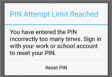
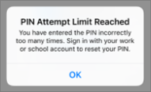

# Instellingen voor app-beveiliging valideren op Android- of iOS-apparaten

Volg de instructies in de volgende secties om instellingen voor app-beveiliging te valideren op Android- of iOS-apparaten.
  
## Android
  
### Controleer of de instellingen voor app-beveiliging werken op gebruikersapparaten

Nadat u [app-configuraties voor Android-apparaten hebt ingesteld](app-protection-settings-for-android-and-ios.md) om de apps te beschermen, kunt u deze stappen uitvoeren om te controleren of de gekozen instellingen goed werken. 
  
Controleer eerst of het beleid van toepassing is op de app waarin u het gaat valideren.
  
1. Ga in het Microsoft 365 Business [Premium-beheercentrum](https://portal.office.com)naar  \> **Beleidsbeleid bewerken.**
    
2. Kies **Toepassingsbeleid voor Android** voor de instellingen die u hebt gemaakt bij de installatie of een ander beleid dat u hebt gemaakt, en controleer of dit bijvoorbeeld is afgedwongen voor Outlook. 
    
    
  
### Een pincode of vingerafdruk vereisen om toegang te krijgen tot Office-apps valideren

Kies in het deelvenster **Beleid bewerken** de optie **Bewerken** naast **Toegangsbeheer Office-documenten**, vouw **Beheren hoe gebruikers Office-bestanden op mobiele apparaten openen** uit en zorg ervoor dat **Een pincode of vingerafdruk vereisen om toegang te krijgen tot Office-apps** is ingesteld op **Aan**.
  

  
1. Open Outlook op het Android-apparaat van de gebruiker en meld u aan met de Microsoft 365 Business Premium-referenties van de gebruiker.
    
2. U wordt ook gevraagd een pincode in te voeren of een vingerafdruk te gebruiken.
    
    
  
### Pincode opnieuw instellen na aantal mislukte pogingen valideren

Kies **in** het deelvenster  Beleid bewerken de optie Bewerken naast Toegangsbesturingselement **voor Office-documenten,** vouw Beheren hoe gebruikers Toegang krijgen tot **Office-bestanden** op mobiele apparaten uit en zorg ervoor dat **Pincode** opnieuw instellen nadat het aantal mislukte pogingen is ingesteld op een nummer. Dit is standaard 5. 
  
1. Open Outlook op het Android-apparaat van de gebruiker en meld u aan met de Microsoft 365 Business Premium-referenties van de gebruiker.
    
2. Voer net zo vaak een onjuiste pincode in als is aangegeven in het beleid. U ziet een prompt met de melding **Pincode pogingslimiet bereikt om** de pincode opnieuw in te stellen. 
    
    
  
3. Druk op **Pincode opnieuw instellen**. U wordt gevraagd u aan te melden met de Microsoft 365 Business Premium-referenties van de gebruiker en vervolgens een nieuwe pincode in te stellen.
    
### Gebruikers dwingen om alle werkbestanden op te slaan in OneDrive voor Bedrijven valideren

Kies in het deelvenster **Beleid bewerken** de optie **Bewerken** naast **Beveiliging bij verlies of diefstal van apparaten**, vouw **Werkbestanden beveiligen bij verlies of diefstal van apparaten** uit en zorg ervoor dat **Gebruikers dwingen om alle werkbestanden op te slaan in OneDrive voor Bedrijven** is ingesteld op **Aan**.
  

  
1. Open Outlook op het Android-apparaat van de gebruiker en meld u aan met de Microsoft 365 Business Premium-referenties van de gebruiker en voer desgevraagd een pincode in.
    
2. Open een e-mailbericht met een bijlage en tik op het pictogram Pijl-omlaag naast de gegevens van de bijlage.
    
    
  
    U ziet Niet **opslaan op apparaat** onder aan het scherm. 
    
    
  
    > [!NOTE]
    > Opslaan in OneDrive voor Bedrijven is op dit moment niet ingeschakeld voor Android, zodat u alleen ziet dat lokaal opslaan is geblokkeerd. 
  
### Vereisen dat gebruikers zich opnieuw aanmelden als Office-apps inactief zijn geweest gedurende een opgegeven tijd valideren

Kies **in** het deelvenster  Beleid bewerken de optie Bewerken naast Toegangsbeheer voor **Office-documenten,** vouw Beheren hoe gebruikers Toegang krijgen tot **Office-bestanden** op mobiele apparaten uit en zorg ervoor dat Gebruikers opnieuw moeten aanmelden nadat **Office-apps** niet actief zijn geweest, is ingesteld op een aantal minuten. Dit is standaard 30 minuten. 
  
1. Open Outlook op het Android-apparaat van de gebruiker en meld u aan met de Microsoft 365 Business Premium-referenties van de gebruiker en voer desgevraagd een pincode in.
    
2. U ziet nu het Postvak IN van Outlook. Gebruik het Android-apparaat minimaal 30 minuten niet (of een andere tijdsduur, langer dan wat u hebt opgegeven in het beleid). Het apparaat wordt waarschijnlijk gedimd.
    
3. Open Outlook opnieuw op het Android-apparaat.
    
4. U wordt gevraagd uw pincode in te voeren voordat u Outlook opnieuw kunt openen.
    
### Werkbestanden beveiligen met versleuteling valideren

Kies in het deelvenster **Beleid bewerken** de optie **Bewerken** naast **Beveiliging bij verlies of diefstal van apparaten**, vouw **Werkbestanden beveiligen bij verlies of diefstal van apparaten** uit en zorg ervoor dat **Werkbestanden beveiligen met versleuteling** is ingesteld op **Aan** en **Gebruikers dwingen om alle werkbestanden op te slaan in OneDrive voor Bedrijven** is ingesteld op **Uit**.
  
1. Open Outlook op het Android-apparaat van de gebruiker en meld u aan met de Microsoft 365 Business Premium-referenties van de gebruiker en voer desgevraagd een pincode in.
    
2. Open een e-mailbericht met een paar bijlagen in het afbeeldingsbestand.
    
3. Tik op het pictogram Pijl-omlaag naast de informatie van de bijlage om die op te slaan.
    
    
  
4. U wordt mogelijk gevraagd om toegang toe te staan voor Outlook tot de foto's, media en bestanden op uw apparaat. Tik op **Toestaan**.
    
5. Kies onderaan het scherm **Opslaan op apparaat** en open vervolgens de **Galerie** -app. 
    
6. U ziet een versleutelde foto (of meer als u meerdere bijlagen met afbeeldingsbestanden hebt opgeslagen) in de lijst. Dit wordt mogelijk weergegeven in de lijst met afbeeldingen als een grijs vierkant met een wit uitroepteken binnen een witte cirkel in het midden van het grijze vak.
    
    
  
## iOS
  
### Controleer of de instellingen voor app-beveiliging werken op gebruikersapparaten

Nadat u [app-configuraties voor iOS-apparaten hebt ingesteld](app-protection-settings-for-android-and-ios.md) om apps te beschermen, kunt u deze stappen uitvoeren om te controleren of de gekozen instellingen goed werken. 
  
Controleer eerst of het beleid van toepassing is op de app waarin u het gaat valideren.
  
1. Ga in het Microsoft 365 Business [Premium-beheercentrum](https://portal.office.com)naar  \> **Beleidsbeleid bewerken.**
    
2. Kies **Toepassingsbeleid voor iOS** voor de instellingen die u hebt gemaakt bij de installatie of een ander beleid dat u hebt gemaakt, en controleer of dit is afgedwongen voor outlook bijvoorbeeld. 
    
    
  
### Een pincode vereisen om toegang te krijgen tot Office-apps valideren

Kies in het deelvenster **Beleid bewerken** de optie **Bewerken** naast **Toegangsbeheer Office-documenten**, vouw **Beheren hoe gebruikers Office-bestanden op mobiele apparaten openen** uit en zorg ervoor dat **Een pincode of vingerafdruk vereisen om toegang te krijgen tot Office-apps** is ingesteld op **Aan**.
  

  
1. Open Outlook op het iOS-apparaat van de gebruiker en meld u aan met de Microsoft 365 Business Premium-referenties van de gebruiker.
    
2. U wordt ook gevraagd een pincode in te voeren of een vingerafdruk te gebruiken.
    
    
  
### Pincode opnieuw instellen na aantal mislukte pogingen valideren

Kies **in** het deelvenster  Beleid bewerken de optie Bewerken naast Toegangsbesturingselement **voor Office-documenten,** vouw Beheren hoe gebruikers Toegang krijgen tot **Office-bestanden** op mobiele apparaten uit en zorg ervoor dat **Pincode** opnieuw instellen nadat het aantal mislukte pogingen is ingesteld op een nummer. Dit is standaard 5. 
  
1. Open Outlook op het iOS-apparaat van de gebruiker en meld u aan met de Microsoft 365 Business Premium-referenties van de gebruiker.
    
2. Voer net zo vaak een onjuiste pincode in als is aangegeven in het beleid. U ziet een prompt met de melding **Pincode pogingslimiet bereikt om** de pincode opnieuw in te stellen. 
    
    
  
3. Druk op **OK**. U wordt gevraagd u aan te melden met de Microsoft 365 Business Premium-referenties van de gebruiker en vervolgens een nieuwe pincode in te stellen.
    
### Gebruikers dwingen om alle werkbestanden op te slaan in OneDrive voor Bedrijven valideren

Kies in het deelvenster **Beleid bewerken** de optie **Bewerken** naast **Beveiliging bij verlies of diefstal van apparaten**, vouw **Werkbestanden beveiligen bij verlies of diefstal van apparaten** uit en zorg ervoor dat **Gebruikers dwingen om alle werkbestanden op te slaan in OneDrive voor Bedrijven** is ingesteld op **Aan**.
  

  
1. Open Outlook op het iOS-apparaat van de gebruiker en meld u aan met de Microsoft 365 Business Premium-referenties van de gebruiker en voer desgevraagd een pincode in.
    
2. Open een e-mailbericht met een bijlage, open de bijlage en kies **Opslaan** onderaan het scherm. 
    
    
  
3. U ziet alleen een optie voor OneDrive voor Bedrijven. Zo niet, tikt **u op Account** toevoegen en **selecteert u OneDrive voor Bedrijven** in het scherm **Opslagaccount** toevoegen. Geef microsoft 365 Business Premium van de eindgebruiker op om u aan te melden wanneer u daarom wordt gevraagd. 
    
    Tik op **Opslaan** en selecteer **OneDrive voor Bedrijven**.
    
### Vereisen dat gebruikers zich opnieuw aanmelden als Office-apps inactief zijn geweest gedurende een opgegeven tijd valideren

Kies **in** het deelvenster  Beleid bewerken de optie Bewerken naast Toegangsbeheer voor **Office-documenten,** vouw Beheren hoe gebruikers Toegang krijgen tot **Office-bestanden** op mobiele apparaten uit en zorg ervoor dat Gebruikers opnieuw moeten aanmelden nadat **Office-apps** niet actief zijn geweest, is ingesteld op een aantal minuten. Dit is standaard 30 minuten. 
  
1. Open Outlook op het iOS-apparaat van de gebruiker en meld u aan met de Microsoft 365 Business Premium-referenties van de gebruiker en voer desgevraagd een pincode in.
    
2. U ziet nu het Postvak IN van Outlook. Gebruik het iOS-apparaat minimaal 30 minuten niet (of een andere tijdsduur, langer dan wat u hebt opgegeven in het beleid). Het apparaat wordt waarschijnlijk gedimd.
    
3. Open Outlook opnieuw op het iOS-apparaat.
    
4. U wordt gevraagd uw pincode in te voeren voordat u Outlook opnieuw kunt openen.
    
### Werkbestanden beveiligen met versleuteling valideren

Kies in het deelvenster **Beleid bewerken** de optie **Bewerken** naast **Beveiliging bij verlies of diefstal van apparaten**, vouw **Werkbestanden beveiligen bij verlies of diefstal van apparaten** uit en zorg ervoor dat **Werkbestanden beveiligen met versleuteling** is ingesteld op **Aan** en **Gebruikers dwingen om alle werkbestanden op te slaan in OneDrive voor Bedrijven** is ingesteld op **Uit**.
  
1. Open Outlook op het iOS-apparaat van de gebruiker en meld u aan met de Microsoft 365 Business Premium-referenties van de gebruiker en voer desgevraagd een pincode in.
    
2. Open een e-mailbericht met een paar bijlagen in het afbeeldingsbestand.
    
3. Tik op de bijlage en tik vervolgens op de optie **Opslaan** eronder. 
    
4. Open de app **Foto's** vanuit het beginscherm. U ziet een versleutelde foto (of meer als u meerdere bijlagen met afbeeldingsbestanden hebt opgeslagen) die is opgeslagen, maar die wel is versleuteld. 
    
---

