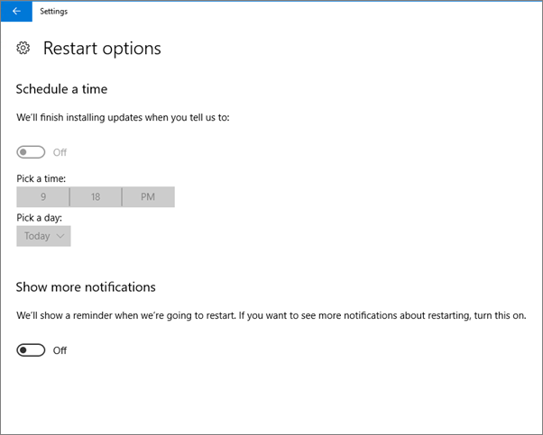

# Instellingen voor apparaatbeveiliging controleren op Windows 10-pc'sValidate device protection settings on Windows 10 PCs

## Controleren of Windows 10-apparaatbeleid is ingesteldVerify that Windows 10 device policies are set

Nadat u [apparaatbeleid hebt ingesteld](protection-settings-for-windows-10-pcs.md), kan het enkele uren duren voordat het beleid van kracht wordt op apparaten van gebruikers.After you [set up devices policies](protection-settings-for-windows-10-pcs.md), it may take up to a few hours for the policy to take effect on users' devices. U kunt controleren of het beleid van kracht is door verschillende schermen met Windows-instellingen te bekijken op de apparaten van gebruikers.You can confirm that the policies took effect by looking at various Windows Settings screens on the users' devices. Omdat de gebruikers de instellingen voor Windows Update en Windows Defender Antivirus op hun Windows 10-apparaten niet kunnen wijzigen, worden veel opties grijs weergegeven.Because the users won't be able to modify the Windows Update and Windows Defender Antivirus settings on their Windows 10 devices, many options will be grayed out.
  
1. Ga **Settings** naar \> **Instellingen &amp; Update-beveiligingsupdate** \> **Windows Update** \> **Startopties opnieuw op** en controleer of alle instellingen grijs zijn.Go to **Settings** \> **Update &amp; security** \> **Windows Update** \> **Restart options** and confirm that all settings are grayed out. 
    
    
  
2. Ga naar **Instellingen** \> **Update &amp; beveiligingsupdate** De geavanceerde opties voor Windows \> **Update** en controleer of alle instellingen grijs \> **Advanced options** zijn weergegeven.Go to **Settings** \> **Update &amp; security** \> **Windows Update** \> **Advanced options** and confirm that all settings are grayed out. 
    
    
  
3. Go to **Settings** \> **Update &amp; security** \> **Windows Update** \> **Advanced options** \> **Choose how updates are delivered**.Go to **Settings** \> **Update &amp; security** \> **Windows Update** \> **Advanced options** \> **Choose how updates are delivered**.
    
    Controleer of u het bericht (in het rood) zien dat sommige instellingen door uw organisatie worden verborgen of beheerd en dat alle opties grijs worden weergegeven.Confirm that you can see the message (in red) that some settings are hidden or managed by your organization, and all the options are grayed out.
    
    
  
4. To open the Windows Defender Security Center, go to **Settings** \> **Update &amp; security** \> **Windows Defender** \> click **Open Windows Defender Security Center** \> **Virus &amp; thread protection** \> **Virus &amp; threat protection settings**.To open the Windows Defender Security Center, go to **Settings** \> **Update &amp; security** \> **Windows Defender** \> click **Open Windows Defender Security Center** \> **Virus &amp; thread protection** \> **Virus &amp; threat protection settings**. 
    
5. Controleer of alle opties grijs zijn weergegeven.Verify that all options are grayed out. 
    
    
  
## Verwante onderwerpenRelated Topics

[Microsoft 365 voor bedrijfsdocumentatie en -bronnenMicrosoft 365 for business documentation and resources](https://go.microsoft.com/fwlink/p/?linkid=853701)
  
[Aan de slag met Microsoft 365 voor bedrijvenGet started with Microsoft 365 for business](microsoft-365-business-overview.md)
  
[Microsoft 365 voor bedrijven beherenManage Microsoft 365 for business](manage.md)
  
[Instellingen voor apparaatbeveiliging instellen voor Windows 10-pc'sSet device configurations for Windows 10 PCs](protection-settings-for-windows-10-pcs.md)
  

