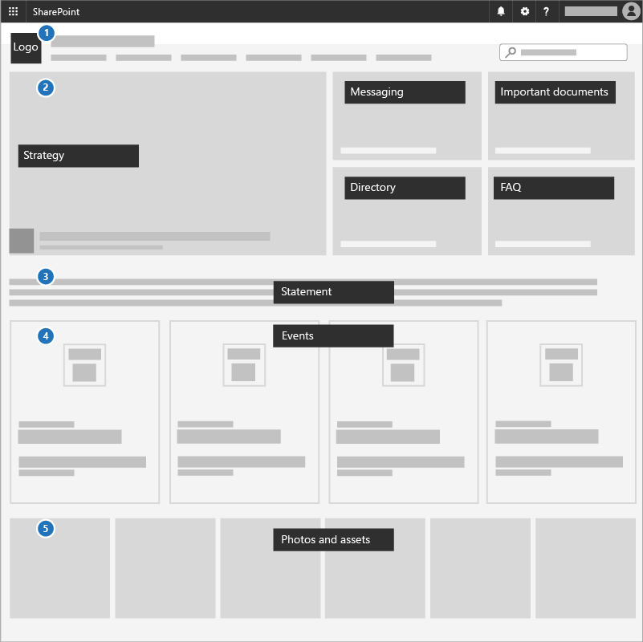

# Een communicatiesite makenCreate a communications site

Een geweldige manier om prioriteiten te communiceren, strategiedocumenten te delen en toekomstige gebeurtenissen te markeren, is door een communicatiesite te gebruiken in SharePoint.A great way to communicate priorities, share strategy documents, and highlight upcoming events is to use a communications site in SharePoint. Communicatiesites zijn voor het delen van zaken in uw hele bedrijf of campagne. het is uw interne strategiesite.Communications sites are for sharing things broadly across your whole business or campaign; it's your internal strategy site.

## Aanbevolen proceduresBest practices

Neem de volgende elementen op in uw communicatiesite:Include the following elements in your Communications site:

1. Voeg uw logo en kleuren toe als een koptekstafbeelding en -thema.Add your logo and colors as a header image and theme.
2. Leid met uw strategie, bericht, belangrijke documenten, een adreslijst en veelgestelde vragen in een **Hero-webonderdeel.**Lead with your strategy, message, important documents, a directory, and FAQ in a **Hero web part**.
3. Voeg een CEO of kandidaatverklaring toe aan het team in een **webonderdeel Tekst.**Include a CEO or candidate statement to the team in a **Text web part**.
4. Voeg gebeurtenissen toe aan een **webonderdeel Gebeurtenissen,** zodat iedereen kan zien wat er gaat komen.Add events to an **Events web part** so everyone can see what's coming up.
5. Voeg foto's toe die personen kunnen gebruiken of delen aan een **webonderdeel Afbeeldingsgalerie.**Add photos that people can use or share to an **Image gallery web part**.

## Infographic: Een infographic voor communicatiesite makenInfographic: Create a Communications Site infographic

De volgende koppelingen voor PowerPoint en PDF kunnen worden gedownload en afgedrukt in tabloid-indeling (ook wel bekend als grootboek, 11 x 17 of A3).The following links for PowerPoint and PDF can be downloaded and printed in tabloid format (also known as ledger, 11 x 17, or A3).

[PDF](downloads/M365CampaignsCreateCommunicationSite.pdf)  |  [PowerPoint](downloads/M365CampaignsCreateCommunicationSite.pptx)[PDF](downloads/M365CampaignsCreateCommunicationSite.pdf) | [PowerPoint](downloads/M365CampaignsCreateCommunicationSite.pptx)

## InstellenSet it up

1. Meld u aan bij https://Office.com.Sign in to https://Office.com.
2. Selecteer in de linkerbovenhoek van de pagina het pictogram voor het startpictogram voor apps en selecteer vervolgens de **SharePoint-tegel.**In the top-left corner of the page, select the app launcher icon and then select the **SharePoint** tile. Als u de **SharePoint-tegel** niet ziet, klikt u op de **tegel Sites** of **Alles** als SharePoint niet zichtbaar is.If you don't see the **SharePoint** tile, click the **Sites** tile or **All** if SharePoint isn't visible.
3. Klik boven aan de Startpagina van SharePoint op **+ Site maken** en kies de optie **Communicatiesite.**At the top of the SharePoint home page, click **+ Create site** and choose the **Communication site** option.

Meer informatie [over communicatiesites](https://support.office.com/article/What-is-a-SharePoint-communication-site-94A33429-E580-45C3-A090-5512A8070732) en hoe u een [communicatiesite maakt in SharePoint Online.](https://support.microsoft.com/en-us/office/create-a-communication-site-in-sharepoint-online-7fb44b20-a72f-4d2c-9173-fc8f59ba50eb)Learn all [about Communications sites](https://support.office.com/article/What-is-a-SharePoint-communication-site-94A33429-E580-45C3-A090-5512A8070732) and how to [create a communication site in SharePoint Online](https://support.microsoft.com/en-us/office/create-a-communication-site-in-sharepoint-online-7fb44b20-a72f-4d2c-9173-fc8f59ba50eb).

## BeheerinstellingenAdmin settings

Als u de koppeling **+** Site maken niet ziet, is het maken van selfservicesite mogelijk niet beschikbaar in Microsoft 365.If you don't see the **+ Create** site link, self-service site creation might not be available in Microsoft 365. Als u een teamsite wilt maken, neem dan contact op met de persoon die Microsoft 365 in uw organisatie beheert.To create a team site, contact the person administering Microsoft 365 in your organization. Als u een Microsoft 365-beheerder bent, zie Site maken [beheren in SharePoint Online](/sharepoint/manage-site-creation) om het maken van selfservicesites voor uw organisatie in te stellen of Sites beheren in het nieuwe [SharePoint-beheercentrum](/sharepoint/manage-sites-in-new-admin-center) om een site te maken vanuit het SharePoint Online-beheercentrum.If you're a Microsoft 365 admin, see [Manage site creation in SharePoint Online](/sharepoint/manage-site-creation) to enable self-service site creation for your organization or [Manage sites in the new SharePoint admin center](/sharepoint/manage-sites-in-new-admin-center) to create a site from the SharePoint Online admin center.