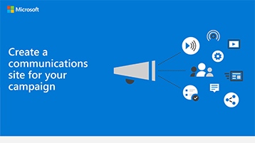

# Een communicatiesite voor uw campagne makenCreate a communications site for your campaign

Een fantastische manier om prioriteiten te communiceren, strategie documenten te delen en toekomstige gebeurtenissen te markeren, is door een communicatiesite te gebruiken in SharePoint.A great way to communicate priorities, share strategy documents, and highlight upcoming events is to use a communications site in SharePoint. Communicatiesites zijn voor het delen van acties in de hele campagne. het is de interne campagne site.Communications sites are for sharing things broadly across your whole campaign; it's your internal campaign site.

## Aanbevolen proceduresBest practices

Neem de volgende elementen op uw communicatiesite op:Include the following elements in your Communications site:

1. Het logo en de kleuren van een campagne toevoegen als koptekstafbeelding en themaAdd your campaign logo and colors as a header image and theme
2. Lever uw strategie, berichten, belangrijke documenten, een adreslijst en veelgestelde vragen in een **webonderdeel held**.Lead with your strategy, message, important documents, a directory, and FAQ in a **Hero web part**.
3. Neem een kandidaat-overzicht op naar het team in een **webonderdeel tekst**.Include a candidate statement to the team in a **Text web part**.
4. Voeg campagne gebeurtenissen toe aan een **webonderdeel gebeurtenissen** zodat iedereen kan zien wat er is.Add campaign events to an **Events web part** so everyone can see what's coming up.
5. Voeg Foto's toe die gebruikers kunnen gebruiken of delen met een **webonderdeel Afbeeldingengalerie**.Add photos that people can use or share to an **Image gallery web part**.

## Infographic: een communicatie site maken InfographicInfographic: Create a Communications Site infographic 
U kunt de volgende koppelingen voor PowerPoint en PDF downloaden en afdrukken in de tabloid-indeling (ook wel bekend als Ledger, 11 x 17 of a3).The following links for PowerPoint and PDF can be downloaded and printed in tabloid format (also known as ledger, 11 x 17, or A3).

[PDF-bestand](downloads/M365CampaignsCreateCommunicationSite.pdf)  |  [PowerPoint](downloads/M365CampaignsCreateCommunicationSite.pptx)[PDF](downloads/M365CampaignsCreateCommunicationSite.pdf) | [PowerPoint](downloads/M365CampaignsCreateCommunicationSite.pptx)

## InstellenSet it up

1. Meld u aan bij https://Office.com.Sign in to https://Office.com.
2. Selecteer in de linkerbovenhoek van de pagina het startprogramma voor apps en selecteer vervolgens de tegel **SharePoint** .In the top-left corner of the page, select the app launcher icon and then select the **SharePoint** tile. Als u de **SharePoint-** tegel niet ziet, klikt u op de tegel **sites** of **Alles** als SharePoint niet zichtbaar is.If you don't see the **SharePoint** tile, click the **Sites** tile or **All** if SharePoint isn't visible.
3. Klik boven aan de SharePoint-startpagina op **+ site maken** en kies de optie **communicatiesite** .At the top of the SharePoint home page, click **+ Create site** and choose the **Communication site** option.

Meer informatie [over Communicatiesites](https://support.office.com/article/What-is-a-SharePoint-communication-site-94A33429-E580-45C3-A090-5512A8070732) en het [maken van een communicatiesite in SharePoint Online](https://support.microsoft.com/en-us/office/create-a-communication-site-in-sharepoint-online-7fb44b20-a72f-4d2c-9173-fc8f59ba50eb).Learn all [about Communications sites](https://support.office.com/article/What-is-a-SharePoint-communication-site-94A33429-E580-45C3-A090-5512A8070732) and how to [create a communication site in SharePoint Online](https://support.microsoft.com/en-us/office/create-a-communication-site-in-sharepoint-online-7fb44b20-a72f-4d2c-9173-fc8f59ba50eb).

## BeheerdersinstellingenAdmin settings

Als u de koppeling **+ site maken** niet ziet, is het zelf maken van sites mogelijk niet beschikbaar in microsoft 365.If you don't see the **+ Create** site link, self-service site creation might not be available in Microsoft 365. Neem contact op met de persoon die Microsoft 365 in uw organisatie beheert als u een team site wilt maken.To create a team site, contact the person administering Microsoft 365 in your organization. Als u een Microsoft 365-beheerder bent, raadpleegt u [sites maken in SharePoint Online beheren](https://docs.microsoft.com/sharepoint/manage-site-creation) als u het maken van sites met selfservice voor uw organisatie of het [beheren van sites in het nieuwe SharePoint](https://docs.microsoft.com/sharepoint/manage-sites-in-new-admin-center) online-Beheercentrum wilt inschakelen voor het maken van een site.If you're a Microsoft 365 admin, see [Manage site creation in SharePoint Online](https://docs.microsoft.com/sharepoint/manage-site-creation) to enable self-service site creation for your organization or [Manage sites in the new SharePoint admin center](https://docs.microsoft.com/sharepoint/manage-sites-in-new-admin-center) to create a site from the SharePoint Online admin center.
  
